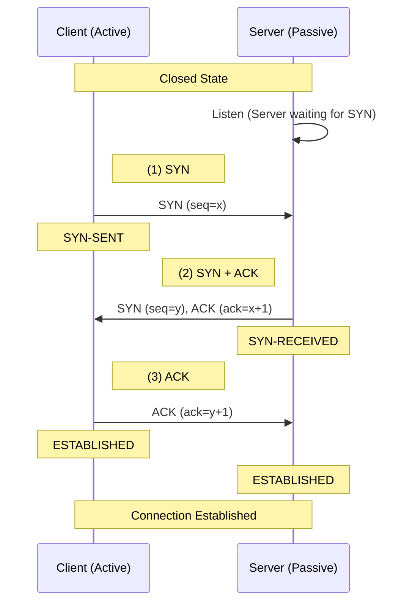
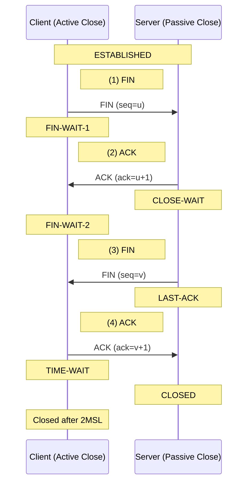
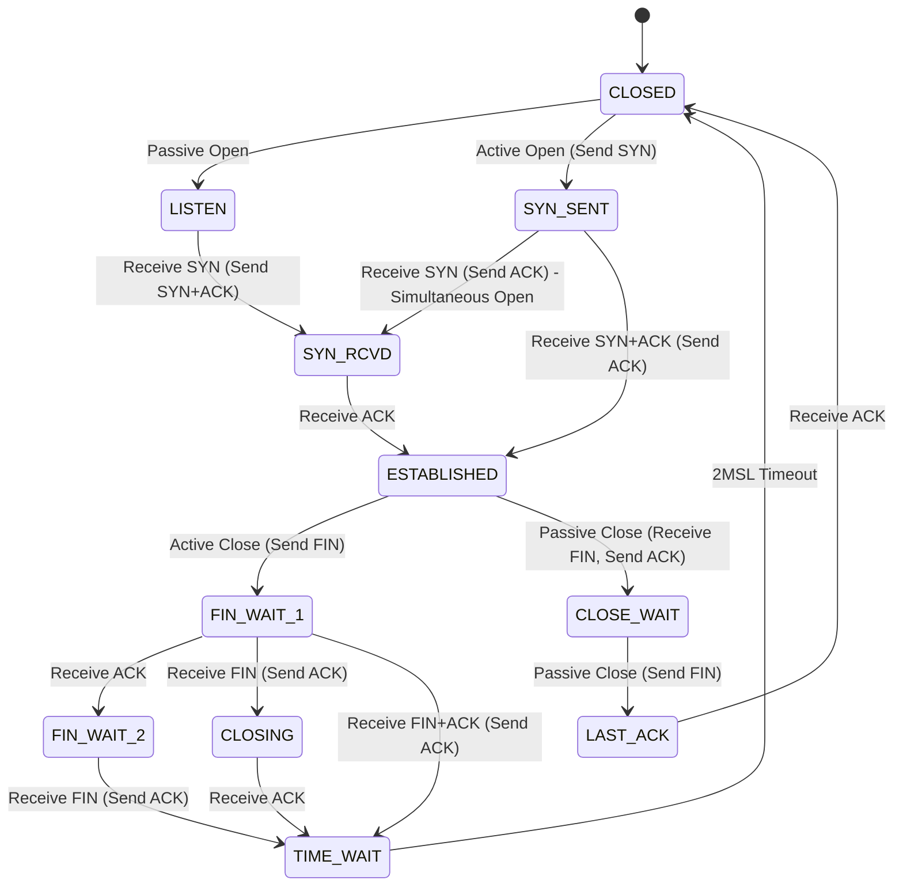

# TCP 协议基础

TCP (Transmission Control Protocol, 传输控制协议) 是一种面向连接的, 可靠的, 基于字节流的传输层通信协议. 

## TCP 三次握手 (Three-way Handshake)

三次握手用于建立一个 TCP 连接. 其主要目的是初始化序列号, 并确认双方的收发能力. 



1. **第一次握手 (SYN)**: 客户端发送一个 `SYN` 包 (序列号 `seq=x`) 到服务器, 进入 `SYN-SENT` 状态. 
2. **第二次握手 (SYN + ACK)**: 服务器收到 `SYN` 包, 返回自己的 `SYN` 包 (序列号 `seq=y`) 以及对客户端 `SYN` 的确认 `ACK` (`ack=x+1`), 服务器进入 `SYN-RECEIVED` 状态. 
3. **第三次握手 (ACK)**: 客户端收到 `SYN+ACK` 包, 发送确认包 `ACK` (`ack=y+1`), 客户端进入 `ESTABLISHED` 状态. 服务器收到 `ACK` 后, 也进入 `ESTABLISHED` 状态. 

## TCP 四次挥手 (Four-way Handshake)

四次挥手用于终止一个 TCP 连接. 由于 TCP 是全双工的, 每个方向都必须单独关闭. 



1. **第一次挥手 (FIN)**: 客户端发送 `FIN` 包 (序列号 `seq=u`), 进入 `FIN-WAIT-1` 状态, 表示客户端没有数据要发送了. 
2. **第二次挥手 (ACK)**: 服务器收到 `FIN` 包, 返回 `ACK` (`ack=u+1`), 服务器进入 `CLOSE-WAIT` 状态. 此时 TCP 连接处于半关闭状态, 服务器可能还有数据没发完. 客户端收到后进入 `FIN-WAIT-2`. 
3. **第三次挥手 (FIN)**: 服务器发完所有数据后, 发送 `FIN` 包 (序列号 `seq=v`), 进入 `LAST-ACK` 状态. 
4. **第四次挥手 (ACK)**: 客户端收到 `FIN` 包, 返回 `ACK` (`ack=v+1`), 进入 `TIME-WAIT` 状态. 服务器收到 `ACK` 后关闭连接. 客户端在等待 2MSL 之后也关闭连接. 

## TCP 状态机 (State Machine)

TCP 连接在其生命周期中会经历多个状态. 



### 常见状态说明

| 状态 | 说明 |
| :--- | :--- |
| **LISTEN** | 服务器等待来自客户端的连接请求. |
| **SYN-SENT** | 客户端发送 SYN 报文后等待匹配的连接请求. |
| **SYN-RECEIVED** | 服务器收到 SYN 报文并发送 SYN+ACK 后, 等待客户端的确认. |
| **ESTABLISHED** | 连接已建立, 可以正常收发数据. |
| **FIN-WAIT-1** | 等待远程 TCP 的连接中断请求, 或先前的连接中断请求的确认. |
| **FIN-WAIT-2** | 从远端 TCP 等待连接中断请求. |
| **CLOSE-WAIT** | 等待从本地用户发来的连接中断请求. |
| **LAST-ACK** | 等待原来发向远端 TCP 的连接中断请求的确认. |
| **TIME-WAIT** | 等待足够的时间以确保远程 TCP 接收到连接中断请求的确认. |
| **CLOSED** | 没有任何连接状态. |

## 常用排查工具 (CLI Tools)

在 Linux 环境下, 可以使用以下命令检查 TCP 连接状态. 

### 1. `ss` (Socket Statistics)
`ss` 是查看网络连接的首选工具, 比传统的 `netstat` 更快, 更详细. 

```bash
# 查看所有 TCP 连接
ss -t -a

# 查看处于 ESTABLISHED 状态的连接
ss -t state established

# 查看监听端口及其对应的进程
ss -tunlp
```

### 2. `netstat`
虽然已逐渐被 `ss` 取代, 但在许多系统中仍广泛使用. 

```bash
# 查看所有监听端口
netstat -tpln
```

### 3. `tcpdump`
用于抓取和分析网络数据包. 

```bash
# 抓取特定网卡的 TCP 握手包 (SYN, ACK, FIN)
tcpdump -i eth0 'tcp[tcpflags] & (tcp-syn|tcp-ack|tcp-fin) != 0'
```

### 4. `socat`
`socat` 是一个强大的多功能网络工具, 用于在两个数据流之间建立双向通道. 

```bash
# 监听 TCP 端口并转发到另一个地址
socat TCP4-LISTEN:8080,fork TCP4:google.com:80

# TCP 端口转发 (本地端口 80 转发到远程服务器 80)
socat TCP4-LISTEN:80,reuseaddr,fork TCP4:remote-server:80
```

### 5. `nc` (Netcat)
被称为网络工具中的 "瑞士军刀", 常用于端口扫描, 文件传输和简单聊天. 

```bash
# 检查远程端口是否开放
nc -zv 192.168.1.1 22

# 监听端口并作为简易 HTTP 服务器 (返回文本)
echo -e "HTTP/1.1 200 OK\n\n Hello World" | nc -l 8080

# 文件传输 (接收端)
nc -l 9999 > received_file
# 文件传输 (发送端)
nc 192.168.1.1 9999 < file_to_send
```

### 6. `nmap`
强大的网络探测和安全审核工具. 

```bash
# 扫描主机开放的 TCP 端口
nmap -sT 192.168.1.1

# 扫描并识别服务版本及操作系统
nmap -A -v 192.168.1.1

# 扫描特定端口范围
nmap -p 1-1024 192.168.1.1
```

### 7. `iperf3`
用于测试网络带宽和吞吐量. 

```bash
# 服务端模式
iperf3 -s

# 客户端模式 (连接到服务端进行 10 秒测试)
iperf3 -c 192.168.1.1

# 使用多个并行流进行测试
iperf3 -c 192.168.1.1 -P 4
```