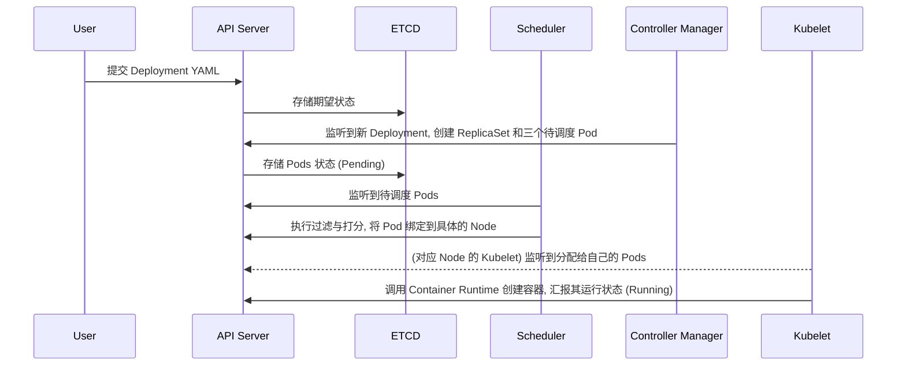

Kubernetes (K8s) 是一个跨主机的容器编排平台, 旨在自动化容器化应用程序的部署、扩展和管理. 它的核心价值在于提供了一套**声明式 (Declarative)** 的系统设计范式, 以及对基础设施的深度抽象.

## 1. 核心架构: Control Plane 与 Nodes

Kubernetes 遵循典型的 主从 (Master-Worker) 架构, 现在更准确地称为 **Control Plane** 与 **Nodes**.

### Control Plane (控制面/管理节点)
控制面是集群的 "大脑", 负责全局决策以及检测和响应集群事件.
*   **kube-apiserver**: 集群的唯一入口, 所有的资源配置、查询都通过它进行. 它还是各组件交互的枢纽, 遵循 RESTful 风格.
*   **etcd**: 高可用的分布式键值存储, 是 K8s 的 "数据库". 它存储了整个集群的状态, 是唯一的真理来源 (Source of Truth).
*   **kube-scheduler**: 决策 Pod 应该运行在哪个 Node 上. 它通过预选 (Predicate) 和优选 (Priority) 算法实现最优调度.
*   **kube-controller-manager**: 运行控制器进程, 负责执行调谐循环 (Reconciliation Loop), 确保集群的实际状态趋于期望状态.

### Nodes (工作节点)
运行实际的业务容器.
*   **kubelet**: 驻扎在节点上的 "大管家", 负责维护容器的生命周期, 并与 API Server 通信汇报节点状态.
*   **kube-proxy**: 实现 Service 的关键. 它维护节点上的网络规则 (iptables 或 IPVS), 实现请求的流量负载均衡.
*   **Container Runtime**: 实际运行容器的引擎 (如 containerd).

---

## 2. 核心概念与术语速查

### 工作负载管理
*   **Pod**: K8s 的最小原子调度单位. 一个 Pod 内可以包含多个紧耦合的容器, 它们共享同一个 Network Namespace, IP 以及存储卷.
*   **Deployment**: 定义无状态应用的最佳方式. 它管理多个 Pod 副本 (ReplicaSet), 支持滚动更新 (Rolling Update) 和版本回滚.
*   **StatefulSet**: 用于管理有状态应用 (如数据库). 它保证 Pod 有固定的网络标识 (Hostname) 和持久化存储绑定.
*   **Job & CronJob**: 用于执行一次性任务或定时任务.

### 服务发现与负载均衡
*   **Service**: 由于 Pod 是易逝的 (Ephemeral), Service 提供了持久的虚拟 IP (VIP). 它通过 **Label Selector** 匹配后端 Pod.
*   **Ingress**: 暴露集群内部 HTTP/HTTPS 服务的入口, 提供 L7 层路由转发能力.

### 资源识别与配置
*   **Namespace**: 逻辑隔离. 在同一个物理集群中划分出多个虚拟资源池 (如 dev, test, prod).
*   **Label (标签)**: 键值对, 用于组织、分类和筛选对象. 它是 K8s 中耦合度最低、灵活性最高的筛选机制.
*   **Annotation (注解)**: 与 Label 类似, 但主要存储非标识性元数据, 常用于第三方工具配置 (如监控、日志等).
*   **ConfigMap & Secret**: 用于解耦环境配置. ConfigMap 存储普通配置, Secret 存储敏感信息 (如密码、Token).

### 存储抽象
*   **Volume**: 定义数据卷的存储位置.
*   **Persistent Volume (PV)**: 管理员预分配的存储资源.
*   **Persistent Volume Claim (PVC)**: 用户对存储的需求声明 (如 "我需要 10G RWO 类型的盘").

---

## 3. 深度解析: 为什么 Pods 之间可以直接通信?

在 Kubernetes 的网络架构中, 强制要求实现 **"IP-per-Pod"** 模型. 这种模型规定了 Pod 间通信必须遵循以下原则:

### 核心三原则 (No-NAT Principle)
1.  **Pod 到 Pod 的通信**: 任意两个 Pod 之间可以直接通过对方的 IP 通讯, 而不需要经过 NAT (网络地址转换).
2.  **Node 到 Pod 的通信**: 任何节点都可以访问该集群内所有的 Pod, 且不需要 NAT.
3.  **Pod 看到的自己 IP**: Pod 在内部看到的自己的 IP, 与外部其他 Pod 看到的它的 IP 必须完全一致.

### 为什么这样设计?
*   **简化模型**: 这使得分布式系统不需要为了容器的特殊 IP 而重新开发网络协议. 对于应用来说, 它们就像是在同一台虚拟机或者局域网内运行一样.
*   **平滑迁移**: 方便将传统的单体应用或基于 VM 的服务直接迁移到容器中, 无需为了应对动态变化的端口映射而修改代码.
*   **性能优化**: 绕过 NAT 可以显著降低包转发的延迟和 CPU 开销.

### 底层是如何实现的?
这取决于具体的 **CNI 插件** (如 Calico, Cilium). 它们通过以下技术手段在跨主机的节点间路由 Pod 流量:
*   **Overlay**: 在物理网络上封装隧道 (如 VXLAN), 将原始数据包包装在 UDP 中传输.
*   **Routing**: 通过 BGP 等协议, 将 Pod 的 IP 网络直接通告给物理交换机或路由器, 实现直接路由转发.

---

## 4. 经典的 Pod 创建流转图

> 理解 Kubernetes 的关键在于理解其对资源的高度抽象. 从计算 (Pod)、网络 (Service) 到存储 (PV), 这种抽象层使得我们可以一套代码运行在任何云平台上.

## 5. 基本概念与核心术语详解

### 5.1 基础元数据
*   **Label (标签)**: 附加到对象 (如 Pod) 上的键值对, 用于组织和选择对象集合. Label 允许用户以松耦合的方式映射自己的组织结构.
    *   *Selector*: 通过 Label Selector, 客户端/控制器可以识别特定的资源集合.
*   **Annotation (注解)**: 也是键值对, 但不能用于选择对象. 主要用于存储辅助元数据 (如版本信息、作者、构建记录) 或被第三方工具、库拉取信息.
*   **Namespace (命名空间)**: 供多个用户使用、用于逻辑隔离资源的虚拟集群. 它提供了资源名称的作用域, 同时也常作为资源配额和网络策略的边界.

### 5.2 工作负载对象 (Workloads)
*   **Deployment**: 现代 K8s 中最核心的对象. 它为 Pod 和 ReplicaSet 提供声明式的更新能力. 适用于 Web 服务、API 服务等无状态应用.
*   **Replication Controller (RC)**: **[Legacy]** K8s 早期的副本控制器, 确保在任何时间都有特定数量的 Pod 副本在运行. 现已被 **ReplicaSet** (它支持更强的 Label 筛选器) 和 **Deployment** 完全取代.
*   **ReplicaSet (RS)**: 下一代 RC, 主要由 Deployment 自动管理, 用于确保 Pod 副本数符合预期.
*   **StatefulSet**: 用于管理有状态应用. 它为 Pod 提供稳定的网络标识符 (ID) 和稳定的持久化存储, 适用于数据库 (如 MySQL, MongoDB) 或分布式系统.
*   **Horizontal Pod Autoscaler (HPA)**: 根据 CPU 利用率或自定义指标自动缩放 Deployment 或 ReplicaSet 中的 Pod 数量, 实现应用的弹性伸缩.
*   **Job & CronJob**: 
    - **Job**: 创建一个或多个 Pod, 并确保指定数量的 Pod 成功终止 (用于批处理).
    - **CronJob**: 基于时间计划运行 Job (类似 Linux 的 crontab).

### 5.3 服务与网络
*   **Service (Svc)**: 将运行在 Pod 集合上的应用程序公开为网络服务的方式. 它为一组 Pod 提供了一个稳定的 IP (ClusterIP) 和端口, 屏蔽了 Pod 重启导致的 IP 变化.
*   **Port & TargetPort**: 
    - *Port*: Service 暴露的端口.
    - *TargetPort*: 流量转发到容器内部的端口.

### 5.4 存储抽象
*   **Volume (卷)**: 目录, 其中的数据可被 Pod 中的容器访问. K8s 支持多种类型的 Volume (本地、NFS、云商磁盘等).
*   **Persistent Volume (PV)**: 集群中的一块存储资源, 由管理员预配置或通过 StorageClass 动态供给. 它独立于 Pod 的生命周期.
*   **Persistent Volume Claim (PVC)**: 用户对存储的申请. PVC 消费 PV 资源, 它不需要关心底层具体的存储实现 (如存储地址、用户名等).

### 5.5 配置管理
*   **ConfigMap**: 用于将非机密配置数据存储在键值对中. 允许将镜像内容与环境配置解耦.
*   **Secret**: 用于存储敏感信息 (如密码、OAuth 令牌、SSH 密钥). 它提供了一种比 ConfigMap 更安全的数据保护机制 (尽管默认只是 Base64 编码, 但在某些环境中会结合 KMS 加密).

---

> 在设计应用架构时, 尽量优先使用 **Deployment** 管理 Pod, 并通过 **Service** 进行内部通信. 所有的外部配置应尽可能抽象到 **ConfigMap** 中, 以便在不同环境 (Dev/Test/Prod) 间平滑迁移.
