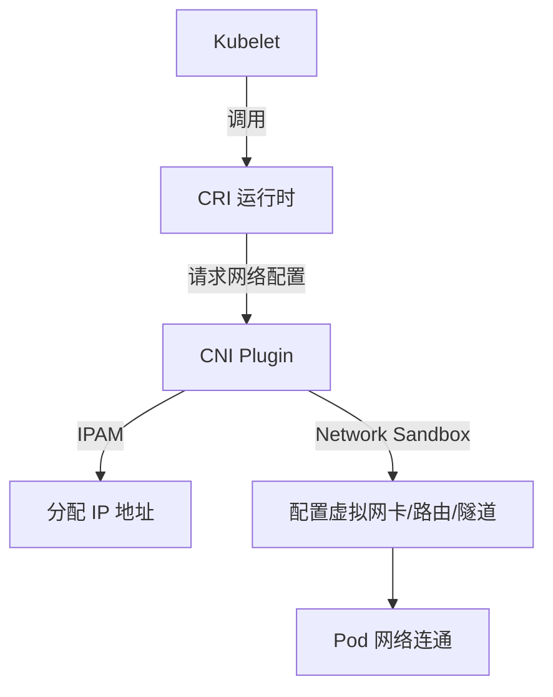

在 Kubernetes 集群中, 网络是最复杂也是最核心的部分之一. Kubernetes 本身并不实现 Pod 网络, 而是定义了一套规范——**CNI (Container Network Interface)**.

## 什么是 CNI?

CNI (容器网络接口) 是由 CNCF 维护的一套标准, 用于在容器创建或销毁时, 动态地配置其网络资源.

*   **解耦**: 将容器运行时 (CRI, 如 containerd, Docker) 与具体的网络实现隔离.
*   **职责**: CNI 插件只负责两件事: 创建容器时**分配 IP 并打通网络**, 销毁容器时**释放 IP 并清理环境**.

### CNI 工作全景图

---

## 核心技术: 三种常见的通信模式

在选择 CNI 插件前, 必须理解底层的数据转发方式:

### 1. Overlay (叠加网络)
*   **原理**: 在物理网络 (Underlay) 之上通过封装技术 (VXLAN, UDP, Geneve) 构建逻辑网络. 数据包会被封装在另一个 UDP 包中传输.
*   **优点**: 对底层物理网络依赖极低, 几乎可以在任何环境下运行.
*   **缺点**: 二次封包拆包导致明显的性能损耗 (CPU 和带宽), MTU 需要调整.
*   **代表**: Flannel (VXLAN), Calico (IPIP), Weave.

### 2. L3 Routing (三层路由)
*   **原理**: 不封装数据包. 通过 BGP 协议或静态路由, 将 Pod IP 直接作为路由条目通告给物理网关或对端节点.
*   **优点**: 接近原生网络的性能, 无封包损耗, 方便运维排障 (直接抓包看 IP).
*   **缺点**: 需要物理网内设备 (路由器/交换机) 支持, 且集群规模极大时 BGP 路由表可能过载.
*   **代表**: Calico (BGP), Antrea (部分模式).

### 3. eBPF 原生转发
*   **原理**: 绕过复杂的 Linux 内核协议栈 (iptables/IPVS), 利用内核 eBPF 技术在驱动层或更早的路径处理数据包.
*   **优点**: 极致性能, 支持 L7 层安全策略 (HTTP 路径过滤), 极强的可观测性.
*   **代表**: Cilium.

---

## 主流 CNI 插件深度对比

| 特性 | Flannel | Calico | Cilium |
| :--- | :--- | :--- | :--- |
| **主要模式** | VXLAN (Overlay) | BGP (L3) / IPIP | eBPF / Direct |
| **性能损耗** | 中等 (有封装) | **低 (原生转发)** | **极低 (BGP+eBPF)** |
| **网络策略 (Firewall)** | **不支持** | **强 (L3/L4)** | **极强 (L3-L7)** |
| **可观测性** | 基本无 | 一般 | **强 (Hubble 可视化)** |
| **运维难度** | 极低 | 中等 | 较高 (需高内核版本) |
| **推荐场景** | 开发测试, 小规模集群 | 大中型生产环境, 高性能需求 | 云原生尖端运维, 零信任安全 |

---

## 如何进行选型?

### 场景一: 追求简单, 稳定
如果您只是想搭建一个学习环境或小型内部办公集群, **Flannel** 是首选. 它几乎是 "开箱即用" 的代名词.

### 场景二: 生产环境的 "标准之选"
**Calico** 是目前工业界的事实标准.
*   如果您需要 **Network Policy** 来隔离 Pod 间的流量.
*   如果您对网络延迟比较敏感.
*   它支持混合模式: 部分节点走 Overlay, 部分节点走 BGP.

### 场景三: 未来的 "天花板"
如果您的团队拥有较强的运维能力, 并且:
*   需要针对应用层 (如 API 路径, HTTP Method) 做安全审计.
*   需要在集群中运行超大规模的服务发现 (取代 kube-proxy 的 IPVS/iptables).
*   需要深度监控网络丢包或延迟.
那么 **Cilium** 是不二之选.

---

## 云环境下的特殊考虑

如果您在公有云 (AWS, Azure, GCP, 阿里云) 上运行托管集群:
1.  **优先使用云原生 CNI**: 比如 AWS 的 `amazon-vpc-cni-k8s`.
2.  **原因**: 这些插件能让 Pod 直接获取 VPC 内网 IP, 性能最高且能与云平台的安全组 (Security Groups) 完美集成.

> **总结**: 没有最好的 CNI, 只有最适合您基础设施的 CNI. 新手选 Flannel, 成熟团队选 Calico, 追求极致选 Cilium.
