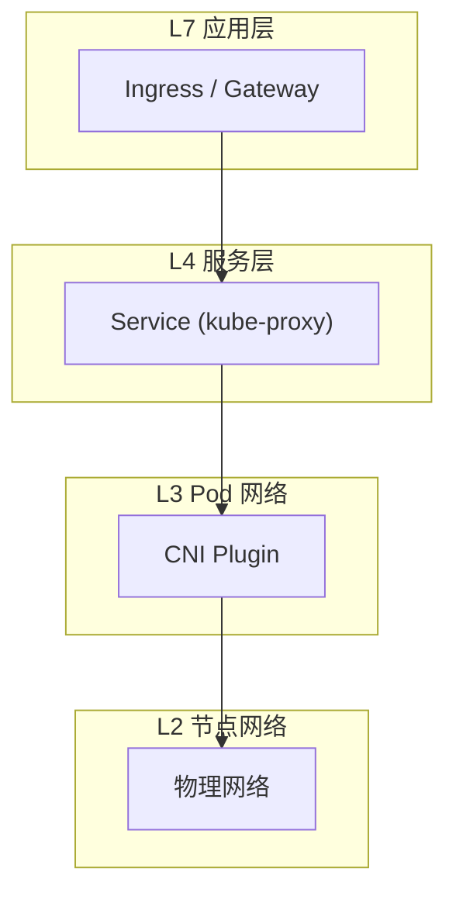
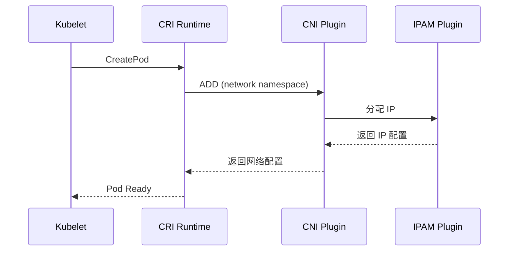
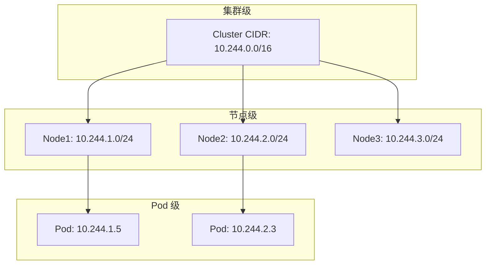
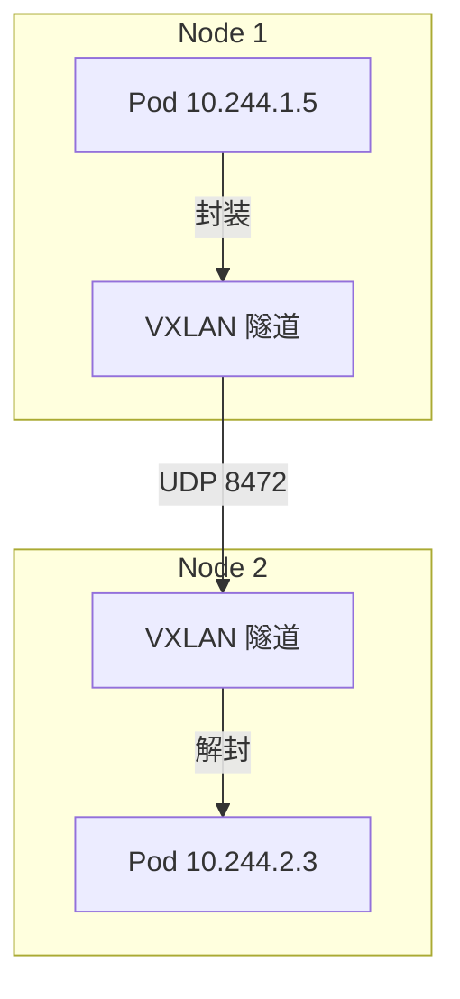
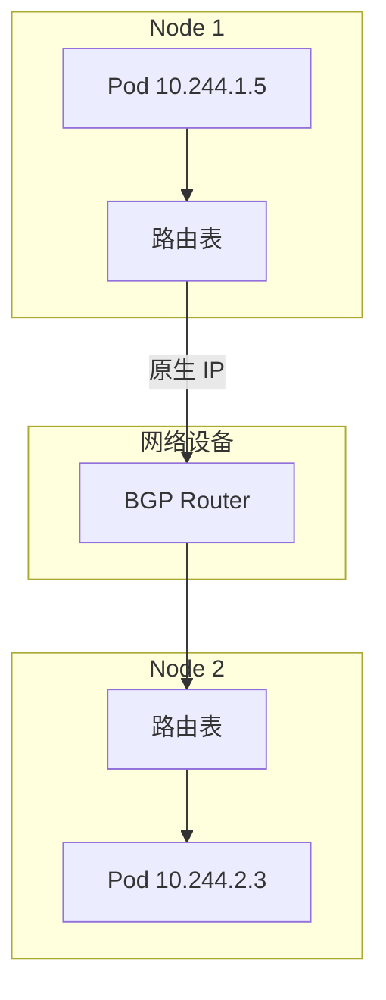
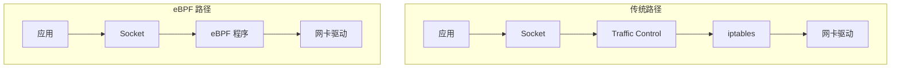

在 Kubernetes 集群中, 网络是最复杂也是最核心的部分之一. Kubernetes 本身并不实现 Pod 网络, 而是定义了一套规范——**CNI (Container Network Interface)**.

---

## 1. Kubernetes 网络模型

### 1.1 基本要求

Kubernetes 网络模型有三条核心规则:

| 规则 | 描述 |
|------|------|
| **Pod-to-Pod** | 所有 Pod 可以直接通信, 无需 NAT |
| **Node-to-Pod** | 所有节点可以与所有 Pod 直接通信 |
| **Pod 看到的 IP** | Pod 看到的自己 IP 与其他 Pod 看到的一致 |

### 1.2 网络层次



---

## 2. CNI 规范

### 2.1 什么是 CNI

CNI (Container Network Interface) 是由 CNCF 维护的一套标准:

- **解耦**: 将容器运行时与网络实现隔离
- **职责**: 容器创建时分配 IP, 销毁时释放 IP

### 2.2 CNI 执行流程



### 2.3 CNI 配置

```json
{
  "cniVersion": "1.0.0",
  "name": "mynet",
  "type": "bridge",
  "bridge": "cni0",
  "isGateway": true,
  "ipMasq": true,
  "ipam": {
    "type": "host-local",
    "subnet": "10.244.0.0/24",
    "routes": [
      { "dst": "0.0.0.0/0" }
    ]
  }
}
```

### 2.4 CNI 操作

| 操作 | 描述 |
|------|------|
| **ADD** | 将容器添加到网络 |
| **DEL** | 从网络移除容器 |
| **CHECK** | 检查容器网络状态 |
| **VERSION** | 返回支持的 CNI 版本 |

---

## 3. IPAM (IP 地址管理)

### 3.1 IPAM 类型

| 类型 | 描述 | 适用场景 |
|------|------|----------|
| **host-local** | 本地文件存储, 每节点独立子网 | 小规模集群 |
| **whereabouts** | 分布式 IPAM, 跨节点协调 | 中大规模集群 |
| **calico-ipam** | Calico 内置, 支持 IP 池 | Calico 用户 |

### 3.2 IP 分配机制



---

## 4. 网络模式

### 4.1 Overlay (叠加网络)



| 技术 | 封装方式 | 特点 |
|------|----------|------|
| **VXLAN** | UDP 封装 L2 帧 | 最常用, 兼容性好 |
| **Geneve** | UDP 封装, 可扩展 | 支持元数据 |
| **IPIP** | IP-in-IP | 开销最小 |

**优点**:
- 对底层网络无要求
- 部署简单

**缺点**:
- 封装开销 (~50 字节)
- MTU 需要调整
- 排障困难

### 4.2 L3 路由



**优点**:
- 无封装开销
- 原生性能
- 易于排障

**缺点**:
- 需要网络设备支持 BGP
- 路由表规模问题

### 4.3 eBPF 原生



**优点**:
- 绕过 iptables, 极致性能
- L7 层策略支持
- 强大的可观测性

**缺点**:
- 需要较新内核 (5.4+)
- 学习曲线陡峭

---

## 5. 主流 CNI 插件

### 5.1 Flannel

```yaml
# kube-flannel-cfg ConfigMap
net-conf.json: |
  {
    "Network": "10.244.0.0/16",
    "Backend": {
      "Type": "vxlan"
    }
  }
```

| 特性 | 值 |
|------|-----|
| 模式 | VXLAN, host-gw, UDP |
| NetworkPolicy | ❌ 不支持 |
| 复杂度 | 极低 |
| 适用场景 | 开发测试, 小规模集群 |

### 5.2 Calico

```yaml
apiVersion: projectcalico.org/v3
kind: IPPool
metadata:
  name: default-ipv4-ippool
spec:
  cidr: 10.244.0.0/16
  ipipMode: CrossSubnet
  natOutgoing: true
  nodeSelector: all()
```

| 特性 | 值 |
|------|-----|
| 模式 | BGP, IPIP, VXLAN |
| NetworkPolicy | ✅ L3/L4 |
| 复杂度 | 中 |
| 适用场景 | 生产环境标准选择 |

**Calico 模式选择**:
| 模式 | 场景 |
|------|------|
| BGP 全模式 | 支持 BGP 的网络环境 |
| IPIP CrossSubnet | 部分跨子网 |
| VXLAN | 不支持 BGP |

### 5.3 Cilium

```yaml
apiVersion: cilium.io/v2
kind: CiliumNetworkPolicy
metadata:
  name: l7-policy
spec:
  endpointSelector:
    matchLabels:
      app: api
  ingress:
  - fromEndpoints:
    - matchLabels:
        app: frontend
    toPorts:
    - ports:
      - port: "80"
        protocol: TCP
      rules:
        http:
        - method: GET
          path: "/api/.*"
```

| 特性 | 值 |
|------|-----|
| 模式 | eBPF, 可替换 kube-proxy |
| NetworkPolicy | ✅ L3/L4/L7 |
| 可观测性 | Hubble UI |
| 复杂度 | 较高 |
| 适用场景 | 云原生尖端, 零信任 |

**Cilium 特性**:
- 替换 kube-proxy (eBPF)
- Service Mesh (无 Sidecar)
- Hubble 网络可观测性
- Tetragon 安全可观测性

---

## 6. 插件对比

| 特性 | Flannel | Calico | Cilium |
|------|---------|--------|--------|
| **主要模式** | VXLAN | BGP/IPIP | eBPF |
| **性能** | 中 | 高 | 极高 |
| **NetworkPolicy** | ❌ | L3/L4 | L3/L4/L7 |
| **可观测性** | 无 | 一般 | Hubble |
| **替换 kube-proxy** | ❌ | ❌ | ✅ |
| **内核要求** | 低 | 低 | 5.4+ |
| **运维难度** | 低 | 中 | 高 |

---

## 7. 云厂商 CNI

| 云 | CNI | 特点 |
|----|-----|------|
| **AWS** | amazon-vpc-cni | Pod 获取 VPC ENI IP |
| **GCP** | gke-cni | 原生 VPC 网络 |
| **Azure** | azure-cni | VNet 直接 IP |
| **阿里云** | terway | ENI 多 IP 模式 |

**优势**:
- Pod IP 直接是 VPC IP
- 与云安全组集成
- 性能最优

---

## 8. 网络排障

### 8.1 常用命令

```bash
# 查看 Pod 网络
kubectl exec -it <pod> -- ip addr
kubectl exec -it <pod> -- ip route

# 查看节点路由
ip route show | grep 10.244

# 抓包分析
tcpdump -i any -nn host 10.244.1.5

# Cilium 调试
cilium connectivity test
hubble observe --pod <pod>
```

### 8.2 常见问题

| 问题 | 可能原因 |
|------|----------|
| Pod 无法通信 | CNI 未就绪, NetworkPolicy 阻断 |
| 跨节点不通 | 隧道/路由配置错误, 防火墙 |
| DNS 解析失败 | CoreDNS 问题, NetworkPolicy |
| 性能差 | MTU 配置错误, 封装开销 |

---

> **总结**: 没有最好的 CNI, 只有最适合您基础设施的 CNI. 新手选 Flannel, 成熟团队选 Calico, 追求极致选 Cilium.
