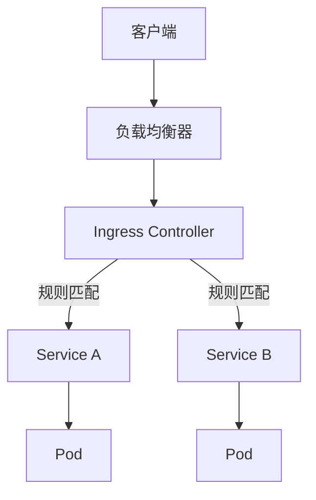
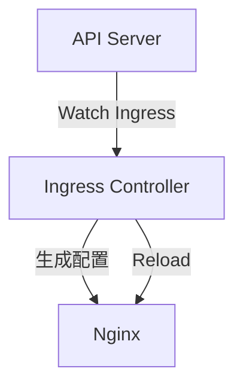
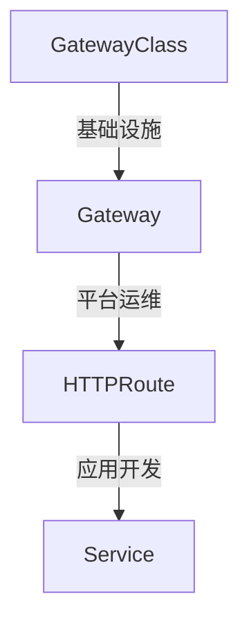

在 Kubernetes 中, Service 只能提供 L4 层负载均衡, 而 **Ingress** 则是为了解决 L7 层 (HTTP/HTTPS) 路由需求而生的. 它充当了集群的 "守门员", 负责将外部请求转发到内部的 Pod.

---

## 1. Ingress 架构



### 1.1 核心概念

| 概念 | 描述 |
|------|------|
| **Ingress 资源** | 声明式配置 (YAML), 定义路由规则 |
| **Ingress Controller** | 实现者, 监听 Ingress 并配置代理 |
| **IngressClass** | 指定使用哪个 Controller |

---

## 2. Ingress 配置

### 2.1 基础配置

```yaml
apiVersion: networking.k8s.io/v1
kind: Ingress
metadata:
  name: app-ingress
  annotations:
    nginx.ingress.kubernetes.io/rewrite-target: /
spec:
  ingressClassName: nginx
  tls:
  - hosts:
    - app.example.com
    secretName: app-tls
  rules:
  - host: app.example.com
    http:
      paths:
      - path: /api
        pathType: Prefix
        backend:
          service:
            name: api-service
            port:
              number: 80
      - path: /
        pathType: Prefix
        backend:
          service:
            name: frontend-service
            port:
              number: 80
```

### 2.2 Path 类型

| 类型 | 匹配行为 |
|------|----------|
| **Exact** | 精确匹配 `/foo` (不匹配 `/foo/`) |
| **Prefix** | 前缀匹配 `/foo` (匹配 `/foo/bar`) |
| **ImplementationSpecific** | 由 Controller 决定 |

### 2.3 IngressClass

```yaml
apiVersion: networking.k8s.io/v1
kind: IngressClass
metadata:
  name: nginx
  annotations:
    ingressclass.kubernetes.io/is-default-class: "true"
spec:
  controller: k8s.io/ingress-nginx
  parameters:
    apiGroup: k8s.nginx.org
    kind: IngressNginxController
    name: default
```

---

## 3. 主流 Ingress 控制器

### 3.1 NGINX Ingress Controller



**特点**:
- 最成熟, 文档丰富
- 通过 Annotations 扩展功能
- 大规模配置变更需 reload

**常用 Annotations**:
```yaml
annotations:
  nginx.ingress.kubernetes.io/ssl-redirect: "true"
  nginx.ingress.kubernetes.io/proxy-body-size: "50m"
  nginx.ingress.kubernetes.io/proxy-read-timeout: "3600"
  nginx.ingress.kubernetes.io/affinity: "cookie"
  nginx.ingress.kubernetes.io/limit-rps: "100"
```

### 3.2 Traefik

**特点**:
- Go 编写, 云原生设计
- 动态配置无需 reload
- 内置 Dashboard
- 自动 Let's Encrypt 证书

```yaml
apiVersion: traefik.containo.us/v1alpha1
kind: IngressRoute
metadata:
  name: app-route
spec:
  entryPoints:
  - websecure
  routes:
  - match: Host(`app.example.com`) && PathPrefix(`/api`)
    kind: Rule
    services:
    - name: api-service
      port: 80
    middlewares:
    - name: rate-limit
```

### 3.3 Envoy-based

| 实现 | 特点 |
|------|------|
| **Istio Gateway** | Service Mesh 集成, 功能强大 |
| **Contour** | 多租户, HTTPProxy CRD |
| **Ambassador/Emissary** | API Gateway 功能 |

**Contour HTTPProxy**:
```yaml
apiVersion: projectcontour.io/v1
kind: HTTPProxy
metadata:
  name: app
spec:
  virtualhost:
    fqdn: app.example.com
    tls:
      secretName: app-tls
  routes:
  - conditions:
    - prefix: /api
    services:
    - name: api-service
      port: 80
      weight: 90
    - name: api-service-canary
      port: 80
      weight: 10
```

---

## 4. 控制器对比

| 特性 | Nginx | Traefik | Envoy-based |
|------|-------|---------|-------------|
| **配置生效** | Reload | 热更新 | 热更新 (xDS) |
| **可观测性** | 需插件 | 内置 Dashboard | 极致 |
| **扩展方式** | Annotations | CRD/Middleware | 丰富 CRD |
| **协议支持** | HTTP, gRPC, TCP | HTTP, TCP | HTTP/1/2/3, gRPC |
| **学习曲线** | 低 | 中 | 高 |
| **社区活跃度** | 极高 | 高 | 高 |

---

## 5. TLS 配置

### 5.1 手动证书

```yaml
apiVersion: v1
kind: Secret
metadata:
  name: app-tls
type: kubernetes.io/tls
data:
  tls.crt: <base64-encoded-cert>
  tls.key: <base64-encoded-key>
```

### 5.2 cert-manager 自动化

```yaml
apiVersion: cert-manager.io/v1
kind: Certificate
metadata:
  name: app-cert
spec:
  secretName: app-tls
  issuerRef:
    name: letsencrypt-prod
    kind: ClusterIssuer
  dnsNames:
  - app.example.com
```

---

## 6. Gateway API

### 6.1 为什么需要 Gateway API

| Ingress 问题 | Gateway API 解决方案 |
|--------------|----------------------|
| Annotations 碎片化 | 标准化 CRD |
| 缺乏角色分离 | 职责划分清晰 |
| 功能有限 | 丰富的路由能力 |

### 6.2 资源模型



| 角色 | 资源 | 职责 |
|------|------|------|
| 基础设施提供者 | GatewayClass | 定义 Controller |
| 平台运维 | Gateway | 配置监听器, TLS |
| 应用开发者 | HTTPRoute | 定义路由规则 |

### 6.3 GatewayClass

```yaml
apiVersion: gateway.networking.k8s.io/v1
kind: GatewayClass
metadata:
  name: cilium
spec:
  controllerName: io.cilium/gateway-controller
```

### 6.4 Gateway

```yaml
apiVersion: gateway.networking.k8s.io/v1
kind: Gateway
metadata:
  name: production
spec:
  gatewayClassName: cilium
  listeners:
  - name: https
    protocol: HTTPS
    port: 443
    tls:
      mode: Terminate
      certificateRefs:
      - name: wildcard-tls
    allowedRoutes:
      namespaces:
        from: All
```

### 6.5 HTTPRoute

```yaml
apiVersion: gateway.networking.k8s.io/v1
kind: HTTPRoute
metadata:
  name: app-route
spec:
  parentRefs:
  - name: production
    sectionName: https
  hostnames:
  - app.example.com
  rules:
  - matches:
    - path:
        type: PathPrefix
        value: /api
    - headers:
      - name: X-Version
        value: v2
    backendRefs:
    - name: api-v2
      port: 80
      weight: 100
  - matches:
    - path:
        type: PathPrefix
        value: /api
    backendRefs:
    - name: api-v1
      port: 80
```

### 6.6 高级路由

```yaml
rules:
- matches:
  - path:
      type: PathPrefix
      value: /
  filters:
  - type: RequestHeaderModifier
    requestHeaderModifier:
      add:
      - name: X-Request-ID
        value: "${request_id}"
  - type: RequestRedirect
    requestRedirect:
      scheme: https
      statusCode: 301
  backendRefs:
  - name: frontend
    port: 80
    weight: 90
  - name: frontend-canary
    port: 80
    weight: 10
```

---

## 7. 选型建议

| 场景 | 推荐 |
|------|------|
| 追求稳定, 社区支持 | NGINX Ingress |
| 动态配置, 自动证书 | Traefik |
| 复杂流量管理 | Envoy (Contour/Istio) |
| 云平台原生 | ALB/GCLB Ingress |
| 现代化标准 | Gateway API |

---

## 8. 调试与排查

```bash
# 查看 Ingress
kubectl get ingress -A
kubectl describe ingress app-ingress

# 查看 Controller 日志
kubectl logs -n ingress-nginx -l app.kubernetes.io/name=ingress-nginx

# 测试路由
curl -H "Host: app.example.com" http://<ingress-ip>/api

# Gateway API 资源
kubectl get gateways,httproutes -A
kubectl describe httproute app-route
```

---

> **总结**: 对于大多数用户来说, Nginx 依然是金标准. 但如果追求现代化的运维体验和无感更新, Traefik 和 Gateway API 是更具吸引力的选择.
