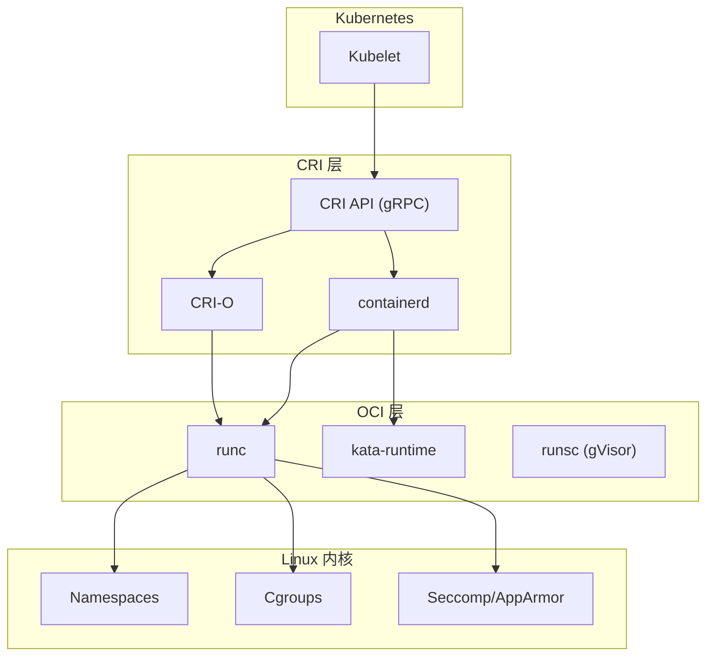
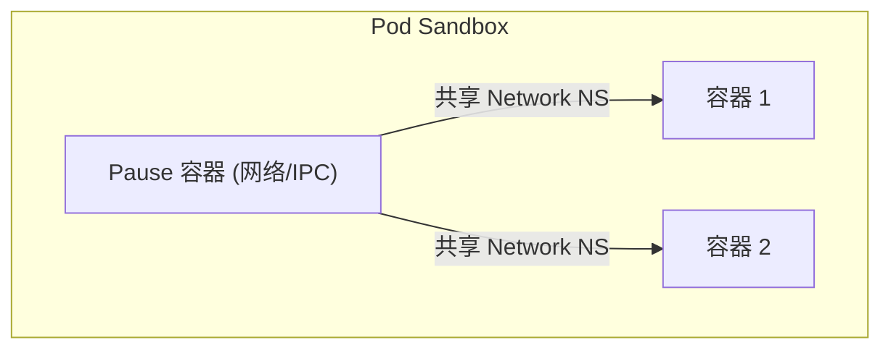
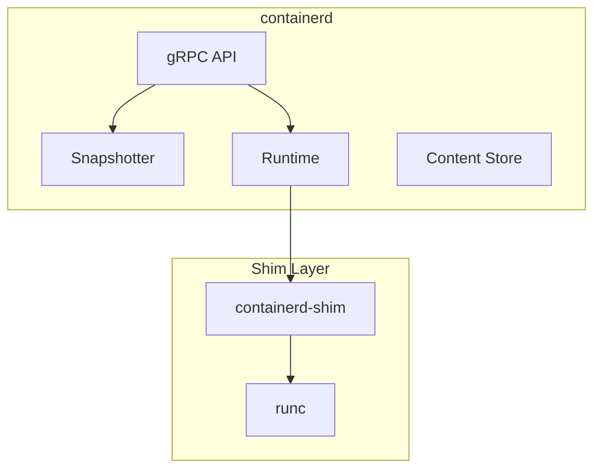
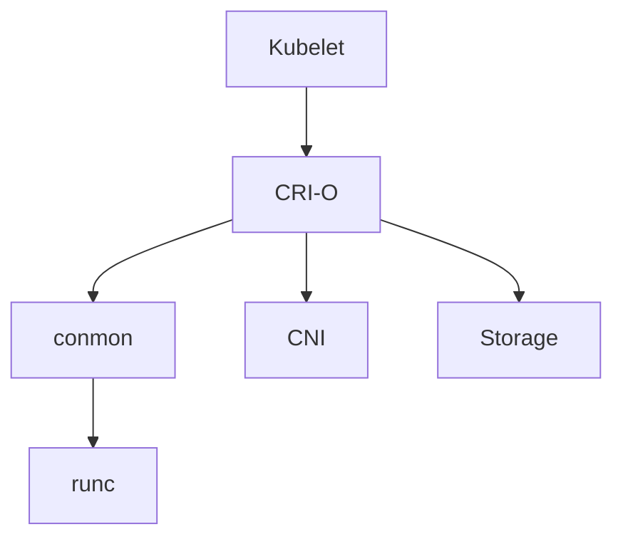
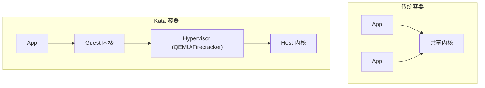
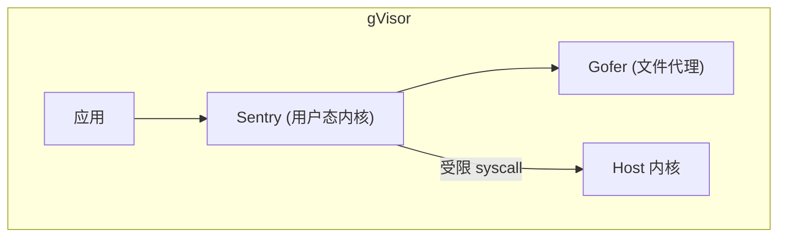

在 Kubernetes 中, **Container Runtime (容器运行时)** 是负责拉取镜像, 运行容器的底层组件. 随着 Kubernetes 移除对 Docker 的直接支持 (Dockershim), 运行时领域进入了 **CRI (Container Runtime Interface)** 时代.

---

## 1. 运行时分层架构



---

## 2. CRI (Container Runtime Interface)

### 2.1 CRI 设计目标

| 目标 | 描述 |
|------|------|
| **解耦** | Kubelet 与运行时实现分离 |
| **标准化** | 统一的 gRPC 接口 |
| **可扩展** | 支持多种运行时 |

### 2.2 CRI 服务

```proto
// RuntimeService - 容器生命周期
service RuntimeService {
    rpc RunPodSandbox(RunPodSandboxRequest) returns (RunPodSandboxResponse);
    rpc StopPodSandbox(StopPodSandboxRequest) returns (StopPodSandboxResponse);
    rpc CreateContainer(CreateContainerRequest) returns (CreateContainerResponse);
    rpc StartContainer(StartContainerRequest) returns (StartContainerResponse);
    rpc StopContainer(StopContainerRequest) returns (StopContainerResponse);
}

// ImageService - 镜像管理
service ImageService {
    rpc ListImages(ListImagesRequest) returns (ListImagesResponse);
    rpc PullImage(PullImageRequest) returns (PullImageResponse);
    rpc RemoveImage(RemoveImageRequest) returns (RemoveImageResponse);
}
```

### 2.3 Pod Sandbox

CRI 引入了 **Pod Sandbox** 概念:



---

## 3. containerd

### 3.1 架构



### 3.2 核心组件

| 组件 | 职责 |
|------|------|
| **Snapshotter** | 文件系统快照 (overlayfs) |
| **Content Store** | 镜像内容存储 |
| **Runtime** | 容器生命周期管理 |
| **Shim** | 容器进程托管, 允许 containerd 重启 |

### 3.3 配置

```toml
# /etc/containerd/config.toml
version = 2

[plugins."io.containerd.grpc.v1.cri"]
  sandbox_image = "registry.k8s.io/pause:3.9"
  
[plugins."io.containerd.grpc.v1.cri".containerd]
  default_runtime_name = "runc"
  
[plugins."io.containerd.grpc.v1.cri".containerd.runtimes.runc]
  runtime_type = "io.containerd.runc.v2"
  
[plugins."io.containerd.grpc.v1.cri".containerd.runtimes.runc.options]
  SystemdCgroup = true
```

### 3.4 工具

| 工具 | 用途 |
|------|------|
| `ctr` | containerd 原生 CLI |
| `nerdctl` | Docker 兼容 CLI |
| `crictl` | CRI 调试工具 |

---

## 4. CRI-O

### 4.1 设计理念

- **单一职责**: 仅为 Kubernetes 服务
- **轻量**: 无守护进程, 由 conmon 托管

### 4.2 架构



### 4.3 特点

| 特性 | 描述 |
|------|------|
| **版本对齐** | CRI-O 版本与 K8s 版本对齐 |
| **OpenShift 默认** | Red Hat 生态首选 |
| **无 daemon** | conmon 托管容器进程 |

---

## 5. 安全沙箱运行时

### 5.1 为什么需要沙箱

| 风险 | 描述 |
|------|------|
| **共享内核** | 容器共享宿主机内核 |
| **容器逃逸** | 内核漏洞可能导致逃逸 |
| **多租户隔离** | 不同租户容器需要强隔离 |

### 5.2 Kata Containers



| 特性 | 值 |
|------|-----|
| **隔离** | 硬件虚拟化 (VM) |
| **性能** | 中 (虚拟化开销) |
| **兼容性** | 极好 |
| **启动时间** | ~150ms (Firecracker) |

**配置 RuntimeClass**:
```yaml
apiVersion: node.k8s.io/v1
kind: RuntimeClass
metadata:
  name: kata
handler: kata
---
apiVersion: v1
kind: Pod
metadata:
  name: secure-pod
spec:
  runtimeClassName: kata
```

### 5.3 gVisor



| 特性 | 值 |
|------|-----|
| **隔离** | 用户态内核 |
| **性能** | 中 (syscall 拦截) |
| **兼容性** | 部分 syscall 不支持 |
| **启动时间** | 毫秒级 |

### 5.4 对比

| 特性 | runc | Kata | gVisor |
|------|------|------|--------|
| **隔离技术** | Namespace/Cgroups | VM | 用户态内核 |
| **隔离强度** | 低 | 极高 | 高 |
| **性能** | 极高 | 中 | 中 |
| **兼容性** | 完美 | 极好 | 一般 |
| **适用场景** | 通用 | 多租户/不可信代码 | 高安全 Web |

---

## 6. RuntimeClass

### 6.1 定义

```yaml
apiVersion: node.k8s.io/v1
kind: RuntimeClass
metadata:
  name: high-security
handler: kata
overhead:
  podFixed:
    memory: "120Mi"
    cpu: "250m"
scheduling:
  nodeSelector:
    security: high
```

### 6.2 使用

```yaml
apiVersion: v1
kind: Pod
metadata:
  name: untrusted-workload
spec:
  runtimeClassName: high-security
  containers:
  - name: app
    image: untrusted-image:latest
```

---

## 7. 镜像管理

### 7.1 OCI 镜像规范

```
image/
├── index.json      # 镜像索引 (多架构)
├── blobs/          # 内容寻址存储
│   ├── sha256:...  # 配置
│   └── sha256:...  # 层
└── oci-layout     # 版本标识
```

### 7.2 镜像拉取策略

| 策略 | 描述 |
|------|------|
| `Always` | 每次都拉取 |
| `IfNotPresent` | 本地不存在时拉取 |
| `Never` | 不拉取, 必须本地存在 |

### 7.3 私有仓库认证

```yaml
apiVersion: v1
kind: Secret
metadata:
  name: registry-secret
type: kubernetes.io/dockerconfigjson
data:
  .dockerconfigjson: <base64>
---
apiVersion: v1
kind: Pod
spec:
  imagePullSecrets:
  - name: registry-secret
```

---

## 8. 调试工具

### 8.1 crictl

```bash
# 配置
cat /etc/crictl.yaml
runtime-endpoint: unix:///run/containerd/containerd.sock
image-endpoint: unix:///run/containerd/containerd.sock

# 常用命令
crictl pods                    # 列出 Pod
crictl ps                      # 列出容器
crictl images                  # 列出镜像
crictl logs <container-id>     # 查看日志
crictl exec -it <id> sh        # 进入容器
crictl inspect <id>            # 检查容器
```

### 8.2 containerd 调试

```bash
# ctr 命令
ctr namespaces ls
ctr -n k8s.io containers ls
ctr -n k8s.io images ls

# nerdctl (Docker 兼容)
nerdctl -n k8s.io ps
nerdctl -n k8s.io images
```

---

## 9. 迁移指南

### 9.1 Docker → containerd

```bash
# 1. 安装 containerd
apt install containerd

# 2. 配置 Kubelet
# /var/lib/kubelet/kubeadm-flags.env
--container-runtime-endpoint=unix:///run/containerd/containerd.sock

# 3. 重启 Kubelet
systemctl restart kubelet
```

### 9.2 检查运行时

```bash
kubectl get nodes -o wide
# 查看 CONTAINER-RUNTIME 列
```

---

> **总结**: K8s 运行时的演进方向是 "更轻, 更专, 更安全". containerd 解决了 "专" 的问题, 而 Kata Containers 正在解决 "安全" 的边界.
