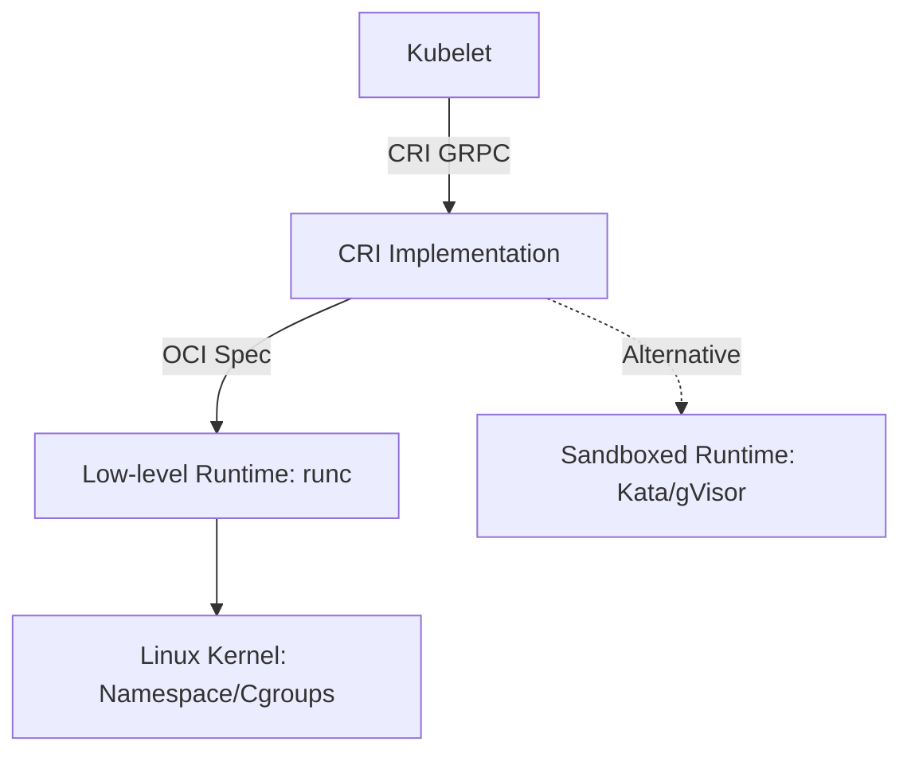

在 Kubernetes 中, **Container Runtime (容器运行时)** 是负责拉取镜像、运行容器的底层组件. 随着 Kubernetes 宣布移除对 Docker 的直接支持 (Dockershim), 运行时领域进入了 **CRI (Container Runtime Interface)** 时代.

## 什么是 CRI?

CRI 是一套插件接口, 它允许 Kubelet 在不重新编译的情况下使用各种容器运行时. 它将 Kubernetes 的调度逻辑与具体的容器生命周期管理解耦.

### 运行时分层模型

---

## 主流运行时对比

### 1. containerd
从 Docker 核心组件中剥离出来的工业级标准运行时.
*   **地位**: 目前 K8s 生态的事实标准, 性能极其稳定, 资源占用低.
*   **特点**: 它是 Docker 的子集, 专注于容器生命周期管理. 如果您从 Docker 迁移过来, containerd 是最自然的选择.
*   **工具**: 使用 `ctr` 或更符合 K8s 习惯的 `nerdctl` 进行调试.

### 2. CRI-O
由 Red Hat 推出, 专为 Kubernetes 设计的轻型运行时.
*   **地位**: OpenShift 默认使用.
*   **特点**: 遵循 "单主线" 原则, 仅实现 Kubernetes 所需的功能. 它的代码库更小, 受攻击面也相对较小.
*   **工具**: 使用 `crictl` 进行操作.

### 3. Docker (via cri-dockershim)
Docker 本身不支持 CRI 接口, 以前由 Kubelet 内部集成转换逻辑 (Dockershim).
*   **现状**: 弃用. 如果非要用, 需要单独安装 Mirantis 维护的 `cri-dockershim`.
*   **建议**: 生产环境建议直接切换到 containerd.

---

## 安全沙箱运行时 (Secure Runtimes)

传统的容器共享宿主机内核, 一旦发生 "容器逃逸", 宿主机将面临巨大的安全风险. 安全沙箱通过增加隔离层来解决这一问题:

| 特性 | runc (默认) | Kata Containers | gVisor (Google) |
| :--- | :--- | :--- | :--- |
| **隔离技术** | Namespace / Cgroups | **轻量级虚拟机 (MicroVM)** | **用户态内核拦截 (Sentry)** |
| **隔离强度** | 低 | **极高** | **高** |
| **性能损耗** | 极低 | 中 (有虚拟化开销) | 低到中 (系统调用拦截) |
| **兼容性** | 完美 | 极好 | 一般 (部分系统调用不支持) |
| **应用场景** | 通用环境 | 多租户、不可信代码运行 | 高安全 Web 服务 |

---

## 如何选择运行时?

1.  **通用生产环境**: **containerd**. 它是最稳妥、支持最广泛的选择.
2.  **Red Hat / OpenShift 生态**: **CRI-O**. 与其生态集成度最高.
3.  **多租户云环境 / 需要隔离不可信应用**: **Kata Containers**. 它是用硬件虚拟化技术包裹容器, 安全等级等同于虚拟机.
4.  **轻量级安全需求**: **gVisor**. 比如在无服务器 (Serverless) 场景中运行用户上传的代码.

---

## 运维锦囊: crictl 工具

无论您使用的是 containerd 还是 CRI-O, 建议统一学习使用 **`crictl`**. 它是专门为 CRI 运行时设计的命令行检查工具, 语法与 `docker` 非常相似:

*   `crictl ps`: 查看容器列表
*   `crictl pods`: 查看 Pod 列表 (这是 docker 没有的概念)
*   `crictl logs <id>`: 查看日志
*   `crictl exec -it <id> sh`: 进入容器内部

> **总结**: K8s 运行时的演进方向是 "更轻、更专、更安全". containerd 解决了 "专" 的问题, 而 Kata Containers 正在解决 "安全" 的边界.
