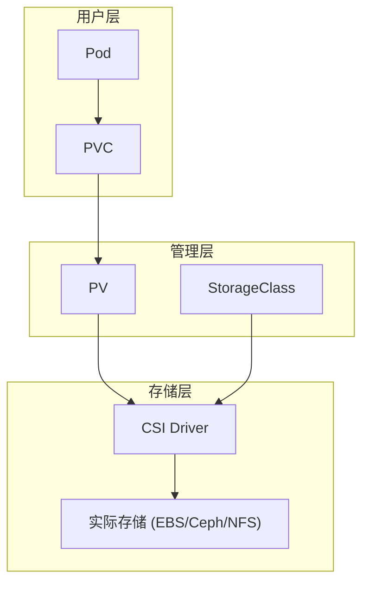
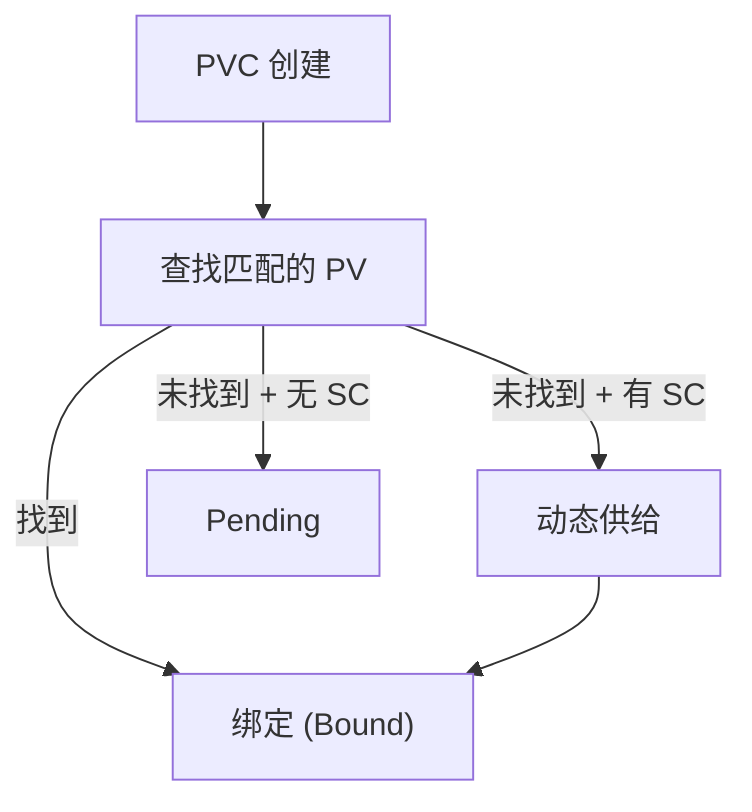
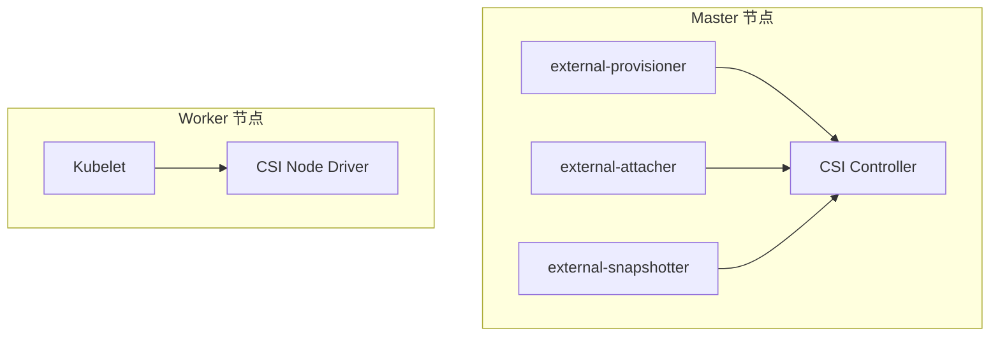
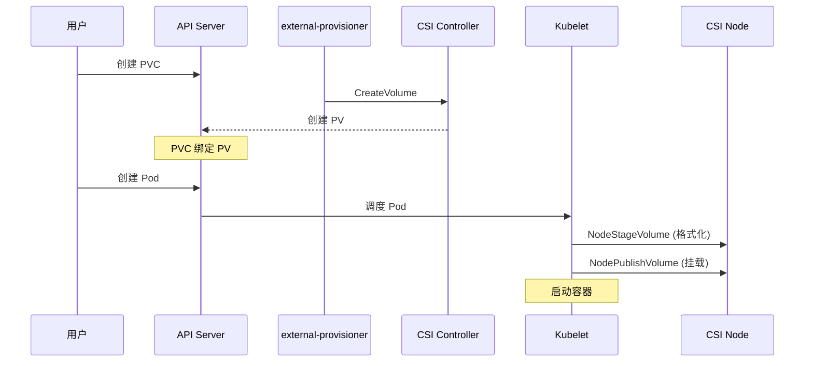

在容器化的无状态世界里, 如何让数据持久化? Kubernetes 通过 **CSI (Container Storage Interface)** 建立了一套标准, 允许不同的存储供应商 (AWS EBS, Ceph, NFS) 无缝接入集群.

---

## 1. 存储抽象层



### 1.1 核心对象

| 对象 | 角色 | 描述 |
|------|------|------|
| **PV** | 管理员 | 实际存储资源的抽象 |
| **PVC** | 用户 | 对存储的需求声明 |
| **StorageClass** | 策略 | 定义动态供给策略 |

---

## 2. PV 与 PVC

### 2.1 PV (Persistent Volume)

```yaml
apiVersion: v1
kind: PersistentVolume
metadata:
  name: pv-nfs
spec:
  capacity:
    storage: 100Gi
  accessModes:
  - ReadWriteMany
  persistentVolumeReclaimPolicy: Retain
  storageClassName: nfs
  nfs:
    server: nfs.example.com
    path: /exports/data
  mountOptions:
  - hard
  - nfsvers=4.1
```

### 2.2 PVC (Persistent Volume Claim)

```yaml
apiVersion: v1
kind: PersistentVolumeClaim
metadata:
  name: data-pvc
spec:
  accessModes:
  - ReadWriteOnce
  resources:
    requests:
      storage: 10Gi
  storageClassName: fast-ssd
  selector:
    matchLabels:
      environment: production
```

### 2.3 绑定机制



**匹配条件**:
- 容量 >= 请求
- 访问模式包含请求的模式
- StorageClass 匹配
- Selector 匹配 (如果指定)

### 2.4 访问模式

| 模式 | 缩写 | 描述 | 典型存储 |
|------|------|------|----------|
| **ReadWriteOnce** | RWO | 单节点读写 | Block (EBS, Azure Disk) |
| **ReadOnlyMany** | ROX | 多节点只读 | NFS, CephFS |
| **ReadWriteMany** | RWX | 多节点读写 | NFS, CephFS, GlusterFS |
| **ReadWriteOncePod** | RWOP | 单 Pod 读写 | CSI 1.5+ |

### 2.5 回收策略

| 策略 | 行为 |
|------|------|
| **Retain** | PVC 删除后保留 PV 和数据 |
| **Delete** | PVC 删除后删除 PV 和底层存储 |
| **Recycle** | 已废弃, 使用动态供给替代 |

---

## 3. StorageClass

### 3.1 定义

```yaml
apiVersion: storage.k8s.io/v1
kind: StorageClass
metadata:
  name: fast-ssd
  annotations:
    storageclass.kubernetes.io/is-default-class: "true"
provisioner: ebs.csi.aws.com
parameters:
  type: gp3
  iops: "3000"
  throughput: "125"
  encrypted: "true"
reclaimPolicy: Delete
allowVolumeExpansion: true
volumeBindingMode: WaitForFirstConsumer
```

### 3.2 关键参数

| 参数 | 描述 |
|------|------|
| `provisioner` | CSI 驱动名称 |
| `parameters` | 存储后端特定参数 |
| `reclaimPolicy` | 回收策略 |
| `allowVolumeExpansion` | 是否允许扩容 |
| `volumeBindingMode` | 绑定时机 |

### 3.3 绑定模式

| 模式 | 行为 |
|------|------|
| **Immediate** | PVC 创建后立即绑定 |
| **WaitForFirstConsumer** | 等待 Pod 调度后再绑定 (拓扑感知) |

---

## 4. CSI 架构



### 4.1 CSI 组件

| 组件 | 位置 | 职责 |
|------|------|------|
| **Controller Plugin** | Deployment | 创建/删除卷, 快照 |
| **Node Plugin** | DaemonSet | 挂载/卸载卷 |
| **external-provisioner** | Sidecar | 监听 PVC, 调用 CreateVolume |
| **external-attacher** | Sidecar | 监听 VolumeAttachment, 调用 ControllerPublish |
| **external-snapshotter** | Sidecar | 处理卷快照 |
| **node-driver-registrar** | Sidecar | 向 Kubelet 注册 CSI 驱动 |

### 4.2 CSI RPC 接口

| 服务 | 方法 |
|------|------|
| **Identity** | GetPluginInfo, Probe, GetPluginCapabilities |
| **Controller** | CreateVolume, DeleteVolume, ControllerPublishVolume |
| **Node** | NodeStageVolume, NodePublishVolume, NodeGetInfo |

---

## 5. 卷操作

### 5.1 挂载流程



### 5.2 卷扩容

```yaml
# 修改 PVC
spec:
  resources:
    requests:
      storage: 20Gi  # 从 10Gi 扩容到 20Gi
```

扩容流程:
1. 更新 PVC 的 storage 请求
2. CSI 控制器扩容底层卷
3. Kubelet 扩展文件系统 (在线或离线)

---

## 6. 卷快照 (VolumeSnapshot)

### 6.1 VolumeSnapshotClass

```yaml
apiVersion: snapshot.storage.k8s.io/v1
kind: VolumeSnapshotClass
metadata:
  name: csi-aws-snapclass
driver: ebs.csi.aws.com
deletionPolicy: Delete
parameters:
  type: snap
```

### 6.2 创建快照

```yaml
apiVersion: snapshot.storage.k8s.io/v1
kind: VolumeSnapshot
metadata:
  name: data-snapshot
spec:
  volumeSnapshotClassName: csi-aws-snapclass
  source:
    persistentVolumeClaimName: data-pvc
```

### 6.3 从快照恢复

```yaml
apiVersion: v1
kind: PersistentVolumeClaim
metadata:
  name: restored-pvc
spec:
  dataSource:
    name: data-snapshot
    kind: VolumeSnapshot
    apiGroup: snapshot.storage.k8s.io
  accessModes:
  - ReadWriteOnce
  resources:
    requests:
      storage: 10Gi
```

---

## 7. 本地存储

### 7.1 Local PV

```yaml
apiVersion: v1
kind: PersistentVolume
metadata:
  name: local-pv
spec:
  capacity:
    storage: 100Gi
  accessModes:
  - ReadWriteOnce
  persistentVolumeReclaimPolicy: Retain
  storageClassName: local-storage
  local:
    path: /mnt/disks/ssd1
  nodeAffinity:
    required:
      nodeSelectorTerms:
      - matchExpressions:
        - key: kubernetes.io/hostname
          operator: In
          values:
          - node-1
```

### 7.2 Local StorageClass

```yaml
apiVersion: storage.k8s.io/v1
kind: StorageClass
metadata:
  name: local-storage
provisioner: kubernetes.io/no-provisioner
volumeBindingMode: WaitForFirstConsumer
```

### 7.3 本地 vs 网络存储

| 特性 | 本地存储 | 网络存储 |
|------|----------|----------|
| 性能 | 极高 (NVMe) | 受网络限制 |
| 持久性 | 节点故障即丢失 | 跨节点复制 |
| 调度 | 固定节点 | 灵活迁移 |
| 适用场景 | 高性能 DB | 通用应用 |

---

## 8. 常见 CSI 驱动

| 驱动 | 存储类型 | 特点 |
|------|----------|------|
| **ebs.csi.aws.com** | AWS EBS | 块存储, gp3/io2 |
| **pd.csi.storage.gke.io** | GCP PD | GCE 持久磁盘 |
| **disk.csi.azure.com** | Azure Disk | Azure 托管磁盘 |
| **rook-ceph.rbd.csi.ceph.com** | Ceph RBD | 分布式块存储 |
| **nfs.csi.k8s.io** | NFS | 网络文件系统 |

---

## 9. 调试与排查

```bash
# 查看 PV/PVC 状态
kubectl get pv,pvc -A

# 查看 StorageClass
kubectl get storageclass

# 查看 VolumeAttachment
kubectl get volumeattachments

# CSI 驱动 Pod 日志
kubectl logs -n kube-system -l app=ebs-csi-controller

# 挂载点排查
kubectl describe pod <name> | grep -A 10 Volumes
```

---

> **总结**: CSI 标准化了存储的操作接口. 在选型时, 应根据业务对 IOPS, 延迟以及高可用的权重进行平衡.
