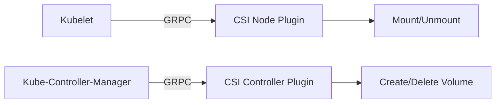

在容器化的无状态世界里, 如何让数据持久化? Kubernetes 通过 **CSI (Container Storage Interface)** 建立了一套标准, 允许不同的存储供应商 (AWS EBS, Ceph, NFS) 无缝接入集群.

## 1. 存储层抽象: PV 与 PVC

Kubernetes 为了解耦 "底层存储设施" 与 "上层业务需求", 引入了两个核心资源:

*   **PV (Persistent Volume)**: 由管理员配置的存储资源. 它描述了硬盘的实际容量、访问模式 (RWO/RWX) 以及底层路径.
*   **PVC (Persistent Volume Claim)**: 用户对存储的需求声明. 用户不感知具体磁盘在哪, 只声明 "我需要 10GiB 空间".

### 绑定逻辑
K8s 会寻找符合 PVC 要求的 PV 并将两者绑定 (Bound). 只有绑定后, PVC 才能被挂载到 Pod 中使用.

---

## 2. 核心架构: CSI 驱动

**CSI (容器存储接口)** 将存储控制逻辑从 Kubernetes 主代码中分离出来.

*   **Control Plane 职责**: 负责卷的操作 (例如在 AWS 上创建一个硬盘).
*   **Node 职责**: 负责卷的挂载 (例如将硬盘格式化并挂载到容器目录).

---

## 3. StorageClass: 动态供给 (Dynamic Provisioning)

如果每次都需要管理员手动创建 PV, 运维效率将极低. **StorageClass** 实现了自动创建 PV 的功能.

1.  用户提交 PVC, 指定 `storageClassName`.
2.  控制面监听到 PVC 后, 调用对应的 CSI 驱动请求空间.
3.  CSI 驱动在云平台或存储服务端创建磁盘.
4.  K8s 自动生成对应的 PV 并与 PVC 绑定.

---

## 4. 访问模式 (Access Modes)

| 模式 | 缩写 | 含义 |
| :--- | :--- | :--- |
| **ReadWriteOnce** | **RWO** | 卷可以被单个节点以读写方式挂载. (常见于 Block Storage) |
| **ReadOnlyMany** | **ROX** | 卷可以被多个节点以只读方式挂载. |
| **ReadWriteMany** | **RWX** | 卷可以被多个节点以读写方式挂载. (常见于 NFS, CephFS) |

---

## 5. 本地卷 (Local PV) 与分布式存储的选择

*   **本地存储 (Local PV)**: 极致的 IO 性能 (NVMe 闪存), 适用于高性能数据库 (MySQL, TiDB). 缺点是与节点强绑定, 节点宕机数据面临风险.
*   **中心化存储 (Ceph/Cloud Disk)**: 数据高可用, 支持跨物理节点漂移. 缺点是受限于网络带宽, 延迟相对较高.

> **总结**: CSI 标准化了存储的操作接口. 在选型时, 应根据业务对 IOPS、延迟以及高可用的权重进行平衡.
