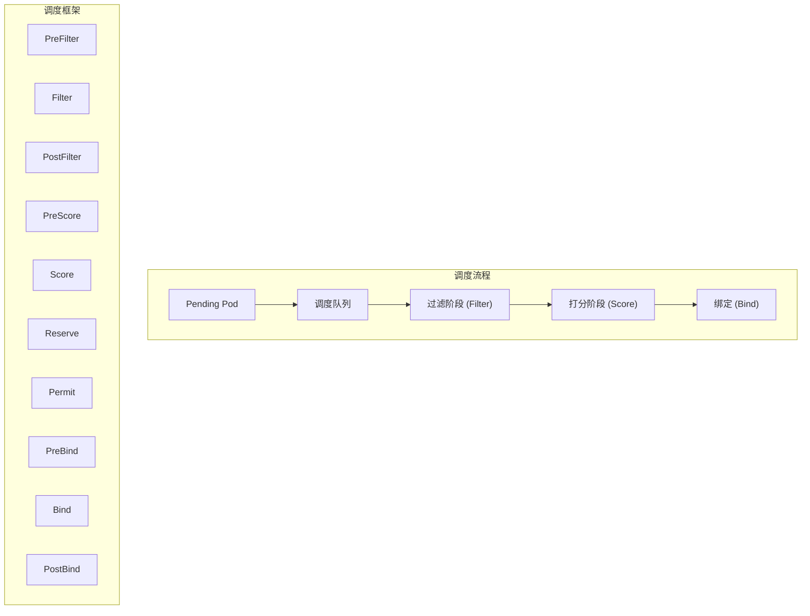
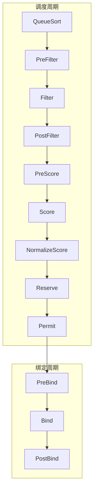
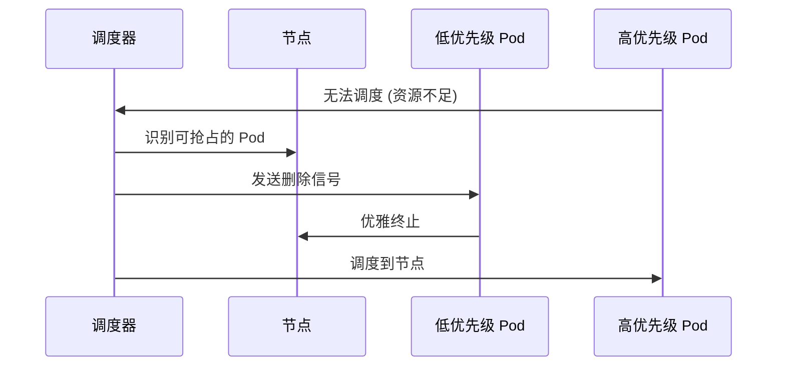

**kube-scheduler** 是 Kubernetes 的核心决策者. 它的任务是根据一系列规则, 在庞大的节点资源池中为待调度的 Pod 找到最合适的 "家".

---

## 1. 调度器架构



### 1.1 调度上下文

| 对象 | 描述 |
|------|------|
| **Pod** | 待调度的工作负载 |
| **Node** | 候选节点列表 |
| **PodInfo** | Pod 的调度相关信息缓存 |
| **NodeInfo** | 节点资源快照 |

---

## 2. 调度的两个阶段

当一个 Pod 进入调度队列时, 调度器会经历两个核心阶段:

### 2.1 过滤阶段 (Filtering/Predicates)

排除不符合条件的节点:

| 过滤器 | 检查内容 |
|--------|----------|
| **PodFitsResources** | CPU/内存资源是否充足 |
| **PodFitsHostPorts** | HostPort 是否被占用 |
| **PodMatchNodeSelector** | nodeSelector 是否匹配 |
| **PodToleratesNodeTaints** | Pod 是否容忍节点 Taints |
| **CheckNodeUnschedulable** | 节点是否可调度 |
| **CheckVolumeBinding** | PV 是否可绑定 |
| **InterPodAffinity** | Pod 亲和性规则检查 |

### 2.2 打分阶段 (Scoring/Priorities)

在候选节点中打分排序:

| 打分器 | 策略 |
|--------|------|
| **LeastRequestedPriority** | 倾向资源占用少的节点 (负载均衡) |
| **BalancedResourceAllocation** | CPU/内存使用比例均衡 |
| **ImageLocality** | 倾向已有所需镜像的节点 |
| **NodeAffinityPriority** | 满足 preferredNodeAffinity |
| **InterPodAffinityPriority** | 满足 podAffinity/antiAffinity |
| **TaintTolerationPriority** | 容忍更多 Taints 的节点得分更高 |

---

## 3. 调度框架 (Scheduling Framework)

Kubernetes 1.19+ 引入了插件化的调度框架, 将调度过程分为多个扩展点:



### 3.1 扩展点说明

| 扩展点 | 阶段 | 作用 |
|--------|------|------|
| **QueueSort** | 入队 | 决定 Pod 在队列中的顺序 |
| **PreFilter** | 预处理 | 检查 Pod 先决条件 |
| **Filter** | 过滤 | 排除不合格节点 |
| **PostFilter** | 后处理 | 处理无可用节点的情况 (抢占) |
| **PreScore** | 打分前 | 准备打分所需信息 |
| **Score** | 打分 | 为节点评分 |
| **Reserve** | 预留 | 预留节点资源 |
| **Permit** | 许可 | 批准/拒绝/等待绑定 |
| **PreBind** | 绑定前 | 执行绑定前置操作 |
| **Bind** | 绑定 | 将 Pod 绑定到节点 |
| **PostBind** | 绑定后 | 清理或通知操作 |

### 3.2 自定义调度插件

```go
type Plugin interface {
    Name() string
}

type FilterPlugin interface {
    Plugin
    Filter(ctx context.Context, state *CycleState, pod *v1.Pod, nodeInfo *NodeInfo) *Status
}

type ScorePlugin interface {
    Plugin
    Score(ctx context.Context, state *CycleState, pod *v1.Pod, nodeName string) (int64, *Status)
}
```

---

## 4. 亲和性与反亲和性

### 4.1 Node Affinity

```yaml
spec:
  affinity:
    nodeAffinity:
      requiredDuringSchedulingIgnoredDuringExecution:  # 硬性要求
        nodeSelectorTerms:
        - matchExpressions:
          - key: disktype
            operator: In
            values: ["ssd"]
      preferredDuringSchedulingIgnoredDuringExecution:  # 软性偏好
      - weight: 100
        preference:
          matchExpressions:
          - key: zone
            operator: In
            values: ["zone-a"]
```

### 4.2 Pod Affinity / Anti-Affinity

```yaml
spec:
  affinity:
    podAffinity:
      requiredDuringSchedulingIgnoredDuringExecution:
      - labelSelector:
          matchLabels:
            app: cache
        topologyKey: kubernetes.io/hostname
    podAntiAffinity:
      preferredDuringSchedulingIgnoredDuringExecution:
      - weight: 100
        podAffinityTerm:
          labelSelector:
            matchLabels:
              app: web
          topologyKey: topology.kubernetes.io/zone
```

| 字段 | 含义 |
|------|------|
| `topologyKey` | 定义 "同一位置" 的标准 (主机名, 机架, 可用区) |
| `labelSelector` | 匹配目标 Pod 的标签 |
| `namespaceSelector` | 跨 Namespace 匹配 |

---

## 5. Taints 与 Tolerations

### 5.1 Taint 效果

| Effect | 行为 |
|--------|------|
| `NoSchedule` | 不调度新 Pod |
| `PreferNoSchedule` | 尽量不调度 |
| `NoExecute` | 驱逐已有 Pod |

```bash
# 添加 Taint
kubectl taint nodes node1 key=value:NoSchedule

# 移除 Taint
kubectl taint nodes node1 key=value:NoSchedule-
```

### 5.2 Toleration

```yaml
spec:
  tolerations:
  - key: "key"
    operator: "Equal"
    value: "value"
    effect: "NoSchedule"
  - key: "key"
    operator: "Exists"
    effect: "NoExecute"
    tolerationSeconds: 3600  # 容忍 1 小时后驱逐
```

---

## 6. 优先级与抢占

### 6.1 PriorityClass

```yaml
apiVersion: scheduling.k8s.io/v1
kind: PriorityClass
metadata:
  name: high-priority
value: 1000000
globalDefault: false
preemptionPolicy: PreemptLowerPriority
description: "用于关键业务"
```

### 6.2 抢占机制

当高优先级 Pod 无法调度时:

1. 调度器尝试寻找可抢占的低优先级 Pod
2. 选择 "牺牲者" 使高优先级 Pod 可调度
3. 优雅终止被抢占的 Pod
4. 调度高优先级 Pod



---

## 7. Descheduler (反调度器)

调度器只负责 Pod 的初始放置. **Descheduler** 可以重新平衡已运行的 Pod:

### 7.1 使用场景

- 节点资源利用率不均衡
- 新节点加入集群
- 节点 Taint 变更
- Pod 亲和性规则违反

### 7.2 常用策略

| 策略 | 作用 |
|------|------|
| `RemoveDuplicates` | 移除同节点上的重复 Pod |
| `LowNodeUtilization` | 从高负载节点迁移到低负载节点 |
| `RemovePodsViolatingInterPodAntiAffinity` | 移除违反反亲和性的 Pod |
| `RemovePodsViolatingNodeAffinity` | 移除违反节点亲和性的 Pod |
| `RemovePodsViolatingTopologySpreadConstraint` | 重新平衡拓扑分布 |

---

## 8. Topology Spread Constraints

控制 Pod 在拓扑域间的分布:

```yaml
spec:
  topologySpreadConstraints:
  - maxSkew: 1
    topologyKey: topology.kubernetes.io/zone
    whenUnsatisfiable: DoNotSchedule
    labelSelector:
      matchLabels:
        app: web
  - maxSkew: 2
    topologyKey: kubernetes.io/hostname
    whenUnsatisfiable: ScheduleAnyway
```

| 字段 | 含义 |
|------|------|
| `maxSkew` | 允许的最大差异 |
| `topologyKey` | 拓扑域标签 |
| `whenUnsatisfiable` | 不满足时的行为 |

---

> 默认调度器能满足 90% 的场景. 剩下的 10% 需要通过 Affinity, Taints, PriorityClass 以及合理的 Resource Quota 来进行精细化微调.
