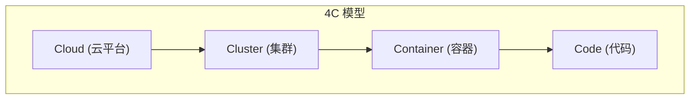
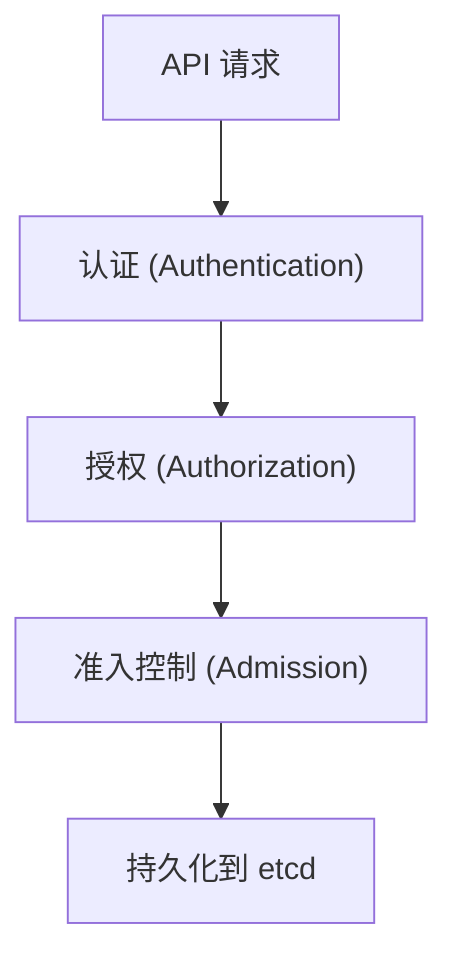
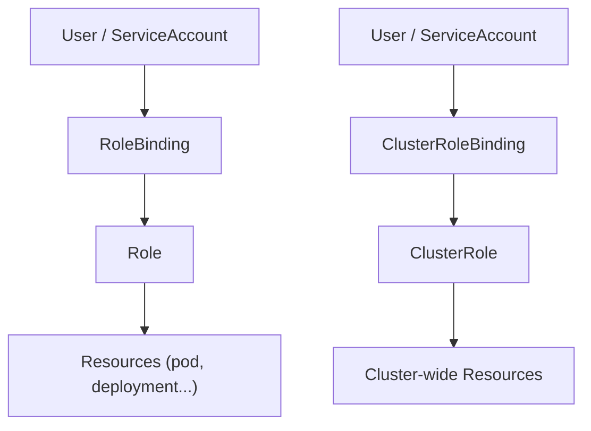

Kubernetes 的安全模型被称为 **4C 模型**: Cloud, Cluster, Container, Code. 在集群层面, 我们需要从身份认证, 访问控制和底层隔离三个维度建立防线.

---

## 1. 4C 安全模型



| 层级 | 责任范围 | 关键措施 |
|------|----------|----------|
| **Cloud** | 云平台安全 | VPC 隔离, IAM, 网络防火墙 |
| **Cluster** | K8s 集群安全 | RBAC, NetworkPolicy, Admission |
| **Container** | 容器运行时安全 | 镜像扫描, Seccomp, AppArmor |
| **Code** | 应用代码安全 | 依赖扫描, Secret 管理, SAST |

---

## 2. API Server 访问控制流程



### 2.1 认证 (Authentication)

| 方式 | 描述 |
|------|------|
| **X.509 证书** | kubeconfig 中的客户端证书 |
| **Bearer Token** | ServiceAccount Token |
| **OIDC** | 集成企业 IdP (Dex, Keycloak) |
| **Webhook** | 外部认证服务 |

### 2.2 授权 (Authorization)

| 模式 | 描述 |
|------|------|
| **RBAC** | 基于角色的访问控制 (推荐) |
| **ABAC** | 基于属性的访问控制 |
| **Webhook** | 外部授权服务 |
| **Node** | 限制 Kubelet 访问范围 |

### 2.3 准入控制 (Admission Control)

| 类型 | 阶段 | 作用 |
|------|------|------|
| **Mutating** | 修改阶段 | 注入 Sidecar, 默认值 |
| **Validating** | 验证阶段 | 拒绝不合规资源 |
| **ImagePolicyWebhook** | 镜像验证 | 验证镜像签名 |

内置关键准入控制器:
- `LimitRanger`: 强制资源限制
- `ResourceQuota`: 命名空间配额
- `PodSecurity`: Pod 安全标准
- `NodeRestriction`: 限制 Kubelet 权限

---

## 3. RBAC 详解

### 3.1 核心对象



### 3.2 Role 示例

```yaml
apiVersion: rbac.authorization.k8s.io/v1
kind: Role
metadata:
  name: pod-reader
  namespace: default
rules:
- apiGroups: [""]
  resources: ["pods", "pods/log"]
  verbs: ["get", "list", "watch"]
- apiGroups: ["apps"]
  resources: ["deployments"]
  verbs: ["get", "list"]
  resourceNames: ["my-app"]  # 可选: 限制特定资源
```

### 3.3 常用 Verbs

| Verb | 描述 |
|------|------|
| `get` | 读取单个资源 |
| `list` | 列出资源集合 |
| `watch` | 监听资源变化 |
| `create` | 创建资源 |
| `update` | 更新资源 |
| `patch` | 部分更新 |
| `delete` | 删除资源 |
| `deletecollection` | 批量删除 |

---

## 4. Network Policy

### 4.1 默认行为

| 场景 | 行为 |
|------|------|
| 无 NetworkPolicy | 所有流量允许 |
| 有 Ingress Policy | 仅匹配的入站流量允许 |
| 有 Egress Policy | 仅匹配的出站流量允许 |

### 4.2 默认拒绝策略

```yaml
apiVersion: networking.k8s.io/v1
kind: NetworkPolicy
metadata:
  name: default-deny-all
  namespace: production
spec:
  podSelector: {}  # 匹配所有 Pod
  policyTypes:
  - Ingress
  - Egress
```

### 4.3 精细化规则

```yaml
apiVersion: networking.k8s.io/v1
kind: NetworkPolicy
metadata:
  name: api-allow
spec:
  podSelector:
    matchLabels:
      app: api
  policyTypes:
  - Ingress
  - Egress
  ingress:
  - from:
    - namespaceSelector:
        matchLabels:
          env: production
    - podSelector:
        matchLabels:
          role: frontend
    ports:
    - protocol: TCP
      port: 8080
  egress:
  - to:
    - podSelector:
        matchLabels:
          app: database
    ports:
    - protocol: TCP
      port: 5432
  - to:  # 允许 DNS
    - namespaceSelector: {}
      podSelector:
        matchLabels:
          k8s-app: kube-dns
    ports:
    - protocol: UDP
      port: 53
```

---

## 5. Pod 安全标准 (PSS)

### 5.1 三个安全级别

| 级别 | 描述 | 限制 |
|------|------|------|
| **Privileged** | 无限制 | 用于系统组件 |
| **Baseline** | 基础限制 | 阻止已知提权 |
| **Restricted** | 严格限制 | 生产环境推荐 |

### 5.2 Pod Security Admission

```yaml
apiVersion: v1
kind: Namespace
metadata:
  name: production
  labels:
    pod-security.kubernetes.io/enforce: restricted
    pod-security.kubernetes.io/enforce-version: latest
    pod-security.kubernetes.io/warn: restricted
    pod-security.kubernetes.io/audit: restricted
```

| 模式 | 行为 |
|------|------|
| `enforce` | 拒绝违规 Pod |
| `warn` | 允许但警告 |
| `audit` | 仅记录日志 |

### 5.3 Restricted 级别限制

```yaml
spec:
  securityContext:
    runAsNonRoot: true
    seccompProfile:
      type: RuntimeDefault
  containers:
  - name: app
    securityContext:
      allowPrivilegeEscalation: false
      capabilities:
        drop: ["ALL"]
      readOnlyRootFilesystem: true
```

---

## 6. Secret 管理

### 6.1 Secret 类型

| 类型 | 用途 |
|------|------|
| `Opaque` | 通用密钥 |
| `kubernetes.io/tls` | TLS 证书 |
| `kubernetes.io/dockerconfigjson` | 镜像拉取凭据 |
| `kubernetes.io/service-account-token` | SA Token |

### 6.2 静态加密 (Encryption at Rest)

```yaml
# /etc/kubernetes/encryption-config.yaml
apiVersion: apiserver.config.k8s.io/v1
kind: EncryptionConfiguration
resources:
- resources:
  - secrets
  providers:
  - aescbc:
      keys:
      - name: key1
        secret: <base64-encoded-key>
  - identity: {}  # 回退到明文
```

### 6.3 外部 Secret 管理

| 工具 | 集成方式 |
|------|----------|
| **HashiCorp Vault** | CSI Driver, Sidecar |
| **AWS Secrets Manager** | External Secrets Operator |
| **Azure Key Vault** | CSI Driver |
| **SOPS** | GitOps 加密 |

---

## 7. 运行时安全

### 7.1 Seccomp

限制容器可用的系统调用:

```yaml
spec:
  securityContext:
    seccompProfile:
      type: RuntimeDefault  # 或 Localhost
      # localhostProfile: profiles/my-profile.json
```

### 7.2 AppArmor

```yaml
metadata:
  annotations:
    container.apparmor.security.beta.kubernetes.io/app: runtime/default
```

### 7.3 运行时检测 (Falco)

实时监控异常行为:
- 容器内执行 shell
- 非预期网络连接
- 敏感文件访问
- 特权操作

---

## 8. 镜像安全

### 8.1 镜像扫描

| 工具 | 特点 |
|------|------|
| **Trivy** | 快速, 支持 SBOM |
| **Grype** | Anchore 开源版 |
| **Clair** | 分布式扫描 |

### 8.2 镜像签名 (Cosign)

```bash
# 签名镜像
cosign sign --key cosign.key myregistry/myimage:v1

# 验证签名
cosign verify --key cosign.pub myregistry/myimage:v1
```

### 8.3 准入策略验证

```yaml
# Kyverno 策略示例
apiVersion: kyverno.io/v1
kind: ClusterPolicy
metadata:
  name: verify-image-signature
spec:
  rules:
  - name: check-signature
    match:
      resources:
        kinds: ["Pod"]
    verifyImages:
    - image: "myregistry/*"
      key: |-
        -----BEGIN PUBLIC KEY-----
        ...
        -----END PUBLIC KEY-----
```

---

## 9. 审计日志

```yaml
# audit-policy.yaml
apiVersion: audit.k8s.io/v1
kind: Policy
rules:
- level: Metadata
  resources:
  - group: ""
    resources: ["secrets", "configmaps"]
- level: RequestResponse
  resources:
  - group: ""
    resources: ["pods"]
  verbs: ["create", "delete"]
- level: None
  users: ["system:kube-scheduler"]
```

| 级别 | 记录内容 |
|------|----------|
| `None` | 不记录 |
| `Metadata` | 仅元数据 |
| `Request` | 包含请求体 |
| `RequestResponse` | 包含请求和响应体 |

---

> 安全不是一个单一的产品, 而是从认证到运行时的闭环. 坚持 "最小特权原则 (Least Privilege)" 是防御的核心.
