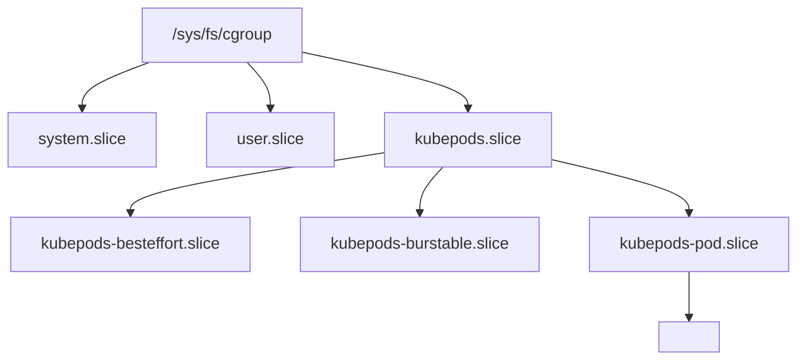
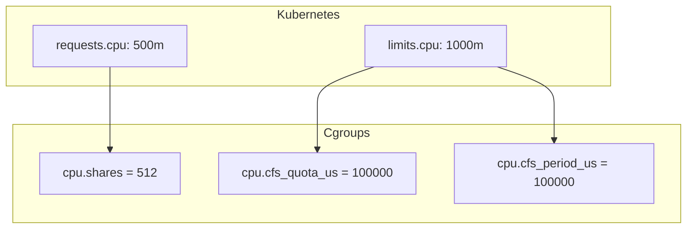
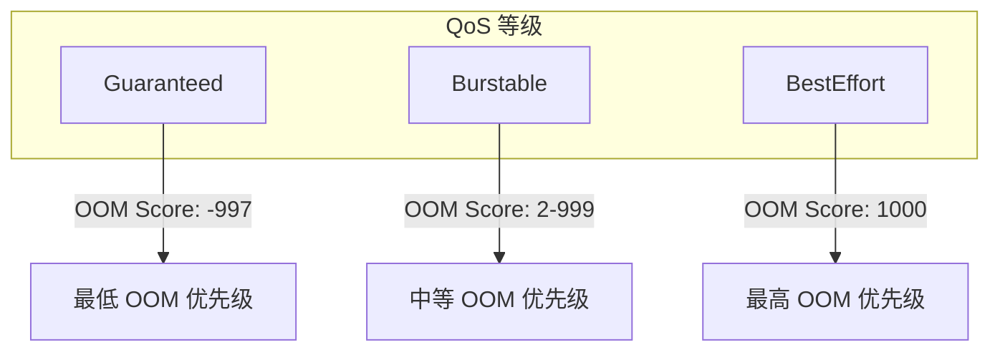
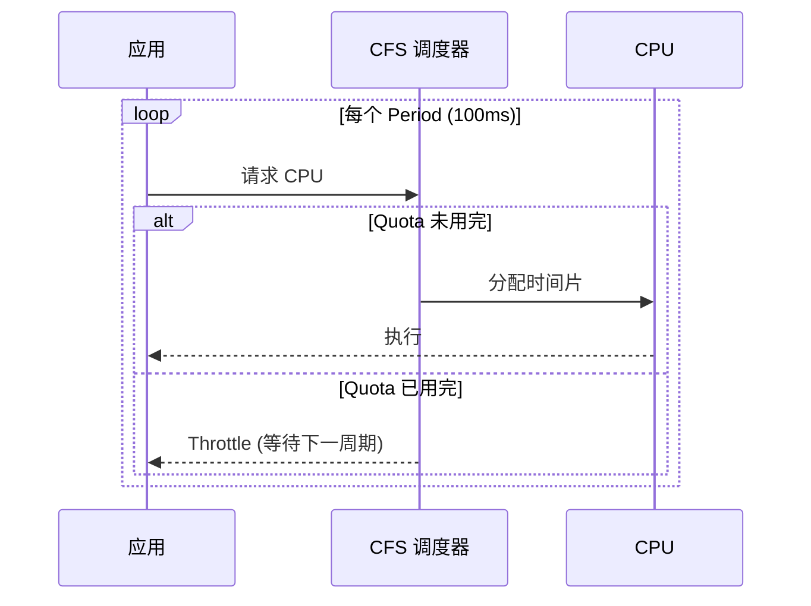
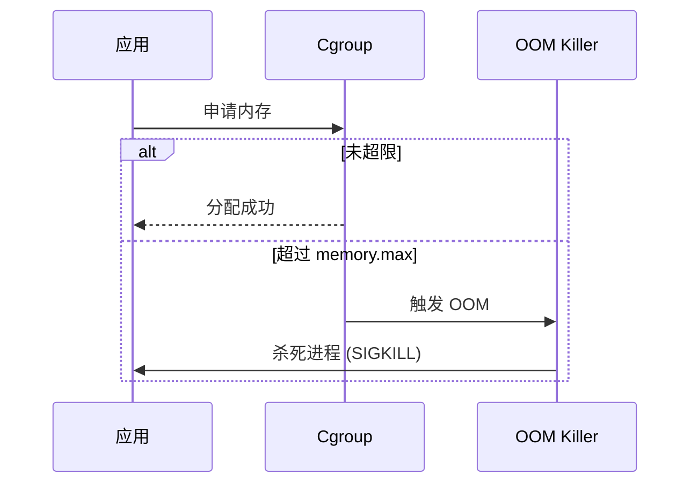

在 Kubernetes 中, 资源管理的核心在于 "限制" 与 "隔离". 这种能力并非由 Kubernetes 凭空创造, 而是建立在 Linux 内核的 **Control Groups (cgroups)** 机制之上.

---

## 1. Cgroups 基础

### 1.1 什么是 Cgroups

Cgroups 是 Linux 内核提供的一种机制, 用于对一组进程进行资源配额和度量:

| 功能 | 描述 |
|------|------|
| **资源限制** | 限制 CPU, 内存, I/O 等使用量 |
| **优先级** | 分配资源权重 |
| **统计** | 监控资源使用情况 |
| **控制** | 冻结, 恢复进程组 |

### 1.2 Cgroups 层级



---

## 2. Cgroups 控制器

### 2.1 主要控制器

| 控制器 | 功能 | 文件 |
|--------|------|------|
| **cpu** | CPU 时间配额 | cpu.cfs_quota_us, cpu.shares |
| **cpuset** | CPU 核心绑定 | cpuset.cpus, cpuset.mems |
| **memory** | 内存限制 | memory.limit_in_bytes |
| **blkio** | 块 I/O 限制 | blkio.throttle.* |
| **pids** | 进程数限制 | pids.max |

### 2.2 v1 vs v2 对比

| 特性 | Cgroups v1 | Cgroups v2 |
|------|------------|------------|
| **层级** | 每个控制器独立层级 | 统一层级 |
| **接口** | 各控制器接口不同 | 统一接口 |
| **内存控制** | 基础 | 更精细 (memory.high) |
| **I/O 控制** | 基础 | 更强 (统一回写控制) |
| **默认状态** | 大多数发行版 | 新发行版默认 |

---

## 3. Kubernetes 资源配置

### 3.1 Requests 与 Limits

```yaml
spec:
  containers:
  - name: app
    resources:
      requests:
        cpu: "500m"      # 0.5 核
        memory: "256Mi"
      limits:
        cpu: "1000m"     # 1 核
        memory: "512Mi"
```

### 3.2 CPU 映射



| K8s 配置 | Cgroup 参数 | 计算 |
|----------|-------------|------|
| `requests.cpu` | `cpu.shares` | 1000m = 1024 shares |
| `limits.cpu` | `cpu.cfs_quota_us` | 1000m = 100000 (1 period) |

**示例**: `limits.cpu: 500m`
- period = 100000 μs (100ms)
- quota = 50000 μs (50ms)
- 含义: 每 100ms 只能使用 50ms CPU 时间

### 3.3 内存映射

| K8s 配置 | Cgroup 参数 |
|----------|-------------|
| `limits.memory` | `memory.limit_in_bytes` |
| `requests.memory` | 用于调度, 不直接映射 |

**OOM 行为**:
- 超过 limit → OOM Kill
- 容器退出, 根据 restartPolicy 重启

---

## 4. QoS 分级

### 4.1 三个等级



### 4.2 判定条件

| QoS | 条件 | oom_score_adj |
|-----|------|---------------|
| **Guaranteed** | 所有容器 requests = limits (全设置) | -997 |
| **Burstable** | 至少一个容器有 request | 2 - 999 |
| **BestEffort** | 无任何 requests/limits | 1000 |

### 4.3 Guaranteed 示例

```yaml
spec:
  containers:
  - name: app
    resources:
      requests:
        cpu: "1"
        memory: "1Gi"
      limits:
        cpu: "1"         # = requests
        memory: "1Gi"    # = requests
```

### 4.4 Cgroup 层级

```text
/sys/fs/cgroup/kubepods.slice/
├── kubepods-besteffort.slice/     # BestEffort Pod
│   └── kubepods-besteffort-pod<uid>.slice/
├── kubepods-burstable.slice/      # Burstable Pod
│   └── kubepods-burstable-pod<uid>.slice/
└── kubepods-pod<uid>.slice/       # Guaranteed Pod
    └── <container-id>/
```

---

## 5. CPU 节流 (Throttling)

### 5.1 CFS 调度器原理



### 5.2 监控节流

```bash
# 查看 CPU 统计
cat /sys/fs/cgroup/cpu/kubepods.slice/.../cpu.stat
# nr_periods: 周期数
# nr_throttled: 被节流次数
# throttled_time: 被节流总时间 (ns)

# Prometheus 指标
container_cpu_cfs_throttled_periods_total
container_cpu_cfs_throttled_seconds_total
```

### 5.3 节流问题排查

| 现象 | 可能原因 |
|------|----------|
| 高节流, 低利用率 | 瞬时突发超过配额 |
| 延迟增加 | 等待下一个 period |
| 响应时间不稳定 | 周期性节流 |

**解决方案**:
1. 增加 CPU limits
2. 优化应用减少 CPU 突发
3. 考虑 CPU Burst (内核支持)

---

## 6. 内存管理

### 6.1 内存层级

```yaml
# Cgroups v2
memory.current   # 当前使用量
memory.min       # 最低保证 (不可回收)
memory.low       # 低优先级回收阈值
memory.high      # 软限制 (触发回收)
memory.max       # 硬限制 (触发 OOM)
```

### 6.2 OOM 处理



### 6.3 内存监控

```bash
# 查看内存使用
cat /sys/fs/cgroup/memory/kubepods.slice/.../memory.usage_in_bytes
cat /sys/fs/cgroup/memory/kubepods.slice/.../memory.limit_in_bytes

# Prometheus 指标
container_memory_usage_bytes
container_memory_working_set_bytes
container_memory_rss
```

---

## 7. 资源配额最佳实践

### 7.1 设置原则

| 原则 | 说明 |
|------|------|
| **始终设置 requests** | 影响调度决策 |
| **合理设置 limits** | 防止单个 Pod 耗尽资源 |
| **requests ≤ limits** | 必须满足 |
| **观察后调整** | 基于实际使用量优化 |

### 7.2 推荐配置

```yaml
# 生产环境建议
resources:
  requests:
    cpu: "100m"      # 基于 P50 使用量
    memory: "128Mi"  # 略高于稳态使用
  limits:
    cpu: "500m"      # 允许突发
    memory: "256Mi"  # 防止内存泄漏
```

### 7.3 Namespace 配额

```yaml
apiVersion: v1
kind: ResourceQuota
metadata:
  name: team-quota
  namespace: team-a
spec:
  hard:
    requests.cpu: "10"
    requests.memory: "20Gi"
    limits.cpu: "20"
    limits.memory: "40Gi"
    pods: "50"
---
apiVersion: v1
kind: LimitRange
metadata:
  name: default-limits
  namespace: team-a
spec:
  limits:
  - default:
      cpu: "500m"
      memory: "512Mi"
    defaultRequest:
      cpu: "100m"
      memory: "128Mi"
    type: Container
```

---

## 8. 高级特性

### 8.1 CPU 亲和性 (cpuset)

```yaml
# Guaranteed Pod 可使用 static CPU manager
# kubelet 配置
--cpu-manager-policy=static
--reserved-cpus=0-1
```

### 8.2 拓扑感知 (Topology Manager)

```yaml
# kubelet 配置
--topology-manager-policy=best-effort
--topology-manager-scope=container
```

### 8.3 内存 QoS (v2)

```yaml
# 启用 MemoryQoS feature gate
--feature-gates=MemoryQoS=true
```

---

## 9. 调试命令

```bash
# 查看 Pod Cgroup 路径
kubectl get pod <name> -o jsonpath='{.metadata.uid}'
ls /sys/fs/cgroup/kubepods.slice/

# 查看 CPU 配置
cat /sys/fs/cgroup/cpu/.../cpu.shares
cat /sys/fs/cgroup/cpu/.../cpu.cfs_quota_us

# 查看内存配置
cat /sys/fs/cgroup/memory/.../memory.limit_in_bytes

# 使用 crictl
crictl inspect <container-id> | jq '.info.runtimeSpec.linux.resources'
```

---

> Cgroups 是 K8s 实现多租户隔离的基石. 理解了 cgroup 的权重和配额机制, 才能真正做到对集群容量心中有数.
