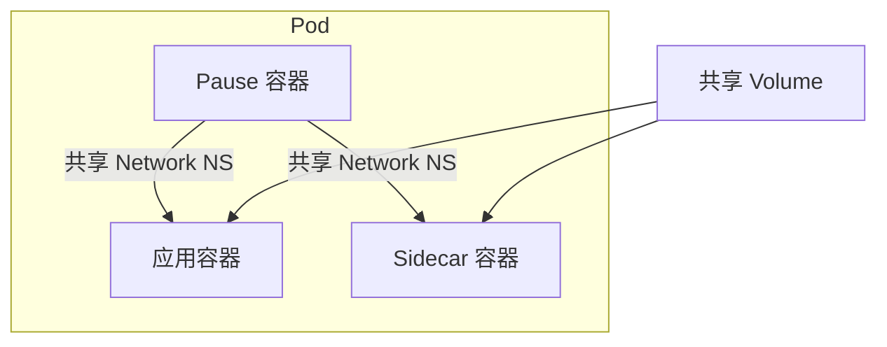
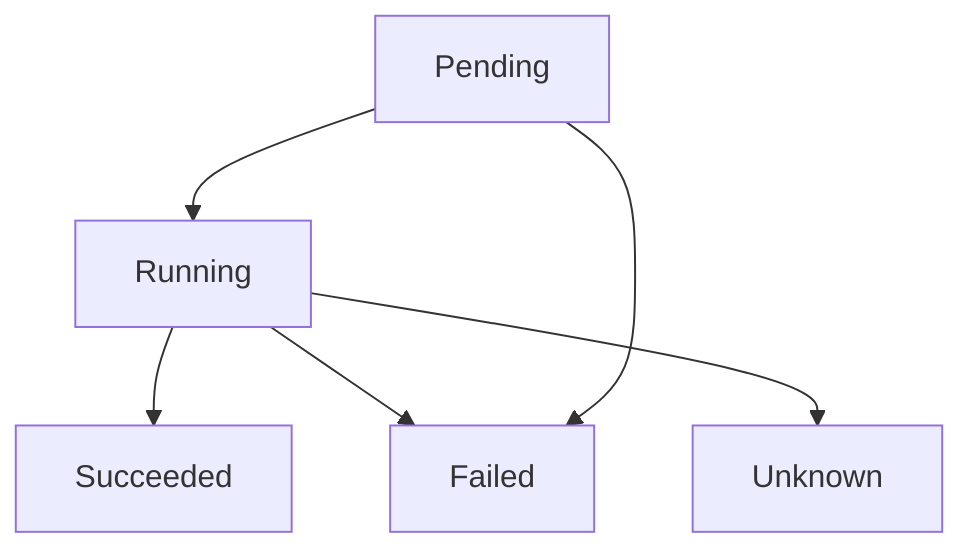
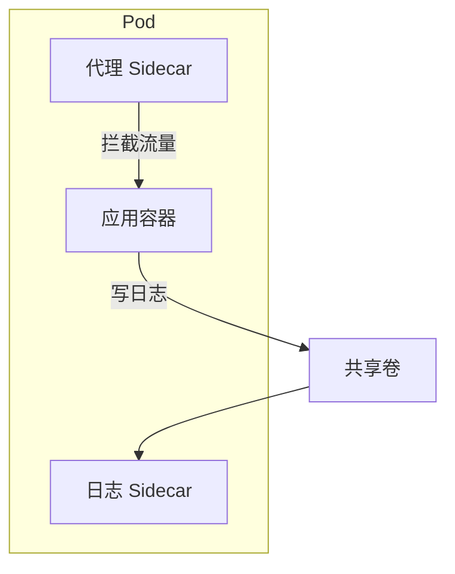
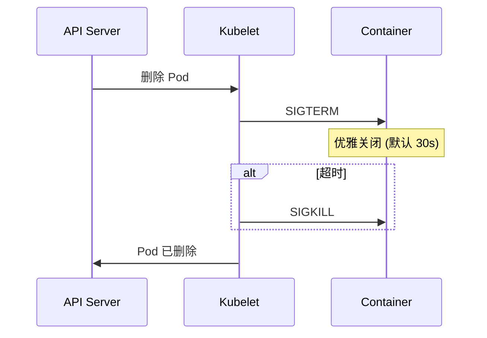

在 Kubernetes 中, **Pod** 是最小的部署单元. 它代表了集群中运行的一个进程实例. 理解 Pod 不仅仅是理解如何运行容器, 更是理解 K8s 协同机制的核心.

---

## 1. 为什么需要 Pod?

如果没有 Pod, 直接调度容器会面临什么问题?

| 问题 | Pod 解决方案 |
|------|--------------|
| 紧耦合协同 | 同一 Pod 内容器共享网络和存储 |
| 资源管理 | 以 Pod 为单位申请资源 |
| 调度原子性 | 一组容器作为整体调度 |

### 1.1 Pause 容器 (Infra Container)



每个 Pod 启动时, 都会首先运行一个特殊的 **Pause 容器**:

- **网络共享**: 所有业务容器加入 Pause 的 Network Namespace, 共享 IP 和端口空间
- **存储共享**: Pod 级 Volume 可被所有容器挂载
- **进程隔离**: 容器间进程互不可见 (独立 PID Namespace)

---

## 2. Pod 生命周期

### 2.1 Phase 状态



| Phase | 描述 |
|-------|------|
| **Pending** | 已创建, 等待调度或拉取镜像 |
| **Running** | 已绑定节点, 至少一个容器运行中 |
| **Succeeded** | 所有容器成功退出, 不再重启 |
| **Failed** | 所有容器已退出, 至少一个失败 |
| **Unknown** | 无法获取状态 (节点通信失败) |

### 2.2 容器状态

| 状态 | 描述 |
|------|------|
| **Waiting** | 等待启动 (拉取镜像, 等待依赖) |
| **Running** | 正在运行 |
| **Terminated** | 已退出 |

### 2.3 Pod Conditions

```yaml
status:
  conditions:
  - type: PodScheduled
    status: "True"
  - type: Initialized
    status: "True"
  - type: ContainersReady
    status: "True"
  - type: Ready
    status: "True"
```

| Condition | 含义 |
|-----------|------|
| `PodScheduled` | 已调度到节点 |
| `Initialized` | Init 容器已完成 |
| `ContainersReady` | 所有容器就绪 |
| `Ready` | Pod 可以接收流量 |

---

## 3. 健康检查 (Probes)

### 3.1 三种探针

| 探针 | 作用 | 失败后果 |
|------|------|----------|
| **Liveness** | 检查容器是否存活 | 重启容器 |
| **Readiness** | 检查是否准备好接收流量 | 从 Service 移除 |
| **Startup** | 检查应用是否启动完成 | 延迟其他探针 |

### 3.2 探针类型

```yaml
spec:
  containers:
  - name: app
    livenessProbe:
      httpGet:
        path: /healthz
        port: 8080
        httpHeaders:
        - name: Custom-Header
          value: Awesome
      initialDelaySeconds: 15
      periodSeconds: 10
      timeoutSeconds: 3
      failureThreshold: 3
      successThreshold: 1
    
    readinessProbe:
      tcpSocket:
        port: 8080
      initialDelaySeconds: 5
      periodSeconds: 5
    
    startupProbe:
      exec:
        command:
        - cat
        - /tmp/healthy
      failureThreshold: 30
      periodSeconds: 10
```

| 类型 | 描述 |
|------|------|
| **httpGet** | HTTP GET 请求, 2xx/3xx 为成功 |
| **tcpSocket** | TCP 连接检查 |
| **exec** | 执行命令, 返回码 0 为成功 |
| **grpc** | gRPC 健康检查 (1.24+) |

### 3.3 探针参数

| 参数 | 描述 | 默认值 |
|------|------|--------|
| `initialDelaySeconds` | 容器启动后首次探测延迟 | 0 |
| `periodSeconds` | 探测间隔 | 10 |
| `timeoutSeconds` | 探测超时 | 1 |
| `successThreshold` | 连续成功次数 | 1 |
| `failureThreshold` | 连续失败次数 | 3 |

---

## 4. Init 容器

Init 容器在业务容器启动前按顺序执行:

```yaml
spec:
  initContainers:
  - name: wait-for-db
    image: busybox
    command: ['sh', '-c', 'until nc -z db 5432; do sleep 1; done']
  
  - name: init-config
    image: busybox
    command: ['sh', '-c', 'cp /config/* /app/config/']
    volumeMounts:
    - name: config
      mountPath: /app/config
  
  containers:
  - name: app
    image: myapp:v1
```

**典型用途**:
- 等待依赖服务就绪
- 初始化配置文件
- 数据库迁移
- 克隆 Git 仓库

---

## 5. 容器设计模式

### 5.1 Sidecar 模式



| 场景 | Sidecar 职责 |
|------|--------------|
| 日志收集 | Fluent Bit, Filebeat |
| 代理 | Envoy, Linkerd-proxy |
| 监控 | Datadog Agent |

### 5.2 Ambassador 模式

Sidecar 作为应用的 "大使", 代理外部连接:

```yaml
spec:
  containers:
  - name: app
    # 连接 localhost:6379
  - name: redis-ambassador
    image: ambassador/redis
    # 代理到远程 Redis 集群
```

### 5.3 Adapter 模式

转换应用输出格式:

```yaml
spec:
  containers:
  - name: app
    # 输出特定格式指标
  - name: prometheus-adapter
    # 转换为 Prometheus 格式
```

---

## 6. 资源管理

### 6.1 Requests 与 Limits

```yaml
spec:
  containers:
  - name: app
    resources:
      requests:
        memory: "256Mi"
        cpu: "250m"
      limits:
        memory: "512Mi"
        cpu: "500m"
```

| 字段 | 作用 |
|------|------|
| `requests` | 调度依据, 保证的最小资源 |
| `limits` | 硬性上限, 超出会被限制或 OOM Kill |

### 6.2 QoS 类别

| QoS | 条件 | OOM 优先级 |
|-----|------|------------|
| **Guaranteed** | requests = limits (全部设置) | 最低 |
| **Burstable** | requests < limits | 中 |
| **BestEffort** | 无 requests/limits | 最高 (首先被杀) |

---

## 7. 优雅终止

### 7.1 终止流程



### 7.2 配置

```yaml
spec:
  terminationGracePeriodSeconds: 60
  containers:
  - name: app
    lifecycle:
      preStop:
        exec:
          command: ["/bin/sh", "-c", "sleep 10 && kill -TERM 1"]
```

### 7.3 最佳实践

1. 应用监听 SIGTERM 信号
2. 停止接收新请求
3. 完成进行中的请求
4. 关闭数据库连接
5. 优雅退出

---

## 8. Pod 拓扑

### 8.1 Topology Spread Constraints

```yaml
spec:
  topologySpreadConstraints:
  - maxSkew: 1
    topologyKey: topology.kubernetes.io/zone
    whenUnsatisfiable: DoNotSchedule
    labelSelector:
      matchLabels:
        app: web
```

### 8.2 Pod 反亲和性

```yaml
spec:
  affinity:
    podAntiAffinity:
      requiredDuringSchedulingIgnoredDuringExecution:
      - labelSelector:
          matchLabels:
            app: web
        topologyKey: kubernetes.io/hostname
```

---

## 9. 调试技巧

```bash
# 查看 Pod 详情
kubectl describe pod <name>

# 查看容器日志
kubectl logs <pod> -c <container> --previous

# 进入容器
kubectl exec -it <pod> -c <container> -- /bin/sh

# 临时调试容器 (1.23+)
kubectl debug <pod> -it --image=busybox --target=<container>

# 端口转发
kubectl port-forward <pod> 8080:80
```

---

> **核心逻辑**: Pod 的设计初衷是模拟 "逻辑主机". 它为容器提供了一个相对静态的环境, 屏蔽了物理机器的差异.
