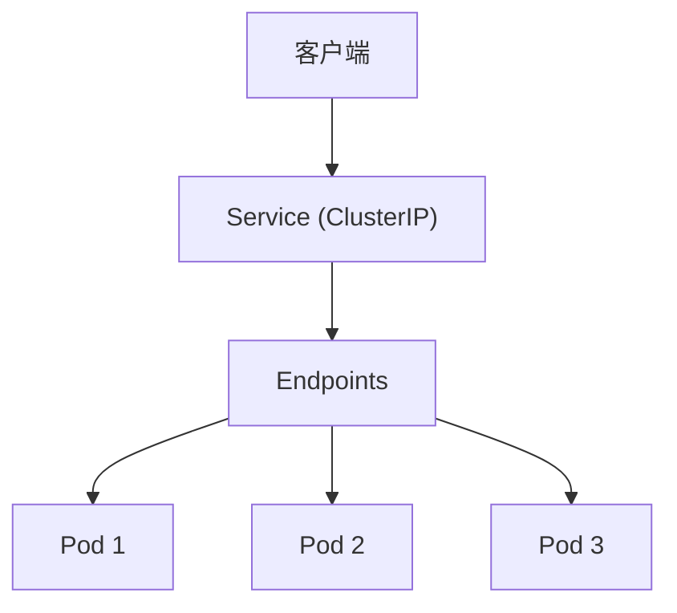
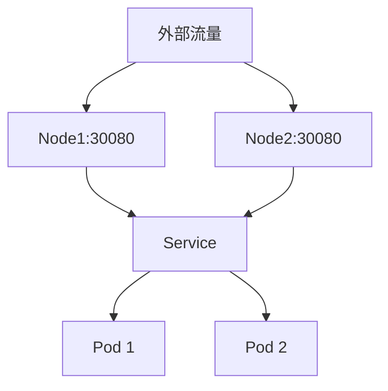
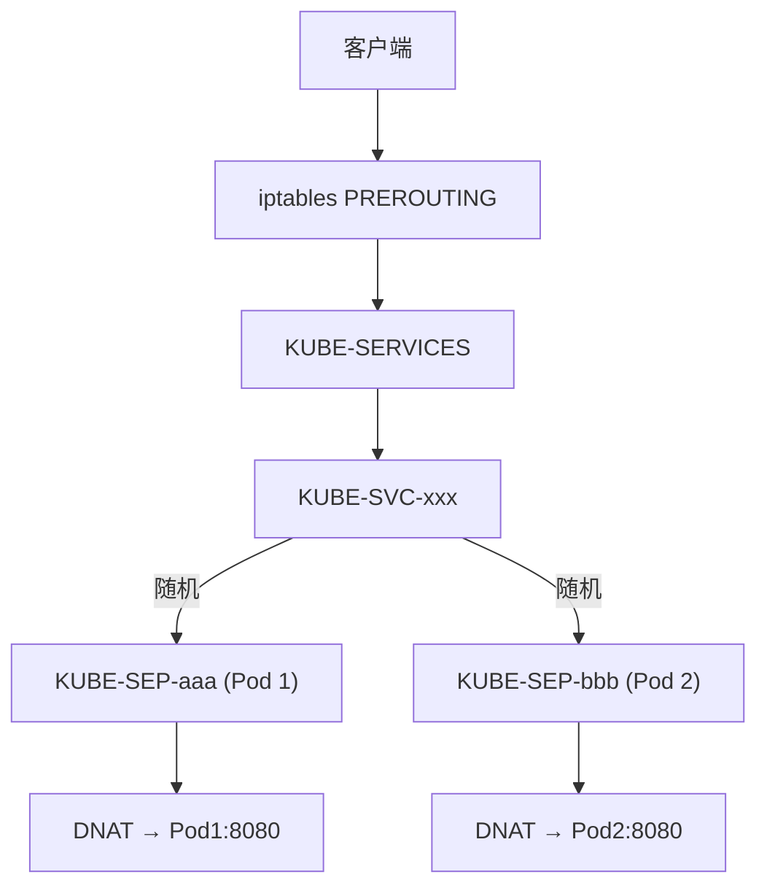
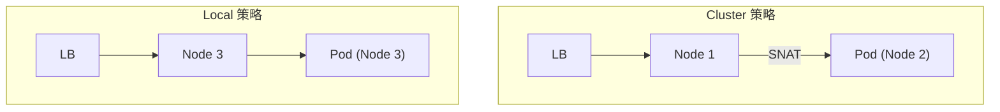

Kubernetes **Service** 为一组动态变化的 Pod 提供稳定的访问入口, 实现服务发现和负载均衡.

---

## 1. Service 核心概念



### 1.1 为什么需要 Service

| 问题 | Service 解决方案 |
|------|------------------|
| Pod IP 动态变化 | 提供稳定的 ClusterIP |
| Pod 水平扩缩 | 自动更新 Endpoints |
| 多副本负载均衡 | kube-proxy 实现 |
| 服务发现 | DNS 记录 (`svc.namespace.svc.cluster.local`) |

---

## 2. Service 类型

### 2.1 ClusterIP (默认)

仅在集群内部可访问:

```yaml
apiVersion: v1
kind: Service
metadata:
  name: my-service
spec:
  type: ClusterIP
  selector:
    app: my-app
  ports:
  - port: 80           # Service 端口
    targetPort: 8080   # Pod 端口
```

### 2.2 NodePort

在每个节点上暴露端口 (30000-32767):

```yaml
spec:
  type: NodePort
  ports:
  - port: 80
    targetPort: 8080
    nodePort: 30080    # 可选, 不指定则自动分配
```



### 2.3 LoadBalancer

请求云厂商创建负载均衡器:

```yaml
spec:
  type: LoadBalancer
  loadBalancerIP: 10.0.0.1  # 可选, 指定 IP
  externalTrafficPolicy: Local  # 保留客户端 IP
```

| 字段 | 作用 |
|------|------|
| `loadBalancerIP` | 请求特定 IP (需云厂商支持) |
| `externalTrafficPolicy` | `Cluster` (默认) 或 `Local` |
| `allocateLoadBalancerNodePorts` | 是否分配 NodePort |

### 2.4 ExternalName

将 Service 映射到外部 DNS:

```yaml
spec:
  type: ExternalName
  externalName: db.example.com
```

---

## 3. kube-proxy 实现模式

kube-proxy 运行在每个节点, 负责实现 Service 的流量转发.

### 3.1 iptables 模式 (默认)



**iptables 规则示例**:
```bash
# Service 入口链
-A KUBE-SERVICES -d 10.96.0.1/32 -p tcp -m tcp --dport 80 -j KUBE-SVC-xxx

# 负载均衡 (随机选择)
-A KUBE-SVC-xxx -m statistic --mode random --probability 0.5 -j KUBE-SEP-aaa
-A KUBE-SVC-xxx -j KUBE-SEP-bbb

# 端点 DNAT
-A KUBE-SEP-aaa -p tcp -j DNAT --to-destination 10.244.1.5:8080
```

**特点**:
- 规则数量与 Service × Endpoints 成正比
- 大规模集群性能下降
- 不支持连接级负载均衡

### 3.2 IPVS 模式

使用 Linux IPVS (IP Virtual Server) 实现:

```bash
# 查看 IPVS 规则
ipvsadm -Ln

# 输出示例
TCP  10.96.0.1:80 rr
  -> 10.244.1.5:8080    Masq    1      0          0
  -> 10.244.2.3:8080    Masq    1      0          0
```

**IPVS 负载均衡算法**:

| 算法 | 描述 |
|------|------|
| `rr` | 轮询 (Round Robin) |
| `lc` | 最少连接 |
| `dh` | 目标哈希 |
| `sh` | 源哈希 |
| `sed` | 最短预期延迟 |
| `nq` | 永不排队 |

**启用 IPVS**:
```yaml
# kube-proxy ConfigMap
mode: ipvs
ipvs:
  scheduler: rr
```

**优势**:
- O(1) 复杂度查找
- 更好的大规模性能
- 丰富的负载均衡算法

### 3.3 nftables 模式 (1.29+)

使用 nftables 替代 iptables, 提供更好的性能和可维护性.

---

## 4. Endpoints 与 EndpointSlices

### 4.1 Endpoints

```yaml
apiVersion: v1
kind: Endpoints
metadata:
  name: my-service  # 必须与 Service 同名
subsets:
- addresses:
  - ip: 10.244.1.5
  - ip: 10.244.2.3
  ports:
  - port: 8080
```

### 4.2 EndpointSlices (推荐)

解决大规模 Endpoints 的问题:

```yaml
apiVersion: discovery.k8s.io/v1
kind: EndpointSlice
metadata:
  name: my-service-abc
  labels:
    kubernetes.io/service-name: my-service
addressType: IPv4
endpoints:
- addresses:
  - "10.244.1.5"
  conditions:
    ready: true
    serving: true
    terminating: false
  nodeName: node-1
ports:
- port: 8080
  protocol: TCP
```

**优势**:
- 单个 Slice 最多 100 个端点
- 增量更新, 减少 API Server 负载
- 支持 IPv6, 拓扑感知

---

## 5. Headless Service

不分配 ClusterIP, 直接返回 Pod IP:

```yaml
spec:
  clusterIP: None
  selector:
    app: my-app
```

### 5.1 DNS 解析

```bash
# 普通 Service
dig my-service.default.svc.cluster.local
# 返回 ClusterIP

# Headless Service
dig my-service.default.svc.cluster.local
# 返回所有 Pod IP
```

### 5.2 StatefulSet 配合

```yaml
apiVersion: v1
kind: Service
metadata:
  name: mysql
spec:
  clusterIP: None
  selector:
    app: mysql
---
apiVersion: apps/v1
kind: StatefulSet
metadata:
  name: mysql
spec:
  serviceName: mysql  # 关联 Headless Service
```

DNS 记录:
- `mysql-0.mysql.default.svc.cluster.local`
- `mysql-1.mysql.default.svc.cluster.local`

---

## 6. 会话亲和性 (Session Affinity)

```yaml
spec:
  sessionAffinity: ClientIP
  sessionAffinityConfig:
    clientIP:
      timeoutSeconds: 10800  # 3 小时
```

| 模式 | 行为 |
|------|------|
| `None` | 默认, 无亲和性 |
| `ClientIP` | 同一客户端 IP 路由到同一 Pod |

---

## 7. 外部流量策略

### 7.1 externalTrafficPolicy

```yaml
spec:
  type: LoadBalancer
  externalTrafficPolicy: Local
```

| 策略 | 行为 | 客户端 IP |
|------|------|-----------|
| `Cluster` | 跨节点负载均衡 | SNAT 丢失 |
| `Local` | 仅本节点 Pod | 保留 |



### 7.2 internalTrafficPolicy

```yaml
spec:
  internalTrafficPolicy: Local
```

优先使用本节点的 Pod 处理请求, 减少跨节点流量.

---

## 8. 多端口 Service

```yaml
spec:
  ports:
  - name: http
    port: 80
    targetPort: 8080
  - name: https
    port: 443
    targetPort: 8443
  - name: grpc
    port: 9090
    targetPort: 9090
    appProtocol: grpc  # 应用协议提示
```

---

## 9. Service 拓扑感知

### 9.1 Topology Aware Hints

```yaml
spec:
  ports:
  - port: 80
    targetPort: 8080
  internalTrafficPolicy: Local
```

启用后, kube-proxy 优先路由到同可用区的 Pod.

### 9.2 Topology Keys (已废弃)

被 Topology Aware Hints 替代.

---

## 10. 调试与排查

```bash
# 查看 Service
kubectl get svc my-service -o wide

# 查看 Endpoints
kubectl get endpoints my-service
kubectl get endpointslices -l kubernetes.io/service-name=my-service

# 查看 iptables 规则
iptables-save | grep my-service

# 查看 IPVS 规则
ipvsadm -Ln | grep <ClusterIP>

# DNS 测试
kubectl run -it --rm debug --image=busybox -- nslookup my-service
```

---

> Service 是 Kubernetes 网络模型的核心抽象. 理解 kube-proxy 的实现机制, 有助于在复杂网络环境中排查连接问题.
