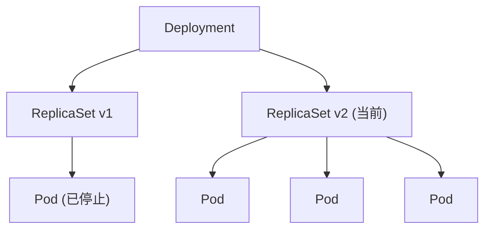
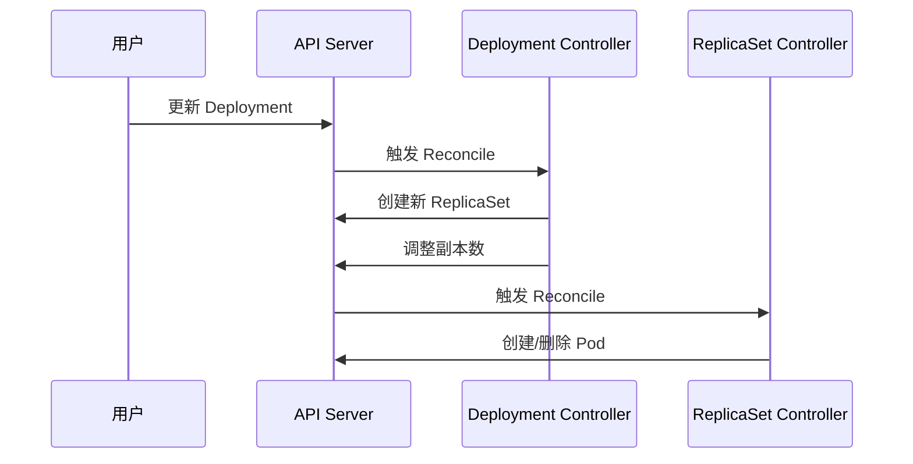
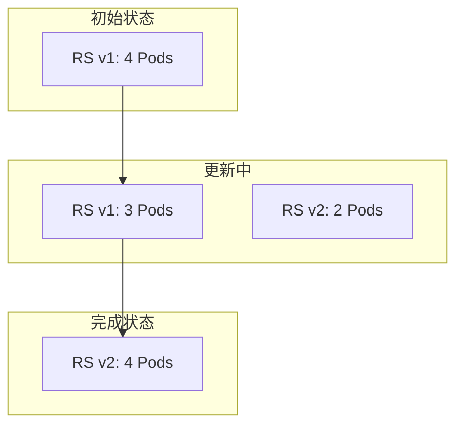
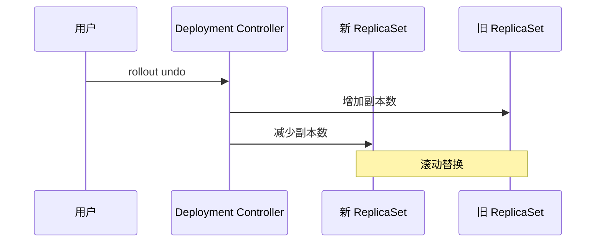
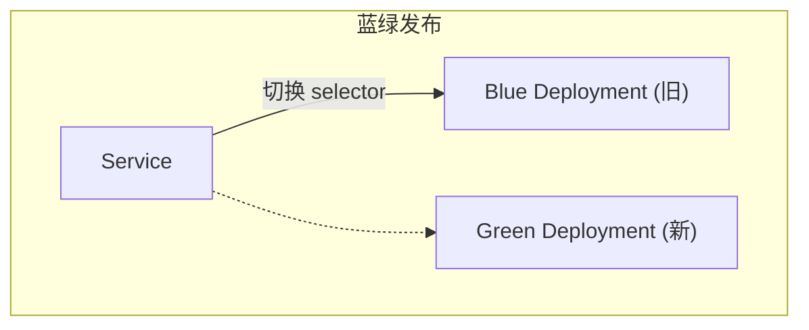
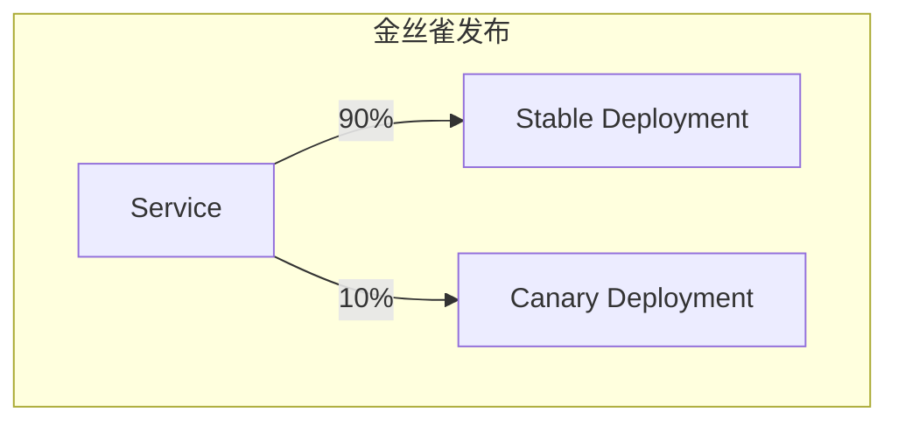

Deployment 是 Kubernetes 中最常用的控制器, 它建立在 ReplicaSet 之上, 提供了强大的版本管理和声明式更新能力.

---

## 1. 控制器模型

### 1.1 层级关系



| 对象 | 职责 |
|------|------|
| **Deployment** | 版本管理, 更新策略 |
| **ReplicaSet** | 维护指定数量的 Pod 副本 |
| **Pod** | 实际运行的工作负载 |

### 1.2 控制循环



---

## 2. Deployment 配置

### 2.1 完整示例

```yaml
apiVersion: apps/v1
kind: Deployment
metadata:
  name: web
  labels:
    app: web
spec:
  replicas: 3
  revisionHistoryLimit: 10
  progressDeadlineSeconds: 600
  selector:
    matchLabels:
      app: web
  strategy:
    type: RollingUpdate
    rollingUpdate:
      maxSurge: 25%
      maxUnavailable: 25%
  template:
    metadata:
      labels:
        app: web
    spec:
      containers:
      - name: web
        image: nginx:1.21
        ports:
        - containerPort: 80
        readinessProbe:
          httpGet:
            path: /healthz
            port: 80
          initialDelaySeconds: 5
          periodSeconds: 5
        resources:
          requests:
            cpu: 100m
            memory: 128Mi
          limits:
            cpu: 500m
            memory: 256Mi
```

### 2.2 关键字段

| 字段 | 描述 |
|------|------|
| `revisionHistoryLimit` | 保留的历史 RS 数量 |
| `progressDeadlineSeconds` | 更新超时时间 |
| `minReadySeconds` | Pod 就绪后等待时间 |
| `paused` | 暂停更新 |

---

## 3. 更新策略

### 3.1 RollingUpdate (滚动更新)

```yaml
strategy:
  type: RollingUpdate
  rollingUpdate:
    maxSurge: 25%          # 可超出期望值的 Pod 数
    maxUnavailable: 25%    # 可不可用的 Pod 数
```

**更新过程**:



**计算示例** (replicas=4):
- maxSurge=25% → 最多 5 个 Pod (4 + 1)
- maxUnavailable=25% → 最少 3 个可用 (4 - 1)

### 3.2 Recreate (重建)

```yaml
strategy:
  type: Recreate
```

**行为**: 先删除所有旧 Pod, 再创建新 Pod

| 适用场景 |
|----------|
| 不能同时运行两个版本 |
| 有状态应用 (不推荐用 Deployment) |
| 快速全量更新 |

---

## 4. 更新流程详解

### 4.1 触发更新

```bash
# 方式 1: 修改镜像
kubectl set image deployment/web web=nginx:1.22

# 方式 2: 编辑配置
kubectl edit deployment web

# 方式 3: 应用 YAML
kubectl apply -f deployment.yaml
```

### 4.2 更新状态

```bash
# 查看更新状态
kubectl rollout status deployment/web

# 输出
Waiting for deployment "web" spec update to be observed...
Waiting for deployment "web" rollout to finish: 1 out of 3 new replicas have been updated...
Waiting for deployment "web" rollout to finish: 2 out of 3 new replicas have been updated...
deployment "web" successfully rolled out
```

### 4.3 Deployment Conditions

```yaml
status:
  conditions:
  - type: Available
    status: "True"
    reason: MinimumReplicasAvailable
  - type: Progressing
    status: "True"
    reason: NewReplicaSetAvailable
```

| Condition | 含义 |
|-----------|------|
| `Available` | 最小可用副本已就绪 |
| `Progressing` | 正在进行更新 |
| `ReplicaFailure` | 创建 Pod 失败 |

---

## 5. 回滚机制

### 5.1 查看历史

```bash
kubectl rollout history deployment/web

# 输出
REVISION  CHANGE-CAUSE
1         <none>
2         kubectl set image deployment/web web=nginx:1.21
3         kubectl set image deployment/web web=nginx:1.22
```

### 5.2 记录变更原因

```bash
kubectl annotate deployment/web kubernetes.io/change-cause="升级到 v1.22"
```

### 5.3 回滚操作

```bash
# 回滚到上一版本
kubectl rollout undo deployment/web

# 回滚到指定版本
kubectl rollout undo deployment/web --to-revision=2

# 查看特定版本详情
kubectl rollout history deployment/web --revision=2
```

### 5.4 回滚原理



---

## 6. 高级发布策略

### 6.1 蓝绿发布



**实现步骤**:
1. 部署新版本 (Green) Deployment
2. 验证新版本正常
3. 修改 Service selector 指向新版本
4. 删除旧版本 (Blue) Deployment

```yaml
# 切换流量
kubectl patch svc web -p '{"spec":{"selector":{"version":"v2"}}}'
```

### 6.2 金丝雀发布



**基于 Pod 数量**:
```yaml
# Stable: 9 个副本
# Canary: 1 个副本
# 比例约 90:10
```

**基于 Ingress (Nginx)**:
```yaml
apiVersion: networking.k8s.io/v1
kind: Ingress
metadata:
  annotations:
    nginx.ingress.kubernetes.io/canary: "true"
    nginx.ingress.kubernetes.io/canary-weight: "10"
```

### 6.3 A/B 测试

```yaml
# 基于 Header
annotations:
  nginx.ingress.kubernetes.io/canary: "true"
  nginx.ingress.kubernetes.io/canary-by-header: "X-Canary"
  nginx.ingress.kubernetes.io/canary-by-header-value: "true"
```

---

## 7. 渐进式交付

### 7.1 Argo Rollouts

```yaml
apiVersion: argoproj.io/v1alpha1
kind: Rollout
metadata:
  name: web
spec:
  replicas: 5
  strategy:
    canary:
      steps:
      - setWeight: 20
      - pause: {duration: 1m}
      - setWeight: 40
      - pause: {duration: 1m}
      - setWeight: 60
      - pause: {duration: 1m}
      - setWeight: 80
      - pause: {duration: 1m}
  selector:
    matchLabels:
      app: web
  template:
    # ...
```

### 7.2 Flagger

```yaml
apiVersion: flagger.app/v1beta1
kind: Canary
metadata:
  name: web
spec:
  targetRef:
    apiVersion: apps/v1
    kind: Deployment
    name: web
  progressDeadlineSeconds: 60
  analysis:
    interval: 30s
    threshold: 5
    maxWeight: 50
    stepWeight: 10
    metrics:
    - name: request-success-rate
      thresholdRange:
        min: 99
```

---

## 8. 最佳实践

### 8.1 就绪探针

```yaml
# 必须配置, 否则滚动更新可能导致服务中断
readinessProbe:
  httpGet:
    path: /ready
    port: 8080
  initialDelaySeconds: 10
  periodSeconds: 5
  failureThreshold: 3
```

### 8.2 优雅关闭

```yaml
spec:
  terminationGracePeriodSeconds: 60
  containers:
  - lifecycle:
      preStop:
        exec:
          command: ["/bin/sh", "-c", "sleep 10"]
```

### 8.3 PodDisruptionBudget

```yaml
apiVersion: policy/v1
kind: PodDisruptionBudget
metadata:
  name: web-pdb
spec:
  minAvailable: 2  # 或 maxUnavailable: 1
  selector:
    matchLabels:
      app: web
```

### 8.4 更新建议

| 实践 | 说明 |
|------|------|
| **设置 minReadySeconds** | 给应用预热时间 |
| **保留足够历史** | revisionHistoryLimit >= 10 |
| **监控更新过程** | 观察错误率, 延迟 |
| **配合 PDB** | 保证最小可用数 |

---

## 9. 调试命令

```bash
# 查看 Deployment
kubectl get deployment web -o wide
kubectl describe deployment web

# 查看 ReplicaSet
kubectl get rs -l app=web
kubectl describe rs <rs-name>

# 查看更新事件
kubectl get events --field-selector involvedObject.name=web

# 暂停/恢复更新
kubectl rollout pause deployment/web
kubectl rollout resume deployment/web

# 重启 Deployment (触发 Pod 重建)
kubectl rollout restart deployment/web
```

---

> 理解了 Deployment 的副本演进逻辑, 才能在复杂的流量环境下精准控制发布的节奏与安全.
