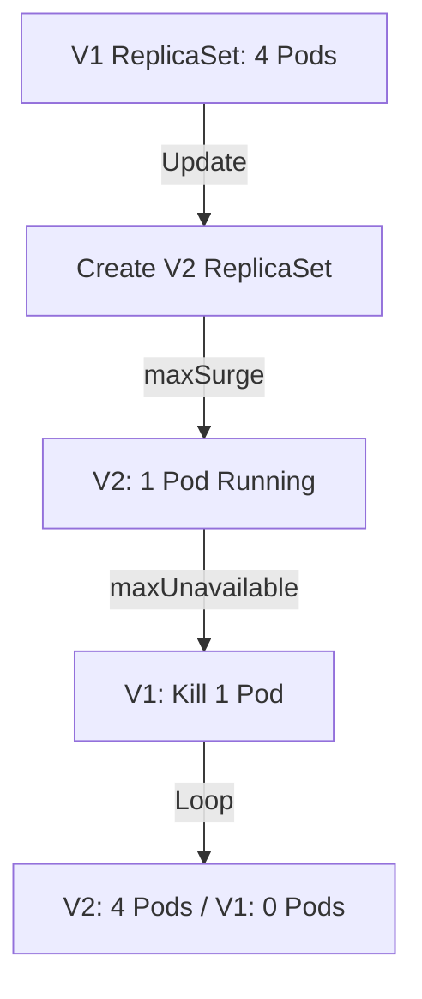

Deployment 是 Kubernetes 中最常用的控制器, 它建立在 ReplicaSet 之上, 提供了强大的版本管理和声明式更新能力. 深入理解 Deployment 的更新机制, 是保障业务平滑升级的核心.

## 1. 控制器模型: 期望状态的演进

Deployment 并不直接管理 Pod, 而是通过管理 **ReplicaSet** 来实现版本控制.

*   当提交一个新的 Deployment 镜像版本时, Deployment 会创建一个**新的 ReplicaSet**.
*   它会逐渐增加新 ReplicaSet 的副本数, 同时减少旧 ReplicaSet 的副本数.
*   这种逻辑保证了在整个更新过程中, 集群中始终有可用的实例提供服务.

---

## 2. 滚动更新 (RollingUpdate)

这是 Deployment 的默认策略, 旨在实现零停机更新. 其核心参数如下:

*   **maxSurge**: 更新过程中可以额外创建的 Pod 比例或数量. 默认为 25%. 这决定了更新瞬间对资源的额外消耗.
*   **maxUnavailable**: 更新过程中不可用的 Pod 最大比例或数量. 默认为 25%. 这决定了更新过程中服务容量的下限.

### 更新过程解析



---

## 3. 高阶发布策略

虽然 Deployment 提供了基础的滚动更新, 但在复杂生产环境下, 往往需要更精细的控制:

### 蓝绿发布 (Blue-Green)
*   **原理**: 同时运行两个完全相同的版本. 通过切换 Service 的 Label Selector 一次性将流量从旧版本 (Blue) 导向新版本 (Green).
*   **优点**: 切换瞬间完成, 回滚极快.
*   **缺点**: 需要双倍的硬件资源.

### 金丝雀发布 (Canary)
*   **原理**: 先更新极小比例的副本 (如 1 个), 观察其业务指标 (如错误率、延迟) 是否正常, 确认无误后再全量更新.
*   **实现**: 通常配合 **Ingress Nginx (Annotations)** 或 **Service Mesh (Istio)** 来控制流量切分的比例, 而非单纯依靠 Pod 数量.

---

## 4. 回滚机制 (Rollback)

Kubernetes 会保留 Deployment 的 **Revision (修订版本) 历史**.

```bash
# 查看发布历史
kubectl rollout history deployment/my-app

# 回滚到上一个版本
kubectl rollout undo deployment/my-app

# 回滚到特定版本
kubectl rollout undo deployment/my-app --to-revision=2
```

---

## 5. 优雅更新的最佳实践

*   **Readiness Probes**: 滚动更新极度依赖就绪探针. 如果不设置探针, K8s 会在 Pod 容器启动后立即认为其就绪并停掉旧副本, 如果此时应用尚未初始化完成, 会导致服务中断.
*   **minReadySeconds**: 设置 Pod 就绪后等待多久才继续更新下一个副本. 这给应用留出了预热和观察的时间.
*   **revisionHistoryLimit**: 建议设置为 10 左右, 既能保证回滚能力, 又能避免 etcd 存储过多无效的历史 ReplicaSet.

> 理解了 Deployment 的副本演进逻辑, 才能在复杂的流量环境下精准控制发布的节奏与安全.
