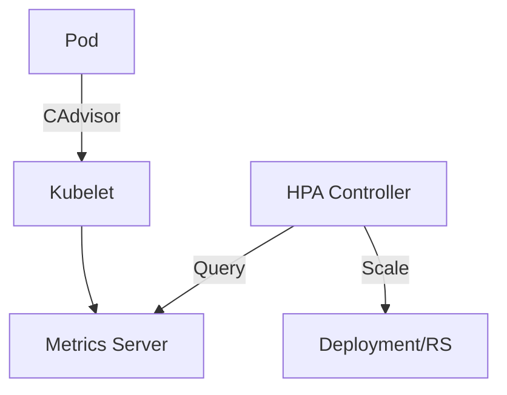

在高并发业务场景下, 依靠人工手动调整副本数往往不够及时且浪费资源. **HPA (Horizontal Pod Autoscaler)** 实现了基于负载的自动伸缩, 是实现云原生弹性架构的关键.

## 1. HPA 的工作架构

HPA 的运行依赖于一个闭环的监控与决策系统:

1.  **Metrics Server**: 充当集群内的资源指标聚合器 (从 kubelet 的 Summary API 获取 CPU/Memory 指标).
2.  **HPA Controller**: 定期 (默认每 15s) 查询 Metrics API.
3.  **Scale Subresource**: HPA 控制器通过修改 Deployment/StatefulSet 的 `replicas` 字段触发扩缩容.

---

## 2. 扩容算法的核心逻辑

HPA 采用如下公式计算期望的副本数:

`Desired Replicas = ceil[Current Replicas * (Current Metric Value / Desired Metric Value)]`

*   **示例**: 如果当前有 2 个副本, 当前平均 CPU 使用率为 100m, 目标值 (Target) 是 50m.
*   那么: `ceil[2 * (100 / 50)] = 4`.
*   系统将自动扩容到 4 个副本.

---

## 3. 扩容灵敏度与冷却防止

为了防止在指标波动时产生 "震荡" (即频繁扩增和缩减副本), HPA 引入了时间窗机制:

*   **扩容速度**: 默认情况下, 一旦指标超过阈值, HPA 会迅速尝试扩容.
*   **缩容冷却 (Stabilization Window)**: 旨在确保缩容操作由于指标的瞬时下降而过快发生. 默认观察窗口为 5 分钟, 即在过去 5 分钟内取最高值作为决策依据.

---

## 4. 自定义指标 (Custom Metrics)

仅靠 CPU 和内存指标往往无法真实反映业务压力. 现代架构通常采用基于 Prometheus 的自定义指标实现 HPA:

*   **常见场景**: QPS (每秒请求数)、消息队列堆积量 (MQ Message Backlog).
*   **实现方式**: 通过 **Prometheus Adapter** 将 Prometheus 中的数据转化为 Kubernetes API Server 能够识别的 `custom.metrics.k8s.io` 指标.

---

## 5. 落地建议: 弹性架构的平衡

*   **准确的资源 Requests**: HPA 的百分比计算是基于 Pod 的 `request` 值而非 `limit`. 如果 `request` 设置得不准, HPA 的决策将毫无意义.
*   **配合 VPA**: HPA 负责 "横向" 增加 Pod 数量, 而 VPA (Vertical Pod Autoscaler) 负责 "纵向" 增加单机配置. 通常建议通过 HPA 解决流量峰值, 通过 VPA 进行长期资源水位画像优化.
*   **应用启动时间**: HPA 的效果受限于 Pod 的启动速度. 对于 Java 等启动慢的应用, 应结合过载保护及更激进的扩容策略.

> 自动扩缩容不仅是节省成本的手段, 更是系统高可用防线的最后一道关卡.
