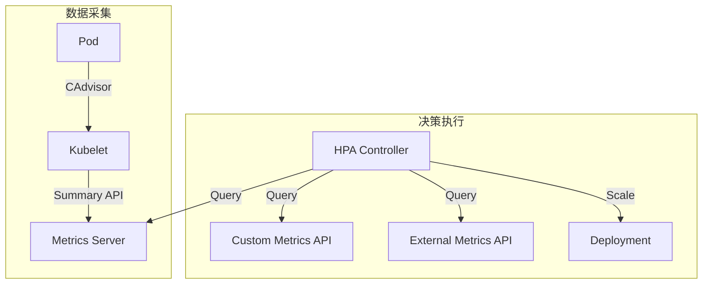
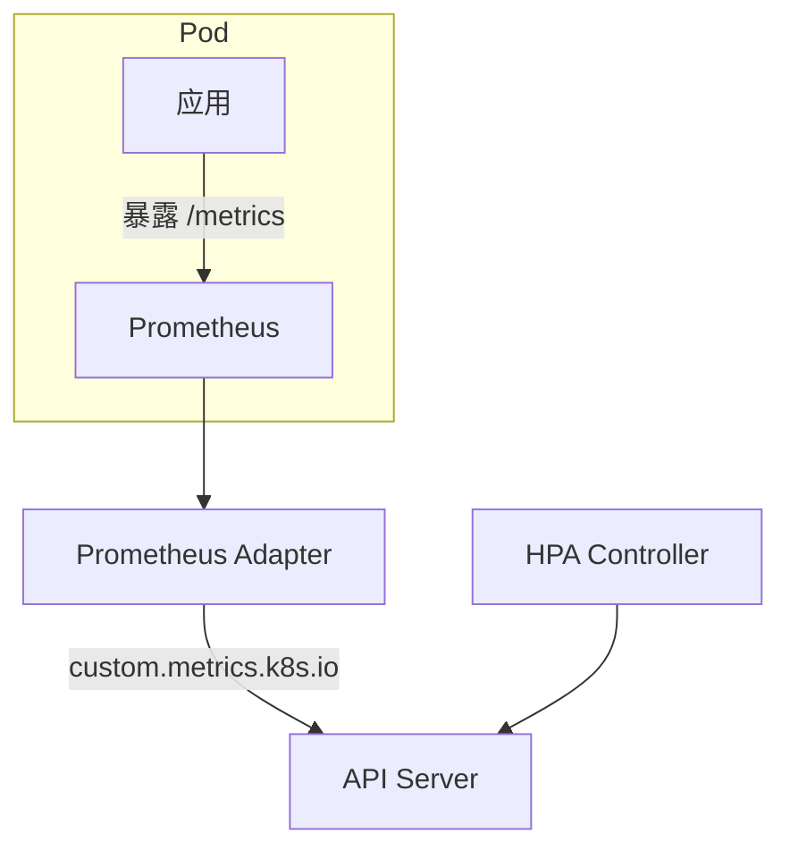

在高并发业务场景下, 依靠人工手动调整副本数往往不够及时且浪费资源. **HPA (Horizontal Pod Autoscaler)** 实现了基于负载的自动伸缩, 是实现云原生弹性架构的关键.

---

## 1. HPA 工作架构



### 1.1 指标 API 层次

| API | 路径 | 提供者 |
|-----|------|--------|
| **Resource Metrics** | `metrics.k8s.io` | Metrics Server |
| **Custom Metrics** | `custom.metrics.k8s.io` | Prometheus Adapter |
| **External Metrics** | `external.metrics.k8s.io` | 云厂商, KEDA |

---

## 2. HPA 配置

### 2.1 基础配置 (v2)

```yaml
apiVersion: autoscaling/v2
kind: HorizontalPodAutoscaler
metadata:
  name: web-hpa
spec:
  scaleTargetRef:
    apiVersion: apps/v1
    kind: Deployment
    name: web
  minReplicas: 2
  maxReplicas: 10
  metrics:
  - type: Resource
    resource:
      name: cpu
      target:
        type: Utilization
        averageUtilization: 70
  - type: Resource
    resource:
      name: memory
      target:
        type: AverageValue
        averageValue: 500Mi
```

### 2.2 Target 类型

| 类型 | 描述 | 示例 |
|------|------|------|
| `Utilization` | 相对于 requests 的百分比 | CPU 利用率 70% |
| `AverageValue` | 每个 Pod 的平均值 | 内存 500Mi |
| `Value` | 所有 Pod 的总和 | 总请求数 1000 |

---

## 3. 扩缩容算法

### 3.1 核心公式

```
desiredReplicas = ceil[currentReplicas × (currentMetricValue / desiredMetricValue)]
```

**示例**:
- 当前副本: 2
- 当前 CPU 使用: 100m (平均)
- 目标 CPU: 50m
- 计算: ceil[2 × (100/50)] = ceil[4] = 4

### 3.2 多指标处理

当配置多个指标时:
1. 分别计算每个指标的期望副本数
2. 取最大值作为最终决策

```yaml
metrics:
- type: Resource
  resource:
    name: cpu
    target:
      type: Utilization
      averageUtilization: 50  # → 4 replicas
- type: Pods
  pods:
    metric:
      name: requests_per_second
    target:
      type: AverageValue
      averageValue: "100"     # → 6 replicas
# 最终: max(4, 6) = 6 replicas
```

---

## 4. 行为控制 (Behavior)

### 4.1 防抖与稳定窗口

```yaml
spec:
  behavior:
    scaleDown:
      stabilizationWindowSeconds: 300  # 5 分钟稳定窗口
      policies:
      - type: Percent
        value: 10
        periodSeconds: 60
      - type: Pods
        value: 4
        periodSeconds: 60
      selectPolicy: Min  # 取最小值, 更保守
    scaleUp:
      stabilizationWindowSeconds: 0
      policies:
      - type: Percent
        value: 100
        periodSeconds: 15
      - type: Pods
        value: 4
        periodSeconds: 15
      selectPolicy: Max  # 取最大值, 更激进
```

### 4.2 策略说明

| 参数 | 描述 |
|------|------|
| `stabilizationWindowSeconds` | 回溯窗口, 取期间最大/最小值 |
| `policies.type` | `Pods` (绝对数) 或 `Percent` (百分比) |
| `policies.periodSeconds` | 策略生效时间段 |
| `selectPolicy` | `Max`, `Min`, `Disabled` |

### 4.3 禁用缩容

```yaml
spec:
  behavior:
    scaleDown:
      selectPolicy: Disabled
```

---

## 5. 自定义指标 HPA

### 5.1 Prometheus Adapter

```yaml
# prometheus-adapter 配置
rules:
- seriesQuery: 'http_requests_total{namespace!="",pod!=""}'
  resources:
    overrides:
      namespace: {resource: "namespace"}
      pod: {resource: "pod"}
  name:
    matches: "^(.*)_total$"
    as: "${1}_per_second"
  metricsQuery: 'sum(rate(<<.Series>>{<<.LabelMatchers>>}[2m])) by (<<.GroupBy>>)'
```

### 5.2 使用自定义指标

```yaml
apiVersion: autoscaling/v2
kind: HorizontalPodAutoscaler
spec:
  metrics:
  - type: Pods
    pods:
      metric:
        name: http_requests_per_second
      target:
        type: AverageValue
        averageValue: "100"
```

### 5.3 外部指标

```yaml
spec:
  metrics:
  - type: External
    external:
      metric:
        name: queue_messages_ready
        selector:
          matchLabels:
            queue: worker
      target:
        type: Value
        value: "30"
```

---

## 6. 指标采集链路



### 6.1 Metrics Server 要求

```bash
# 检查 Metrics Server
kubectl top pods
kubectl top nodes

# 验证 API
kubectl get --raw /apis/metrics.k8s.io/v1beta1/pods
```

---

## 7. VPA (Vertical Pod Autoscaler)

### 7.1 HPA vs VPA

| 特性 | HPA | VPA |
|------|-----|-----|
| 扩展方向 | 水平 (副本数) | 垂直 (资源配额) |
| 适用场景 | 流量波动 | 资源调优 |
| 生产使用 | 广泛 | 谨慎 (需重启 Pod) |

### 7.2 VPA 配置

```yaml
apiVersion: autoscaling.k8s.io/v1
kind: VerticalPodAutoscaler
metadata:
  name: web-vpa
spec:
  targetRef:
    apiVersion: apps/v1
    kind: Deployment
    name: web
  updatePolicy:
    updateMode: "Auto"  # Off, Initial, Recreate, Auto
  resourcePolicy:
    containerPolicies:
    - containerName: app
      minAllowed:
        cpu: 100m
        memory: 128Mi
      maxAllowed:
        cpu: 4
        memory: 8Gi
```

### 7.3 HPA + VPA 协作

| 场景 | 建议 |
|------|------|
| CPU 扩缩 | 仅使用 HPA |
| 内存调优 | 使用 VPA (Recommend 模式) |
| 两者结合 | HPA 管 CPU, VPA 管 Memory |

---

## 8. KEDA (Kubernetes Event-driven Autoscaling)

### 8.1 超越 HPA 的场景

- 基于消息队列深度扩缩
- 缩容到 0 副本
- 基于 Cron 定时扩缩

### 8.2 ScaledObject

```yaml
apiVersion: keda.sh/v1alpha1
kind: ScaledObject
metadata:
  name: rabbitmq-scaler
spec:
  scaleTargetRef:
    name: consumer
  minReplicaCount: 0
  maxReplicaCount: 30
  triggers:
  - type: rabbitmq
    metadata:
      queueName: tasks
      queueLength: "10"
```

---

## 9. 最佳实践

### 9.1 资源 Requests 设置

HPA 的百分比计算基于 `requests`, 不是 `limits`:

```yaml
# 正确: 设置合理的 requests
resources:
  requests:
    cpu: 200m    # HPA 基于此值计算
  limits:
    cpu: 1000m
```

### 9.2 应用启动时间

慢启动应用需要配合:

```yaml
spec:
  behavior:
    scaleUp:
      stabilizationWindowSeconds: 120  # 等待新 Pod 就绪
```

### 9.3 Pod Disruption Budget

保护最小可用副本:

```yaml
apiVersion: policy/v1
kind: PodDisruptionBudget
metadata:
  name: web-pdb
spec:
  minAvailable: 2  # 或 maxUnavailable: 1
  selector:
    matchLabels:
      app: web
```

---

## 10. 调试与监控

```bash
# 查看 HPA 状态
kubectl get hpa web-hpa -o wide

# 查看事件
kubectl describe hpa web-hpa

# 查看指标
kubectl get --raw "/apis/metrics.k8s.io/v1beta1/namespaces/default/pods" | jq

# 模拟负载
kubectl run -it load-generator --rm --image=busybox \
  -- /bin/sh -c "while true; do wget -q -O- http://web; done"
```

---

> 自动扩缩容不仅是节省成本的手段, 更是系统高可用防线的最后一道关卡.
