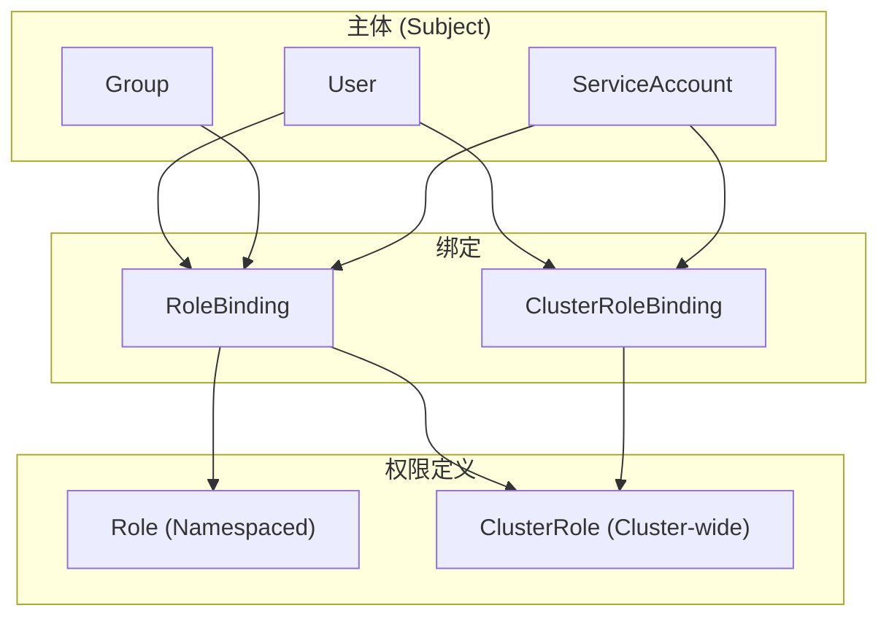

Kubernetes 的安全核心在于 **"谁 (Subject)" 能对 "什么 (Resource)" 做 "什么操作 (Verb)"**. **RBAC (Role-Based Access Control)** 是实现这一逻辑的标准机制.

---

## 1. RBAC 架构



### 1.1 核心对象

| 对象 | 作用域 | 描述 |
|------|--------|------|
| **Role** | Namespace | 定义命名空间内的权限 |
| **ClusterRole** | Cluster | 定义集群级权限或可复用模板 |
| **RoleBinding** | Namespace | 在命名空间内绑定权限 |
| **ClusterRoleBinding** | Cluster | 在集群范围绑定权限 |

---

## 2. 授权主体 (Subjects)

### 2.1 User 与 Group

```yaml
subjects:
- kind: User
  name: alice@example.com
  apiGroup: rbac.authorization.k8s.io
- kind: Group
  name: developers
  apiGroup: rbac.authorization.k8s.io
```

**关键点**: Kubernetes 不存储 User/Group 信息, 它们来自外部认证系统 (证书 CN/O, OIDC claims).

### 2.2 ServiceAccount

```yaml
apiVersion: v1
kind: ServiceAccount
metadata:
  name: prometheus
  namespace: monitoring
---
subjects:
- kind: ServiceAccount
  name: prometheus
  namespace: monitoring
```

**ServiceAccount Token**:
- 自动挂载到 Pod 的 `/var/run/secrets/kubernetes.io/serviceaccount/`
- 可通过 `automountServiceAccountToken: false` 禁用

---

## 3. Role 与 ClusterRole

### 3.1 Role 示例

```yaml
apiVersion: rbac.authorization.k8s.io/v1
kind: Role
metadata:
  name: pod-reader
  namespace: default
rules:
- apiGroups: [""]              # 核心 API 组
  resources: ["pods"]
  verbs: ["get", "list", "watch"]
- apiGroups: [""]
  resources: ["pods/log"]       # 子资源
  verbs: ["get"]
- apiGroups: ["apps"]
  resources: ["deployments"]
  verbs: ["get", "list"]
  resourceNames: ["my-app"]     # 限定特定资源
```

### 3.2 ClusterRole 示例

```yaml
apiVersion: rbac.authorization.k8s.io/v1
kind: ClusterRole
metadata:
  name: node-reader
rules:
- apiGroups: [""]
  resources: ["nodes"]
  verbs: ["get", "list", "watch"]
- apiGroups: [""]
  resources: ["persistentvolumes"]
  verbs: ["get", "list"]
- nonResourceURLs: ["/healthz", "/metrics"]  # 非资源 URL
  verbs: ["get"]
```

### 3.3 常用 Verbs

| Verb | 对应 HTTP | 描述 |
|------|-----------|------|
| `get` | GET (单个) | 读取单个资源 |
| `list` | GET (集合) | 列出资源集合 |
| `watch` | GET (watch) | 监听资源变化 |
| `create` | POST | 创建资源 |
| `update` | PUT | 完整更新资源 |
| `patch` | PATCH | 部分更新资源 |
| `delete` | DELETE | 删除单个资源 |
| `deletecollection` | DELETE (集合) | 批量删除资源 |

### 3.4 API Groups

| apiGroup | 资源示例 |
|----------|----------|
| `""` (core) | pods, services, configmaps, secrets |
| `apps` | deployments, statefulsets, daemonsets |
| `batch` | jobs, cronjobs |
| `networking.k8s.io` | networkpolicies, ingresses |
| `rbac.authorization.k8s.io` | roles, rolebindings |

---

## 4. 绑定 (Bindings)

### 4.1 RoleBinding

```yaml
apiVersion: rbac.authorization.k8s.io/v1
kind: RoleBinding
metadata:
  name: read-pods
  namespace: default
subjects:
- kind: User
  name: jane
  apiGroup: rbac.authorization.k8s.io
- kind: ServiceAccount
  name: app-sa
  namespace: default
roleRef:
  kind: Role
  name: pod-reader
  apiGroup: rbac.authorization.k8s.io
```

### 4.2 RoleBinding 引用 ClusterRole

```yaml
apiVersion: rbac.authorization.k8s.io/v1
kind: RoleBinding
metadata:
  name: read-secrets
  namespace: production
subjects:
- kind: Group
  name: developers
roleRef:
  kind: ClusterRole    # 引用 ClusterRole
  name: secret-reader  # 但仅在 production 命名空间生效
  apiGroup: rbac.authorization.k8s.io
```

### 4.3 ClusterRoleBinding

```yaml
apiVersion: rbac.authorization.k8s.io/v1
kind: ClusterRoleBinding
metadata:
  name: cluster-admin-binding
subjects:
- kind: User
  name: admin@example.com
roleRef:
  kind: ClusterRole
  name: cluster-admin
  apiGroup: rbac.authorization.k8s.io
```

---

## 5. 内置角色

### 5.1 默认 ClusterRoles

| 角色 | 权限 |
|------|------|
| `cluster-admin` | 超级管理员, 所有权限 |
| `admin` | 命名空间管理员 (不含 ResourceQuota) |
| `edit` | 读写大部分资源 |
| `view` | 只读 (不含 secrets) |

### 5.2 系统角色

| 角色 | 用途 |
|------|------|
| `system:kube-scheduler` | 调度器权限 |
| `system:kube-controller-manager` | 控制器管理器权限 |
| `system:node` | Kubelet 权限 |

---

## 6. ClusterRole 聚合

```yaml
apiVersion: rbac.authorization.k8s.io/v1
kind: ClusterRole
metadata:
  name: monitoring-endpoints
  labels:
    rbac.example.com/aggregate-to-monitoring: "true"
rules:
- apiGroups: [""]
  resources: ["endpoints"]
  verbs: ["get", "list"]
---
apiVersion: rbac.authorization.k8s.io/v1
kind: ClusterRole
metadata:
  name: monitoring
aggregationRule:
  clusterRoleSelectors:
  - matchLabels:
      rbac.example.com/aggregate-to-monitoring: "true"
rules: []  # 自动从匹配的 ClusterRole 聚合
```

**内置聚合**: `admin`, `edit`, `view` 角色都支持聚合扩展.

---

## 7. 权限检查与调试

### 7.1 auth can-i

```bash
# 检查当前用户权限
kubectl auth can-i create pods
kubectl auth can-i delete deployments -n production

# 检查其他用户权限
kubectl auth can-i get secrets --as=jane
kubectl auth can-i list pods --as=system:serviceaccount:default:app-sa

# 列出所有权限
kubectl auth can-i --list
kubectl auth can-i --list --as=jane -n production
```

### 7.2 who-can (kubectl-who-can 插件)

```bash
# 谁能删除 pods?
kubectl who-can delete pods -n production

# 谁能创建 secrets?
kubectl who-can create secrets
```

### 7.3 RBAC 审计

```bash
# 查看所有 RoleBindings
kubectl get rolebindings -A

# 查看特定 ServiceAccount 的绑定
kubectl get rolebindings,clusterrolebindings -A \
  -o json | jq '.items[] | select(.subjects[]?.name=="app-sa")'
```

---

## 8. 最佳实践

### 8.1 最小权限原则

```yaml
# 避免
rules:
- apiGroups: ["*"]
  resources: ["*"]
  verbs: ["*"]

# 推荐
rules:
- apiGroups: [""]
  resources: ["pods"]
  verbs: ["get", "list"]
```

### 8.2 禁用默认 SA Token

```yaml
apiVersion: v1
kind: ServiceAccount
metadata:
  name: my-sa
automountServiceAccountToken: false
```

或在 Pod 级别:

```yaml
spec:
  automountServiceAccountToken: false
```

### 8.3 命名空间隔离

```yaml
# 为每个团队创建独立命名空间
apiVersion: v1
kind: Namespace
metadata:
  name: team-frontend
---
# 团队只能访问自己的命名空间
apiVersion: rbac.authorization.k8s.io/v1
kind: RoleBinding
metadata:
  name: team-frontend-admin
  namespace: team-frontend
subjects:
- kind: Group
  name: team-frontend
roleRef:
  kind: ClusterRole
  name: admin
```

### 8.4 审计与告警

定期检查:
- 拥有 `cluster-admin` 权限的主体
- 可以访问 secrets 的服务账号
- 未使用的权限绑定

---

## 9. 常见模式

### 9.1 只读访问

```yaml
apiVersion: rbac.authorization.k8s.io/v1
kind: ClusterRole
metadata:
  name: readonly
rules:
- apiGroups: ["*"]
  resources: ["*"]
  verbs: ["get", "list", "watch"]
```

### 9.2 CI/CD 部署权限

```yaml
apiVersion: rbac.authorization.k8s.io/v1
kind: Role
metadata:
  name: deployer
  namespace: production
rules:
- apiGroups: ["apps"]
  resources: ["deployments"]
  verbs: ["get", "list", "watch", "create", "update", "patch"]
- apiGroups: [""]
  resources: ["configmaps", "secrets"]
  verbs: ["get", "list", "create", "update", "patch"]
```

### 9.3 Operator 权限

```yaml
apiVersion: rbac.authorization.k8s.io/v1
kind: ClusterRole
metadata:
  name: database-operator
rules:
- apiGroups: ["database.example.com"]
  resources: ["*"]
  verbs: ["*"]
- apiGroups: ["apps"]
  resources: ["statefulsets"]
  verbs: ["get", "list", "watch", "create", "update", "delete"]
- apiGroups: [""]
  resources: ["pods", "services", "configmaps", "secrets"]
  verbs: ["get", "list", "watch", "create", "update", "delete"]
```

---

> 安全不是一蹴而就的墙, 而是精细到每个 API 调用, 每个 verb 操作的防线.
