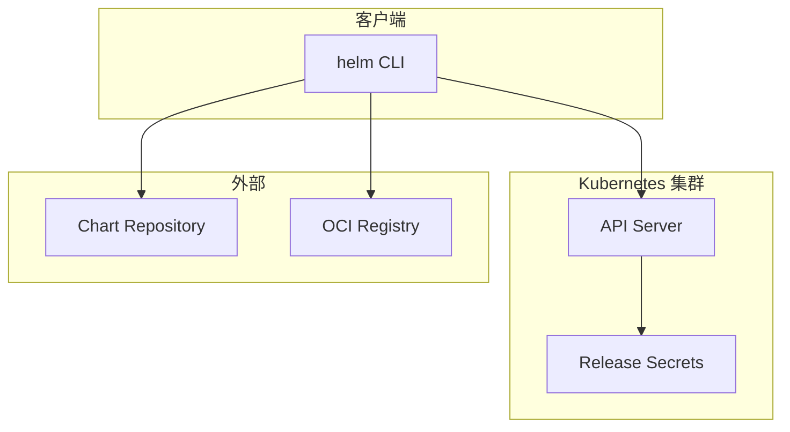
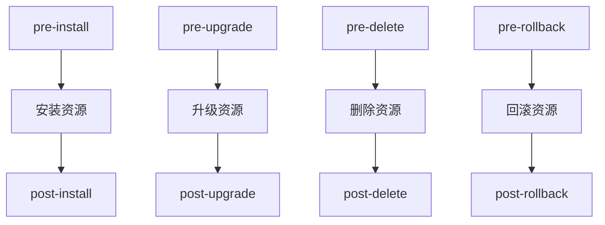

Helm 是 Kubernetes 的包管理器, 它将复杂的 Kubernetes 资源清单封装为可复用的 **Chart**, 实现应用的版本化分发和生命周期管理.

---

## 1. Helm 架构



**Helm 3 特性** (相比 Helm 2):
- 移除了 Tiller 服务端组件
- Release 信息存储在 Kubernetes Secrets
- 使用 RBAC 进行权限控制
- 支持 OCI Registry 存储 Chart

---

## 2. Chart 结构

```
mychart/
├── Chart.yaml          # Chart 元数据
├── Chart.lock          # 依赖锁定文件
├── values.yaml         # 默认配置值
├── values.schema.json  # 值的 JSON Schema 验证
├── charts/             # 依赖的子 Chart
├── crds/               # CustomResourceDefinitions
├── templates/          # 模板文件目录
│   ├── NOTES.txt       # 安装后提示信息
│   ├── _helpers.tpl    # 模板辅助函数
│   ├── deployment.yaml
│   ├── service.yaml
│   └── ingress.yaml
└── .helmignore         # 打包时忽略的文件
```

### 2.1 Chart.yaml

```yaml
apiVersion: v2
name: myapp
version: 1.2.3           # Chart 版本 (SemVer)
appVersion: "2.0.0"      # 应用版本
description: My Application
type: application        # application 或 library
keywords:
  - web
  - api
dependencies:
  - name: postgresql
    version: "12.x.x"
    repository: https://charts.bitnami.com/bitnami
    condition: postgresql.enabled
maintainers:
  - name: DevOps Team
    email: devops@example.com
```

### 2.2 values.yaml 层次结构

Values 可以从多个来源覆盖, 优先级从低到高:

| 来源 | 优先级 |
|------|--------|
| Chart 的 `values.yaml` | 最低 |
| 父 Chart 的 `values.yaml` | ↑ |
| `-f` 指定的文件 | ↑ |
| `--set` 命令行参数 | 最高 |

```bash
# 多文件覆盖
helm install myapp ./mychart \
  -f values-base.yaml \
  -f values-prod.yaml \
  --set image.tag=v2.0.0
```

---

## 3. Go 模板引擎

Helm 使用 Go 的 `text/template` 包, 扩展了 Sprig 函数库.

### 3.1 基础语法

```yaml
# templates/deployment.yaml
apiVersion: apps/v1
kind: Deployment
metadata:
  name: {{ .Release.Name }}-{{ .Chart.Name }}
  labels:
    {{- include "mychart.labels" . | nindent 4 }}
spec:
  replicas: {{ .Values.replicaCount }}
  selector:
    matchLabels:
      app: {{ .Chart.Name }}
  template:
    spec:
      containers:
        - name: {{ .Chart.Name }}
          image: "{{ .Values.image.repository }}:{{ .Values.image.tag }}"
          {{- if .Values.resources }}
          resources:
            {{- toYaml .Values.resources | nindent 12 }}
          {{- end }}
```

### 3.2 内置对象

| 对象 | 描述 |
|------|------|
| `.Release.Name` | Release 名称 |
| `.Release.Namespace` | 目标 Namespace |
| `.Release.IsInstall` | 是否为首次安装 |
| `.Release.IsUpgrade` | 是否为升级操作 |
| `.Chart.Name` | Chart 名称 |
| `.Chart.Version` | Chart 版本 |
| `.Values` | values.yaml 合并后的值 |
| `.Files` | 访问 Chart 中的非模板文件 |
| `.Capabilities` | 集群能力信息 |

### 3.3 常用函数

```yaml
# 字符串处理
{{ .Values.name | upper }}
{{ .Values.name | quote }}
{{ .Values.name | default "myapp" }}

# 条件判断
{{- if and .Values.ingress.enabled (eq .Values.ingress.class "nginx") }}
...
{{- end }}

# 循环
{{- range .Values.env }}
- name: {{ .name }}
  value: {{ .value | quote }}
{{- end }}

# 字典操作
{{- $myDict := dict "key1" "value1" "key2" "value2" }}
{{ get $myDict "key1" }}

# YAML 转换
{{- toYaml .Values.nodeSelector | nindent 8 }}
```

### 3.4 命名模板 (_helpers.tpl)

```yaml
# templates/_helpers.tpl
{{- define "mychart.labels" -}}
app.kubernetes.io/name: {{ .Chart.Name }}
app.kubernetes.io/instance: {{ .Release.Name }}
app.kubernetes.io/version: {{ .Chart.AppVersion | quote }}
{{- end }}

{{- define "mychart.selectorLabels" -}}
app: {{ .Chart.Name }}
release: {{ .Release.Name }}
{{- end }}
```

---

## 4. Hooks 生命周期

Hooks 允许在 Release 生命周期的特定点执行操作:



### 4.1 Hook 示例

```yaml
# templates/db-migrate-job.yaml
apiVersion: batch/v1
kind: Job
metadata:
  name: {{ .Release.Name }}-db-migrate
  annotations:
    "helm.sh/hook": pre-upgrade,pre-install
    "helm.sh/hook-weight": "-5"           # 执行顺序 (小的先执行)
    "helm.sh/hook-delete-policy": hook-succeeded
spec:
  template:
    spec:
      containers:
        - name: migrate
          image: myapp:{{ .Values.image.tag }}
          command: ["./migrate.sh"]
      restartPolicy: Never
```

### 4.2 Hook 删除策略

| 策略 | 行为 |
|------|------|
| `hook-succeeded` | Hook 成功后删除 |
| `hook-failed` | Hook 失败后删除 |
| `before-hook-creation` | 创建新 Hook 前删除旧的 |

---

## 5. Release 管理

### 5.1 Release 状态

```bash
# 查看 Release 列表
helm list -A

# 查看 Release 历史
helm history myapp -n production

# 查看 Release 详情
helm get all myapp -n production
helm get values myapp -n production
helm get manifest myapp -n production
```

### 5.2 升级与回滚

```bash
# 升级 Release
helm upgrade myapp ./mychart \
  -f values-prod.yaml \
  --set image.tag=v2.1.0 \
  --atomic \           # 失败自动回滚
  --wait \             # 等待资源就绪
  --timeout 5m

# 回滚到上一版本
helm rollback myapp 1 -n production
```

### 5.3 Release 存储

Helm 3 将 Release 信息存储在 Secrets:

```bash
kubectl get secrets -l owner=helm
# sh.helm.release.v1.myapp.v1
# sh.helm.release.v1.myapp.v2
```

Secret 内容 (Base64 + Gzip):
- Chart 元数据
- 合并后的 Values
- 渲染后的 Manifest
- 安装/升级时间戳

---

## 6. Repository 管理

### 6.1 传统 Chart Repository

```bash
# 添加仓库
helm repo add bitnami https://charts.bitnami.com/bitnami
helm repo update

# 搜索 Chart
helm search repo nginx
helm search repo nginx --versions

# 下载 Chart
helm pull bitnami/nginx --untar
```

### 6.2 OCI Registry 支持

```bash
# 登录 Registry
helm registry login registry.example.com

# 推送 Chart
helm push mychart-1.0.0.tgz oci://registry.example.com/charts

# 安装 OCI Chart
helm install myapp oci://registry.example.com/charts/mychart --version 1.0.0
```

---

## 7. 依赖管理

### 7.1 声明依赖

```yaml
# Chart.yaml
dependencies:
  - name: postgresql
    version: "12.1.0"
    repository: https://charts.bitnami.com/bitnami
    condition: postgresql.enabled
    tags:
      - database
  - name: redis
    version: "17.x.x"
    repository: https://charts.bitnami.com/bitnami
    condition: redis.enabled
```

### 7.2 依赖操作

```bash
# 下载依赖
helm dependency update ./mychart

# 查看依赖
helm dependency list ./mychart
```

### 7.3 覆盖子 Chart Values

```yaml
# values.yaml
postgresql:
  enabled: true
  auth:
    username: myapp
    database: myapp_db
  primary:
    resources:
      requests:
        memory: 256Mi
```

---

## 8. 调试与验证

```bash
# 语法检查
helm lint ./mychart

# 模板渲染 (不安装)
helm template myapp ./mychart -f values-prod.yaml

# 干跑 (连接集群但不实际执行)
helm install myapp ./mychart --dry-run --debug

# 比较差异
helm diff upgrade myapp ./mychart -f values-prod.yaml
```

---

## 9. 常用命令速查

```bash
# 仓库管理
helm repo add <name> <url>
helm repo update
helm repo list
helm repo remove <name>

# 搜索
helm search repo <keyword>
helm search hub <keyword>

# 安装/升级
helm install <release> <chart> -f values.yaml -n <namespace>
helm upgrade --install <release> <chart>  # 不存在则安装

# 查看
helm list -A
helm history <release>
helm get values <release>
helm get manifest <release>

# 卸载
helm uninstall <release> -n <namespace>

# 打包
helm package ./mychart
helm push mychart-1.0.0.tgz oci://<registry>
```

---

> Helm 将 Kubernetes 资源管理从 "手写 YAML" 提升到了 "软件包分发" 的层次. 良好的 Chart 设计是实现 GitOps 和可重复部署的基础.