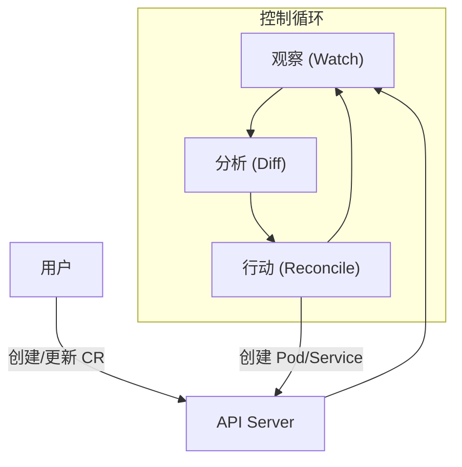
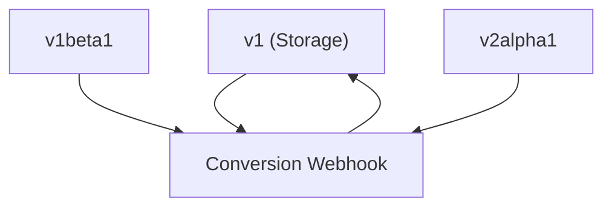
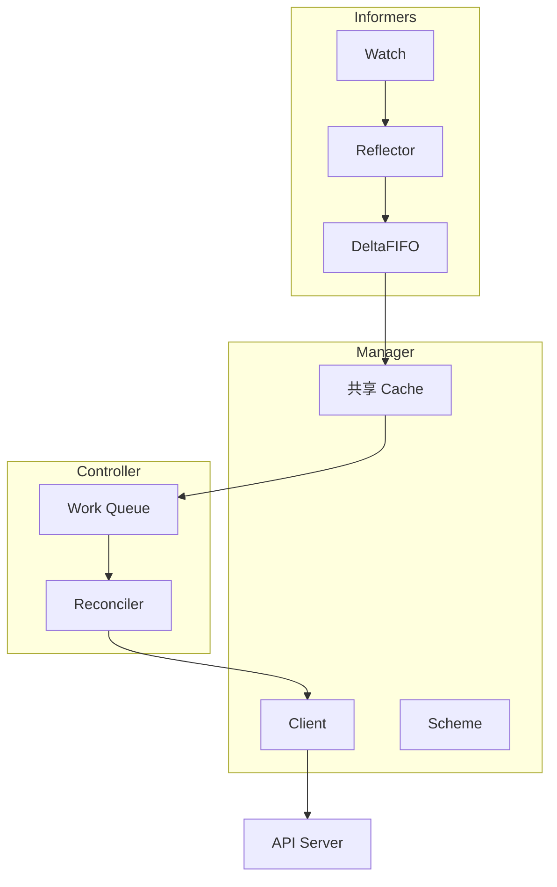
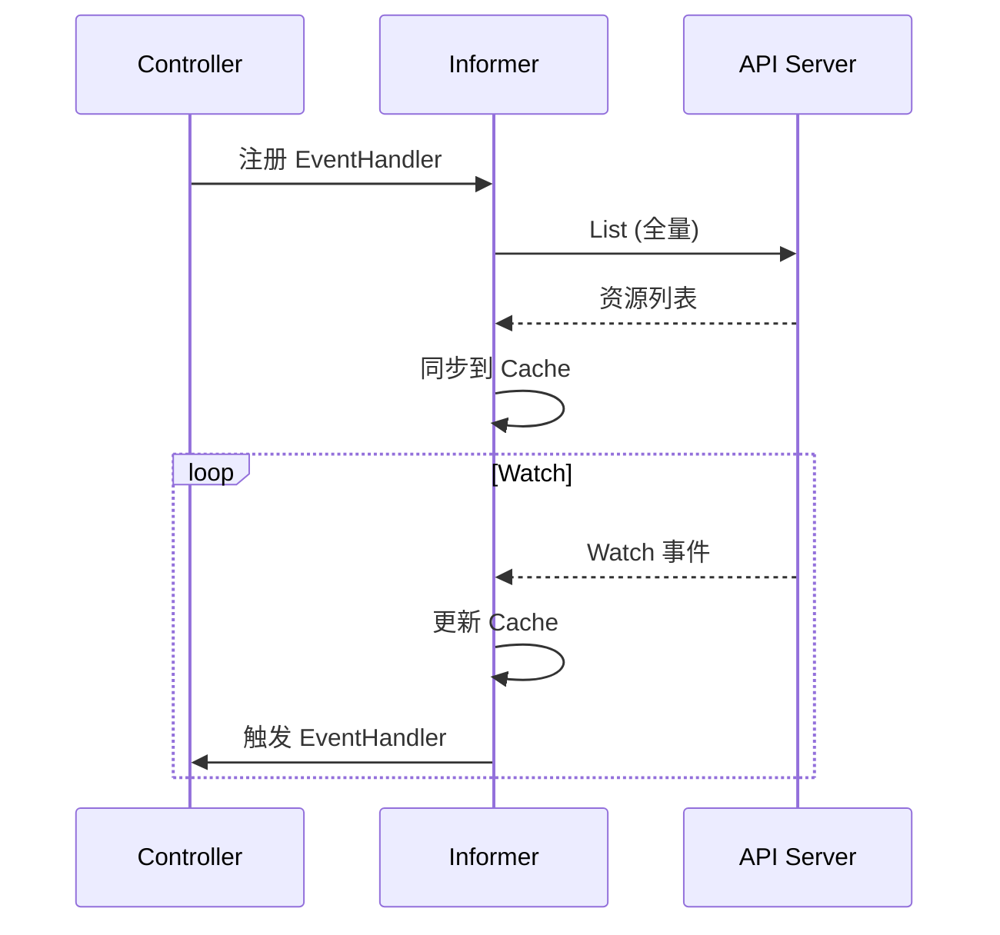
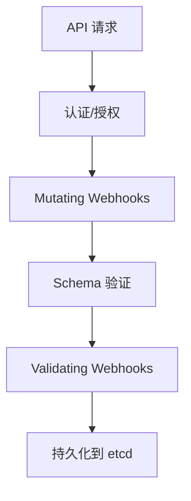

Kubernetes Operator 是一种**设计模式**. 它通过扩展 Kubernetes API, 将特定领域的运维知识以代码的形式固化在集群中, 实现复杂有状态应用的自动化管理.

---

## 1. 核心范式: 声明式 API 与控制循环



### 1.1 期望状态与实际状态

Operator 遵循 Kubernetes 的核心哲学: **控制循环 (Reconciliation Loop)**.

1. **观察 (Observe)**: 通过监控 API Server 了解资源的当前实际状态
2. **分析 (Diff)**: 将实际状态与用户定义的期望状态进行对比
3. **行动 (Act)**: 执行必要的运维操作, 使实际状态趋向于期望状态

---

## 2. Custom Resource Definition (CRD)

### 2.1 CRD 结构

```yaml
apiVersion: apiextensions.k8s.io/v1
kind: CustomResourceDefinition
metadata:
  name: databases.example.com
spec:
  group: example.com
  versions:
  - name: v1
    served: true
    storage: true
    schema:
      openAPIV3Schema:
        type: object
        properties:
          spec:
            type: object
            required: ["engine", "version"]
            properties:
              engine:
                type: string
                enum: ["mysql", "postgresql"]
              version:
                type: string
              replicas:
                type: integer
                minimum: 1
                maximum: 5
                default: 1
          status:
            type: object
            properties:
              phase:
                type: string
              readyReplicas:
                type: integer
    subresources:
      status: {}    # 启用 status 子资源
      scale:        # 启用 scale 子资源
        specReplicasPath: .spec.replicas
        statusReplicasPath: .status.readyReplicas
    additionalPrinterColumns:
    - name: Engine
      type: string
      jsonPath: .spec.engine
    - name: Phase
      type: string
      jsonPath: .status.phase
  scope: Namespaced
  names:
    plural: databases
    singular: database
    kind: Database
    shortNames: ["db"]
```

### 2.2 版本与转换



| 字段 | 作用 |
|------|------|
| `served` | 该版本是否可通过 API 访问 |
| `storage` | 该版本是否用于存储 (仅一个为 true) |
| `deprecated` | 标记为废弃 |

---

## 3. Controller-runtime 架构

controller-runtime 是 Kubebuilder 和 Operator SDK 的底层库.



### 3.1 核心组件

| 组件 | 职责 |
|------|------|
| **Manager** | 管理所有 Controller 的生命周期 |
| **Cache** | 本地缓存, 减少 API Server 负载 |
| **Client** | 读取走缓存, 写入走 API Server |
| **Reconciler** | 核心业务逻辑接口 |
| **Predicate** | 事件过滤器 |

### 3.2 Reconciler 接口

```go
type Reconciler interface {
    Reconcile(ctx context.Context, req Request) (Result, error)
}

// Request 包含触发 Reconcile 的对象信息
type Request struct {
    NamespacedName types.NamespacedName
}

// Result 控制重新入队行为
type Result struct {
    Requeue      bool
    RequeueAfter time.Duration
}
```

### 3.3 返回值语义

| 返回值 | 行为 |
|--------|------|
| `Result{}, nil` | 成功, 不重新入队 |
| `Result{Requeue: true}, nil` | 立即重新入队 |
| `Result{RequeueAfter: time.Minute}, nil` | 延迟重新入队 |
| `Result{}, err` | 指数退避重试 |

---

## 4. Informer 与 WorkQueue

### 4.1 List-Watch 机制

Operator 不通过轮询发现变化, 而是通过 **List-Watch** 机制:



### 4.2 SharedInformer

| 组件 | 作用 |
|------|------|
| **Reflector** | 执行 List-Watch, 推送到队列 |
| **DeltaFIFO** | 存储对象变更增量 |
| **Indexer** | 本地缓存, 支持索引查询 |
| **Lister** | 从缓存读取对象 |

### 4.3 WorkQueue 特性

```go
// 延迟队列
queue.AddAfter(item, 5*time.Second)

// 速率限制
queue.AddRateLimited(item)

// 重试退避
// 默认: 5ms, 10ms, 20ms, 40ms... 最大 1000s
```

---

## 5. Admission Webhooks

### 5.1 类型

| 类型 | 时机 | 作用 |
|------|------|------|
| **Validating** | 资源持久化前 | 验证请求, 拒绝非法资源 |
| **Mutating** | Validating 之前 | 修改请求, 注入默认值 |



### 5.2 Webhook 配置

```yaml
apiVersion: admissionregistration.k8s.io/v1
kind: ValidatingWebhookConfiguration
metadata:
  name: database-validator
webhooks:
- name: validate.database.example.com
  clientConfig:
    service:
      name: webhook-service
      namespace: default
      path: /validate
    caBundle: <base64-encoded-ca>
  rules:
  - apiGroups: ["example.com"]
    apiVersions: ["v1"]
    operations: ["CREATE", "UPDATE"]
    resources: ["databases"]
  admissionReviewVersions: ["v1"]
  sideEffects: None
  failurePolicy: Fail
```

### 5.3 Webhook 实现

```go
func (w *DatabaseWebhook) ValidateCreate(ctx context.Context, obj runtime.Object) error {
    db := obj.(*examplev1.Database)
    
    if db.Spec.Engine == "mysql" && db.Spec.Version < "8.0" {
        return fmt.Errorf("MySQL version must be >= 8.0")
    }
    
    return nil
}
```

---

## 6. Operator 成熟度模型

| 阶段 | 能力 | 描述 |
|------|------|------|
| **Level 1** | 基础安装 | 自动化部署和初始配置 |
| **Level 2** | 无缝升级 | 版本更新, 配置变更 |
| **Level 3** | 全生命周期 | 备份, 恢复, 故障转移 |
| **Level 4** | 深度观测 | 内置 Metrics, 日志采集 |
| **Level 5** | 自动驾驶 | 自动扩缩, 自愈, 调优 |

---

## 7. Kubebuilder 实践

### 7.1 项目初始化

```bash
# 创建项目
kubebuilder init --domain example.com --repo github.com/example/db-operator

# 创建 API
kubebuilder create api --group database --version v1 --kind Database

# 创建 Webhook
kubebuilder create webhook --group database --version v1 --kind Database \
  --defaulting --programmatic-validation
```

### 7.2 生成的目录结构

```
├── api/v1/
│   ├── database_types.go      # CRD 类型定义
│   ├── database_webhook.go    # Webhook 实现
│   └── zz_generated.deepcopy.go
├── controllers/
│   └── database_controller.go # Reconciler 实现
├── config/
│   ├── crd/                   # CRD YAML
│   ├── rbac/                  # RBAC 规则
│   └── webhook/               # Webhook 配置
└── main.go                    # 入口
```

### 7.3 Marker 注释

```go
// +kubebuilder:object:root=true
// +kubebuilder:subresource:status
// +kubebuilder:printcolumn:name="Engine",type=string,JSONPath=`.spec.engine`
// +kubebuilder:printcolumn:name="Phase",type=string,JSONPath=`.status.phase`

type Database struct {
    metav1.TypeMeta   `json:",inline"`
    metav1.ObjectMeta `json:"metadata,omitempty"`
    
    Spec   DatabaseSpec   `json:"spec,omitempty"`
    Status DatabaseStatus `json:"status,omitempty"`
}
```

---

## 8. 最佳实践

### 8.1 幂等性

`Reconcile` 函数必须是幂等的. 无论触发多少次, 只要期望状态不变, 最终结果应该一致.

```go
func (r *DatabaseReconciler) Reconcile(ctx context.Context, req ctrl.Request) (ctrl.Result, error) {
    // 获取资源
    var db examplev1.Database
    if err := r.Get(ctx, req.NamespacedName, &db); err != nil {
        return ctrl.Result{}, client.IgnoreNotFound(err)
    }
    
    // 确保 Deployment 存在 (CreateOrUpdate 是幂等的)
    deploy := &appsv1.Deployment{ObjectMeta: metav1.ObjectMeta{
        Name:      db.Name,
        Namespace: db.Namespace,
    }}
    
    _, err := ctrl.CreateOrUpdate(ctx, r.Client, deploy, func() error {
        // 设置期望规格
        deploy.Spec.Replicas = &db.Spec.Replicas
        return ctrl.SetControllerReference(&db, deploy, r.Scheme)
    })
    
    return ctrl.Result{}, err
}
```

### 8.2 Owner References

通过 OwnerReference 实现级联删除:

```go
ctrl.SetControllerReference(owner, owned, scheme)
```

### 8.3 Finalizers

对于需要清理外部资源的场景:

```go
const finalizerName = "database.example.com/finalizer"

func (r *DatabaseReconciler) Reconcile(ctx context.Context, req ctrl.Request) (ctrl.Result, error) {
    var db examplev1.Database
    if err := r.Get(ctx, req.NamespacedName, &db); err != nil {
        return ctrl.Result{}, client.IgnoreNotFound(err)
    }
    
    // 检查是否正在删除
    if !db.DeletionTimestamp.IsZero() {
        if controllerutil.ContainsFinalizer(&db, finalizerName) {
            // 清理外部资源
            if err := r.cleanupExternalResources(&db); err != nil {
                return ctrl.Result{}, err
            }
            // 移除 Finalizer
            controllerutil.RemoveFinalizer(&db, finalizerName)
            if err := r.Update(ctx, &db); err != nil {
                return ctrl.Result{}, err
            }
        }
        return ctrl.Result{}, nil
    }
    
    // 添加 Finalizer
    if !controllerutil.ContainsFinalizer(&db, finalizerName) {
        controllerutil.AddFinalizer(&db, finalizerName)
        if err := r.Update(ctx, &db); err != nil {
            return ctrl.Result{}, err
        }
    }
    
    // 正常 Reconcile 逻辑...
    return ctrl.Result{}, nil
}
```

### 8.4 Status 更新

```go
// 分离 Spec 和 Status 更新
db.Status.Phase = "Running"
db.Status.ReadyReplicas = 3
if err := r.Status().Update(ctx, &db); err != nil {
    return ctrl.Result{}, err
}
```

---

## 9. 测试策略

### 9.1 单元测试

```go
func TestReconcile(t *testing.T) {
    scheme := runtime.NewScheme()
    _ = examplev1.AddToScheme(scheme)
    
    client := fake.NewClientBuilder().
        WithScheme(scheme).
        WithObjects(&examplev1.Database{...}).
        Build()
    
    reconciler := &DatabaseReconciler{Client: client, Scheme: scheme}
    
    result, err := reconciler.Reconcile(ctx, ctrl.Request{...})
    assert.NoError(t, err)
}
```

### 9.2 Envtest (集成测试)

```go
var testEnv *envtest.Environment

func TestMain(m *testing.M) {
    testEnv = &envtest.Environment{
        CRDDirectoryPaths: []string{filepath.Join("..", "config", "crd", "bases")},
    }
    cfg, _ := testEnv.Start()
    // ... 运行测试
    testEnv.Stop()
}
```

---

> Operator 是 Kubernetes 能够从 "容器编排平台" 进化为 "云操作系统" 的核心动力. 它让复杂的分布式一致性逻辑从 "人肉运维" 变为了 "软件定义".
