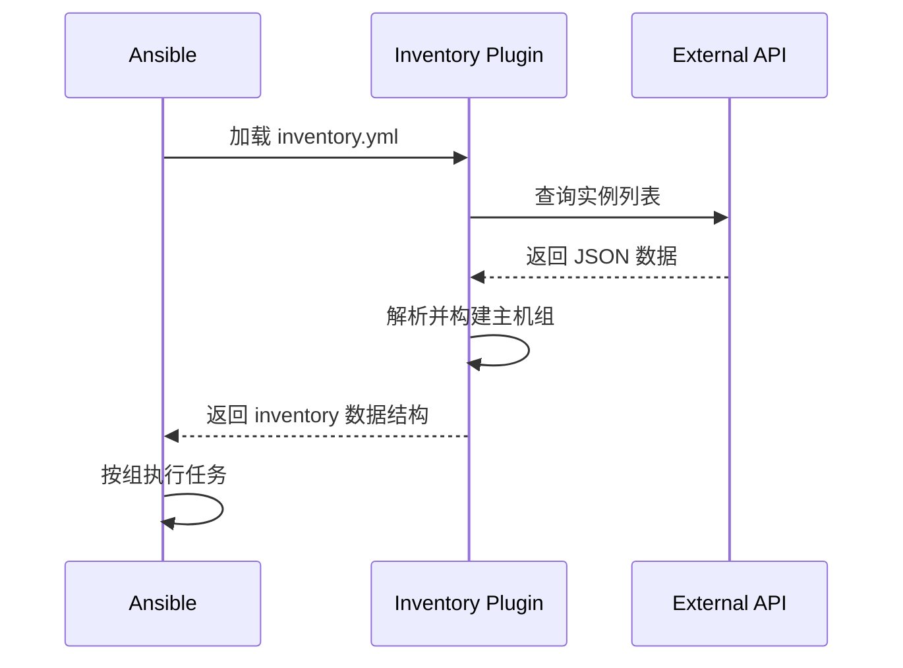

## 1. Ansible 定义与核心特性

Ansible 是一款基于 Python 开发的开源自动化运维工具, 属于 **声明式 (Declarative)** 配置管理系统. 它通过 SSH 协议实现对远程主机的管理, 核心哲学是 **"Simple, Powerful, Agentless"**.

### 1.1 关键特性 (Core Features)
*   **Agentless (无代理)**: 目标节点无需安装任何客户端、Agent 或运行特定的后台进程. 只要有 SSH 和 Python 即可被管理.
*   **Idempotency (幂等性)**: 核心设计目标. 无论执行多少次, 系统的状态始终保持一致.
*   **Push-based (推模式)**: 控制节点主动将配置 "推" 向受控节点, 实时性强, 适合即时运维任务.
*   **YAML Syntax**: 使用人类易读的 YAML 编写 Playbook, 降低了学习门槛.

---

## 2. 架构组件与配置文件优先级

理解 Ansible 的工作机制需要先理清它的 "身体构成" 以及它是如何寻找配置的.

### 2.1 基本组件 (Components)
1.  **Control Node**: 安装 Ansible 的机器, 负责解析 Playbook 并下发任务.
2.  **Managed Nodes (Hosts)**: 被管理的远程服务器.
3.  **Inventory**: 主机清单, 定义了受控主机的归属和变量.
4.  **Modules**: 执行具体任务的二进制文件或脚本 (如 `yum`, `copy`, `service`).
5.  **Plugins**: 对 Ansible 功能的扩展 (如 Connection, Lookup, Filter 插件).

### 2.2 配置文件优先级 (Configuration Precedence)
Ansible 按照固定的顺序寻找配置文件, 一旦找到则立刻停止搜索 (取最高级). **优先级从高到低排列如下**:
1.  **`ANSIBLE_CONFIG`**: 环境变量定义的路径.
2.  **`./ansible.cfg`**: 当前执行目录下的配置文件 (生产环境中最常用的定位方式).
3.  **`~/.ansible.cfg`**: 用户家目录下的隐藏文件.
4.  **`/etc/ansible/ansible.cfg`**: 全局默认配置文件 (由包管理器安装生成).

---

## 3. 任务执行全路径 (Working Mechanism)

### 3.1 Ansiballz: 模块打包与解释器发现
在任务下发前, Ansible 并不是直接发送原始 Python 脚本, 而是执行以下底层操作:
1.  **解释器发现 (Interpreter Discovery)**: Ansible 会首先探测目标机上的 Python 路径 (首选 `python3`). 这一行为可以通过 `ansible_python_interpreter` 变量进行强制指定.
2.  **Ansiballz 封包**: Ansible 将模块代码、参数以及共享存库打包成一个 base64 编码并经过压缩的 Python 脚本 (被称为 Ansiballz). 这种封包机制保证了即使远程节点缺少依赖包, 只要有 Python 核心库即可运行任务.

### 3.2 传输协议: SFTP vs SCP
传输 Ansiballz 包时, Ansible 支持多种连接方式, 默认首选 **SFTP**:
*   **SFTP (首选)**: 连接持久化好, 现代 OpenSSH 服务器默认开启.
*   **SCP (兼容性选项)**: 当远端 SFTP 子系统被禁用时触发回退. SCP 每次传输文件都需要建立新的会话, 效率略低.
*   **底层配置**: 若需强制使用 SCP, 可在 `ansible.cfg` 中设置 `scp_if_ssh = smart` (智能切换) 或 `True`.

### 3.3 任务分发全路径 (Working Mechanism)
1.  **Loading**: 加载配置文件, 解析命令行参数, 读取 Inventory.
2.  **Packaging**: 生成 Ansiballz 封包.
3.  **Transport**: 通过 **SFTP/SCP** 传输包至远程 `~/.ansible/tmp/`.
4.  **Execution**: 修改脚本权限并调用解释器执行.
5.  **Result Gathering**: 捕获标准输出 (JSON 格式), 返回给控制节点并在终端渲染显示.

---

## 4. 深度实践: Inventory 主机清单

Inventory 不仅仅是 IP 列表, 它是整个自动化逻辑的 "地图".

### 4.1 基础匹配逻辑 (Patterns)
Ansible 使用 Patterns 来指定执行任务的目标. 它可以是主机名、IP、组名甚至是它们的组合.

| 模式 | 含义 | 示例 |
| :--- | :--- | :--- |
| **all** | 匹配清单中所有主机 | `ansible all -m ping` |
| **主机/组名** | 直接匹配特定对象 | `ansible db_servers -m ping` |
| **通配符 (`*`)** | 模糊匹配主机名 | `ansible "web*.example.com" -m ping` |
| **并集 (`,`)** | 匹配组 A 或组 B | `ansible "web,db" -m ping` |
| **交集 (`&`)** | 既在组 A 也在组 B | `ansible "web:&prod" -m ping` |
| **排除 (`!`)** | 在组 A 但不在组 B | `ansible "web:!staging" -m ping` |

### 4.2 详细举例 (INI 格式)
在 `inventory.ini` 中, 我们可以构建复杂的层级结构.

```ini
# 1. 简单主机范围
[web]
web[01:10].example.com  # 匹配 web01 到 web10

# 2. 嵌套组 (Children)
[shanghai]
sh1.example.com
sh2.example.com

[beijing]
bj1.example.com

[china:children] # 定义子组
shanghai
beijing

# 3. 带有变量的主机
[db]
db-master ansible_host=192.168.1.100 ansible_port=2222
db-slave  ansible_host=192.168.1.101
```

### 4.3 高级话题: 正则表达式匹配
如果通配符无法满足复杂的命名规约, 可以使用 `~` 开启正则匹配:
```bash
# 匹配所有以 web 或 db 开头, 且包含连续三个数字并以 .example.com 结尾的主机
ansible "~(web|db).*[0-9]{3}\.example\.com" -m ping
```

---

## 5. 传输性能优化

### 5.1 ControlPersist (SSH 持久化)
大集群下, SSH 握手是瓶颈. 启用该功能可让 SSH 连接在空闲时段内保持复用:
```ini
# ansible.cfg
[ssh_connection]
ssh_args = -C -o ControlMaster=auto -o ControlPersist=60s
```

### 5.2 Pipelining (隧道化传输)
当开启后, Ansible 不再将封包写入磁盘, 而是直接通过 stdin 管道喂给远程控制台的 Python 解释器.
*   **性能提升**: 极大地减少了磁盘 I/O 和 SSH 连接次数.
*   **注意事项**: 必须在远程系统的 `/etc/sudoers` 中禁用 `requiretty`, 否则会导致提权失败.
```ini
# ansible.cfg
pipelining = True
```

### 5.3 极致性能: Mitogen for Ansible (第三方插件)
尽管 Pipelining 提升巨大, 但 Ansible 原生执行由于 Python 进程频繁启动仍有开销.
*   **原理**: Mitogen 通过在远程主机维持一个长效的 Python 解释器并使用高效的序列化协议, 能够减少多达 90% 的 CPU 消耗和网络带宽.
*   **工程建议**: 适用于数千台规模的极致性能追求, 但需注意其对部分复杂 Action Plugins 的兼容性风险.


---

## 6. 动态 Inventory: 云原生主机发现

在云环境中, 服务器实例是动态创建和销毁的. 静态 INI 文件无法适应这种弹性需求. 动态 Inventory 插件允许 Ansible 从外部数据源 (云 API, CMDB, 服务发现系统) 实时获取主机列表.

### 6.1 动态 Inventory 工作原理



### 6.2 云平台插件示例

**AWS EC2 动态 Inventory**:

```yaml
# inventory/aws_ec2.yml
---
plugin: amazon.aws.aws_ec2

regions:
  - us-east-1
  - us-west-2

# 过滤条件 (仅获取运行中的实例)
filters:
  instance-state-name: running
  "tag:Environment": production

# 基于标签构建主机组
keyed_groups:
  - key: tags.Role
    prefix: role
    separator: "_"
  - key: placement.availability_zone
    prefix: az
  - key: instance_type
    prefix: type

# 组合变量
compose:
  ansible_host: public_ip_address | default(private_ip_address)
  ansible_user: "'ec2-user'"
  instance_name: tags.Name | default(instance_id)

# 主机变量设置
hostnames:
  - tag:Name
  - private-dns-name
  - instance-id
```

**验证动态 Inventory**:

```bash
# 列出所有主机
ansible-inventory -i inventory/aws_ec2.yml --list

# 以图形化方式展示
ansible-inventory -i inventory/aws_ec2.yml --graph

# 测试连通性
ansible -i inventory/aws_ec2.yml all -m ping
```

### 6.3 自定义 Inventory 插件开发

当现有插件无法满足需求时 (如对接内部 CMDB), 可以开发自定义插件:

```python
# inventory_plugins/my_cmdb.py
from ansible.plugins.inventory import BaseInventoryPlugin, Constructable
from ansible.errors import AnsibleError
import requests

DOCUMENTATION = r'''
name: my_cmdb
plugin_type: inventory
short_description: Inventory from internal CMDB
'''

class InventoryModule(BaseInventoryPlugin, Constructable):
    NAME = 'my_cmdb'
    
    def verify_file(self, path):
        """验证配置文件"""
        valid = False
        if super().verify_file(path):
            if path.endswith(('cmdb.yml', 'cmdb.yaml')):
                valid = True
        return valid
    
    def parse(self, inventory, loader, path, cache=True):
        """解析并填充 inventory"""
        super().parse(inventory, loader, path, cache)
        self._read_config_data(path)
        
        # 从 CMDB API 获取数据
        api_url = self.get_option('api_url')
        api_token = self.get_option('api_token')
        
        try:
            response = requests.get(
                f"{api_url}/api/v1/servers",
                headers={'Authorization': f'Bearer {api_token}'},
                timeout=30
            )
            response.raise_for_status()
            servers = response.json()
        except Exception as e:
            raise AnsibleError(f"Failed to fetch from CMDB: {e}")
        
        # 构建 inventory
        for server in servers:
            hostname = server['hostname']
            self.inventory.add_host(hostname)
            
            # 设置主机变量
            self.inventory.set_variable(hostname, 'ansible_host', server['ip'])
            self.inventory.set_variable(hostname, 'server_role', server.get('role'))
            
            # 添加到组
            group = server.get('environment', 'ungrouped')
            self.inventory.add_group(group)
            self.inventory.add_child(group, hostname)
```

### 6.4 大规模 Inventory 分片策略

当管理 1000+ 主机时, 单一 Inventory 文件会变得难以维护. 采用分片策略:

```
inventory/
├── production/
│   ├── aws_ec2.yml      # AWS 动态获取
│   ├── azure_rm.yml     # Azure 动态获取
│   ├── static.yml       # 静态主机 (物理机, 特殊设备)
│   └── group_vars/
│       └── all.yml
├── staging/
│   ├── aws_ec2.yml
│   └── group_vars/
│       └── all.yml
└── development/
    └── static.yml
```

```bash
# 使用整个目录作为 Inventory
ansible-playbook -i inventory/production/ site.yml
```

---

## 7. 第一周进阶练习

### 练习 1: 优先级实验
1.  在 `/etc/ansible/ansible.cfg` 设置 `forks = 5`.
2.  在当前目录 `./ansible.cfg` 设置 `forks = 10`.
3.  通过命令 `ansible-config dump | grep FORKS` 观察生效值, 并验证优先级逻辑.

### 练习 2: 复杂 Inventory 构建
创建一个名为 `hosts.ini` 的文件, 要求实现:
- 定义一个 `loadbalancer` 组.
- 定义一个 `app` 组, 包含 `app01` 到 `app20`.
- 定义一个 `datacenter` 组, 将上述两组作为其子组 (children).
- 尝试使用交集模式 (`&`) 给同时属于 `app` 和 `datacenter` 组的主机下发任务.

### 练习 3: 正则表达式挑战
使用 `ansible` 命令配合正则表达式, 仅匹配 Inventory 中那些**名称包含偶数**且以 **.com** 结尾的主机, 并执行 `ping`.

---

> 理解 SSH 隧道与 Inventory 拓扑, 你就掌握了 Ansible 的命脉. 所有的上层逻辑架构, 本质上都是对这幅 "地图" 的各种变换与投影.
