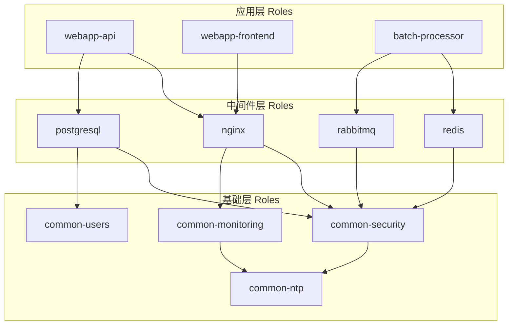
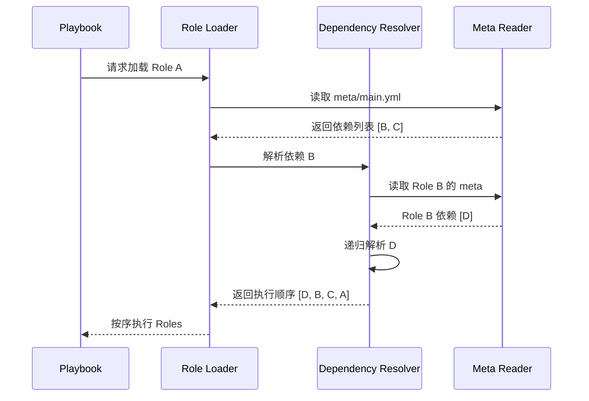
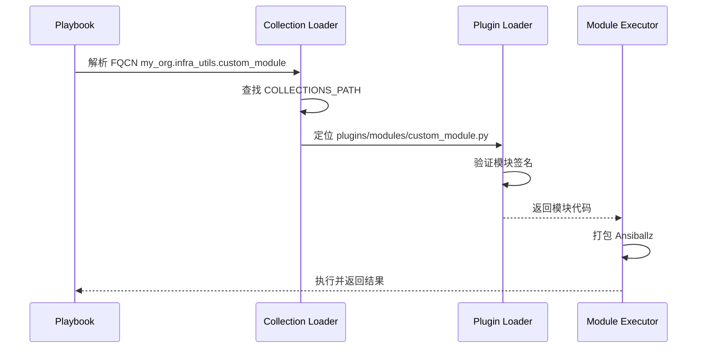
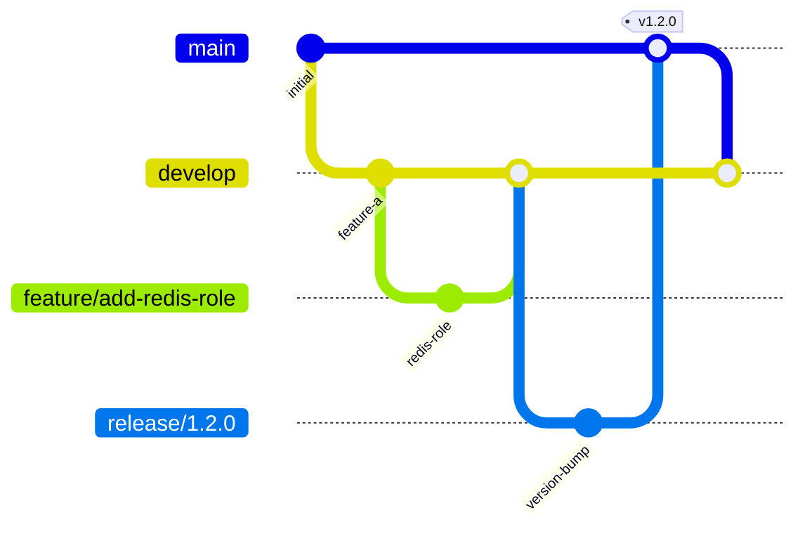

## 1. 结构化治理: Ansible Roles

Roles 是 Ansible 实现 "代码复用" 和 "松耦合" 的核心手段. 它将 tasks, handlers, files, templates, vars 等组件封装为一个独立的可重用单元.

### 1.1 标准化初始化与工程规约

在工程实践中, 严禁手动创建 Role 目录. 必须使用标准工具初始化以确保兼容性:

```bash
# 初始化一个符合 Galaxy 标准的 Role
ansible-galaxy role init my_custom_role

# 生成的目录结构
my_custom_role/
├── defaults/
│   └── main.yml
├── files/
├── handlers/
│   └── main.yml
├── meta/
│   └── main.yml
├── tasks/
│   └── main.yml
├── templates/
├── tests/
│   ├── inventory
│   └── test.yml
├── vars/
│   └── main.yml
└── README.md
```

### 1.2 目录组件的工程抽象

Ansible Role 的目录结构并非随意设计, 而是对应了配置管理中的不同生命周期:

| 目录名 | 核心职能 | 工程属性与约定 |
| :--- | :--- | :--- |
| **`defaults/`** | **默认变量** | 优先级最低. 定义 Role 的 "Public API", 供外部用户在 Playbook 中按需覆盖. |
| **`vars/`** | **私有变量** | 优先级极高 (仅次于命令行). 存放 Role 内部的固定常量, 不建议外部修改, 确保 Role 逻辑的一致性. |
| **`tasks/`** | **任务编排** | 核心入口为 `main.yml`. 建议使用 `import_tasks` 将复杂逻辑拆分为子任务文件. |
| **`handlers/`** | **状态后置处理** | 只有在 `tasks` 触发 `changed` 状态时才执行. 常用于服务重启、Cache 刷新等. |
| **`templates/`** | **动态配置文件** | 存放 `.j2` 模板. 通过 Jinja2 引擎注入变量, 实现同一 Role 在不同环境下生成差异化配置. |
| **`files/`** | **静态资源分发** | 存放不受变量影响的二进制文件、证书等. 在同步时采用校验和比对. |
| **`meta/`** | **元数据与依赖** | `main.yml` 定义作者、平台兼容性及 `dependencies`. 强制约束 Role 间的父子关系. |
| **`library/`** | **内置私有模块** | 若该 Role 需要特定 Python 脚本支持, 可在此存放. 运行任务时会自动推送到远程执行. |
| **`tests/`** | **质量保证** | 存放 `inventory` 和 `test.yml`, 用于配合 Molecule 等框架进行自动化单元测试. |

### 1.3 Role 设计模式与分层架构

在大型组织中, Role 不应扁平地堆叠在单一目录下. 采用分层架构可以显著降低复杂度:



#### 1.3.1 分层原则

| 层级 | 命名规约 | 职责范围 | 变更频率 |
|------|----------|----------|----------|
| **基础层** | `common-*` | OS 加固, 用户管理, 时间同步, 监控 Agent | 极低 |
| **中间件层** | 服务名 (如 `nginx`, `postgresql`) | 通用中间件的安装与基础配置 | 低 |
| **应用层** | 业务名 (如 `webapp-api`) | 业务特定配置, 部署脚本 | 高 |

#### 1.3.2 跨平台 Role 设计

生产级 Role 必须处理多发行版兼容性. 核心策略是将 OS 特定逻辑隔离到独立文件中:

```yaml
# tasks/main.yml
---
- name: Include OS-specific variables
  include_vars: "{{ item }}"
  with_first_found:
    - "{{ ansible_facts['distribution'] }}_{{ ansible_facts['distribution_major_version'] }}.yml"
    - "{{ ansible_facts['os_family'] }}.yml"
    - "default.yml"

- name: Include OS-specific tasks
  include_tasks: "{{ item }}"
  with_first_found:
    - "install_{{ ansible_facts['os_family'] | lower }}.yml"
    - "install_default.yml"

- name: Include common configuration
  import_tasks: configure.yml

- name: Include verification tasks
  import_tasks: verify.yml
```

**目录结构示例**:

```
roles/nginx/
├── tasks/
│   ├── main.yml
│   ├── install_redhat.yml
│   ├── install_debian.yml
│   ├── configure.yml
│   └── verify.yml
├── vars/
│   ├── RedHat.yml
│   ├── Debian.yml
│   └── default.yml
└── templates/
    └── nginx.conf.j2
```

#### 1.3.3 生产级任务拆分策略

复杂 Role 的 `tasks/main.yml` 应仅作为路由入口, 实际逻辑分散到专责文件:

| 文件名 | 职责 | 执行时机 |
|--------|------|----------|
| `preflight.yml` | 前置检查 (磁盘空间, 端口冲突, 依赖版本) | 第一阶段 |
| `install.yml` | 软件包安装 | 第二阶段 |
| `configure.yml` | 配置文件生成, 目录创建 | 第三阶段 |
| `service.yml` | 服务启动, 开机自启配置 | 第四阶段 |
| `verify.yml` | 健康检查, 端口监听验证 | 第五阶段 |
| `cleanup.yml` | 临时文件清理, 旧版本移除 | 最终阶段 |

```yaml
# tasks/main.yml - 路由入口
---
- name: Preflight checks
  import_tasks: preflight.yml
  tags: [preflight]

- name: Install packages
  import_tasks: install.yml
  tags: [install]

- name: Configure application
  import_tasks: configure.yml
  tags: [configure]

- name: Manage service
  import_tasks: service.yml
  tags: [service]

- name: Verify deployment
  import_tasks: verify.yml
  tags: [verify]
```

### 1.4 完整生产级 Role 示例: NGINX 部署

以下是一个生产级 NGINX Role 的核心文件结构:

```yaml
# defaults/main.yml - 公开 API
---
nginx_http_port: 80
nginx_https_port: 443
nginx_worker_processes: auto
nginx_worker_connections: 1024
nginx_client_max_body_size: "10m"
nginx_keepalive_timeout: 65

nginx_enable_ssl: false
nginx_ssl_certificate: ""
nginx_ssl_certificate_key: ""

nginx_upstreams: []
# - name: backend
#   servers:
#     - address: 192.168.1.10
#       port: 8080
#       weight: 1

nginx_vhosts: []
# - server_name: example.com
#   root: /var/www/html
#   index: index.html

nginx_extra_configs: []
```

```yaml
# vars/RedHat.yml - 私有常量
---
nginx_package_name: nginx
nginx_service_name: nginx
nginx_config_dir: /etc/nginx
nginx_log_dir: /var/log/nginx
nginx_user: nginx
nginx_group: nginx
```

```yaml
# tasks/preflight.yml - 前置检查
---
- name: Check if ports are available
  wait_for:
    port: "{{ item }}"
    state: stopped
    timeout: 1
  loop:
    - "{{ nginx_http_port }}"
    - "{{ nginx_https_port }}"
  ignore_errors: yes
  register: port_check

- name: Fail if ports are in use
  fail:
    msg: "Port {{ item.item }} is already in use"
  loop: "{{ port_check.results }}"
  when: item.failed is defined and not item.failed
  loop_control:
    label: "{{ item.item }}"

- name: Gather disk space
  shell: df -m / | tail -1 | awk '{print $4}'
  register: disk_space
  changed_when: false

- name: Ensure sufficient disk space (minimum 500MB)
  assert:
    that:
      - disk_space.stdout | int > 500
    fail_msg: "Insufficient disk space: {{ disk_space.stdout }}MB available, 500MB required"
```

```yaml
# tasks/install.yml - 安装逻辑
---
- name: Install NGINX package
  package:
    name: "{{ nginx_package_name }}"
    state: present
  notify: Restart nginx

- name: Install SSL dependencies
  package:
    name:
      - openssl
      - python3-cryptography
    state: present
  when: nginx_enable_ssl | bool
```

```yaml
# tasks/configure.yml - 配置生成
---
- name: Ensure configuration directories exist
  file:
    path: "{{ item }}"
    state: directory
    owner: root
    group: root
    mode: '0755'
  loop:
    - "{{ nginx_config_dir }}/conf.d"
    - "{{ nginx_config_dir }}/sites-available"
    - "{{ nginx_config_dir }}/sites-enabled"

- name: Deploy main NGINX configuration
  template:
    src: nginx.conf.j2
    dest: "{{ nginx_config_dir }}/nginx.conf"
    owner: root
    group: root
    mode: '0644'
    validate: "nginx -t -c %s"
  notify: Reload nginx

- name: Deploy virtual host configurations
  template:
    src: vhost.conf.j2
    dest: "{{ nginx_config_dir }}/sites-available/{{ item.server_name }}.conf"
    owner: root
    group: root
    mode: '0644'
  loop: "{{ nginx_vhosts }}"
  notify: Reload nginx

- name: Enable virtual hosts
  file:
    src: "{{ nginx_config_dir }}/sites-available/{{ item.server_name }}.conf"
    dest: "{{ nginx_config_dir }}/sites-enabled/{{ item.server_name }}.conf"
    state: link
  loop: "{{ nginx_vhosts }}"
  notify: Reload nginx
```

```yaml
# tasks/verify.yml - 验证逻辑
---
- name: Verify NGINX configuration syntax
  command: nginx -t
  register: nginx_syntax_check
  changed_when: false

- name: Wait for NGINX to be listening
  wait_for:
    port: "{{ nginx_http_port }}"
    state: started
    timeout: 30

- name: Verify NGINX responds to HTTP request
  uri:
    url: "http://localhost:{{ nginx_http_port }}/"
    status_code: [200, 301, 302, 403, 404]
  register: http_check
  retries: 3
  delay: 5
```

```yaml
# handlers/main.yml
---
- name: Restart nginx
  service:
    name: "{{ nginx_service_name }}"
    state: restarted
  listen: "Restart nginx"

- name: Reload nginx
  service:
    name: "{{ nginx_service_name }}"
    state: reloaded
  listen: "Reload nginx"
```

---

## 2. Role 依赖管理深度解析

### 2.1 `meta/main.yml` 完整配置

`meta/main.yml` 是 Role 的元数据中心, 定义了作者信息、平台兼容性和依赖关系:

```yaml
# meta/main.yml
---
galaxy_info:
  author: Infrastructure Team
  description: Production-grade NGINX deployment role
  company: ACME Corp
  license: MIT
  
  min_ansible_version: "2.12"
  
  platforms:
    - name: EL
      versions:
        - "8"
        - "9"
    - name: Ubuntu
      versions:
        - focal    # 20.04
        - jammy    # 22.04
    - name: Debian
      versions:
        - bullseye  # 11
        - bookworm  # 12
  
  galaxy_tags:
    - web
    - nginx
    - loadbalancer
    - proxy

dependencies:
  # 简单依赖: 仅指定 Role 名
  - common-security
  
  # 带版本约束的依赖
  - role: common-monitoring
    version: ">=2.0.0,<3.0.0"
  
  # 带变量传递的依赖
  - role: common-firewall
    vars:
      firewall_allowed_ports:
        - 80
        - 443
  
  # 条件依赖
  - role: ssl-certificates
    when: nginx_enable_ssl | bool
```

### 2.2 依赖解析机制

当 Playbook 调用一个 Role 时, Ansible 的依赖解析器执行以下流程:



**执行顺序原则**: 依赖的 Role 总是在当前 Role 之前执行 (深度优先).

### 2.3 循环依赖检测与规避

Ansible 在加载阶段会检测循环依赖并抛出错误:

```
ERROR! A recursive loop was detected involving role 'role_a' -> 'role_b' -> 'role_a'
```

**规避策略**:

1. **提取公共依赖**: 若 A 依赖 B, B 依赖 A 的某部分功能, 应将该功能提取为独立 Role C

2. **使用 `include_role` 替代静态依赖**: 在任务中动态加载, 绕过静态解析

```yaml
# 不在 meta/main.yml 中声明依赖
# 而是在 tasks 中动态加载
- name: Conditionally include firewall role
  include_role:
    name: common-firewall
  vars:
    firewall_ports: "{{ my_ports }}"
  when: configure_firewall | bool
```

### 2.4 依赖版本约束

在企业环境中, Role 版本兼容性至关重要:

```yaml
# requirements.yml
---
roles:
  - name: nginx
    src: git+https://gitlab.example.com/ansible/roles/nginx.git
    version: v2.3.1  # 精确版本锁定
    
  - name: common-security
    src: git+https://gitlab.example.com/ansible/roles/common-security.git
    version: ">=1.5.0,<2.0.0"  # 范围约束
```

```bash
# 安装依赖
ansible-galaxy install -r requirements.yml -p roles/

# 强制更新 (覆盖本地)
ansible-galaxy install -r requirements.yml -p roles/ --force
```

---

## 3. 跨节点协作: Delegation 与 Serial

### 3.1 `delegate_to` (任务委托)

`delegate_to` 允许在目标主机的上下文中, 将实际执行委托给另一台主机:

```yaml
- name: Remove server from load balancer before maintenance
  haproxy:
    state: disabled
    host: "{{ inventory_hostname }}"
    socket: /var/lib/haproxy/stats
  delegate_to: "{{ groups['loadbalancers'][0] }}"

- name: Perform maintenance on server
  package:
    name: "*"
    state: latest

- name: Re-add server to load balancer
  haproxy:
    state: enabled
    host: "{{ inventory_hostname }}"
    socket: /var/lib/haproxy/stats
  delegate_to: "{{ groups['loadbalancers'][0] }}"
```

**应用场景**:
- 负载均衡器节点摘除/恢复
- 在监控系统中静默告警
- 在 CMDB 中更新主机状态
- DNS 记录更新

### 3.2 `delegate_to: localhost` 与 `local_action`

当需要在控制节点执行任务时:

```yaml
# 方式 1: delegate_to localhost
- name: Generate local report
  template:
    src: report.j2
    dest: /tmp/deploy_report_{{ inventory_hostname }}.txt
  delegate_to: localhost
  become: no

# 方式 2: local_action (语法糖)
- name: Send deployment notification
  local_action:
    module: slack
    msg: "Deployed {{ app_version }} to {{ inventory_hostname }}"
    channel: "#deployments"
    token: "{{ slack_token }}"
```

### 3.3 `run_once`

在整个批次中只执行一次, 适合全局初始化任务:

```yaml
- name: Initialize database schema
  command: /usr/bin/db_migrate.sh
  run_once: true
  delegate_to: "{{ groups['database'][0] }}"

- name: Generate shared SSL certificate
  command: certbot certonly --webroot -w /var/www/html -d example.com
  run_once: true
  delegate_to: "{{ groups['web'][0] }}"
  register: cert_result

- name: Distribute certificate to all nodes
  copy:
    src: /etc/letsencrypt/live/example.com/
    dest: /etc/ssl/certs/example.com/
    remote_src: yes
  delegate_to: "{{ groups['web'][0] }}"
```

### 3.4 `serial` 滚动更新

`serial` 控制每批处理的主机数量, 实现零停机滚动部署:

```yaml
- name: Rolling update web servers
  hosts: web_servers
  serial: 2  # 每次处理 2 台
  # 或者使用百分比
  # serial: "25%"
  # 或者使用递增策略
  # serial:
  #   - 1      # 第一批 1 台 (金丝雀)
  #   - 5      # 第二批 5 台
  #   - "50%"  # 后续每批 50%
  
  tasks:
    - name: Remove from LB
      haproxy:
        state: disabled
        host: "{{ inventory_hostname }}"
      delegate_to: lb01
    
    - name: Update application
      package:
        name: myapp
        state: latest
    
    - name: Wait for health check
      uri:
        url: "http://localhost:8080/health"
        status_code: 200
      retries: 10
      delay: 5
    
    - name: Add back to LB
      haproxy:
        state: enabled
        host: "{{ inventory_hostname }}"
      delegate_to: lb01
```

---

## 4. 生态进化: Ansible Collections

从 Ansible 2.9 开始, 传统的模块开始剥离到 **Collections** 中. Collection 是 Ansible 资产的高级封装形式.

### 4.1 命名空间 (Namespace) 机制

在 Collections 时代, 模块名由 `apt` 变成了 `ansible.builtin.apt`:

```yaml
# 旧式写法 (仍兼容, 但不推荐)
- name: Install package
  apt:
    name: nginx
    state: present

# 新式写法 (推荐)
- name: Install package
  ansible.builtin.apt:
    name: nginx
    state: present

# 第三方 Collection
- name: Create AWS EC2 instance
  amazon.aws.ec2_instance:
    name: my-instance
    instance_type: t3.micro
```

**命名空间结构**: `<namespace>.<collection>.<module>`

| 组件 | 示例 | 说明 |
|------|------|------|
| namespace | `amazon`, `community`, `my_org` | 发布者或组织标识 |
| collection | `aws`, `general`, `infra_utils` | 功能集合名称 |
| module | `ec2_instance`, `postgresql_db` | 具体模块名 |

### 4.2 Collection 内部结构

```bash
# 初始化 Collection
ansible-galaxy collection init my_org.infra_utils

# 生成的目录结构
my_org/infra_utils/
├── docs/
├── galaxy.yml          # 元数据清单
├── meta/
│   └── runtime.yml     # 运行时配置 (重定向, 弃用声明)
├── plugins/
│   ├── modules/        # 自定义模块
│   ├── lookup/         # Lookup 插件
│   ├── filter/         # Filter 插件
│   ├── callback/       # Callback 插件
│   └── inventory/      # 动态 Inventory 插件
├── roles/              # 内含 Roles
├── playbooks/          # 可复用 Playbooks
└── README.md
```

### 4.3 `galaxy.yml` 高级配置

```yaml
# galaxy.yml
---
namespace: my_org
name: infra_utils
version: 1.2.0
readme: README.md

authors:
  - Infrastructure Team <infra@example.com>

description: |
  Production-grade infrastructure automation utilities.
  Includes modules for custom API integration and advanced filters.

license_file: LICENSE

tags:
  - infrastructure
  - automation
  - utilities

dependencies:
  ansible.utils: ">=2.0.0"
  community.general: ">=5.0.0,<7.0.0"
  
repository: https://gitlab.example.com/ansible/collections/infra_utils
documentation: https://docs.example.com/ansible/infra_utils
homepage: https://example.com/ansible
issues: https://gitlab.example.com/ansible/collections/infra_utils/-/issues

build_ignore:
  - "*.pyc"
  - "__pycache__"
  - ".git"
  - "tests/"
```

### 4.4 模块索引与加载原理

当 Playbook 引用 `my_org.infra_utils.custom_module` 时, Ansible 的加载流程:



**搜索路径优先级** (`COLLECTIONS_PATHS`):

1. 当前目录的 `./collections/`
2. Playbook 目录的 `collections/`
3. `~/.ansible/collections/`
4. `/usr/share/ansible/collections/`

### 4.5 `meta/runtime.yml` 运行时配置

用于声明模块重定向, 实现平滑迁移:

```yaml
# meta/runtime.yml
---
requires_ansible: ">=2.12.0"

plugin_routing:
  modules:
    # 模块重命名: 旧名称 -> 新名称
    old_module_name:
      redirect: my_org.infra_utils.new_module_name
    
    # 弃用声明
    deprecated_module:
      deprecation:
        removal_version: "2.0.0"
        warning_text: |
          This module is deprecated. Use 'new_module' instead.
    
    # 移除声明
    removed_module:
      tombstone:
        removal_version: "1.5.0"
        warning_text: |
          This module was removed. Please use 'alternative' instead.

action_groups:
  # 定义模块组, 便于批量应用配置
  my_infra:
    - custom_api
    - custom_db
    - custom_notify
```

---

## 5. 企业 Galaxy 私有仓库架构

在企业环境中, 直接依赖公网 Galaxy 存在安全和可用性风险. 私有仓库是必要的基础设施.

### 5.1 Automation Hub 部署

Red Hat Automation Hub 是官方的私有仓库解决方案:

```yaml
# ansible.cfg
[galaxy]
server_list = automation_hub, galaxy

[galaxy_server.automation_hub]
url = https://hub.example.com/api/galaxy/
token = <your-token>

[galaxy_server.galaxy]
url = https://galaxy.ansible.com/
```

### 5.2 基于 GitLab 的替代方案

对于不使用 Red Hat 产品的团队, 可以基于 Git 仓库实现类似功能:

```yaml
# requirements.yml
---
collections:
  - name: my_org.infra_utils
    source: git+https://gitlab.example.com/ansible/collections/infra_utils.git
    type: git
    version: v1.2.0

  - name: my_org.security
    source: https://nexus.example.com/repository/ansible-collections/
    type: galaxy
    version: ">=2.0.0"

roles:
  - name: nginx
    src: git+https://gitlab.example.com/ansible/roles/nginx.git
    version: v3.1.0
```

### 5.3 Collection 发布流水线

```yaml
# .gitlab-ci.yml
stages:
  - lint
  - test
  - build
  - publish

variables:
  COLLECTION_NAMESPACE: my_org
  COLLECTION_NAME: infra_utils

lint:
  stage: lint
  script:
    - ansible-lint roles/
    - yamllint .

test:
  stage: test
  script:
    - ansible-galaxy collection build --force
    - ansible-galaxy collection install *.tar.gz -p ./test_collections
    - ansible-test sanity --docker

build:
  stage: build
  script:
    - |
      # 从 git tag 提取版本号
      VERSION=$(git describe --tags --abbrev=0 | sed 's/v//')
      sed -i "s/^version:.*/version: ${VERSION}/" galaxy.yml
    - ansible-galaxy collection build
  artifacts:
    paths:
      - "*.tar.gz"
  only:
    - tags

publish:
  stage: publish
  script:
    - |
      ansible-galaxy collection publish \
        --api-key "${AUTOMATION_HUB_TOKEN}" \
        --server automation_hub \
        *.tar.gz
  only:
    - tags
  when: manual
```

---

## 6. 团队协作工作流

### 6.1 Git 分支模型



**分支策略**:

| 分支类型 | 命名规范 | 生命周期 | 合并目标 |
|----------|----------|----------|----------|
| `main` | - | 永久 | 仅接受 release 合并 |
| `develop` | - | 永久 | 接受 feature 合并 |
| `feature/*` | `feature/<jira-id>-description` | 短期 | develop |
| `release/*` | `release/<version>` | 短期 | main + develop |
| `hotfix/*` | `hotfix/<issue-id>` | 短期 | main + develop |

### 6.2 Code Review 检查清单

在合并 Role 或 Collection 变更前, 必须验证以下项目:

**结构规范**:
- [ ] 使用 `ansible-galaxy init` 初始化
- [ ] `defaults/` 中的变量有完整注释
- [ ] `meta/main.yml` 包含平台兼容性声明
- [ ] README.md 包含使用示例

**代码质量**:
- [ ] `ansible-lint` 无错误
- [ ] 所有 Task 有 `name` 声明
- [ ] 幂等性正确实现 (连续运行无 changed)
- [ ] 敏感变量使用 `no_log: true`

**测试覆盖**:
- [ ] Molecule 测试通过
- [ ] 覆盖主要发行版 (RHEL, Ubuntu)
- [ ] 验证任务 (`verify.yml`) 存在

**向后兼容**:
- [ ] 默认变量变更不破坏现有用户
- [ ] 弃用功能有迁移指南

### 6.3 依赖锁定与可重现构建

为确保构建可重现, 使用版本锁定文件:

```yaml
# requirements.lock.yml (生成并提交至 Git)
---
collections:
  - name: ansible.netcommon
    version: 5.1.2
    source: https://galaxy.ansible.com
  - name: community.general
    version: 7.3.0
    source: https://galaxy.ansible.com
  - name: my_org.infra_utils
    version: 1.2.0
    source: https://gitlab.example.com/ansible/collections/infra_utils

roles:
  - name: nginx
    version: 3.1.0
    src: git+https://gitlab.example.com/ansible/roles/nginx.git
```

```bash
# 安装锁定版本
ansible-galaxy collection install -r requirements.lock.yml --force
ansible-galaxy role install -r requirements.lock.yml --force

# 更新锁定文件
./scripts/update-deps.sh > requirements.lock.yml
```

### 6.4 变更影响分析

在发布新版本前, 分析变更对下游的影响:

```bash
#!/bin/bash
# scripts/impact-analysis.sh

# 查找所有引用该 Role 的 Playbook
grep -r "role: nginx" playbooks/ inventory/

# 查找所有依赖该 Role 的其他 Roles
find roles/ -name "main.yml" -path "*/meta/*" -exec grep -l "nginx" {} \;

# 检查变量兼容性
diff <(git show main:roles/nginx/defaults/main.yml) \
     roles/nginx/defaults/main.yml
```

---

## 7. 本周实战任务

### 7.1 Playbook 大分片

将一个臃肿的 `web-stack.yml` 拆分为 `common`, `nginx`, `php` 三个 Roles:

1. 使用 `ansible-galaxy role init` 初始化三个 Role
2. 将任务按职责拆分到对应 Role 的 `tasks/` 目录
3. 提取公共变量到 `defaults/main.yml`
4. 使用 `include_role` 实现动态加载
5. 验证幂等性: 连续运行两次确保第二次无 changed

### 7.2 流量平滑切换实战

编写一个滚动更新 Playbook:

1. 使用 `serial: 1` 每次仅更新一台服务器
2. 更新前使用 `delegate_to` 通知 HAProxy 摘除节点
3. 执行更新任务
4. 验证健康检查通过后恢复节点
5. 实现失败时自动回滚机制

### 7.3 离线 Collection 部署

在无外网环境下完成 Collection 安装:

1. 在有网络的机器上下载: `ansible-galaxy collection download community.mysql`
2. 将 `.tar.gz` 文件传输到目标环境
3. 配置 `ANSIBLE_COLLECTIONS_PATH` 指向本地目录
4. 使用 `ansible-galaxy collection install` 从本地文件安装
5. 验证模块可用: `ansible-doc community.mysql.mysql_db`

### 7.4 私有 Galaxy 仓库搭建

使用 GitLab 搭建简易私有仓库:

1. 创建 GitLab 项目存放 Collection
2. 配置 `ansible.cfg` 添加 Git 源
3. 编写 `requirements.yml` 引用私有 Collection
4. 验证从私有仓库安装成功

---

> 模块化不是为了炫技, 而是为了逃离代码的泥潭. 优秀的 Collection 设计能让自动化资产在不同项目间 "开箱即用".
