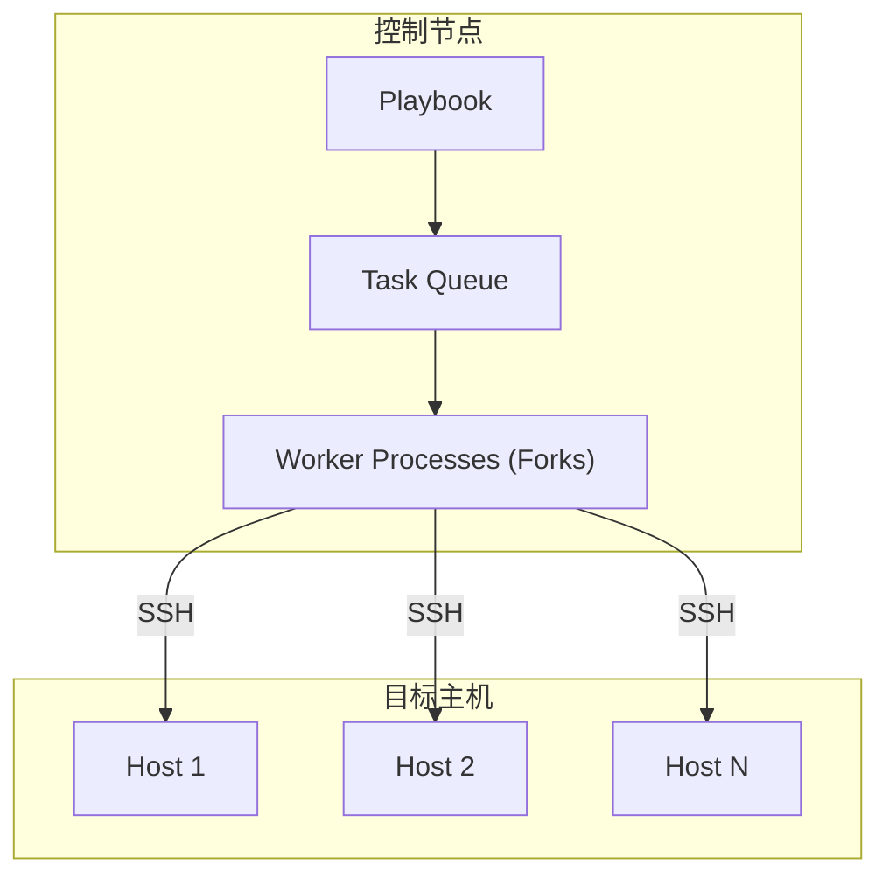
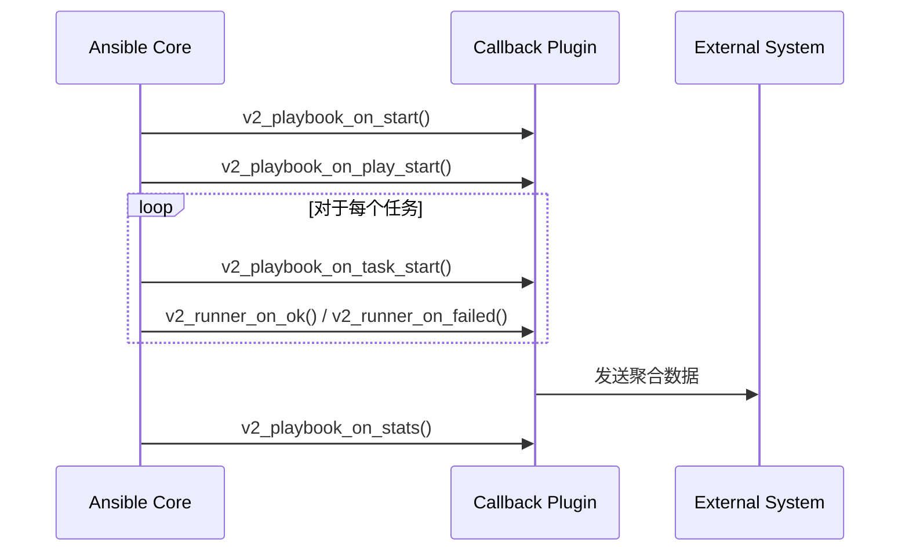
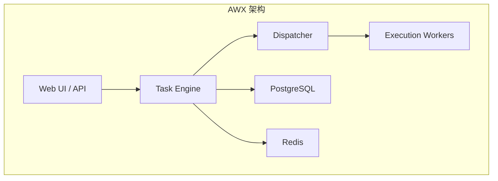

## 1. 执行引擎性能优化

当主机数量超过 100 台时, 控制节点的 CPU, 内存和网络带宽将成为显著瓶颈. 理解 Ansible 的执行模型是优化的前提.

### 1.1 Ansible 执行架构



### 1.2 Forks 并行度

`forks` 参数决定同时处理的主机数量, 每个 Fork 是一个独立的 Python 子进程.

```ini
# ansible.cfg
[defaults]
forks = 50
```

**内存模型分析**:

| 组件 | 典型内存占用 |
|------|--------------|
| Ansible 主进程 | ~50-100 MB |
| 每个 Fork 子进程 | ~30-50 MB |
| 每个 SSH 连接 | ~5-10 MB |

**计算公式**:
```
总内存 ≈ 主进程 + (Forks × 单进程内存) + (活跃连接 × 连接内存)
例: 50 Forks ≈ 100 + (50 × 40) + (50 × 7) ≈ 2.5 GB
```

**配置原则**:
- 控制节点 CPU 核心数 × 2-3 为合理起点
- 网络带宽也是限制因素 (每主机约 1-5 Mbps)
- 使用 `--forks` 命令行参数可临时覆盖

### 1.3 SSH 优化: ControlPersist 与 Pipelining

#### ControlPersist (连接复用)

默认情况下, 每个任务都会建立新的 SSH 连接. ControlPersist 允许复用已建立的连接:

```ini
# ansible.cfg
[ssh_connection]
ssh_args = -o ControlMaster=auto -o ControlPersist=60s
control_path = /tmp/ansible-ssh-%%h-%%p-%%r
```

| 参数 | 作用 |
|------|------|
| `ControlMaster=auto` | 自动创建主连接 |
| `ControlPersist=60s` | 主连接空闲 60 秒后关闭 |
| `control_path` | Socket 文件路径 (%%h=主机, %%p=端口, %%r=用户) |

**效果**: 对同一主机的多个任务共享一个 SSH 连接, 减少 TCP 握手和认证开销.

#### Pipelining (管道模式)

默认执行流程:
1. 创建远程临时目录
2. 上传模块脚本
3. 执行模块
4. 删除临时文件

启用 Pipelining 后:
1. 通过 SSH 管道直接将模块注入 Python 解释器执行

```ini
[ssh_connection]
pipelining = True
```

**限制**: 目标主机的 `/etc/sudoers` 必须禁用 `requiretty`:
```
# /etc/sudoers
Defaults    !requiretty
```

**性能提升**: 可减少 40-60% 的 SSH 往返次数.

### 1.4 执行策略 (Strategies)

策略决定任务在主机间的执行顺序:

| 策略 | 行为 | 适用场景 |
|------|------|----------|
| **linear** (默认) | 所有主机完成 Task 1 后才开始 Task 2 | 有依赖的任务序列 |
| **free** | 各主机独立执行, 互不等待 | 独立任务, 最大化并行 |
| **host_pinned** | 先完成单主机所有任务再换下一台 | 减少上下文切换 |
| **debug** | 交互式调试 | 开发调试 |

```yaml
- hosts: all
  strategy: free
  tasks:
    - name: 独立任务
      package:
        name: nginx
        state: present
```

**Free 策略注意事项**:
- 任务间不能有依赖关系
- 输出可能交错, 难以阅读
- 适合大规模软件包安装等独立操作

---

## 2. Fact 缓存与智能收集

### 2.1 Fact 收集开销

`gather_facts: yes` (默认) 会在每个主机上执行 `setup` 模块, 收集系统信息. 这个过程可能耗时 5-30 秒.

**优化策略**:

| 方法 | 配置 | 效果 |
|------|------|------|
| 禁用收集 | `gather_facts: no` | 完全跳过, 需手动获取所需信息 |
| 智能收集 | `gather_subset: min` | 仅收集最小信息集 |
| 缓存 | `fact_caching = jsonfile` | 首次收集后缓存, 后续复用 |

### 2.2 Fact 缓存后端

```ini
# ansible.cfg
[defaults]
gathering = smart
fact_caching = jsonfile
fact_caching_connection = /tmp/ansible_facts
fact_caching_timeout = 86400
```

| 后端 | 配置 | 特点 |
|------|------|------|
| **jsonfile** | 本地 JSON 文件 | 简单, 单机使用 |
| **redis** | Redis 服务器 | 多控制节点共享 |
| **memcached** | Memcached | 高性能, 无持久化 |
| **yaml** | 本地 YAML 文件 | 人类可读 |

**Redis 配置示例**:
```ini
fact_caching = redis
fact_caching_connection = redis://localhost:6379/0
fact_caching_timeout = 3600
```

### 2.3 智能 Gather Subset

```yaml
- hosts: all
  gather_facts: yes
  gather_subset:
    - network
    - hardware
    - "!facter"  # 排除 facter
```

常用 subset:
- `min`: 最小集 (ansible_*, 发行版信息)
- `network`: 网络接口
- `hardware`: CPU, 内存, 磁盘
- `virtual`: 虚拟化信息
- `all`: 全部 (默认)

---

## 3. 异步执行 (Async & Poll)

对于耗时任务 (数据库恢复, 大文件传输, OS 升级), SSH 连接可能超时断开.

### 3.1 基本用法

```yaml
- name: 长时间运行的任务
  command: /usr/bin/long_running_script.sh
  async: 3600    # 最大运行时间 (秒)
  poll: 10       # 轮询间隔 (秒)
```

| 参数 | 作用 |
|------|------|
| `async` | 任务允许的最大运行时间 |
| `poll: N` | 每 N 秒检查一次状态 |
| `poll: 0` | **Fire-and-forget**: 立即返回, 不等待结果 |

### 3.2 Fire-and-Forget 模式

```yaml
- name: 启动后台任务
  command: /usr/bin/backup.sh
  async: 7200
  poll: 0
  register: backup_job

- name: 继续执行其他任务
  debug:
    msg: "备份已在后台运行"

- name: 稍后检查状态
  async_status:
    jid: "{{ backup_job.ansible_job_id }}"
  register: job_result
  until: job_result.finished
  retries: 60
  delay: 30
```

**工作原理**:
1. Ansible 在远程主机启动任务并立即返回
2. 任务在远程主机的后台继续运行
3. 状态信息存储在 `~/.ansible_async/<job_id>`
4. `async_status` 模块可查询完成状态

---

## 4. 插件系统深度解析

Ansible 的灵活性来自其模块化的插件架构.

### 4.1 插件类型总览

| 插件类型 | 执行位置 | 作用 |
|----------|----------|------|
| **Callback** | 控制节点 | 拦截事件, 自定义输出, 集成外部系统 |
| **Lookup** | 控制节点 | 从外部源获取数据 |
| **Filter** | 控制节点 | Jinja2 数据转换 |
| **Connection** | 控制节点 | 定义连接协议 (SSH, WinRM) |
| **Inventory** | 控制节点 | 动态生成主机清单 |
| **Action** | 控制节点 | 拦截并修改模块执行 |
| **Module** | 目标主机 | 执行具体任务 |

### 4.2 Callback 插件内部机制

Callback 插件可以拦截 Ansible 执行过程中的所有事件:



#### 核心回调方法

| 方法 | 触发时机 |
|------|----------|
| `v2_playbook_on_start` | Playbook 开始执行 |
| `v2_playbook_on_play_start` | Play 开始 |
| `v2_playbook_on_task_start` | Task 开始 |
| `v2_runner_on_ok` | Task 成功完成 |
| `v2_runner_on_failed` | Task 失败 |
| `v2_runner_on_skipped` | Task 跳过 |
| `v2_runner_on_unreachable` | 主机不可达 |
| `v2_playbook_on_stats` | Playbook 结束, 输出统计 |

#### 自定义 Callback 示例

```python
# callback_plugins/slack_notify.py
from ansible.plugins.callback import CallbackBase
import requests

class CallbackModule(CallbackBase):
    CALLBACK_VERSION = 2.0
    CALLBACK_TYPE = 'notification'
    CALLBACK_NAME = 'slack_notify'
    
    def __init__(self):
        super().__init__()
        self.failed_hosts = []
    
    def v2_runner_on_failed(self, result, ignore_errors=False):
        if not ignore_errors:
            self.failed_hosts.append(result._host.get_name())
    
    def v2_playbook_on_stats(self, stats):
        if self.failed_hosts:
            self._send_slack_alert(self.failed_hosts)
    
    def _send_slack_alert(self, hosts):
        webhook_url = "https://hooks.slack.com/..."
        payload = {"text": f"Ansible 失败: {', '.join(hosts)}"}
        requests.post(webhook_url, json=payload)
```

### 4.3 PII 脱敏实现

在合规环境中, 日志不能包含敏感信息:

```python
import re

class CallbackModule(CallbackBase):
    SENSITIVE_PATTERNS = [
        r'password["\']?\s*[:=]\s*["\']?[^"\'}\s]+',
        r'-----BEGIN[A-Z ]+-----[\s\S]+?-----END[A-Z ]+-----',
        r'api[_-]?key["\']?\s*[:=]\s*["\']?[A-Za-z0-9]{20,}',
    ]
    
    def _sanitize(self, data):
        if isinstance(data, dict):
            return {k: self._sanitize(v) for k, v in data.items()}
        elif isinstance(data, str):
            for pattern in self.SENSITIVE_PATTERNS:
                data = re.sub(pattern, '[REDACTED]', data, flags=re.IGNORECASE)
            return data
        return data
    
    def v2_runner_on_ok(self, result):
        sanitized = self._sanitize(result._result)
        # 发送 sanitized 数据到日志系统
```

### 4.4 Lookup 插件

从外部数据源动态获取值:

```yaml
- name: 从 Vault 获取密码
  debug:
    msg: "{{ lookup('hashi_vault', 'secret/data/db:password') }}"

- name: 读取文件内容
  debug:
    msg: "{{ lookup('file', '/path/to/file') }}"

- name: 查询环境变量
  debug:
    msg: "{{ lookup('env', 'HOME') }}"
```

常用 Lookup 插件:
- `file`: 读取本地文件
- `env`: 环境变量
- `password`: 生成或读取密码
- `hashi_vault`: HashiCorp Vault
- `aws_ssm`: AWS Parameter Store
- `redis`: Redis 键值

---

## 5. 性能分析与瓶颈定位

在大规模环境中, 识别性能瓶颈需要可观测性工具. Ansible 提供了多种内置机制用于执行分析.

### 5.1 Callback 插件: 执行时间分析

**`profile_tasks`**: 显示每个任务的执行时间:

```ini
# ansible.cfg
[defaults]
callbacks_enabled = profile_tasks, timer
callback_whitelist = profile_tasks, timer
```

**输出示例**:

```
PLAY RECAP ******************************************************
Friday 17 January 2025  10:23:45 +0000 (0:00:05.123)    0:02:34.567 ******
===============================================================================
Install packages ------------------------------------------ 45.23s
Deploy configuration -------------------------------------- 12.45s
Restart service -------------------------------------------- 5.12s
Gathering Facts -------------------------------------------- 3.21s
```

**`profile_roles`**: 按 Role 聚合时间统计:

```ini
callbacks_enabled = profile_tasks, profile_roles, timer
```

### 5.2 详细调试输出

```bash
# 显示详细执行信息
ansible-playbook site.yml -vvv

# 显示 SSH 连接详情
ansible-playbook site.yml -vvvv

# 仅对特定任务启用调试
ansible-playbook site.yml -v --start-at-task="Deploy configuration"
```

### 5.3 执行时间分析脚本

```python
#!/usr/bin/env python3
# analyze_timing.py - 分析 Ansible JSON 日志

import json
import sys
from collections import defaultdict

def analyze_log(log_file):
    with open(log_file) as f:
        data = json.load(f)
    
    task_times = defaultdict(list)
    host_times = defaultdict(float)
    
    for play in data.get('plays', []):
        for task in play.get('tasks', []):
            task_name = task.get('task', {}).get('name', 'Unknown')
            for host, result in task.get('hosts', {}).items():
                duration = result.get('duration', {})
                elapsed = duration.get('end', 0) - duration.get('start', 0)
                task_times[task_name].append(elapsed)
                host_times[host] += elapsed
    
    print("=== Top 10 Slowest Tasks ===")
    sorted_tasks = sorted(
        [(name, sum(times)/len(times)) for name, times in task_times.items()],
        key=lambda x: x[1],
        reverse=True
    )[:10]
    for name, avg_time in sorted_tasks:
        print(f"  {avg_time:.2f}s - {name}")
    
    print("\n=== Slowest Hosts ===")
    sorted_hosts = sorted(host_times.items(), key=lambda x: x[1], reverse=True)[:10]
    for host, total_time in sorted_hosts:
        print(f"  {total_time:.2f}s - {host}")

if __name__ == "__main__":
    analyze_log(sys.argv[1])
```

**启用 JSON 日志**:

```ini
# ansible.cfg
[defaults]
callbacks_enabled = json
log_path = /var/log/ansible/ansible.json
```

### 5.4 内存优化策略

当管理大量主机时, 控制节点的内存消耗会显著增加:

| 优化项 | 配置 | 效果 |
|--------|------|------|
| 减少 Forks | `forks = 20` (降低) | 减少并发进程内存占用 |
| 禁用 Facts 缓存到内存 | 使用 jsonfile 缓存 | Facts 不保留在内存中 |
| 避免大变量 | 使用 `no_log: true` | 减少日志缓冲 |
| 分批执行 | `serial: 50` | 限制每批主机数量 |

**监控控制节点资源**:

```yaml
- name: Monitor controller resources
  local_action:
    module: shell
    cmd: "ps -o rss,vsz,pid,comm -p {{ ansible_pid }} | tail -1"
  register: controller_mem
  run_once: true
  delegate_to: localhost
  tags: [debug]
```

### 5.5 网络瓶颈诊断

```yaml
# 测量到每个主机的 SSH 延迟
- name: Measure SSH latency
  shell: "echo 'latency test'"
  register: latency_test
  changed_when: false

- name: Report slow hosts
  debug:
    msg: "Host {{ inventory_hostname }} response time: {{ latency_test.delta }}"
  when: latency_test.delta | float > 2.0
```

**网络带宽估算**:

```bash
# 模块传输大小 (典型)
# - 小模块 (ping, debug): ~10KB
# - 中等模块 (yum, apt): ~50KB
# - 大模块 (包含复杂逻辑): ~200KB

# 带宽计算
# 500 hosts * 50KB * 10 tasks = 250MB 数据传输
# 在 100Mbps 网络上约需 20 秒
```

---

## 6. 企业级集成平台

### 6.1 AWX / Ansible Automation Platform 架构



#### 核心组件

| 组件 | 职责 |
|------|------|
| **Web** | UI 和 REST API 入口 |
| **Task** | 任务编排和调度 |
| **Dispatcher** | 分发任务到 Workers |
| **Workers** | 执行 Playbook (可水平扩展) |
| **PostgreSQL** | 存储配置, 历史, 凭据 |
| **Redis** | 任务队列和缓存 |

### 6.2 RBAC (基于角色的访问控制)

AWX 提供细粒度的权限控制:

| 对象 | 权限级别 |
|------|----------|
| **Organization** | Admin, Member, Read |
| **Project** | Admin, Use, Update, Read |
| **Inventory** | Admin, Use, Adhoc, Update, Read |
| **Job Template** | Admin, Execute, Read |
| **Credential** | Admin, Use, Read |

**最小权限原则**:
- 开发者: Project Read + Template Execute
- 运维: Inventory Update + Template Execute
- 管理员: Organization Admin

### 6.3 Workflow (工作流 DAG)

```yaml
# 工作流示例: 蓝绿部署
graph TD
    Backup["备份当前环境"] --> Deploy["部署新版本"]
    Deploy --> Test["运行测试"]
    Test --> |成功| Switch["切换流量"]
    Test --> |失败| Rollback["回滚"]
```

工作流特性:
- 支持条件分支 (成功/失败/总是)
- 支持并行执行
- 支持跨项目调用
- 支持审批节点

### 6.4 动态清单集成

#### 云平台清单

```yaml
# inventory/aws_ec2.yml
plugin: amazon.aws.aws_ec2
regions:
  - us-east-1
  - us-west-2
filters:
  tag:Environment: production
keyed_groups:
  - key: tags.Role
    prefix: role
  - key: placement.availability_zone
    prefix: az
```

#### Consul 服务发现

```yaml
# inventory/consul.yml
plugin: community.general.consul
host: consul.example.com
port: 8500
services:
  - web
  - api
  - database
```

---

## 7. 本周实战任务

### 6.1 性能基准测试

1. 使用 `time` 命令对比 `strategy: linear` vs `strategy: free` 的执行时间
2. 在 50 个容器节点上并发安装软件包
3. 启用 pipelining 后对比执行时间

### 6.2 Fact 缓存配置

1. 配置 jsonfile 缓存后端
2. 第一次运行后检查缓存文件
3. 第二次运行观察 fact 收集是否跳过

### 6.3 自定义 Callback 插件

编写 Callback 插件:
1. 统计每个 Play 的总耗时
2. 任务失败时发送告警到内部 API
3. 脱敏处理包含 password 的输出

### 6.4 异步任务链

编写 Playbook:
1. 使用 `async: 600, poll: 0` 启动长时间任务
2. 在后续任务中使用 `async_status` + `until` 等待完成
3. 处理超时场景

---

> 性能优化不是可选项, 而是规模化的必修课. 理解执行引擎的内部机制, 才能在千台主机的场景下游刃有余.
