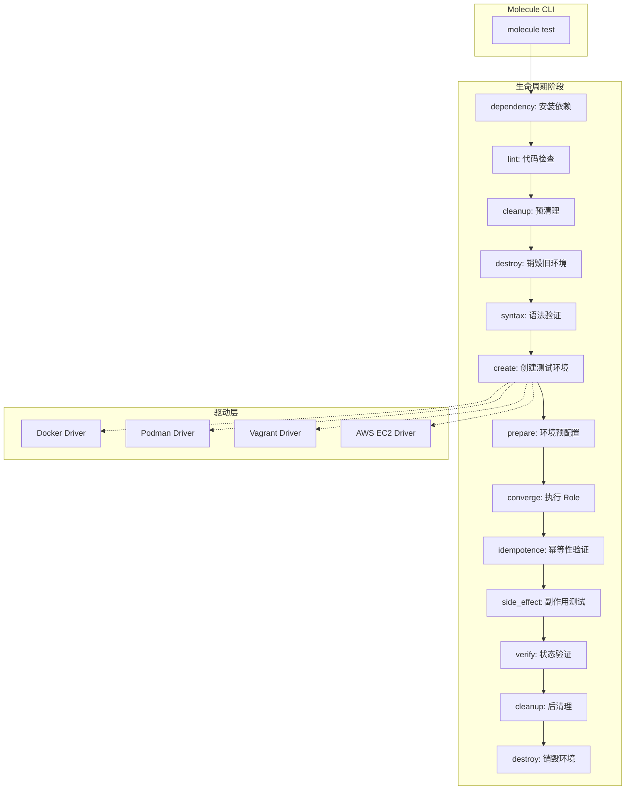
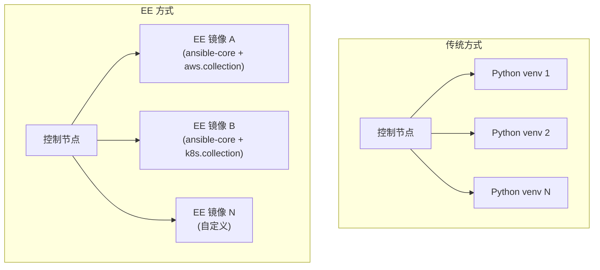
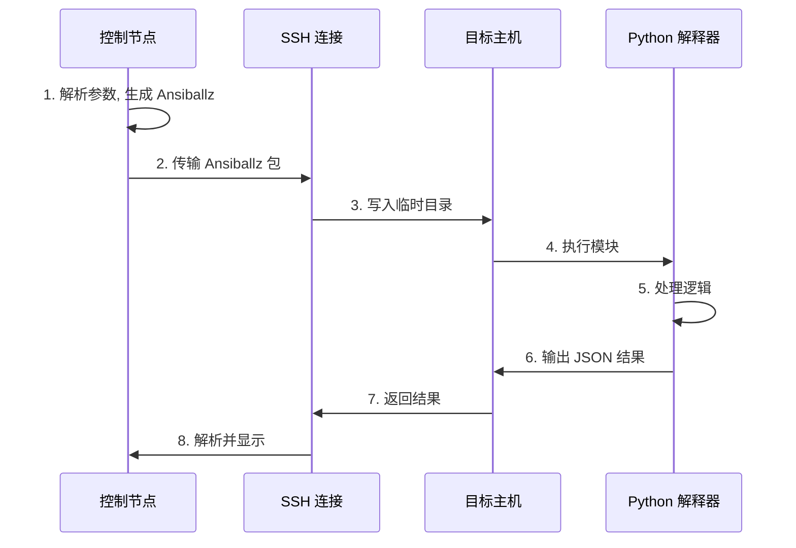

## 1. 基础设施测试: Molecule 框架

随着 IaC (Infrastructure as Code) 的成熟, 基础设施代码必须像应用代码一样经过严格测试. Molecule 是 Ansible 官方推荐的测试框架, 它提供了完整的测试生命周期管理.

### 1.1 Molecule 架构概览



### 1.2 核心概念

| 组件 | 职责 | 常用选项 |
|------|------|----------|
| **Driver** | 管理测试基础设施的驱动 | docker, podman, vagrant, delegated |
| **Platform** | 定义测试目标环境 | 容器镜像, 虚拟机类型 |
| **Provisioner** | 负责执行 Ansible | ansible (默认) |
| **Verifier** | 验证结果的工具 | ansible, testinfra |
| **Scenario** | 测试场景 (可多个) | default, ha, upgrade |

### 1.3 初始化与目录结构

```bash
# 安装 Molecule 及 Docker 驱动
pip install molecule molecule-plugins[docker]

# 在现有 Role 中初始化 Molecule
cd roles/nginx
molecule init scenario --driver-name docker

# 生成的目录结构
roles/nginx/
├── molecule/
│   └── default/
│       ├── converge.yml      # 执行 Role 的 Playbook
│       ├── molecule.yml      # 场景配置
│       ├── prepare.yml       # 环境预配置 (可选)
│       ├── verify.yml        # 验证 Playbook
│       └── cleanup.yml       # 清理 Playbook (可选)
├── tasks/
├── defaults/
└── ...
```

### 1.4 配置文件深度解析: `molecule.yml`

```yaml
# molecule/default/molecule.yml
---
dependency:
  name: galaxy
  options:
    requirements-file: requirements.yml
    role-file: requirements.yml

driver:
  name: docker

platforms:
  # 多平台矩阵测试
  - name: centos-stream-9
    image: quay.io/centos/centos:stream9
    pre_build_image: true
    command: /usr/sbin/init
    privileged: true
    volumes:
      - /sys/fs/cgroup:/sys/fs/cgroup:rw
    cgroupns_mode: host
    
  - name: ubuntu2204
    image: geerlingguy/docker-ubuntu2204-ansible
    pre_build_image: true
    
  - name: debian12
    image: geerlingguy/docker-debian12-ansible
    pre_build_image: true

provisioner:
  name: ansible
  playbooks:
    prepare: prepare.yml
    converge: converge.yml
    verify: verify.yml
  inventory:
    host_vars:
      centos-stream-9:
        ansible_python_interpreter: /usr/bin/python3
      ubuntu2204:
        ansible_python_interpreter: /usr/bin/python3
  config_options:
    defaults:
      callbacks_enabled: profile_tasks, timer
      gathering: smart
      fact_caching: jsonfile
      fact_caching_connection: /tmp/molecule_facts
    ssh_connection:
      pipelining: true

verifier:
  name: ansible
  # 或使用 testinfra
  # name: testinfra
  # options:
  #   v: true

scenario:
  name: default
  test_sequence:
    - dependency
    - cleanup
    - destroy
    - syntax
    - create
    - prepare
    - converge
    - idempotence
    - side_effect
    - verify
    - cleanup
    - destroy
```

### 1.5 Converge Playbook: 执行 Role

```yaml
# molecule/default/converge.yml
---
- name: Converge
  hosts: all
  become: true
  
  vars:
    # 测试专用变量覆盖
    nginx_http_port: 8080
    nginx_worker_processes: 2
    nginx_vhosts:
      - server_name: test.local
        root: /var/www/test
  
  pre_tasks:
    - name: Update apt cache (Debian)
      apt:
        update_cache: yes
        cache_valid_time: 3600
      when: ansible_os_family == 'Debian'
  
  roles:
    - role: "{{ lookup('env', 'MOLECULE_PROJECT_DIRECTORY') | basename }}"
```

### 1.6 验证策略: Ansible Verifier vs Testinfra

#### 方式 1: Ansible Verifier (推荐入门)

使用 Ansible 原生模块进行验证, 门槛低:

```yaml
# molecule/default/verify.yml
---
- name: Verify
  hosts: all
  become: true
  gather_facts: true
  
  tasks:
    - name: Gather package facts
      package_facts:
        manager: auto
      
    - name: Assert nginx is installed
      assert:
        that:
          - "'nginx' in ansible_facts.packages"
        fail_msg: "NGINX package is not installed"
        success_msg: "NGINX package is installed"
    
    - name: Gather service facts
      service_facts:
    
    - name: Assert nginx service is running
      assert:
        that:
          - ansible_facts.services['nginx.service'].state == 'running'
          - ansible_facts.services['nginx.service'].status == 'enabled'
        fail_msg: "NGINX service is not running or enabled"
    
    - name: Check nginx is listening on port 8080
      wait_for:
        port: 8080
        state: started
        timeout: 10
    
    - name: Verify nginx responds to HTTP request
      uri:
        url: http://localhost:8080/
        status_code: [200, 301, 302, 403, 404]
      register: http_result
    
    - name: Assert HTTP response is successful
      assert:
        that:
          - http_result.status in [200, 301, 302, 403, 404]
    
    - name: Check configuration file syntax
      command: nginx -t
      register: nginx_test
      changed_when: false
    
    - name: Assert configuration is valid
      assert:
        that:
          - nginx_test.rc == 0
```

#### 方式 2: Testinfra (适合复杂验证)

使用 Python pytest 进行验证, 功能更强大:

```python
# molecule/default/tests/test_default.py
import pytest


def test_nginx_package_installed(host):
    """验证 NGINX 包已安装"""
    pkg = host.package("nginx")
    assert pkg.is_installed


def test_nginx_service_running(host):
    """验证 NGINX 服务正在运行"""
    svc = host.service("nginx")
    assert svc.is_running
    assert svc.is_enabled


def test_nginx_listening_on_port(host):
    """验证 NGINX 监听指定端口"""
    socket = host.socket("tcp://0.0.0.0:8080")
    assert socket.is_listening


def test_nginx_config_valid(host):
    """验证 NGINX 配置有效"""
    cmd = host.run("nginx -t")
    assert cmd.rc == 0
    assert "syntax is ok" in cmd.stderr


def test_nginx_config_file_exists(host):
    """验证配置文件存在且权限正确"""
    cfg = host.file("/etc/nginx/nginx.conf")
    assert cfg.exists
    assert cfg.is_file
    assert cfg.user == "root"
    assert cfg.group == "root"
    assert cfg.mode == 0o644


def test_vhost_config_exists(host):
    """验证虚拟主机配置存在"""
    vhost = host.file("/etc/nginx/sites-enabled/test.local.conf")
    assert vhost.exists
    assert vhost.is_symlink


@pytest.mark.parametrize("path,owner,mode", [
    ("/var/www/test", "www-data", 0o755),
    ("/var/log/nginx", "www-data", 0o755),
])
def test_directories_exist(host, path, owner, mode):
    """参数化测试: 验证目录存在且权限正确"""
    d = host.file(path)
    assert d.exists
    assert d.is_directory
    # 仅在 Debian 系列检查 owner
    if host.system_info.distribution in ['ubuntu', 'debian']:
        assert d.user == owner
    assert d.mode == mode
```

### 1.7 幂等性测试原理

Molecule 的 `idempotence` 阶段会自动执行以下逻辑:

1. 执行 converge (如果尚未执行)
2. 再次执行 converge
3. 检查第二次执行是否有任何 `changed` 状态

```python
# Molecule 内部逻辑伪代码
def test_idempotence():
    result = run_playbook("converge.yml")
    if any(task.status == "changed" for task in result.tasks):
        fail("Idempotence test failed - tasks reported changed on second run")
```

**常见幂等性失败原因**:
- 使用 `shell` 或 `command` 未设置 `changed_when: false`
- Template 文件中使用时间戳或随机值
- Handler 每次都被触发

### 1.8 多场景测试

一个 Role 可以有多个测试场景:

```bash
# 创建额外场景
molecule init scenario --scenario-name ha --driver-name docker

# 目录结构
molecule/
├── default/              # 基础功能测试
│   └── molecule.yml
├── ha/                   # 高可用场景测试
│   └── molecule.yml
└── upgrade/              # 升级场景测试
    └── molecule.yml
```

```bash
# 运行指定场景
molecule test --scenario-name ha

# 运行所有场景
molecule test --all
```

---

## 2. 云原生运行时: Execution Environments (EE)

传统的 Ansible 依赖复杂的 Python 环境, 在多团队协作或 AWX 环境中容易导致 "Dependency Hell". EE 是解决此问题的现代化方案.

### 2.1 EE 架构概览



### 2.2 EE 的组成

一个 EE 镜像包含以下层次:

| 层次 | 内容 | 来源 |
|------|------|------|
| **Base Image** | 操作系统 (通常是 UBI/Alpine) | 基础镜像 |
| **System Packages** | rpm/deb 包 (如 git, gcc, openssl) | `bindep.txt` |
| **Python Packages** | pip 依赖 (如 boto3, kubernetes) | `requirements.txt` |
| **Ansible Collections** | ansible-core + collections | `requirements.yml` |
| **Custom Scripts** | 额外配置脚本 | `additional_build_steps` |

### 2.3 配置文件: `execution-environment.yml`

```yaml
# execution-environment.yml
---
version: 3

# 基础镜像 (支持 UBI, Alpine, 自定义)
images:
  base_image:
    name: quay.io/ansible/ansible-runner:latest
  # 或使用 EE 基础镜像
  # base_image:
  #   name: quay.io/ansible/awx-ee:latest

options:
  package_manager_path: /usr/bin/microdnf
  # 或 /usr/bin/dnf, /usr/bin/apt-get

dependencies:
  # Python 依赖
  python: requirements.txt
  
  # 系统包依赖 (bindep 格式)
  system: bindep.txt
  
  # Ansible Collections
  galaxy: requirements.yml

additional_build_files:
  # 添加自定义文件到构建上下文
  - src: files/custom-ca.crt
    dest: certs

additional_build_steps:
  # 在 galaxy 安装后执行
  prepend_galaxy:
    - RUN echo "Before galaxy install"
  
  # 在所有依赖安装后执行
  append_final:
    - COPY _build/certs/custom-ca.crt /etc/pki/ca-trust/source/anchors/
    - RUN update-ca-trust
    - RUN chmod +x /usr/local/bin/*
```

### 2.4 依赖文件示例

**`requirements.txt`** (Python 依赖):

```txt
# AWS SDK
boto3>=1.26.0
botocore>=1.29.0

# Kubernetes
kubernetes>=25.0.0

# Database clients
psycopg2-binary>=2.9.0
pymysql>=1.0.0

# Cryptography
cryptography>=40.0.0

# HTTP clients
requests>=2.28.0
urllib3>=1.26.0

# JMESPath for json_query
jmespath>=1.0.0
```

**`bindep.txt`** (系统依赖):

```txt
# 编译工具
gcc [compile platform:centos-8 platform:centos-stream-8 platform:centos-stream-9]
python3-devel [compile platform:centos-8 platform:centos-stream-8 platform:centos-stream-9]
libffi-devel [compile platform:centos-8 platform:centos-stream-8 platform:centos-stream-9]

# SSL 支持
openssl-devel [platform:centos-8 platform:centos-stream-8 platform:centos-stream-9]
libssl-dev [platform:dpkg]

# Git (用于 git+ 格式的 requirements)
git [platform:centos-8 platform:centos-stream-8 platform:centos-stream-9 platform:dpkg]

# PostgreSQL 客户端库
postgresql-devel [platform:centos-8 platform:centos-stream-8 platform:centos-stream-9]
libpq-dev [platform:dpkg]

# Kerberos (用于 Windows 模块)
krb5-devel [platform:centos-8 platform:centos-stream-8 platform:centos-stream-9]
libkrb5-dev [platform:dpkg]
```

**`requirements.yml`** (Ansible Collections):

```yaml
---
collections:
  # AWS
  - name: amazon.aws
    version: ">=6.0.0"
  
  # Kubernetes
  - name: kubernetes.core
    version: ">=2.4.0"
  
  # 通用工具
  - name: ansible.utils
    version: ">=2.10.0"
  - name: community.general
    version: ">=7.0.0"
  
  # 数据库
  - name: community.postgresql
    version: ">=3.0.0"
  - name: community.mysql
    version: ">=3.0.0"
  
  # 网络自动化
  - name: ansible.netcommon
    version: ">=5.0.0"
  
  # 私有 Collection
  - name: my_org.infra_utils
    source: https://galaxy.example.com/
    version: ">=1.2.0"
```

### 2.5 构建流程: `ansible-builder`

```bash
# 安装 ansible-builder
pip install ansible-builder

# 构建 EE 镜像
ansible-builder build \
  --tag my-org-ee:1.0.0 \
  --container-runtime docker \
  --verbosity 3

# 构建输出结构
context/
├── _build/
│   ├── requirements.txt
│   ├── requirements.yml
│   └── bindep.txt
└── Containerfile  # 或 Dockerfile
```

**生成的 Containerfile**:

```dockerfile
ARG EE_BASE_IMAGE=quay.io/ansible/ansible-runner:latest
ARG PYCMD="/usr/bin/python3"
ARG PKGMGR="/usr/bin/microdnf"
ARG PYPKG="python3"
ARG ANSIBLE_GALAXY_CLI_COLLECTION_OPTS=""
ARG ANSIBLE_GALAXY_CLI_ROLE_OPTS=""
ARG ANSIBLE_INSTALL_REFS="ansible-core"

FROM $EE_BASE_IMAGE as galaxy
ARG ANSIBLE_GALAXY_CLI_COLLECTION_OPTS
ARG ANSIBLE_GALAXY_CLI_ROLE_OPTS
COPY _build/requirements.yml /tmp/requirements.yml
RUN ansible-galaxy role install $ANSIBLE_GALAXY_CLI_ROLE_OPTS -r /tmp/requirements.yml --roles-path /usr/share/ansible/roles
RUN ansible-galaxy collection install $ANSIBLE_GALAXY_CLI_COLLECTION_OPTS -r /tmp/requirements.yml --collections-path /usr/share/ansible/collections

FROM $EE_BASE_IMAGE as builder
# ... bindep 和 pip 安装 ...

FROM $EE_BASE_IMAGE as final
COPY --from=galaxy /usr/share/ansible /usr/share/ansible
COPY --from=builder /output/ /output/
RUN /output/install-from-bindep && rm -rf /output/wheels
```

### 2.6 镜像大小优化策略

| 策略 | 方法 | 效果 |
|------|------|------|
| **多阶段构建** | 编译依赖仅在 builder 阶段 | 减少 30-50% |
| **精简基础镜像** | 使用 `ansible-runner` 而非 `python:3.11` | 减少 20-30% |
| **选择性安装** | 仅安装必需的 Collections | 减少 50%+ |
| **清理缓存** | `pip cache purge && microdnf clean all` | 减少 10-20% |

```yaml
# 优化后的配置
additional_build_steps:
  append_final:
    - RUN pip cache purge
    - RUN microdnf clean all
    - RUN rm -rf /root/.cache /tmp/*
```

### 2.7 使用 EE: `ansible-navigator`

```bash
# 安装 ansible-navigator
pip install ansible-navigator

# 使用 EE 执行 Playbook
ansible-navigator run site.yml \
  --execution-environment-image my-org-ee:1.0.0 \
  --mode stdout

# 交互式 TUI 模式
ansible-navigator run site.yml \
  --execution-environment-image my-org-ee:1.0.0 \
  --mode interactive
```

**`ansible-navigator.yml` 配置文件**:

```yaml
# ansible-navigator.yml
---
ansible-navigator:
  execution-environment:
    container-engine: docker
    enabled: true
    image: my-org-ee:1.0.0
    pull:
      policy: missing
    volume-mounts:
      - src: ~/.ssh
        dest: /home/runner/.ssh
        options: ro
      - src: /etc/ssl/certs
        dest: /etc/ssl/certs
        options: ro
    environment-variables:
      set:
        AWS_PROFILE: production
        
  logging:
    level: debug
    file: /tmp/ansible-navigator.log
    
  playbook-artifact:
    enable: true
    save-as: "{playbook_name}-artifact-{time_stamp}.json"
```

---

## 3. 核心扩展: 自定义 Python 模块

当现有的 3000+ 模块无法满足需求, 或需要与内部复杂 API 进行交互时, 编写自定义模块是必修课.

### 3.1 模块执行原理



### 3.2 模块基础结构

```python
#!/usr/bin/python
# -*- coding: utf-8 -*-

# GNU General Public License v3.0+
# ANSIBLE METADATA (可选但推荐)

DOCUMENTATION = r'''
---
module: my_api_client

short_description: Interact with internal REST API

version_added: "1.0.0"

description:
    - This module provides an interface to the internal REST API.
    - It supports CRUD operations on resources.

options:
    endpoint:
        description:
            - The API endpoint URL.
        required: true
        type: str
    resource_id:
        description:
            - The ID of the resource to manage.
        required: false
        type: str
    state:
        description:
            - Desired state of the resource.
        required: false
        type: str
        choices: ['present', 'absent']
        default: 'present'
    data:
        description:
            - Resource data as a dictionary.
        required: false
        type: dict

author:
    - Your Name (@github_handle)
'''

EXAMPLES = r'''
- name: Create a resource
  my_api_client:
    endpoint: https://api.example.com/v1
    state: present
    data:
      name: my-resource
      type: compute

- name: Delete a resource
  my_api_client:
    endpoint: https://api.example.com/v1
    resource_id: res-12345
    state: absent
'''

RETURN = r'''
resource:
    description: The created or updated resource object.
    type: dict
    returned: when state is present
    sample:
        id: res-12345
        name: my-resource
        status: active
changed:
    description: Whether any changes were made.
    type: bool
    returned: always
'''

from ansible.module_utils.basic import AnsibleModule
import json

try:
    import requests
    HAS_REQUESTS = True
except ImportError:
    HAS_REQUESTS = False


def get_resource(module, endpoint, resource_id, headers):
    """获取资源当前状态"""
    url = f"{endpoint}/resources/{resource_id}"
    try:
        response = requests.get(url, headers=headers, timeout=30)
        if response.status_code == 404:
            return None
        response.raise_for_status()
        return response.json()
    except requests.RequestException as e:
        module.fail_json(msg=f"Failed to get resource: {str(e)}")


def create_resource(module, endpoint, data, headers):
    """创建资源"""
    url = f"{endpoint}/resources"
    try:
        response = requests.post(url, json=data, headers=headers, timeout=30)
        response.raise_for_status()
        return response.json()
    except requests.RequestException as e:
        module.fail_json(msg=f"Failed to create resource: {str(e)}")


def update_resource(module, endpoint, resource_id, data, headers):
    """更新资源"""
    url = f"{endpoint}/resources/{resource_id}"
    try:
        response = requests.put(url, json=data, headers=headers, timeout=30)
        response.raise_for_status()
        return response.json()
    except requests.RequestException as e:
        module.fail_json(msg=f"Failed to update resource: {str(e)}")


def delete_resource(module, endpoint, resource_id, headers):
    """删除资源"""
    url = f"{endpoint}/resources/{resource_id}"
    try:
        response = requests.delete(url, headers=headers, timeout=30)
        if response.status_code == 404:
            return False  # 已不存在
        response.raise_for_status()
        return True
    except requests.RequestException as e:
        module.fail_json(msg=f"Failed to delete resource: {str(e)}")


def resources_equal(current, desired):
    """比较资源是否相同 (用于幂等性判断)"""
    # 忽略系统生成的字段
    ignore_keys = {'id', 'created_at', 'updated_at', 'status'}
    current_filtered = {k: v for k, v in current.items() if k not in ignore_keys}
    desired_filtered = {k: v for k, v in desired.items() if k not in ignore_keys}
    return current_filtered == desired_filtered


def run_module():
    # 定义模块参数
    module_args = dict(
        endpoint=dict(type='str', required=True),
        resource_id=dict(type='str', required=False, default=None),
        state=dict(type='str', choices=['present', 'absent'], default='present'),
        data=dict(type='dict', required=False, default=None),
        api_token=dict(type='str', required=False, no_log=True),
    )

    # 初始化返回结果
    result = dict(
        changed=False,
        resource=None,
        diff=dict(before=None, after=None),
    )

    # 创建模块实例
    module = AnsibleModule(
        argument_spec=module_args,
        supports_check_mode=True,
        required_if=[
            ('state', 'present', ['data']),
            ('state', 'absent', ['resource_id']),
        ],
    )

    # 检查依赖
    if not HAS_REQUESTS:
        module.fail_json(msg="The 'requests' library is required. Install with: pip install requests")

    # 提取参数
    endpoint = module.params['endpoint'].rstrip('/')
    resource_id = module.params['resource_id']
    state = module.params['state']
    data = module.params['data']
    api_token = module.params['api_token']

    headers = {'Content-Type': 'application/json'}
    if api_token:
        headers['Authorization'] = f'Bearer {api_token}'

    # 处理 state: absent
    if state == 'absent':
        current = get_resource(module, endpoint, resource_id, headers)
        
        if current is None:
            # 资源已不存在, 无需操作
            result['changed'] = False
        else:
            result['diff']['before'] = current
            result['diff']['after'] = None
            
            if module.check_mode:
                result['changed'] = True
            else:
                delete_resource(module, endpoint, resource_id, headers)
                result['changed'] = True
        
        module.exit_json(**result)

    # 处理 state: present
    if state == 'present':
        current = None
        if resource_id:
            current = get_resource(module, endpoint, resource_id, headers)

        if current is None:
            # 资源不存在, 需要创建
            result['diff']['before'] = None
            result['diff']['after'] = data
            
            if module.check_mode:
                result['changed'] = True
                result['resource'] = data
            else:
                created = create_resource(module, endpoint, data, headers)
                result['changed'] = True
                result['resource'] = created
        else:
            # 资源存在, 检查是否需要更新
            if resources_equal(current, data):
                # 无需变更
                result['changed'] = False
                result['resource'] = current
            else:
                # 需要更新
                result['diff']['before'] = current
                result['diff']['after'] = data
                
                if module.check_mode:
                    result['changed'] = True
                    result['resource'] = {**current, **data}
                else:
                    updated = update_resource(module, endpoint, resource_id, data, headers)
                    result['changed'] = True
                    result['resource'] = updated
        
        module.exit_json(**result)


def main():
    run_module()


if __name__ == '__main__':
    main()
```

### 3.3 关键 API 说明

| API | 用途 | 示例 |
|-----|------|------|
| `AnsibleModule()` | 初始化模块 | 参数解析, check_mode 支持 |
| `module.params` | 访问参数 | `module.params['state']` |
| `module.check_mode` | 检查是否为 --check 模式 | `if module.check_mode: ...` |
| `module.exit_json()` | 成功退出 | `module.exit_json(changed=True, result=...)` |
| `module.fail_json()` | 失败退出 | `module.fail_json(msg="Error occurred")` |
| `module.warn()` | 输出警告 | `module.warn("Deprecated option used")` |
| `no_log=True` | 敏感参数不记录日志 | `password=dict(type='str', no_log=True)` |

### 3.4 Check Mode 实现模式

```python
# 模式 1: 提前返回
if module.check_mode:
    result['changed'] = would_change
    module.exit_json(**result)

# 模式 2: 条件执行
if not module.check_mode:
    actual_result = perform_action()
    result['resource'] = actual_result
result['changed'] = True
```

### 3.5 Diff 输出支持

为支持 `--diff` 模式, 需要在结果中包含 `diff` 字段:

```python
result = dict(
    changed=True,
    diff=dict(
        before="old_content\n",
        after="new_content\n",
        # 或者使用结构化格式
        before_header=f"/etc/app/config.ini (content)",
        after_header=f"/etc/app/config.ini (content)",
    )
)
```

### 3.6 模块放置位置

```
# 项目级别 (推荐用于自定义模块)
playbooks/
├── library/
│   └── my_api_client.py
└── site.yml

# Role 级别
roles/myapp/
├── library/
│   └── my_api_client.py
└── tasks/

# Collection 级别
my_org/infra_utils/
└── plugins/
    └── modules/
        └── my_api_client.py
```

---

## 4. 持续集成流水线 (CI/CD)

将 Ansible 集成到 DevOps 流水线中是工程化的最后一步.

### 4.1 质量门禁

| 阶段 | 工具 | 作用 |
|------|------|------|
| **Syntax** | `ansible-playbook --syntax-check` | 基础语法验证 |
| **Lint** | `ansible-lint` | 最佳实践检查 |
| **Unit Test** | `molecule test` | 功能验证 |
| **Security** | `ansible-lint -p security` | 安全规则检查 |

### 4.2 GitLab CI 完整配置

```yaml
# .gitlab-ci.yml
---
stages:
  - lint
  - test
  - build
  - deploy

variables:
  ANSIBLE_FORCE_COLOR: "true"
  PY_COLORS: "1"
  
image: python:3.11-slim

cache:
  paths:
    - .cache/pip
    - .tox

before_script:
  - pip install --cache-dir .cache/pip ansible ansible-lint molecule molecule-plugins[docker]

# 代码检查
lint:
  stage: lint
  script:
    - ansible --version
    - ansible-lint --version
    - ansible-playbook playbooks/*.yml --syntax-check
    - ansible-lint playbooks/ roles/
  rules:
    - if: $CI_PIPELINE_SOURCE == "merge_request_event"
    - if: $CI_COMMIT_BRANCH == $CI_DEFAULT_BRANCH

# 单元测试 (使用 Docker-in-Docker)
molecule_test:
  stage: test
  image: docker:24-dind
  services:
    - docker:24-dind
  variables:
    DOCKER_HOST: tcp://docker:2375
    DOCKER_TLS_CERTDIR: ""
  before_script:
    - apk add --no-cache python3 py3-pip
    - pip install ansible molecule molecule-plugins[docker]
  script:
    - cd roles/nginx
    - molecule test
  rules:
    - if: $CI_PIPELINE_SOURCE == "merge_request_event"
      changes:
        - roles/**/*

# 构建 EE 镜像
build_ee:
  stage: build
  image: docker:24-dind
  services:
    - docker:24-dind
  variables:
    DOCKER_HOST: tcp://docker:2375
  before_script:
    - apk add --no-cache python3 py3-pip
    - pip install ansible-builder
  script:
    - ansible-builder build --tag $CI_REGISTRY_IMAGE/ee:$CI_COMMIT_SHORT_SHA
    - docker login -u $CI_REGISTRY_USER -p $CI_REGISTRY_PASSWORD $CI_REGISTRY
    - docker push $CI_REGISTRY_IMAGE/ee:$CI_COMMIT_SHORT_SHA
  only:
    - tags

# 部署到 Staging
deploy_staging:
  stage: deploy
  image: $CI_REGISTRY_IMAGE/ee:$CI_COMMIT_SHORT_SHA
  script:
    - ansible-playbook -i inventory/staging playbooks/site.yml --diff
  environment:
    name: staging
  rules:
    - if: $CI_COMMIT_BRANCH == "develop"
  when: manual

# 部署到 Production
deploy_production:
  stage: deploy
  image: $CI_REGISTRY_IMAGE/ee:$CI_COMMIT_SHORT_SHA
  script:
    - ansible-playbook -i inventory/production playbooks/site.yml --diff --check
  environment:
    name: production
  rules:
    - if: $CI_COMMIT_TAG
  when: manual
```

### 4.3 GitHub Actions 集成

```yaml
# .github/workflows/ansible.yml
---
name: Ansible CI

on:
  push:
    branches: [main, develop]
  pull_request:
    branches: [main]

jobs:
  lint:
    runs-on: ubuntu-latest
    steps:
      - uses: actions/checkout@v4
      
      - name: Set up Python
        uses: actions/setup-python@v5
        with:
          python-version: '3.11'
          cache: 'pip'
      
      - name: Install dependencies
        run: pip install ansible ansible-lint yamllint
      
      - name: Run yamllint
        run: yamllint .
      
      - name: Run ansible-lint
        run: ansible-lint playbooks/ roles/
      
      - name: Syntax check
        run: ansible-playbook playbooks/*.yml --syntax-check

  molecule:
    needs: lint
    runs-on: ubuntu-latest
    strategy:
      matrix:
        role:
          - nginx
          - postgresql
          - common-security
    steps:
      - uses: actions/checkout@v4
      
      - name: Set up Python
        uses: actions/setup-python@v5
        with:
          python-version: '3.11'
      
      - name: Install dependencies
        run: pip install ansible molecule molecule-plugins[docker]
      
      - name: Run Molecule tests
        working-directory: roles/${{ matrix.role }}
        run: molecule test

  security:
    runs-on: ubuntu-latest
    steps:
      - uses: actions/checkout@v4
      
      - name: Run Trivy vulnerability scanner
        uses: aquasecurity/trivy-action@master
        with:
          scan-type: 'fs'
          scan-ref: '.'
          format: 'sarif'
          output: 'trivy-results.sarif'
      
      - name: Upload Trivy scan results
        uses: github/codeql-action/upload-sarif@v3
        with:
          sarif_file: 'trivy-results.sarif'
```

### 4.4 测试覆盖率与报告

```yaml
# molecule/default/molecule.yml (添加)
provisioner:
  name: ansible
  config_options:
    defaults:
      callbacks_enabled: profile_tasks, timer, junit
      callback_whitelist: profile_tasks, timer, junit
      
verifier:
  name: testinfra
  options:
    junit-xml: molecule_junit.xml
    cov: roles/nginx
    cov-report: html
```

---

## 5. 本周实战任务

### 5.1 初始化测试环境

为一个现有的 Role 引入 Molecule:

1. 安装依赖: `pip install molecule molecule-plugins[docker]`
2. 初始化场景: `cd roles/nginx && molecule init scenario`
3. 配置多平台: 在 `molecule.yml` 中添加 Ubuntu 和 CentOS 平台
4. 编写 `verify.yml`:
   - 验证包已安装
   - 验证服务运行中
   - 验证端口监听
   - 验证配置语法正确
5. 运行测试: `molecule test`
6. 验证幂等性: 确认 idempotence 阶段通过

### 5.2 构建自定义 EE

1. 创建 `execution-environment.yml`:
   - 添加 `kubernetes.core` Collection
   - 添加 `python-kubernetes` 库
   - 添加 `amazon.aws` Collection
2. 创建依赖文件:
   - `requirements.yml` (Collections)
   - `requirements.txt` (Python)
   - `bindep.txt` (系统包)
3. 构建镜像: `ansible-builder build --tag my-ee:1.0.0`
4. 使用 `ansible-navigator` 验证:
   ```bash
   ansible-navigator run --ee-image my-ee:1.0.0 --mode stdout playbook.yml
   ```

### 5.3 编写生产级自定义模块

编写一个名为 `my_file_manager` 的模块:

1. 接受参数: `path`, `content`, `state` (present/absent), `mode`
2. 实现功能:
   - 如果文件不存在且 state=present: 创建文件
   - 如果文件存在且内容一致: 返回 `changed=False`
   - 如果内容不一致: 覆盖, 返回 `changed=True`
   - 如果 state=absent: 删除文件
3. 支持 Check Mode
4. 支持 Diff 输出
5. 编写完整的 DOCUMENTATION, EXAMPLES, RETURN

### 5.4 搭建 CI/CD 流水线

为 Ansible 项目配置 GitLab CI 或 GitHub Actions:

1. Lint 阶段: yamllint + ansible-lint
2. Test 阶段: Molecule 测试 (使用 matrix 测试多个 Role)
3. Build 阶段: 构建 EE 镜像 (仅 tag 触发)
4. Deploy 阶段: 手动触发部署 (使用 EE 镜像)

---

> 真正的高手不仅能使用工具, 还能创造工具. 掌握测试与扩展能力, 你将从运维工程师进化为自动化架构师.
