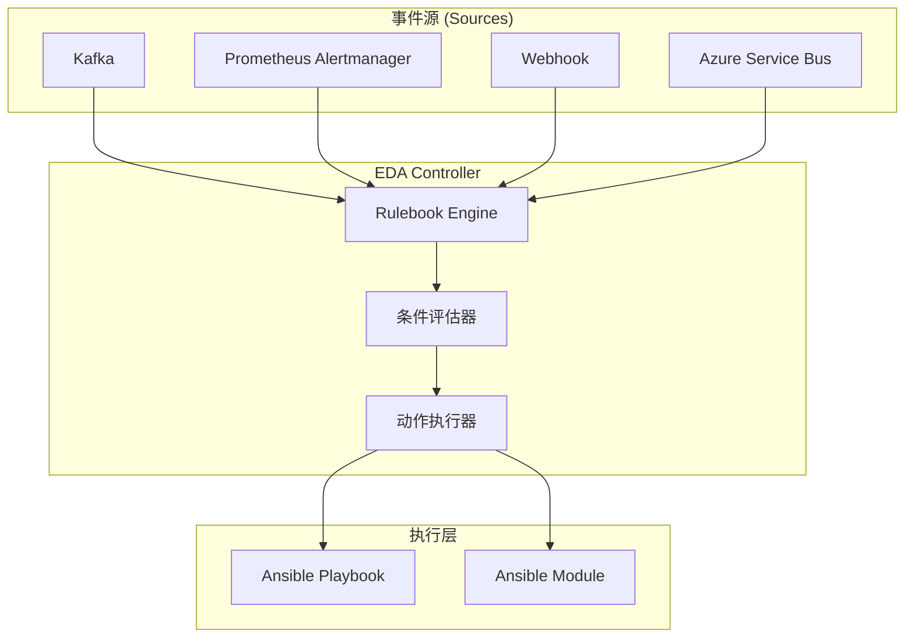
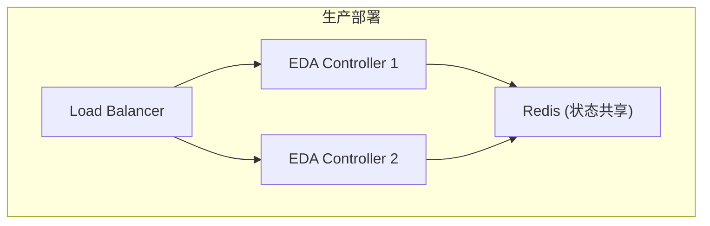
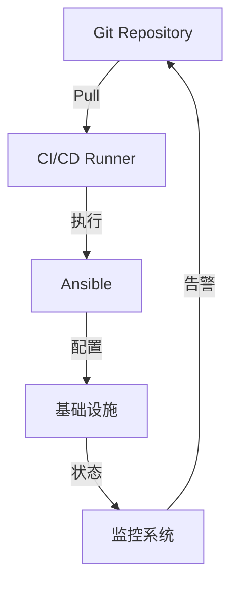
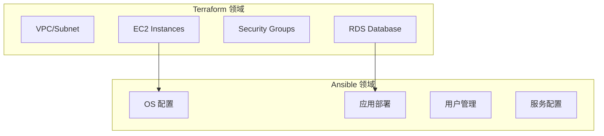
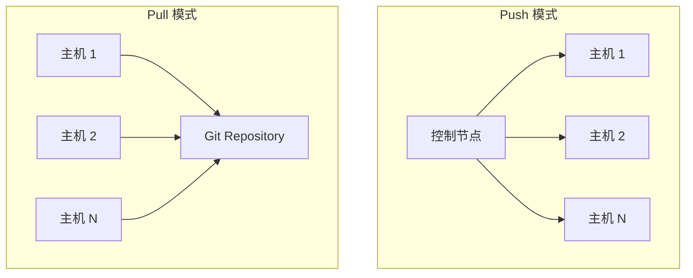

## 1. 响应式运维: Event-Driven Ansible (EDA)

传统的 Ansible 是 "手动触发" 或 "定时任务". EDA 引入了 **"If This Then That"** 的实时响应机制, 是实现**故障自愈 (Self-healing)** 的关键.

### 1.1 EDA 架构概览



### 1.2 核心组件

| 组件 | 职责 |
|------|------|
| **ansible-rulebook** | 核心守护进程, 监听事件并执行规则 |
| **Source Plugin** | 连接外部事件源的驱动 |
| **Rulebook** | 定义事件 → 条件 → 动作的 YAML 文件 |
| **Decision Engine** | 评估条件表达式 |
| **Action Plugin** | 执行响应动作 |

### 1.3 Rulebook 语法深度解析

```yaml
# rulebook.yml
---
- name: 监控告警自愈
  hosts: all
  sources:
    - ansible.eda.alertmanager:
        host: 0.0.0.0
        port: 5001
        data_alerts_path: alerts
  
  rules:
    - name: 服务宕机自动重启
      condition: >
        event.alert.labels.alertname == "ServiceDown" and
        event.alert.labels.severity == "critical"
      action:
        run_playbook:
          name: playbooks/restart_service.yml
          extra_vars:
            target_host: "{{ event.alert.labels.instance }}"
            service_name: "{{ event.alert.labels.service }}"
    
    - name: 磁盘空间告警清理
      condition: event.alert.labels.alertname == "DiskSpaceLow"
      action:
        run_playbook:
          name: playbooks/cleanup_disk.yml
```

#### 事件结构

事件以 JSON 格式传入, 通过 `event.*` 访问:

```json
{
  "alert": {
    "labels": {
      "alertname": "ServiceDown",
      "instance": "web-01.example.com",
      "service": "nginx",
      "severity": "critical"
    },
    "annotations": {
      "summary": "Nginx 服务宕机"
    }
  }
}
```

#### 条件表达式

EDA 支持复杂的布尔表达式:

| 操作符 | 示例 |
|--------|------|
| 比较 | `event.value > 100` |
| 字符串匹配 | `event.name == "error"` |
| 正则 | `event.message is match(".*timeout.*")` |
| 列表包含 | `"critical" in event.tags` |
| 逻辑组合 | `(A and B) or C` |

### 1.4 可用 Source 插件

| 插件 | 用途 |
|------|------|
| `ansible.eda.webhook` | HTTP Webhook 监听 |
| `ansible.eda.alertmanager` | Prometheus Alertmanager |
| `ansible.eda.kafka` | Apache Kafka 消费者 |
| `ansible.eda.url_check` | URL 健康检查 |
| `ansible.eda.file_watch` | 文件变更监控 |
| `ansible.eda.range` | 定时事件生成 |

### 1.5 可用 Action 类型

| 动作 | 用途 |
|------|------|
| `run_playbook` | 执行 Playbook |
| `run_module` | 直接执行模块 |
| `set_fact` | 设置事实供后续规则使用 |
| `post_event` | 生成新事件 |
| `print_event` | 调试输出 |
| `shutdown` | 停止 Rulebook |

### 1.6 EDA 部署架构



### 1.7 生产级高可用部署

#### 事件去重机制

在多实例部署中, 同一事件可能被多个 EDA 控制器接收. 需要使用分布式锁实现事件去重:

```yaml
# rulebook.yml - 带去重的规则
---
- name: 带去重的事件处理
  hosts: all
  sources:
    - ansible.eda.alertmanager:
        host: 0.0.0.0
        port: 5001
  
  rules:
    - name: 去重处理服务告警
      condition: event.alert.labels.alertname == "ServiceDown"
      action:
        run_playbook:
          name: playbooks/remediate.yml
          extra_vars:
            alert_fingerprint: "{{ event.alert.fingerprint }}"
      throttle:
        # 相同 fingerprint 的事件在 5 分钟内仅触发一次
        group_by:
          - event.alert.fingerprint
        once_within: 5 minutes
```

#### 告警风暴抑制

当出现级联故障时, 可能在短时间内产生大量告警. 需要配置抑制策略:

```yaml
rules:
  - name: 抑制告警风暴
    condition: event.alert.labels.alertname is defined
    throttle:
      group_by:
        - event.alert.labels.alertname
      once_within: 1 minute
      max_events: 10  # 同类告警最多处理 10 个
    action:
      run_playbook:
        name: playbooks/handle_alert.yml

  - name: 聚合告警
    condition: |
      events.host_alerts is defined and
      events.host_alerts | length > 5
    action:
      run_playbook:
        name: playbooks/handle_mass_outage.yml
        extra_vars:
          affected_hosts: "{{ events.host_alerts | map(attribute='labels.instance') | list }}"
```

#### Kubernetes 部署示例

```yaml
# eda-deployment.yaml
---
apiVersion: apps/v1
kind: Deployment
metadata:
  name: eda-controller
  labels:
    app: eda
spec:
  replicas: 2
  selector:
    matchLabels:
      app: eda
  template:
    metadata:
      labels:
        app: eda
    spec:
      containers:
        - name: eda
          image: quay.io/ansible/eda-server:latest
          ports:
            - containerPort: 5001
          env:
            - name: EDA_REDIS_HOST
              value: "redis-service"
            - name: EDA_DEDUP_ENABLED
              value: "true"
          volumeMounts:
            - name: rulebooks
              mountPath: /opt/eda/rulebooks
          resources:
            limits:
              memory: "512Mi"
              cpu: "500m"
            requests:
              memory: "256Mi"
              cpu: "100m"
          livenessProbe:
            httpGet:
              path: /health
              port: 5001
            initialDelaySeconds: 30
            periodSeconds: 10
          readinessProbe:
            httpGet:
              path: /ready
              port: 5001
            initialDelaySeconds: 5
            periodSeconds: 5
      volumes:
        - name: rulebooks
          configMap:
            name: eda-rulebooks
---
apiVersion: v1
kind: Service
metadata:
  name: eda-service
spec:
  selector:
    app: eda
  ports:
    - protocol: TCP
      port: 5001
      targetPort: 5001
  type: ClusterIP
```

#### 监控与告警

```yaml
# Prometheus ServiceMonitor
---
apiVersion: monitoring.coreos.com/v1
kind: ServiceMonitor
metadata:
  name: eda-monitor
spec:
  selector:
    matchLabels:
      app: eda
  endpoints:
    - port: metrics
      interval: 30s
      path: /metrics
```

**关键指标**:

| 指标 | 说明 | 告警阈值 |
|------|------|----------|
| `eda_events_received_total` | 接收的事件总数 | - |
| `eda_events_processed_total` | 处理的事件总数 | - |
| `eda_events_deduplicated_total` | 去重的事件数 | - |
| `eda_rulebook_execution_errors` | 执行错误数 | > 0 |
| `eda_action_duration_seconds` | 动作执行时间 | P99 > 60s |

---

## 2. GitOps 与 Secrets 管理

### 2.1 GitOps 模式



**核心原则**:
1. Git 是唯一的真相来源
2. 所有变更通过 Pull/Merge Request
3. 自动化应用变更到基础设施

### 2.2 SOPS 加密集成

**SOPS (Secrets OPerationS)** 允许在 Git 中安全存储加密的 Secrets:

```bash
# 加密 vars 文件
sops --encrypt --age $(age-keygen -y key.txt) vars/secrets.yml > vars/secrets.enc.yml

# 解密并运行
sops --decrypt vars/secrets.enc.yml | ansible-playbook -e @/dev/stdin playbook.yml
```

#### SOPS 配置

```yaml
# .sops.yaml
creation_rules:
  - path_regex: .*secrets.*\.yml$
    age: age1xxxxxxxxx
    
  - path_regex: .*prod.*\.yml$
    kms: arn:aws:kms:us-east-1:xxx:key/xxx
```

#### 与 Ansible 集成

```yaml
# lookup 插件方式
- name: 获取加密的数据库密码
  set_fact:
    db_password: "{{ lookup('community.sops.sops', 'secrets.enc.yml') | from_yaml }}"
```

### 2.3 Ansible Vault vs SOPS

| 特性 | Ansible Vault | SOPS |
|------|---------------|------|
| 加密粒度 | 整个文件 | 单个值 |
| 密钥管理 | 密码/文件 | Cloud KMS, Age, PGP |
| Git 友好 | 差 (二进制 diff) | 好 (结构化 diff) |
| 多云支持 | 无 | AWS KMS, GCP KMS, Azure |

---

## 3. IaC 工具链协同: Terraform + Ansible

### 3.1 职责分离



| 工具 | 关注点 | 生命周期 |
|------|--------|----------|
| **Terraform** | 基础设施资源 | Create / Update / Destroy |
| **Ansible** | 实例内部配置 | Converge / Configure |

### 3.2 集成模式

#### 模式 1: Terraform local-exec

```hcl
resource "aws_instance" "web" {
  ami           = "ami-xxx"
  instance_type = "t3.medium"
  
  provisioner "local-exec" {
    command = <<EOT
      ANSIBLE_HOST_KEY_CHECKING=False \
      ansible-playbook -i '${self.public_ip},' \
        --private-key ${var.ssh_key_path} \
        -u ec2-user \
        configure.yml
    EOT
  }
}
```

**限制**: 仅在资源创建时执行一次

#### 模式 2: 动态清单

```yaml
# inventory/terraform.yml
plugin: cloud.terraform.terraform_provider
project_path: ../terraform
```

```bash
# 从 Terraform State 生成清单
ansible-inventory -i inventory/terraform.yml --list
```

#### 模式 3: terraform-inventory

```bash
# 安装
go install github.com/adammck/terraform-inventory@latest

# 使用
TF_STATE=terraform.tfstate ansible-playbook -i $(which terraform-inventory) playbook.yml
```

### 3.3 不可变基础设施: Packer + Ansible

在镜像构建阶段预配置, 部署时无需配置:

```json
{
  "builders": [{
    "type": "amazon-ebs",
    "ami_name": "app-{{timestamp}}"
  }],
  "provisioners": [{
    "type": "ansible",
    "playbook_file": "configure.yml"
  }]
}
```

**工作流**:
1. Packer 启动临时 EC2
2. Ansible 配置应用
3. Packer 创建 AMI
4. Terraform 使用 AMI 部署

---

## 4. 大规模扩展: Pull 模式

### 4.1 Push vs Pull

| 模式 | 架构 | 适用场景 |
|------|------|----------|
| **Push** | 控制节点 → 目标主机 | 中小规模, 集中管理 |
| **Pull** | 目标主机 ← Git 仓库 | 超大规模, 自治管理 |



### 4.2 ansible-pull 内部机制

```bash
ansible-pull -U https://github.com/org/ansible-config.git local.yml
```

**执行流程**:
1. 克隆/更新 Git 仓库到本地
2. 切换到指定分支/标签
3. 使用 `local` 连接执行 Playbook
4. Playbook 中 inventory 通常为 `localhost`

#### 关键参数

| 参数 | 作用 |
|------|------|
| `-U` | Git 仓库 URL |
| `-C` | 分支/标签 |
| `-d` | 本地克隆目录 |
| `-i` | 自定义 inventory |
| `--accept-host-key` | 自动接受 SSH 密钥 |
| `--purge` | 每次重新克隆 |

### 4.3 生产级 Pull 模式部署

#### Cloud-init 引导

```yaml
#cloud-config
packages:
  - git
  - ansible

runcmd:
  - ansible-pull -U https://github.com/org/config.git -C main local.yml
```

#### Cron 定时拉取

```yaml
# local.yml
- hosts: localhost
  connection: local
  tasks:
    - name: 配置 ansible-pull cron
      cron:
        name: "Ansible Pull"
        minute: "*/15"
        job: >
          /usr/bin/ansible-pull 
          -U https://github.com/org/config.git 
          -C main 
          local.yml >> /var/log/ansible-pull.log 2>&1
```

### 4.4 Pull 模式最佳实践

| 实践 | 说明 |
|------|------|
| **幂等性** | 确保多次执行结果一致 |
| **日志收集** | 集中收集各节点执行日志 |
| **版本锁定** | 使用标签而非 main 分支 |
| **健康检查** | 配置 Prometheus exporter 暴露执行状态 |
| **失败告警** | 执行失败时发送告警 |

---

## 5. 混合云编排

### 5.1 多云清单统一

```yaml
# inventory/all.yml
plugin: constructed
strict: False
groups:
  production: "'prod' in tags"
  staging: "'staging' in tags"
  
compose:
  ansible_host: public_ip | default(private_ip)
  
sources:
  - aws_ec2.yml
  - azure_rm.yml
  - gcp_compute.yml
```

### 5.2 跨云 Playbook

```yaml
- name: 多云配置
  hosts: all
  tasks:
    - name: AWS 特定配置
      include_tasks: aws_specific.yml
      when: "'aws' in group_names"
    
    - name: Azure 特定配置
      include_tasks: azure_specific.yml
      when: "'azure' in group_names"
    
    - name: 通用配置
      include_tasks: common.yml
```

---

## 6. 本周实战任务

### 6.1 EDA 入门

1. 安装 EDA: `pip install ansible-rulebook ansible.eda`
2. 编写 Rulebook 监听 Webhook
3. 使用 `curl` 模拟告警:
   ```bash
   curl -X POST http://localhost:5000 \
     -H "Content-Type: application/json" \
     -d '{"alert": {"labels": {"alertname": "test"}}}'
   ```
4. 观察 Playbook 是否自动触发

### 6.2 Terraform 与 Ansible 集成

1. 编写 Terraform 代码创建 Docker 容器
2. 使用 `local-exec` 调用 Ansible 配置 Nginx
3. 验证 Nginx 服务正常

### 6.3 Pull 模式实验

1. 创建 GitHub 仓库存放 local.yml
2. 在本地 VM 运行:
   ```bash
   ansible-pull -U https://github.com/<your-repo>.git local.yml
   ```
3. 配置 cron 每 15 分钟执行一次

### 6.4 SOPS 加密实验

1. 安装 SOPS 和 age
2. 加密 vars 文件
3. 编写 Playbook 使用加密变量
4. 验证解密和执行成功

---

> 终极的运维是 "NoOps". 通过 EDA 实现自愈, 通过 Terraform 实现交付, 通过 Pull 模式实现扩张, 构建真正 "有机" 的自维护系统.
