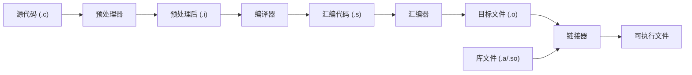

## 1. C 语言简介

### 1.1 C 语言的诞生

C 语言由 Dennis Ritchie 于 1972 年在贝尔实验室开发, 最初用于重写 UNIX 操作系统.

**历史演进**:
- **1972**: C 语言诞生 (Ken Thompson 的 B 语言演化)
- **1978**: K&R C (《The C Programming Language》第一版)
- **1989**: ANSI C (C89/C90)
- **1999**: C99 (内联函数, 可变长数组, `//` 注释)
- **2011**: C11 (多线程, 泛型选择, 静态断言)
- **2018**: C17 (Bug 修复)
- **2023**: C23 (最新标准)

### 1.2 C 语言的设计哲学

C 语言的核心设计原则:

1. **接近硬件**: 提供对内存的直接访问
2. **高效**: 编译后的代码执行速度接近汇编
3. **可移植**: "一次编写, 到处编译"
4. **简洁**: 语言核心小, 功能通过库扩展
5. **信任程序员**: 不做不必要的运行时检查

### 1.3 C 语言的应用领域

| 领域 | 代表项目 |
|------|----------|
| 操作系统 | Linux, Windows, macOS, BSD |
| 嵌入式系统 | 微控制器, IoT 设备, 汽车电子 |
| 数据库 | SQLite, PostgreSQL, MySQL |
| 编译器/解释器 | GCC, Clang, CPython, Lua |
| 网络服务 | Nginx, Redis, Memcached |
| 游戏引擎 | Doom, Quake (id Tech) |

### 1.4 C 与其他语言的关系

```
           C (1972)
          / | \
         /  |  \
    C++ (1983)  Objective-C (1984)
        |
    Java/C# (语法影响)
        |
    Go/Rust (现代系统语言)
```

---

## 2. 编译原理

### 2.1 编译过程概览



### 2.2 预处理 (Preprocessing)

预处理器处理以 `#` 开头的指令:

```c
// 源代码
#include <stdio.h>
#define PI 3.14159

int main(void) {
    printf("PI = %f\n", PI);
    return 0;
}
```

```bash
# 查看预处理结果
gcc -E main.c -o main.i
```

预处理器工作:
- 展开 `#include` (插入头文件内容)
- 替换 `#define` 宏
- 处理条件编译 (`#if`, `#ifdef`)
- 删除注释

### 2.3 编译 (Compilation)

编译器将预处理后的 C 代码转换为汇编语言:

```bash
# 生成汇编代码
gcc -S main.c -o main.s
```

```asm
; 示例汇编输出
main:
    push    rbp
    mov     rbp, rsp
    lea     rdi, [rip+.LC0]
    movsd   xmm0, [rip+.LC1]
    call    printf
    xor     eax, eax
    pop     rbp
    ret
```

编译器的工作:
- 词法分析: 将代码分解为 token
- 语法分析: 构建抽象语法树 (AST)
- 语义分析: 类型检查等
- 优化: 提高代码效率
- 代码生成: 输出汇编

### 2.4 汇编 (Assembly)

汇编器将汇编代码转换为机器码:

```bash
# 生成目标文件
gcc -c main.c -o main.o
```

目标文件 (`.o`) 包含:
- 机器码
- 符号表 (函数名, 变量名)
- 重定位信息

### 2.5 链接 (Linking)

链接器将多个目标文件和库合并为可执行文件:

```bash
# 链接生成可执行文件
gcc main.o -o main
```

链接器的工作:
- 符号解析: 将函数调用与定义关联
- 重定位: 调整地址引用
- 合并段: 将代码段、数据段合并

### 2.6 一步编译

```bash
# 完整编译过程
gcc main.c -o main

# 等价于
gcc -E main.c -o main.i     # 预处理
gcc -S main.i -o main.s     # 编译
gcc -c main.s -o main.o     # 汇编
gcc main.o -o main          # 链接
```

---

## 3. 开发环境配置

### 3.1 编译器安装

**Linux (Debian/Ubuntu)**:

```bash
sudo apt update
sudo apt install build-essential
gcc --version
```

**macOS**:

```bash
xcode-select --install
# 或安装 Homebrew 后
brew install gcc
```

**Windows**:
- MinGW-w64
- WSL (Windows Subsystem for Linux)
- Visual Studio (MSVC)

### 3.2 GCC 常用选项

| 选项 | 描述 |
|------|------|
| `-o <file>` | 指定输出文件名 |
| `-c` | 只编译, 不链接 |
| `-E` | 只预处理 |
| `-S` | 只编译为汇编 |
| `-g` | 生成调试信息 |
| `-O0/O1/O2/O3` | 优化级别 |
| `-Wall` | 启用所有警告 |
| `-Werror` | 将警告视为错误 |
| `-std=c11` | 指定 C 标准 |
| `-I<dir>` | 添加头文件搜索路径 |
| `-L<dir>` | 添加库搜索路径 |
| `-l<lib>` | 链接库 |

### 3.3 推荐编译选项

```bash
gcc -Wall -Wextra -Werror -pedantic -std=c11 -g main.c -o main
```

### 3.4 编辑器/IDE

| 工具 | 特点 |
|------|------|
| Vim/Neovim + LSP | 轻量, 高效, 需要配置 |
| VS Code + C/C++ 扩展 | 免费, 跨平台, 易用 |
| CLion | 功能强大, 付费 |
| Emacs | 高度可定制 |

### 3.5 交叉编译 (Cross-Compilation)

为不同目标架构编译代码:

```bash
# 安装 ARM 交叉编译器 (Debian/Ubuntu)
sudo apt install gcc-aarch64-linux-gnu

# 交叉编译
aarch64-linux-gnu-gcc -o hello_arm hello.c

# 查看目标架构
file hello_arm
# hello_arm: ELF 64-bit LSB executable, ARM aarch64
```

**常用交叉编译工具链**:

| 目标 | 工具链前缀 |
| :--- | :--- |
| ARM 64-bit | `aarch64-linux-gnu-` |
| ARM 32-bit | `arm-linux-gnueabihf-` |
| RISC-V | `riscv64-linux-gnu-` |
| MIPS | `mips-linux-gnu-` |

**Makefile 支持**:

```makefile
# 通过 CROSS_COMPILE 变量切换
CROSS_COMPILE ?=
CC = $(CROSS_COMPILE)gcc
AR = $(CROSS_COMPILE)ar

# 使用: make CROSS_COMPILE=aarch64-linux-gnu-
```

**Sysroot**: 包含目标系统的头文件和库:

```bash
aarch64-linux-gnu-gcc --sysroot=/path/to/sysroot -o hello hello.c
```

---

## 4. 第一个 C 程序

### 4.1 Hello World

```c
// hello.c
#include <stdio.h>

int main(void) {
    printf("Hello, World!\n");
    return 0;
}
```

```bash
gcc hello.c -o hello
./hello
# Hello, World!
```

### 4.2 程序结构分析

```c
#include <stdio.h>      // 1. 预处理指令: 包含标准输入输出头文件

int main(void) {        // 2. main 函数: 程序入口点
                        //    int: 返回类型
                        //    void: 无参数
    
    printf("Hello\n");  // 3. 函数调用: 输出字符串
    
    return 0;           // 4. 返回值: 0 表示成功
}
```

### 4.3 main 函数的形式

```c
// 形式 1: 无参数
int main(void) {
    return 0;
}

// 形式 2: 带命令行参数
int main(int argc, char *argv[]) {
    // argc: 参数个数
    // argv: 参数数组
    for (int i = 0; i < argc; i++) {
        printf("argv[%d] = %s\n", i, argv[i]);
    }
    return 0;
}

// 形式 3: 带环境变量 (POSIX 扩展)
int main(int argc, char *argv[], char *envp[]) {
    return 0;
}
```

### 4.4 返回值含义

| 返回值 | 含义 |
|--------|------|
| 0 | 成功 |
| 非 0 | 失败 (具体含义由程序定义) |

```bash
# 查看上一个程序的返回值
echo $?
```

---

## 5. 变量与基本类型

### 5.1 变量声明

```c
int x;          // 声明
int y = 10;     // 声明并初始化

int a, b, c;    // 同时声明多个变量
int d = 1, e = 2;
```

### 5.2 命名规则

- 由字母、数字、下划线组成
- 不能以数字开头
- 区分大小写
- 不能使用保留字

**命名约定**:
- `snake_case`: 变量、函数 (Linux 内核风格)
- `camelCase`: 变量、函数 (某些项目)
- `ALL_CAPS`: 宏定义
- `_` 或 `__` 开头: 系统保留

### 5.3 整数类型

| 类型 | 最小大小 | 典型大小 (64位) |
|------|----------|-----------------|
| `char` | 1 byte | 1 byte |
| `short` | 2 bytes | 2 bytes |
| `int` | 2 bytes | 4 bytes |
| `long` | 4 bytes | 8 bytes |
| `long long` | 8 bytes | 8 bytes |

```c
#include <stdio.h>
#include <limits.h>

int main(void) {
    printf("char: %zu bytes, range: %d to %d\n", 
           sizeof(char), CHAR_MIN, CHAR_MAX);
    printf("int: %zu bytes, range: %d to %d\n", 
           sizeof(int), INT_MIN, INT_MAX);
    printf("long: %zu bytes, range: %ld to %ld\n", 
           sizeof(long), LONG_MIN, LONG_MAX);
    return 0;
}
```

### 5.4 有符号与无符号

```c
int x = -10;            // 有符号 (默认)
unsigned int y = 10;    // 无符号 (只能为正)

// 类型范围
// signed int:   -2,147,483,648 to 2,147,483,647
// unsigned int: 0 to 4,294,967,295
```

### 5.5 固定宽度整数 (stdint.h)

```c
#include <stdint.h>

int8_t   a;   // 精确 8 位有符号
uint8_t  b;   // 精确 8 位无符号
int16_t  c;   // 精确 16 位有符号
uint16_t d;   // 精确 16 位无符号
int32_t  e;   // 精确 32 位有符号
uint32_t f;   // 精确 32 位无符号
int64_t  g;   // 精确 64 位有符号
uint64_t h;   // 精确 64 位无符号

size_t   i;   // 无符号, 用于表示大小
ssize_t  j;   // 有符号, 用于表示大小或错误
```

### 5.6 浮点类型

| 类型 | 大小 | 精度 |
|------|------|------|
| `float` | 4 bytes | ~7 位有效数字 |
| `double` | 8 bytes | ~15 位有效数字 |
| `long double` | 8-16 bytes | 更高精度 |

```c
#include <stdio.h>
#include <float.h>

int main(void) {
    float f = 3.14159265358979f;   // f 后缀表示 float
    double d = 3.14159265358979;   // 默认 double
    
    printf("float: %.15f\n", f);   // 精度不足
    printf("double: %.15f\n", d);  // 精度足够
    
    printf("float epsilon: %e\n", FLT_EPSILON);
    printf("double epsilon: %e\n", DBL_EPSILON);
    return 0;
}
```

### 5.7 字符类型

```c
char c = 'A';           // 字符字面量
char d = 65;            // ASCII 值

printf("%c\n", c);      // A
printf("%d\n", c);      // 65

// 转义字符
char newline = '\n';    // 换行
char tab = '\t';        // 制表符
char quote = '\'';      // 单引号
char backslash = '\\';  // 反斜杠
char null_char = '\0';  // 空字符
```

### 5.8 布尔类型 (C99)

```c
#include <stdbool.h>

bool flag = true;
bool done = false;

if (flag) {
    printf("flag is true\n");
}

// 实现上, bool 是 _Bool 的别名
// true 是 1, false 是 0
```

---

## 6. Make 与构建系统

### 6.1 为什么需要 Make

手动编译多文件项目繁琐:

```bash
gcc -c main.c -o main.o
gcc -c util.c -o util.o
gcc main.o util.o -o program
```

问题:
- 每次修改都要重新输入命令
- 无法判断哪些文件需要重新编译
- 项目规模增大后难以维护

Make 解决了这些问题:
- **增量编译**: 只重新编译修改过的文件
- **依赖追踪**: 自动判断编译顺序
- **规则定义**: 清晰描述构建过程

### 6.2 Makefile 基本结构

```makefile
# Makefile
CC = gcc
CFLAGS = -Wall -Wextra -g

program: main.o util.o
	$(CC) main.o util.o -o program

main.o: main.c util.h
	$(CC) $(CFLAGS) -c main.c -o main.o

util.o: util.c util.h
	$(CC) $(CFLAGS) -c util.c -o util.o

clean:
	rm -f *.o program
```

```bash
make           # 构建默认目标 (第一个)
make program   # 构建指定目标
make clean     # 执行 clean 规则
make -j4       # 并行编译 (4 个任务)
```

### 6.3 规则语法

```makefile
target: prerequisites
	recipe
	recipe
```

- **target**: 目标文件或伪目标
- **prerequisites**: 依赖文件列表
- **recipe**: 构建命令 (**必须以 Tab 开头, 不能是空格**)

Make 的核心逻辑:
1. 检查 target 是否存在
2. 检查 prerequisites 的时间戳是否比 target 新
3. 如果需要更新, 执行 recipe

### 6.4 变量

#### 6.4.1 变量定义

```makefile
# 递归展开 (使用时展开)
CC = gcc
CFLAGS = $(WARN_FLAGS) -O2

# 简单展开 (定义时展开)
CC := gcc
OBJS := main.o util.o

# 条件赋值 (未定义时才赋值)
CC ?= gcc

# 追加
CFLAGS += -g
```

#### 6.4.2 常用预定义变量

| 变量 | 默认值 | 描述 |
|------|--------|------|
| `CC` | cc | C 编译器 |
| `CXX` | g++ | C++ 编译器 |
| `CFLAGS` | (空) | C 编译选项 |
| `CXXFLAGS` | (空) | C++ 编译选项 |
| `CPPFLAGS` | (空) | 预处理选项 |
| `LDFLAGS` | (空) | 链接选项 |
| `LDLIBS` | (空) | 链接库 |

#### 6.4.3 自动变量

```makefile
$@    # 目标文件名
$<    # 第一个依赖文件
$^    # 所有依赖文件 (去重)
$+    # 所有依赖文件 (不去重)
$?    # 比目标新的依赖文件
$*    # 匹配的 stem (模式规则中)
$(@D) # 目标的目录部分
$(@F) # 目标的文件名部分
```

示例:

```makefile
program: main.o util.o
	$(CC) $^ -o $@
# 展开为: gcc main.o util.o -o program

%.o: %.c
	$(CC) $(CFLAGS) -c $< -o $@
# 对于 main.o: gcc -Wall -c main.c -o main.o
```

### 6.5 模式规则

```makefile
# 通用规则: 从 .c 生成 .o
%.o: %.c
	$(CC) $(CFLAGS) -c $< -o $@

# 通用规则: 从 .c 生成可执行文件
%: %.c
	$(CC) $(CFLAGS) $< -o $@
```

`%` 是通配符, 匹配任意字符串. `$*` 存储匹配的部分.

### 6.6 隐式规则

Make 内置了一些隐式规则:

```makefile
# 内置: .c -> .o
%.o: %.c
	$(CC) $(CPPFLAGS) $(CFLAGS) -c $< -o $@

# 内置: .o -> 可执行文件
%: %.o
	$(CC) $(LDFLAGS) $^ $(LDLIBS) -o $@
```

因此, 简单项目的 Makefile 可以非常简洁:

```makefile
CC = gcc
CFLAGS = -Wall -g

program: main.o util.o
# 依赖隐式规则自动编译 .c -> .o
```

### 6.7 函数

#### 6.7.1 字符串函数

```makefile
# 替换
$(subst from,to,text)
SRCS := main.c util.c
OBJS := $(subst .c,.o,$(SRCS))  # main.o util.o

# 模式替换
$(patsubst pattern,replacement,text)
OBJS := $(patsubst %.c,%.o,$(SRCS))

# 简写形式
OBJS := $(SRCS:.c=.o)

# 去除空格
$(strip text)

# 查找
$(findstring find,text)

# 过滤
$(filter pattern,text)
$(filter-out pattern,text)
```

#### 6.7.2 文件名函数

```makefile
# 目录部分
$(dir src/main.c)  # src/

# 文件名部分
$(notdir src/main.c)  # main.c

# 后缀
$(suffix main.c)  # .c

# 基名
$(basename main.c)  # main

# 添加后缀
$(addsuffix .o,main util)  # main.o util.o

# 添加前缀
$(addprefix src/,main.c)  # src/main.c
```

#### 6.7.3 通配符函数

```makefile
# 展开通配符
SRCS := $(wildcard *.c)
SRCS := $(wildcard src/*.c)
```

#### 6.7.4 shell 函数

```makefile
# 执行 shell 命令
DATE := $(shell date +%Y%m%d)
UNAME := $(shell uname -s)
```

### 6.8 条件语句

```makefile
# ifdef / ifndef
DEBUG := 1
ifdef DEBUG
    CFLAGS += -g -DDEBUG
else
    CFLAGS += -O2
endif

# ifeq / ifneq
OS := $(shell uname -s)
ifeq ($(OS),Linux)
    LDLIBS += -lpthread
endif

ifeq ($(CC),gcc)
    CFLAGS += -std=gnu11
else ifeq ($(CC),clang)
    CFLAGS += -std=c11
endif
```

### 6.9 伪目标

```makefile
# 声明为伪目标 (不是实际文件)
.PHONY: all clean install test

all: program

clean:
	rm -f *.o program

install: program
	cp program /usr/local/bin/

test: program
	./program --test
```

如果不声明 `.PHONY`, 当存在名为 `clean` 的文件时, `make clean` 不会执行.

### 6.10 自动依赖生成

手动维护头文件依赖容易出错. GCC 可以自动生成依赖:

```bash
gcc -MM main.c
# 输出: main.o: main.c util.h config.h
```

**自动化方案**:

```makefile
CC = gcc
CFLAGS = -Wall -g
SRCS = main.c util.c
OBJS = $(SRCS:.c=.o)
DEPS = $(SRCS:.c=.d)

program: $(OBJS)
	$(CC) $(LDFLAGS) $^ -o $@

# 生成依赖文件
%.d: %.c
	$(CC) -MM -MF $@ -MT '$*.o $@' $<

# 编译规则
%.o: %.c
	$(CC) $(CFLAGS) -c $< -o $@

# 包含依赖文件
-include $(DEPS)

clean:
	rm -f $(OBJS) $(DEPS) program

.PHONY: clean
```

或者使用 GCC 的 `-MMD` 选项在编译时同时生成:

```makefile
CFLAGS = -Wall -g -MMD -MP

%.o: %.c
	$(CC) $(CFLAGS) -c $< -o $@

-include $(OBJS:.o=.d)
```

### 6.11 多目录项目

```makefile
# 项目结构:
# src/main.c src/util.c
# include/util.h
# build/

SRCDIR = src
INCDIR = include
BUILDDIR = build

SRCS = $(wildcard $(SRCDIR)/*.c)
OBJS = $(patsubst $(SRCDIR)/%.c,$(BUILDDIR)/%.o,$(SRCS))

CFLAGS = -Wall -I$(INCDIR)

$(BUILDDIR)/program: $(OBJS)
	$(CC) $^ -o $@

$(BUILDDIR)/%.o: $(SRCDIR)/%.c | $(BUILDDIR)
	$(CC) $(CFLAGS) -c $< -o $@

$(BUILDDIR):
	mkdir -p $@

clean:
	rm -rf $(BUILDDIR)

.PHONY: clean
```

`|` 后面是 **order-only 依赖**, 只确保目录存在, 不检查时间戳.

### 6.12 完整示例

```makefile
# === 配置 ===
CC      := gcc
CFLAGS  := -Wall -Wextra -std=c11
LDFLAGS :=
LDLIBS  :=

# 调试/发布模式
ifdef DEBUG
    CFLAGS += -g -O0 -DDEBUG
else
    CFLAGS += -O2 -DNDEBUG
endif

# === 源文件 ===
SRCDIR  := src
INCDIR  := include
BUILDDIR := build

SRCS := $(wildcard $(SRCDIR)/*.c)
OBJS := $(patsubst $(SRCDIR)/%.c,$(BUILDDIR)/%.o,$(SRCS))
DEPS := $(OBJS:.o=.d)

TARGET := $(BUILDDIR)/myprogram

# === 规则 ===
.PHONY: all clean rebuild

all: $(TARGET)

$(TARGET): $(OBJS)
	$(CC) $(LDFLAGS) $^ $(LDLIBS) -o $@

$(BUILDDIR)/%.o: $(SRCDIR)/%.c | $(BUILDDIR)
	$(CC) $(CFLAGS) -I$(INCDIR) -MMD -MP -c $< -o $@

$(BUILDDIR):
	mkdir -p $@

clean:
	rm -rf $(BUILDDIR)

rebuild: clean all

# 包含自动生成的依赖
-include $(DEPS)
```

```bash
make                # 发布构建
make DEBUG=1        # 调试构建
make -j$(nproc)     # 并行构建
make clean          # 清理
make rebuild        # 重新构建
```

### 6.13 Make 调试

```bash
make -n             # 只打印命令, 不执行
make -B             # 强制重新构建所有
make --debug=v      # 详细调试信息
make -p             # 打印所有规则和变量
make VAR=value      # 命令行覆盖变量
```

### 6.14 Makefile 最佳实践

#### 6.14.1 可读性与可维护性

```makefile
# 1. 使用有意义的变量名
SOURCES := $(wildcard src/*.c)
OBJECTS := $(SOURCES:.c=.o)
TARGET  := bin/myapp

# 2. 分组相关配置
# === 编译器配置 ===
CC      := gcc
CFLAGS  := -Wall -Wextra -std=c11

# === 目录配置 ===
SRCDIR  := src
OBJDIR  := obj
BINDIR  := bin

# 3. 添加注释说明复杂规则
# 生成依赖文件, -MT 指定目标, -MF 指定输出文件
%.d: %.c
	$(CC) -MM -MT '$*.o $@' -MF $@ $<

# 4. 使用 .PHONY 声明所有伪目标
.PHONY: all clean install test debug release
```

#### 6.14.2 平台兼容性

```makefile
# 检测操作系统
UNAME := $(shell uname -s)

ifeq ($(UNAME),Linux)
    LDLIBS  += -lpthread -lrt
    INSTALL := install
endif

ifeq ($(UNAME),Darwin)
    LDLIBS  += -lpthread
    INSTALL := ginstall
endif

ifeq ($(OS),Windows_NT)
    EXE     := .exe
    RM      := del /Q
else
    EXE     :=
    RM      := rm -f
endif

TARGET := myapp$(EXE)
```

#### 6.14.3 错误处理

```makefile
# 1. 使用 -Werror 将警告视为错误
CFLAGS += -Werror

# 2. 命令失败时停止
.DELETE_ON_ERROR:

# 3. 检查工具是否存在
check-tools:
	@which $(CC) > /dev/null || (echo "Error: $(CC) not found" && exit 1)
	@which ar > /dev/null || (echo "Error: ar not found" && exit 1)

# 4. 使用 || true 忽略特定错误
clean:
	$(RM) $(OBJECTS) || true
	$(RM) $(TARGET) || true
```

### 6.15 工程项目结构

#### 6.15.1 推荐目录结构

```
project/
├── Makefile           # 主 Makefile
├── config.mk          # 配置变量 (可选)
├── rules.mk           # 通用规则 (可选)
├── src/               # 源代码
│   ├── main.c
│   └── module/
│       ├── module.c
│       └── module.h
├── include/           # 公共头文件
│   └── public_api.h
├── lib/               # 第三方库
├── tests/             # 测试代码
│   ├── Makefile
│   └── test_module.c
├── obj/               # 目标文件 (生成)
├── bin/               # 可执行文件 (生成)
└── docs/              # 文档
```

#### 6.15.2 模块化 Makefile

**主 Makefile**:

```makefile
# 包含配置
include config.mk

# 模块列表
MODULES := core network utils

# 收集所有源文件
SRCS :=
include $(addsuffix /module.mk,$(addprefix src/,$(MODULES)))

OBJS := $(patsubst src/%.c,obj/%.o,$(SRCS))

all: $(TARGET)

$(TARGET): $(OBJS)
	@mkdir -p $(dir $@)
	$(CC) $(LDFLAGS) $^ $(LDLIBS) -o $@

obj/%.o: src/%.c
	@mkdir -p $(dir $@)
	$(CC) $(CFLAGS) -c $< -o $@

include rules.mk
```

**模块定义 (src/core/module.mk)**:

```makefile
# 本模块的源文件
SRCS += src/core/init.c
SRCS += src/core/config.c
SRCS += src/core/logger.c
```

**配置文件 (config.mk)**:

```makefile
# 项目配置
PROJECT := myproject
VERSION := 1.0.0

# 编译器
CC      := gcc
CFLAGS  := -Wall -Wextra -std=c11 -Iinclude

# 目录
SRCDIR  := src
OBJDIR  := obj
BINDIR  := bin

# 目标
TARGET  := $(BINDIR)/$(PROJECT)

# 安装路径
PREFIX  := /usr/local
```

#### 6.15.3 递归 Make vs 非递归 Make

**递归 Make (传统方式)**:

```makefile
# 顶层 Makefile
SUBDIRS := lib src tests

all:
	@for dir in $(SUBDIRS); do \
		$(MAKE) -C $$dir; \
	done

clean:
	@for dir in $(SUBDIRS); do \
		$(MAKE) -C $$dir clean; \
	done
```

问题: 递归 Make 无法正确追踪跨目录依赖.

**非递归 Make (推荐)**:

```makefile
# 使用 include 合并所有 module.mk
# 所有依赖在同一个 Make 实例中处理
include src/core/module.mk
include src/network/module.mk
include tests/module.mk
```

### 6.16 团队协作

#### 6.16.1 版本控制

```makefile
# 从 Git 获取版本信息
GIT_VERSION := $(shell git describe --tags --always --dirty 2>/dev/null || echo "unknown")
GIT_COMMIT  := $(shell git rev-parse --short HEAD 2>/dev/null || echo "unknown")
BUILD_TIME  := $(shell date -u '+%Y-%m-%d %H:%M:%S UTC')

CFLAGS += -DVERSION=\"$(GIT_VERSION)\"
CFLAGS += -DGIT_COMMIT=\"$(GIT_COMMIT)\"
CFLAGS += -DBUILD_TIME=\"$(BUILD_TIME)\"
```

```c
// 在代码中使用
printf("Version: %s (%s)\n", VERSION, GIT_COMMIT);
printf("Built: %s\n", BUILD_TIME);
```

#### 6.16.2 CI/CD 集成

```makefile
# CI 友好的目标
.PHONY: ci lint test coverage

# CI 入口点
ci: lint build test

# 代码检查
lint:
	cppcheck --enable=all --error-exitcode=1 $(SRCDIR)
	clang-format --dry-run --Werror $(SRCS)

# 测试
test: $(TARGET)
	./run_tests.sh

# 代码覆盖率
coverage: CFLAGS += --coverage
coverage: LDFLAGS += --coverage
coverage: clean build test
	gcov -o $(OBJDIR) $(SRCS)
	lcov --capture --directory $(OBJDIR) --output-file coverage.info
	genhtml coverage.info --output-directory coverage_report
```

**GitHub Actions 示例 (.github/workflows/ci.yml)**:

```yaml
name: CI
on: [push, pull_request]

jobs:
  build:
    runs-on: ubuntu-latest
    steps:
      - uses: actions/checkout@v4
      - name: Install dependencies
        run: sudo apt-get install -y cppcheck
      - name: Lint
        run: make lint
      - name: Build
        run: make -j$(nproc)
      - name: Test
        run: make test
```

#### 6.16.3 配置管理

```makefile
# 支持本地配置覆盖 (不提交到版本控制)
-include local.mk

# 支持环境变量覆盖
CC      ?= gcc
PREFIX  ?= /usr/local
DEBUG   ?= 0

# 支持命令行覆盖
# make CC=clang DEBUG=1
```

**local.mk 示例 (加入 .gitignore)**:

```makefile
# 开发者本地配置
CC := clang
CFLAGS += -fsanitize=address
DEBUG := 1
```

#### 6.16.4 标准目标约定

```makefile
# 遵循 GNU 标准目标
.PHONY: all install uninstall clean distclean check dist

# 默认目标
all: $(TARGET)

# 安装到系统
install: $(TARGET)
	$(INSTALL) -d $(DESTDIR)$(PREFIX)/bin
	$(INSTALL) -m 755 $(TARGET) $(DESTDIR)$(PREFIX)/bin/

# 卸载
uninstall:
	$(RM) $(DESTDIR)$(PREFIX)/bin/$(notdir $(TARGET))

# 清理构建产物
clean:
	$(RM) -r $(OBJDIR) $(BINDIR)

# 清理所有生成文件 (包括配置)
distclean: clean
	$(RM) config.mk local.mk

# 运行测试
check: test

# 创建发布包
dist:
	git archive --prefix=$(PROJECT)-$(VERSION)/ -o $(PROJECT)-$(VERSION).tar.gz HEAD
```

#### 6.16.5 帮助信息

```makefile
# 提供帮助目标
.PHONY: help

help:
	@echo "Usage: make [target] [VAR=value]"
	@echo ""
	@echo "Targets:"
	@echo "  all       Build the project (default)"
	@echo "  clean     Remove build artifacts"
	@echo "  install   Install to PREFIX (default: /usr/local)"
	@echo "  test      Run tests"
	@echo "  help      Show this help"
	@echo ""
	@echo "Variables:"
	@echo "  CC        C compiler (default: gcc)"
	@echo "  DEBUG     Enable debug build (default: 0)"
	@echo "  PREFIX    Install prefix (default: /usr/local)"
	@echo ""
	@echo "Examples:"
	@echo "  make DEBUG=1"
	@echo "  make CC=clang"
	@echo "  make install PREFIX=/opt/myapp"
```

### 6.17 常见陷阱与解决方案

#### 6.17.1 Tab vs 空格

```makefile
# 错误: 使用空格缩进 (最常见错误)
target:
    echo "Hello"  # 4 个空格, 会报错

# 正确: 使用 Tab 缩进
target:
	echo "Hello"  # 1 个 Tab
```

错误信息: `*** missing separator. Stop.`

#### 6.17.2 变量展开时机

```makefile
# 递归展开 (=): 使用时展开
A = $(B)
B = hello
# A 的值是 "hello"

# 简单展开 (:=): 定义时展开
A := $(B)
B := hello
# A 的值是 "" (定义时 B 还未定义)
```

#### 6.17.3 通配符陷阱

```makefile
# 错误: 通配符在变量中不自动展开
SRCS = *.c  # SRCS 的值是字面量 "*.c"

# 正确: 使用 wildcard 函数
SRCS = $(wildcard *.c)
```

#### 6.17.4 命令前缀

```makefile
target:
	@echo "静默执行, 不打印命令本身"
	-rm file_that_might_not_exist  # 忽略错误
	+$(MAKE) -C subdir  # 即使 -n 模式也执行
```

#### 6.17.5 并行构建问题

```makefile
# 问题: 隐含的依赖关系
all: prog1 prog2
prog1: common.o main1.o
prog2: common.o main2.o

# 并行构建时, common.o 可能被同时编译两次
# 解决: 确保依赖图正确, 不重复编译

# 或者使用 .NOTPARALLEL (不推荐, 会禁用并行)
.NOTPARALLEL:
```

---

## 7. 练习

### 7.1 Hello World

编写并编译你的第一个 C 程序.

### 7.2 查看编译过程

分别使用 `-E`, `-S`, `-c` 选项, 查看预处理、汇编和目标文件.

### 7.3 类型大小

编写程序输出所有基本类型的大小和范围.

### 7.4 Makefile

为一个包含两个 `.c` 文件的项目编写 Makefile.

---

## 8. 思考题

1. C 语言为什么不做边界检查?
2. 预处理和编译有什么区别?
3. 为什么需要链接过程?
4. `int` 的大小为什么不固定?
5. 有符号整数的负数是如何存储的?

---

## 9. 本周小结

- **C 语言**: 1972 年诞生, 系统编程语言.
- **编译过程**: 预处理 → 编译 → 汇编 → 链接.
- **GCC**: 主流 C 编译器, 丰富的选项.
- **基本类型**: 整数, 浮点, 字符, 布尔.
- **stdint.h**: 固定宽度整数类型.
- **Make**: 自动化构建工具.

---

> C 语言的强大来自于它对计算机硬件的精确控制. 理解编译过程, 是成为 C 语言高手的第一步.
