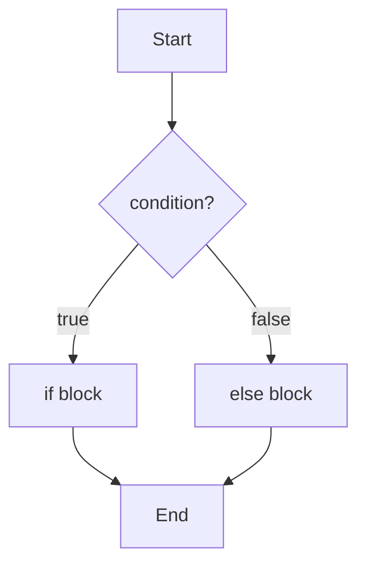

## 1. 条件语句

### 1.1 if 语句



```c
int age = 18;

if (age >= 18) {
    printf("成年人\n");
}

// 多分支
if (age < 12) {
    printf("儿童\n");
} else if (age < 18) {
    printf("青少年\n");
} else {
    printf("成年人\n");
}
```

### 1.2 单语句与代码块

```c
// 单语句可以省略花括号
if (x > 0)
    printf("正数\n");

// 但推荐始终使用花括号
if (x > 0) {
    printf("正数\n");
}

// 避免悬空 else 问题
if (a)
    if (b)
        printf("a && b\n");
else
    printf("这个 else 属于谁?\n");  // 属于最近的 if (b)

// 推荐写法
if (a) {
    if (b) {
        printf("a && b\n");
    }
} else {
    printf("!a\n");
}
```

### 1.3 条件表达式 (三元运算符)

```c
int max = (a > b) ? a : b;

// 等价于
int max;
if (a > b) {
    max = a;
} else {
    max = b;
}

// 嵌套 (可读性差, 谨慎使用)
int sign = (x > 0) ? 1 : (x < 0) ? -1 : 0;
```

### 1.4 switch 语句

```c
int day = 3;

switch (day) {
    case 1:
        printf("星期一\n");
        break;
    case 2:
        printf("星期二\n");
        break;
    case 3:
        printf("星期三\n");
        break;
    default:
        printf("其他\n");
        break;
}
```

### 1.5 switch 的 fall-through

```c
int month = 2;
int days;

switch (month) {
    case 1: case 3: case 5: case 7:
    case 8: case 10: case 12:
        days = 31;
        break;
    case 4: case 6: case 9: case 11:
        days = 30;
        break;
    case 2:
        days = 28;  // 简化, 未考虑闰年
        break;
    default:
        days = -1;
        break;
}

// 有意的 fall-through 应该注释
switch (state) {
    case STATE_A:
        do_a();
        // fall through
    case STATE_B:
        do_b();
        break;
}
```

### 1.6 switch 的限制

```c
// case 必须是整数常量表达式
switch (x) {
    case 1:       // OK
    case 1 + 1:   // OK (编译期计算)
    // case y:    // 错误: 不能是变量
    // case 1.5:  // 错误: 不能是浮点数
}

// 不能在 case 中声明变量 (除非用代码块)
switch (x) {
    case 1: {
        int temp = 10;  // OK: 在代码块中
        printf("%d\n", temp);
        break;
    }
}
```

---

## 2. 循环结构

### 2.1 while 循环

```c
int i = 0;
while (i < 5) {
    printf("%d\n", i);
    i++;
}
```

### 2.2 do-while 循环

```c
int i = 0;
do {
    printf("%d\n", i);
    i++;
} while (i < 5);

// 至少执行一次
int x = 10;
do {
    printf("执行一次\n");
} while (x < 0);  // 条件为假, 但已执行一次
```

### 2.3 for 循环

```c
for (int i = 0; i < 5; i++) {
    printf("%d\n", i);
}

// 等价的 while
int i = 0;
while (i < 5) {
    printf("%d\n", i);
    i++;
}
```

### 2.4 for 循环变体

```c
// 省略部分
int i = 0;
for (; i < 5; i++) { }  // 省略初始化

for (int i = 0; ; i++) { // 省略条件 (无限循环)
    if (i >= 5) break;
}

for (int i = 0; i < 5; ) { // 省略更新
    i++;
}

// 无限循环
for (;;) {
    // ...
}

while (1) {
    // ...
}

// 多变量
for (int i = 0, j = 10; i < j; i++, j--) {
    printf("i=%d, j=%d\n", i, j);
}
```

### 2.5 循环计数器

```c
// 推荐: 使用 size_t 遍历数组
size_t len = sizeof(arr) / sizeof(arr[0]);
for (size_t i = 0; i < len; i++) {
    printf("%d\n", arr[i]);
}

// 倒序遍历注意事项
size_t len = 5;
// 错误: size_t 是无符号的, i >= 0 永远为真
// for (size_t i = len - 1; i >= 0; i--) { }

// 正确写法
for (size_t i = len; i > 0; i--) {
    printf("%zu\n", i - 1);  // 实际索引是 i - 1
}

// 或者使用 ssize_t
for (ssize_t i = (ssize_t)len - 1; i >= 0; i--) {
    printf("%zd\n", i);
}
```

---

## 3. 跳转语句

### 3.1 break

```c
// 跳出最近的循环或 switch
for (int i = 0; i < 10; i++) {
    if (i == 5) {
        break;  // 跳出 for 循环
    }
    printf("%d\n", i);  // 输出 0-4
}

// 嵌套循环中只跳出一层
for (int i = 0; i < 3; i++) {
    for (int j = 0; j < 3; j++) {
        if (j == 1) {
            break;  // 只跳出内层循环
        }
        printf("(%d, %d)\n", i, j);
    }
}
```

### 3.2 continue

```c
// 跳过本次迭代, 继续下一次
for (int i = 0; i < 10; i++) {
    if (i % 2 == 0) {
        continue;  // 跳过偶数
    }
    printf("%d\n", i);  // 输出 1, 3, 5, 7, 9
}
```

### 3.3 goto

```c
// 跳转到标签
    if (error) {
        goto cleanup;
    }
    
    // 正常代码
    // ...
    
cleanup:
    free(ptr);
    close(fd);
    return result;
```

### 3.4 goto 的合理使用

**goto 在错误处理中的价值**:

```c
int process_file(const char *filename) {
    FILE *file = NULL;
    char *buffer = NULL;
    int result = -1;
    
    file = fopen(filename, "r");
    if (file == NULL) {
        goto cleanup;
    }
    
    buffer = malloc(1024);
    if (buffer == NULL) {
        goto cleanup;
    }
    
    if (fread(buffer, 1, 1024, file) == 0) {
        goto cleanup;
    }
    
    // 处理数据
    result = 0;
    
cleanup:
    if (buffer) free(buffer);
    if (file) fclose(file);
    return result;
}
```

**Linux 内核常用此模式进行错误处理.**

### 3.5 goto 的限制

```c
// 不能跳过变量初始化 (C99 VLA)
// goto label;  // 错误
// int arr[n];
// label:

// 不能跳入代码块
// goto inside;
// {
//     int x = 10;
// inside:  // 错误: x 未初始化
//     printf("%d\n", x);
// }
```

---

## 4. 控制流的底层实现

### 4.1 if 的汇编实现

```c
int x = 5;
if (x > 0) {
    printf("positive\n");
}
```

对应的伪汇编:

```asm
    cmp     x, 0          ; 比较 x 和 0
    jle     skip          ; 如果 x <= 0, 跳过
    call    printf        ; 调用 printf
skip:
    ; 继续执行
```

### 4.2 for 的汇编实现

```c
for (int i = 0; i < 10; i++) {
    printf("%d\n", i);
}
```

对应的伪汇编:

```asm
    mov     i, 0          ; 初始化 i = 0
loop_start:
    cmp     i, 10         ; 比较 i 和 10
    jge     loop_end      ; 如果 i >= 10, 跳出
    call    printf        ; 循环体
    inc     i             ; i++
    jmp     loop_start    ; 无条件跳转到循环开始
loop_end:
    ; 继续执行
```

### 4.3 switch 的跳转表

对于连续的 case 值, 编译器可能使用**跳转表**:

```c
switch (x) {
    case 0: do_0(); break;
    case 1: do_1(); break;
    case 2: do_2(); break;
    case 3: do_3(); break;
}
```

编译器生成:

```asm
; 跳转表
jump_table:
    .quad   case_0
    .quad   case_1
    .quad   case_2
    .quad   case_3

; 使用跳转表
    cmp     x, 3
    ja      default       ; 如果 x > 3, 跳到 default
    jmp     [jump_table + x*8]  ; 直接跳转
```

跳转表使得 O(n) 的 if-else 链变成 O(1) 的直接跳转.

---

## 5. 真值与布尔表达式

### 5.1 C 的真值规则

- **0** 为假
- **非 0** 为真 (包括负数)

```c
if (0) {
    // 不执行
}

if (1) {
    // 执行
}

if (-1) {
    // 执行! 负数也是真
}

if (3.14) {
    // 执行! 非零浮点数也是真
}

if (NULL) {
    // 不执行 (NULL 定义为 0)
}
```

### 5.2 比较运算的结果

```c
int a = (5 > 3);   // 1
int b = (5 < 3);   // 0
int c = (5 == 5);  // 1

// 注意: 结果是 int, 不是 bool
printf("%d\n", (5 > 3));  // 1
```

### 5.3 常见陷阱

```c
// 陷阱 1: 赋值 vs 比较
int x = 5;
if (x = 0) {  // 赋值! x 变为 0, 条件为假
    // 不执行
}
// 推荐: 常量放左边 (Yoda 条件)
if (0 == x) { }  // 如果写成 = 会编译错误

// 陷阱 2: 浮点比较
if (0.1 + 0.2 == 0.3) {  // 可能为假!
    // ...
}

// 陷阱 3: 字符串比较
char *s1 = "hello";
char *s2 = "hello";
if (s1 == s2) {  // 比较指针, 不是内容!
    // 可能为真 (字符串字面量可能共享)
}
// 正确: 使用 strcmp
if (strcmp(s1, s2) == 0) { }
```

---

## 6. 循环优化

### 6.1 循环展开

```c
// 原始循环
for (int i = 0; i < 100; i++) {
    arr[i] = i * 2;
}

// 手动展开 (4 倍)
for (int i = 0; i < 100; i += 4) {
    arr[i]     = i * 2;
    arr[i + 1] = (i + 1) * 2;
    arr[i + 2] = (i + 2) * 2;
    arr[i + 3] = (i + 3) * 2;
}
```

编译器通常会自动进行循环展开 (使用 `-O2` 或更高).

### 6.2 循环不变代码外提

```c
// 优化前
for (int i = 0; i < n; i++) {
    arr[i] = strlen(s);  // strlen 每次都计算
}

// 优化后
int len = strlen(s);
for (int i = 0; i < n; i++) {
    arr[i] = len;
}
```

### 6.3 减少循环开销

```c
// 优化前: 每次计算边界
for (int i = 0; i < strlen(s); i++) { }  // O(n^2)!

// 优化后: 缓存边界
int len = strlen(s);
for (int i = 0; i < len; i++) { }  // O(n)
```

---

## 7. 练习

### 7.1 FizzBuzz

从 1 到 100, 3 的倍数输出 "Fizz", 5 的倍数输出 "Buzz", 15 的倍数输出 "FizzBuzz".

### 7.2 素数判断

编写函数判断一个数是否为素数.

### 7.3 错误处理

使用 goto 实现一个多步骤资源分配函数的错误处理.

---

## 8. 思考题

1. switch 比 if-else 链快在哪里?
2. 为什么不建议在循环中使用 goto?
3. continue 在 for 和 while 中的行为有区别吗?
4. 如何跳出多层嵌套循环?
5. 编译器如何优化循环?

---

## 9. 本周小结

- **条件语句**: if/else, switch/case, 条件表达式.
- **循环结构**: while, do-while, for.
- **跳转语句**: break, continue, goto.
- **真值规则**: 0 为假, 非 0 为真.
- **底层实现**: 条件跳转, 跳转表.
- **循环优化**: 展开, 外提, 缓存边界.

---

> 控制流是程序的骨架. 理解其底层实现, 有助于写出更高效的代码.
