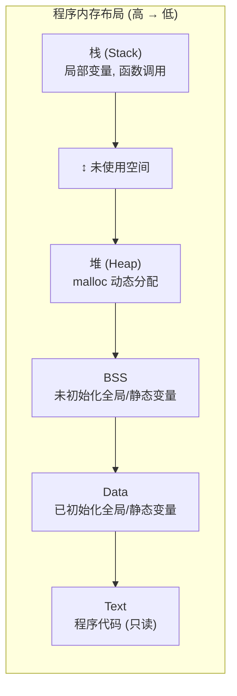

## 1. 程序内存布局

### 1.1 内存区域



### 1.2 各区域特点

| 区域 | 分配方式 | 生命周期 | 大小限制 |
|------|----------|----------|----------|
| 栈 | 自动 | 函数调用期间 | 通常 1-8 MB |
| 堆 | 手动 | 直到 free | 受限于物理内存 |
| BSS | 编译时 | 程序运行期间 | 较大 |
| Data | 编译时 | 程序运行期间 | 较大 |
| Text | 编译时 | 程序运行期间 | - |

### 1.3 查看内存布局

```c
#include <stdio.h>
#include <stdlib.h>

int global_init = 10;     // Data 段
int global_uninit;        // BSS 段

int main(void) {
    int local = 10;       // 栈
    static int static_var = 20;  // Data 段
    int *heap = malloc(sizeof(int));  // 堆
    
    printf("代码段: %p\n", main);
    printf("Data 段: %p\n", &global_init);
    printf("BSS 段: %p\n", &global_uninit);
    printf("堆: %p\n", heap);
    printf("栈: %p\n", &local);
    
    free(heap);
    return 0;
}
```

---

## 2. 动态内存分配

### 2.1 malloc

```c
#include <stdlib.h>

// 分配 n 字节, 内容未初始化
void *malloc(size_t size);

int *p = (int *)malloc(sizeof(int));
if (p == NULL) {
    // 分配失败
    perror("malloc");
    exit(1);
}
*p = 10;

// 分配数组
int *arr = (int *)malloc(10 * sizeof(int));
for (int i = 0; i < 10; i++) {
    arr[i] = i;
}

free(p);
free(arr);
```

### 2.2 calloc

```c
// 分配 num 个大小为 size 的元素, 初始化为 0
void *calloc(size_t num, size_t size);

int *arr = (int *)calloc(10, sizeof(int));
// 等价于 malloc + memset(arr, 0, ...)

for (int i = 0; i < 10; i++) {
    printf("%d ", arr[i]);  // 全是 0
}

free(arr);
```

### 2.3 realloc

```c
// 调整已分配内存的大小
void *realloc(void *ptr, size_t size);

int *arr = (int *)malloc(5 * sizeof(int));
for (int i = 0; i < 5; i++) {
    arr[i] = i + 1;
}

// 扩展到 10 个元素
int *new_arr = (int *)realloc(arr, 10 * sizeof(int));
if (new_arr == NULL) {
    // realloc 失败, 原内存仍有效
    free(arr);
    exit(1);
}
arr = new_arr;  // realloc 可能移动内存

// 新增部分未初始化
for (int i = 5; i < 10; i++) {
    arr[i] = 0;
}

free(arr);
```

**realloc 规则**:
- `ptr == NULL`: 等价于 `malloc(size)`
- `size == 0`: 等价于 `free(ptr)` (某些实现)
- 可能返回新地址, 原指针失效

### 2.4 free

```c
void free(void *ptr);

int *p = (int *)malloc(sizeof(int));
// 使用 p
free(p);     // 释放内存
p = NULL;    // 避免野指针

// free(NULL) 是安全的, 什么也不做
free(NULL);
```

### 2.5 常见错误模式

```c
// 错误 1: 内存泄漏
void leak(void) {
    int *p = malloc(sizeof(int));
    // 忘记 free
}

// 错误 2: 双重释放
int *p = malloc(sizeof(int));
free(p);
free(p);  // 未定义行为!

// 错误 3: 使用已释放的内存
int *p = malloc(sizeof(int));
*p = 10;
free(p);
*p = 20;  // 悬空指针!

// 错误 4: 释放非堆内存
int x = 10;
free(&x);  // 错误!

// 错误 5: 缓冲区溢出
int *arr = malloc(5 * sizeof(int));
arr[10] = 100;  // 越界!
```

---

## 3. 内存泄漏检测

### 3.1 Valgrind

```bash
# 安装
sudo apt install valgrind

# 编译时加 -g
gcc -g -O0 program.c -o program

# 运行检测
valgrind --leak-check=full ./program
```

### 3.2 Valgrind 输出示例

```
==12345== HEAP SUMMARY:
==12345==     in use at exit: 40 bytes in 1 blocks
==12345==   total heap usage: 1 allocs, 0 frees, 40 bytes allocated
==12345==
==12345== 40 bytes in 1 blocks are definitely lost in loss record 1 of 1
==12345==    at 0x4C2BBAF: malloc (vg_replace_malloc.c:299)
==12345==    by 0x4005ED: main (program.c:5)
==12345==
==12345== LEAK SUMMARY:
==12345==    definitely lost: 40 bytes in 1 blocks
```

### 3.3 AddressSanitizer (ASan)

```bash
# 编译时启用
gcc -fsanitize=address -g program.c -o program

# 运行
./program
```

ASan 可以检测:
- 堆缓冲区溢出
- 栈缓冲区溢出
- 使用已释放内存
- 内存泄漏 (使用 `ASAN_OPTIONS=detect_leaks=1`)

---

## 4. 内存对齐

### 4.1 什么是内存对齐

CPU 访问对齐的内存更高效:

```c
struct aligned {
    char a;    // 1 字节, 偏移 0
    // 3 字节填充
    int b;     // 4 字节, 偏移 4
    char c;    // 1 字节, 偏移 8
    // 3 字节填充
};

printf("sizeof = %zu\n", sizeof(struct aligned));  // 12, 不是 6
```

### 4.2 对齐规则

1. 每个成员的偏移量必须是其大小的倍数
2. 结构体总大小必须是最大成员大小的倍数

```c
struct example {
    char a;    // 偏移 0, 大小 1
    // 填充 7 字节
    double b;  // 偏移 8, 大小 8
    char c;    // 偏移 16, 大小 1
    // 填充 3 字节
    int d;     // 偏移 20, 大小 4
    // 填充 4 字节 (使总大小为 8 的倍数)
};
// sizeof = 32
```

### 4.3 优化结构体布局

```c
// 未优化: 24 字节
struct bad_layout {
    char a;    // 1 + 7 padding
    double b;  // 8
    char c;    // 1 + 3 padding
    int d;     // 4
};

// 优化后: 16 字节
struct good_layout {
    double b;  // 8
    int d;     // 4
    char a;    // 1
    char c;    // 1 + 2 padding
};
```

### 4.4 控制对齐

```c
// GCC 扩展: 指定对齐
struct __attribute__((aligned(16))) aligned16 {
    int x;
};

// 禁用填充 (谨慎使用)
struct __attribute__((packed)) packed_struct {
    char a;
    int b;
};
printf("sizeof = %zu\n", sizeof(struct packed_struct));  // 5

// C11 标准方式
#include <stdalign.h>
alignas(16) int x;
```

### 4.5 C11 `aligned_alloc`

动态分配对齐内存:

```c
#include <stdlib.h>

// void *aligned_alloc(size_t alignment, size_t size);
// alignment 必须是 2 的幂, size 必须是 alignment 的倍数

// 分配 16 字节对齐的 64 字节
void *ptr = aligned_alloc(16, 64);
if (ptr) {
    printf("Address: %p (aligned to 16)\n", ptr);
    free(ptr);  // 使用普通 free 释放
}

// POSIX: posix_memalign
void *ptr2;
if (posix_memalign(&ptr2, 16, 100) == 0) {
    // size 不必是 alignment 的倍数
    free(ptr2);
}

// 典型用途: SIMD 操作
alignas(32) float data[8];  // AVX 要求 32 字节对齐
```

---

## 5. 内存操作函数

### 5.1 memset

```c
#include <string.h>

// 将内存设置为特定字节值
void *memset(void *ptr, int value, size_t num);

int arr[10];
memset(arr, 0, sizeof(arr));  // 全部清零

// 注意: value 是字节值
int arr2[10];
memset(arr2, 1, sizeof(arr2));
// arr2[0] != 1, 而是 0x01010101
```

### 5.2 memcpy

```c
// 复制内存 (不处理重叠)
void *memcpy(void *dest, const void *src, size_t num);

int src[5] = {1, 2, 3, 4, 5};
int dest[5];
memcpy(dest, src, sizeof(src));
```

### 5.3 memmove

```c
// 复制内存 (处理重叠)
void *memmove(void *dest, const void *src, size_t num);

int arr[5] = {1, 2, 3, 4, 5};
memmove(arr + 1, arr, 3 * sizeof(int));  // 安全
// arr: {1, 1, 2, 3, 5}
```

### 5.4 memcmp

```c
// 比较内存
int memcmp(const void *ptr1, const void *ptr2, size_t num);

int a[3] = {1, 2, 3};
int b[3] = {1, 2, 3};
int c[3] = {1, 2, 4};

memcmp(a, b, sizeof(a));  // 0 (相等)
memcmp(a, c, sizeof(a));  // < 0 (a < c)
```

---

## 6. 内存池

### 6.1 为什么需要内存池

频繁的 `malloc/free` 有问题:
- 系统调用开销
- 内存碎片
- 分配不确定性

### 6.2 简单内存池实现

```c
#define POOL_SIZE 1024
#define BLOCK_SIZE 64

typedef struct {
    char memory[POOL_SIZE];
    size_t offset;
} MemoryPool;

void pool_init(MemoryPool *pool) {
    pool->offset = 0;
}

void *pool_alloc(MemoryPool *pool, size_t size) {
    // 对齐到 8 字节
    size = (size + 7) & ~7;
    
    if (pool->offset + size > POOL_SIZE) {
        return NULL;  // 池满
    }
    
    void *ptr = pool->memory + pool->offset;
    pool->offset += size;
    return ptr;
}

void pool_reset(MemoryPool *pool) {
    pool->offset = 0;  // 重置, 不释放单个块
}
```

---

## 7. 灵活数组成员 (C99)

```c
// 最后一个成员可以是不完整数组
struct string {
    size_t length;
    char data[];  // 灵活数组成员
};

struct string *create_string(const char *s) {
    size_t len = strlen(s);
    struct string *str = malloc(sizeof(struct string) + len + 1);
    str->length = len;
    strcpy(str->data, s);
    return str;
}

struct string *s = create_string("Hello");
printf("%zu: %s\n", s->length, s->data);  // 5: Hello
free(s);
```

---

## 8. 练习

### 8.1 动态数组

实现一个可自动扩展的动态数组.

### 8.2 内存池

实现一个简单的固定大小块内存池.

### 8.3 字符串复制

实现 `my_strdup` 函数.

---

## 9. 思考题

1. malloc 返回的内存初始化了吗?
2. realloc 失败后原内存怎么办?
3. 为什么需要内存对齐?
4. 如何避免内存泄漏?
5. 内存池有什么优缺点?

---

## 10. 本周小结

- **内存布局**: 栈, 堆, BSS, Data, Text.
- **动态分配**: malloc, calloc, realloc, free.
- **常见错误**: 泄漏, 双重释放, 悬空指针.
- **检测工具**: Valgrind, AddressSanitizer.
- **内存对齐**: 提高访问效率.
- **内存函数**: memset, memcpy, memmove.
- **内存池**: 减少碎片和开销.

---

> 动态内存管理是 C 语言的核心难点. 正确使用内存, 是编写健壮程序的关键.
