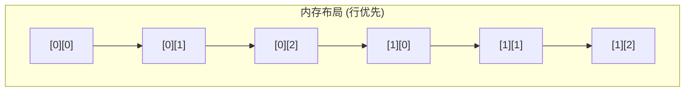

## 1. 多维数组

### 1.1 二维数组



```c
// 声明与初始化
int matrix[3][4] = {
    {1, 2, 3, 4},
    {5, 6, 7, 8},
    {9, 10, 11, 12}
};

// 访问元素
matrix[1][2] = 100;  // 第2行第3列

// 遍历
for (int i = 0; i < 3; i++) {
    for (int j = 0; j < 4; j++) {
        printf("%d ", matrix[i][j]);
    }
    printf("\n");
}
```

### 1.2 内存布局

C 语言多维数组按**行优先 (Row-major)** 存储:

```
matrix[3][4] 在内存中:
[0][0] [0][1] [0][2] [0][3] [1][0] [1][1] [1][2] [1][3] [2][0] ...

地址计算:
&matrix[i][j] = base + (i * 4 + j) * sizeof(int)
```

### 1.3 二维数组参数

```c
// 必须指定列数
void print_matrix(int mat[][4], int rows) {
    for (int i = 0; i < rows; i++) {
        for (int j = 0; j < 4; j++) {
            printf("%d ", mat[i][j]);
        }
        printf("\n");
    }
}

// 使用数组指针
void print_matrix_ptr(int (*mat)[4], int rows);

// 使用指针和手动计算
void print_matrix_flat(int *mat, int rows, int cols) {
    for (int i = 0; i < rows; i++) {
        for (int j = 0; j < cols; j++) {
            printf("%d ", mat[i * cols + j]);
        }
        printf("\n");
    }
}
```

### 1.4 可变长数组 (VLA, C99)

```c
void process(int rows, int cols, int mat[rows][cols]) {
    for (int i = 0; i < rows; i++) {
        for (int j = 0; j < cols; j++) {
            mat[i][j] *= 2;
        }
    }
}

int main(void) {
    int m[3][4] = {{1, 2, 3, 4}, {5, 6, 7, 8}, {9, 10, 11, 12}};
    process(3, 4, m);
    return 0;
}
```

---

## 2. 结构体基础

### 2.1 结构体定义

```c
// 定义结构体类型
struct Point {
    int x;
    int y;
};

// 声明变量
struct Point p1;
struct Point p2 = {3, 4};       // 按顺序初始化
struct Point p3 = {.y = 4, .x = 3};  // 指定成员

// 访问成员
p1.x = 10;
p1.y = 20;
printf("(%d, %d)\n", p1.x, p1.y);
```

### 2.2 typedef

```c
typedef struct {
    int x;
    int y;
} Point;

Point p = {3, 4};  // 不需要 struct 关键字

// 或者
typedef struct Point {
    int x;
    int y;
} Point;
```

### 2.3 结构体数组

```c
typedef struct {
    char name[50];
    int age;
} Person;

Person people[3] = {
    {"Alice", 25},
    {"Bob", 30},
    {"Charlie", 35}
};

for (int i = 0; i < 3; i++) {
    printf("%s: %d\n", people[i].name, people[i].age);
}
```

### 2.4 结构体指针

```c
Point p = {3, 4};
Point *ptr = &p;

// 访问成员
printf("x = %d\n", (*ptr).x);
printf("y = %d\n", ptr->y);    // -> 是简写

// 动态分配
Point *dyn = malloc(sizeof(Point));
dyn->x = 10;
dyn->y = 20;
free(dyn);
```

---

## 3. 结构体内存布局

### 3.1 对齐规则

```c
struct Example {
    char a;    // 1 字节, 偏移 0
    // 3 字节填充
    int b;     // 4 字节, 偏移 4
    char c;    // 1 字节, 偏移 8
    // 3 字节填充
};

printf("sizeof = %zu\n", sizeof(struct Example));  // 12
```

### 3.2 offsetof 宏

```c
#include <stddef.h>

struct Example {
    char a;
    int b;
    char c;
};

printf("offsetof(a) = %zu\n", offsetof(struct Example, a));  // 0
printf("offsetof(b) = %zu\n", offsetof(struct Example, b));  // 4
printf("offsetof(c) = %zu\n", offsetof(struct Example, c));  // 8
```

### 3.3 优化布局

```c
// 未优化: 12 字节
struct Bad {
    char a;    // 1 + 3 padding
    int b;     // 4
    char c;    // 1 + 3 padding
};

// 优化: 8 字节
struct Good {
    int b;     // 4
    char a;    // 1
    char c;    // 1 + 2 padding
};
```

### 3.4 禁用对齐

```c
// GCC 扩展
struct __attribute__((packed)) Packed {
    char a;
    int b;
    char c;
};

printf("sizeof = %zu\n", sizeof(struct Packed));  // 6

// 注意: packed 结构可能导致未对齐访问, 影响性能或在某些架构上崩溃
```

---

## 4. 结构体操作

### 4.1 结构体赋值

```c
Point p1 = {3, 4};
Point p2;

p2 = p1;  // 成员逐一复制

// 等价于
memcpy(&p2, &p1, sizeof(Point));
```

### 4.2 结构体比较

```c
Point p1 = {3, 4};
Point p2 = {3, 4};

// 不能直接比较
// if (p1 == p2) { }  // 编译错误

// 方法 1: 逐个成员比较
if (p1.x == p2.x && p1.y == p2.y) {
    printf("Equal\n");
}

// 方法 2: memcmp (注意填充字节可能不同)
if (memcmp(&p1, &p2, sizeof(Point)) == 0) {
    printf("Equal\n");
}
```

### 4.3 结构体作为函数参数

```c
// 值传递 (复制)
void print_point(Point p) {
    printf("(%d, %d)\n", p.x, p.y);
}

// 指针传递 (高效)
void print_point_ptr(const Point *p) {
    printf("(%d, %d)\n", p->x, p->y);
}

// 修改结构体
void move_point(Point *p, int dx, int dy) {
    p->x += dx;
    p->y += dy;
}
```

### 4.4 返回结构体

```c
Point make_point(int x, int y) {
    Point p = {x, y};
    return p;  // 返回副本
}

// 或者通过指针参数
void init_point(Point *p, int x, int y) {
    p->x = x;
    p->y = y;
}
```

---

## 5. 嵌套结构体

```c
typedef struct {
    int x, y;
} Point;

typedef struct {
    Point center;
    int radius;
} Circle;

Circle c = {{10, 20}, 5};
// 或
Circle c = {.center = {10, 20}, .radius = 5};

printf("Center: (%d, %d)\n", c.center.x, c.center.y);
printf("Radius: %d\n", c.radius);
```

---

## 6. 位域 (Bit-fields)

### 6.1 定义

```c
struct Flags {
    unsigned int flag1 : 1;  // 1 位
    unsigned int flag2 : 1;  // 1 位
    unsigned int value : 4;  // 4 位
    unsigned int : 0;        // 强制对齐到下一个单位
    unsigned int flag3 : 1;
};

struct Flags f = {0};
f.flag1 = 1;
f.value = 10;

printf("sizeof = %zu\n", sizeof(struct Flags));
```

### 6.2 应用场景

```c
// 硬件寄存器
struct StatusRegister {
    unsigned int ready : 1;
    unsigned int error : 1;
    unsigned int mode : 3;
    unsigned int reserved : 27;
};

// 协议头
struct TCPHeader {
    uint16_t src_port;
    uint16_t dst_port;
    uint32_t seq_num;
    uint32_t ack_num;
    unsigned int data_offset : 4;
    unsigned int reserved : 6;
    unsigned int flags : 6;
    uint16_t window;
    // ...
};
```

### 6.3 注意事项

- 位域不能取地址
- 跨平台行为可能不同
- 建议使用位掩码操作代替关键场景

### 6.4 柔性数组成员 (Flexible Array Member, C99)

```c
// 结构体末尾的不完整数组
struct Packet {
    uint16_t length;
    uint16_t type;
    uint8_t data[];  // 柔性数组, 必须是最后一个成员
};

// sizeof 不包含柔性数组
printf("%zu\n", sizeof(struct Packet));  // 4

// 分配时包含数据空间
size_t data_len = 100;
struct Packet *pkt = malloc(sizeof(struct Packet) + data_len);
pkt->length = data_len;
memcpy(pkt->data, src, data_len);

// 使用
for (int i = 0; i < pkt->length; i++) {
    printf("%02x ", pkt->data[i]);
}

free(pkt);
```

柔性数组的优势:
- 单次分配, 内存连续
- 缓存友好
- 避免额外的指针间接寻址

### 6.5 container_of 宏 (内核风格)

```c
#include <stddef.h>

// 从成员指针获取包含它的结构体指针
#define container_of(ptr, type, member) \
    ((type *)((char *)(ptr) - offsetof(type, member)))

struct Node {
    int value;
    struct Node *next;
};

struct Container {
    int id;
    struct Node node;  // 嵌入的结构体
    char name[32];
};

void process_node(struct Node *n) {
    // 从 node 成员获取 Container 指针
    struct Container *c = container_of(n, struct Container, node);
    printf("Container id: %d, name: %s\n", c->id, c->name);
}

int main(void) {
    struct Container c = {.id = 42, .node = {.value = 100}, .name = "test"};
    process_node(&c.node);  // 只传递嵌入成员的指针
    return 0;
}
```

container_of 在 Linux 内核中广泛使用:
- 链表实现 (`list_entry`)
- 红黑树节点
- 设备驱动模型

---

## 7. 练习

### 7.1 复数运算

定义复数结构体, 实现加减乘操作.

### 7.2 矩阵运算

实现矩阵乘法函数.

### 7.3 学生成绩管理

设计结构体存储学生信息, 实现排序和统计功能.

---

## 8. 思考题

1. 为什么结构体需要内存对齐?
2. 如何计算结构体成员的偏移量?
3. 值传递结构体有什么问题?
4. 位域的应用场景是什么?
5. 嵌套结构体如何访问?

---

## 9. 本周小结

- **多维数组**: 行优先存储, 参数传递.
- **结构体**: 定义, 初始化, 访问.
- **内存布局**: 对齐, offsetof, packed.
- **结构体操作**: 赋值, 比较, 参数传递.
- **嵌套结构体**: 结构体中的结构体.
- **位域**: 紧凑的位级成员.

---

> 结构体是组织复杂数据的基础. 理解内存布局, 才能写出高效的代码.
