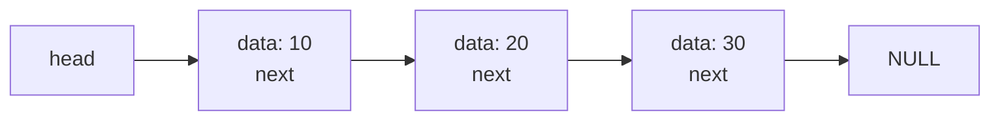
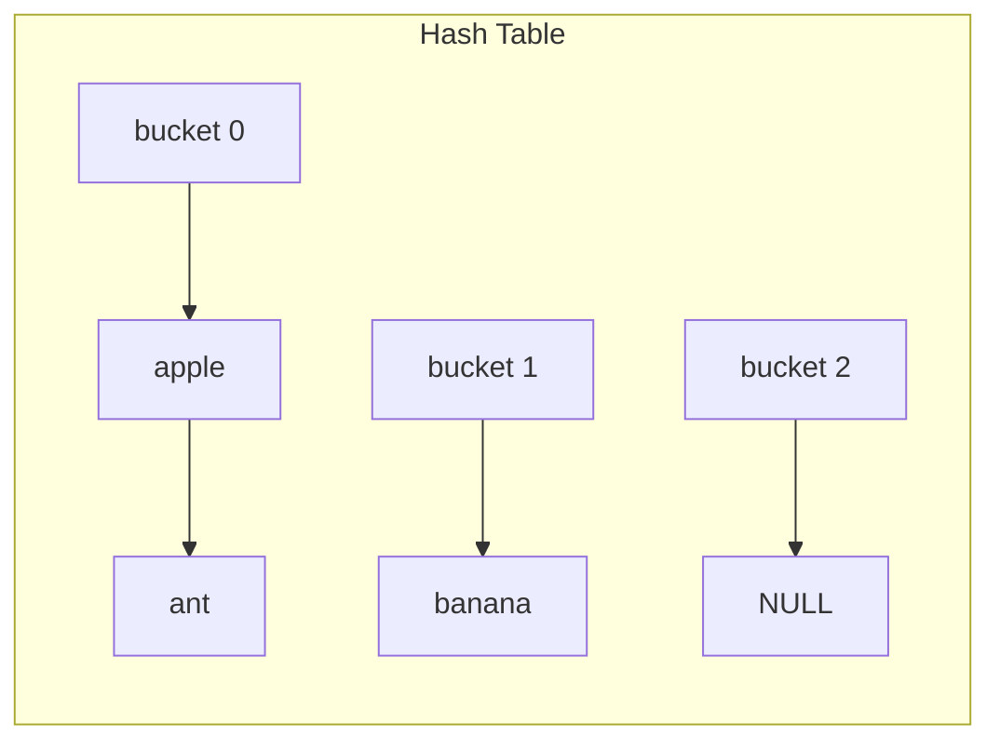

## 1. 链表

### 1.1 单向链表



```c
typedef struct Node {
    int data;
    struct Node *next;
} Node;

typedef struct {
    Node *head;
    size_t size;
} LinkedList;

// 创建节点
Node *create_node(int data) {
    Node *node = malloc(sizeof(Node));
    if (node) {
        node->data = data;
        node->next = NULL;
    }
    return node;
}

// 初始化链表
void list_init(LinkedList *list) {
    list->head = NULL;
    list->size = 0;
}

// 头部插入
void list_push_front(LinkedList *list, int data) {
    Node *node = create_node(data);
    node->next = list->head;
    list->head = node;
    list->size++;
}

// 尾部插入
void list_push_back(LinkedList *list, int data) {
    Node *node = create_node(data);
    if (list->head == NULL) {
        list->head = node;
    } else {
        Node *curr = list->head;
        while (curr->next != NULL) {
            curr = curr->next;
        }
        curr->next = node;
    }
    list->size++;
}

// 删除头部
int list_pop_front(LinkedList *list) {
    if (list->head == NULL) {
        return -1;  // 错误
    }
    Node *node = list->head;
    int data = node->data;
    list->head = node->next;
    free(node);
    list->size--;
    return data;
}

// 遍历
void list_print(const LinkedList *list) {
    for (Node *curr = list->head; curr != NULL; curr = curr->next) {
        printf("%d -> ", curr->data);
    }
    printf("NULL\n");
}

// 释放
void list_free(LinkedList *list) {
    Node *curr = list->head;
    while (curr != NULL) {
        Node *next = curr->next;
        free(curr);
        curr = next;
    }
    list->head = NULL;
    list->size = 0;
}
```

### 1.2 双向链表

```c
typedef struct DNode {
    int data;
    struct DNode *prev;
    struct DNode *next;
} DNode;

typedef struct {
    DNode *head;
    DNode *tail;
    size_t size;
} DoublyLinkedList;

void dlist_push_back(DoublyLinkedList *list, int data) {
    DNode *node = malloc(sizeof(DNode));
    node->data = data;
    node->next = NULL;
    node->prev = list->tail;
    
    if (list->tail) {
        list->tail->next = node;
    } else {
        list->head = node;
    }
    list->tail = node;
    list->size++;
}
```

---

## 2. 栈

### 2.1 数组实现

```c
#define STACK_SIZE 100

typedef struct {
    int data[STACK_SIZE];
    int top;
} Stack;

void stack_init(Stack *s) {
    s->top = -1;
}

int stack_is_empty(const Stack *s) {
    return s->top == -1;
}

int stack_is_full(const Stack *s) {
    return s->top == STACK_SIZE - 1;
}

void stack_push(Stack *s, int value) {
    if (!stack_is_full(s)) {
        s->data[++s->top] = value;
    }
}

int stack_pop(Stack *s) {
    if (!stack_is_empty(s)) {
        return s->data[s->top--];
    }
    return -1;  // 错误
}

int stack_peek(const Stack *s) {
    if (!stack_is_empty(s)) {
        return s->data[s->top];
    }
    return -1;
}
```

### 2.2 链表实现

```c
typedef struct StackNode {
    int data;
    struct StackNode *next;
} StackNode;

typedef struct {
    StackNode *top;
    size_t size;
} LinkedStack;

void lstack_push(LinkedStack *s, int value) {
    StackNode *node = malloc(sizeof(StackNode));
    node->data = value;
    node->next = s->top;
    s->top = node;
    s->size++;
}

int lstack_pop(LinkedStack *s) {
    if (s->top == NULL) return -1;
    StackNode *node = s->top;
    int value = node->data;
    s->top = node->next;
    free(node);
    s->size--;
    return value;
}
```

---

## 3. 队列

### 3.1 数组实现 (环形队列)

```c
#define QUEUE_SIZE 100

typedef struct {
    int data[QUEUE_SIZE];
    int front;
    int rear;
    size_t count;
} Queue;

void queue_init(Queue *q) {
    q->front = 0;
    q->rear = 0;
    q->count = 0;
}

int queue_is_empty(const Queue *q) {
    return q->count == 0;
}

int queue_is_full(const Queue *q) {
    return q->count == QUEUE_SIZE;
}

void queue_enqueue(Queue *q, int value) {
    if (!queue_is_full(q)) {
        q->data[q->rear] = value;
        q->rear = (q->rear + 1) % QUEUE_SIZE;
        q->count++;
    }
}

int queue_dequeue(Queue *q) {
    if (!queue_is_empty(q)) {
        int value = q->data[q->front];
        q->front = (q->front + 1) % QUEUE_SIZE;
        q->count--;
        return value;
    }
    return -1;
}
```

---

## 4. 哈希表

### 4.1 链地址法



```c
#define TABLE_SIZE 101

typedef struct Entry {
    char *key;
    int value;
    struct Entry *next;
} Entry;

typedef struct {
    Entry *buckets[TABLE_SIZE];
} HashTable;

unsigned int hash(const char *key) {
    unsigned int h = 0;
    while (*key) {
        h = h * 31 + *key++;
    }
    return h % TABLE_SIZE;
}

void ht_init(HashTable *ht) {
    memset(ht->buckets, 0, sizeof(ht->buckets));
}

void ht_put(HashTable *ht, const char *key, int value) {
    unsigned int index = hash(key);
    Entry *entry = ht->buckets[index];
    
    // 查找已存在的键
    while (entry) {
        if (strcmp(entry->key, key) == 0) {
            entry->value = value;
            return;
        }
        entry = entry->next;
    }
    
    // 创建新条目
    entry = malloc(sizeof(Entry));
    entry->key = strdup(key);
    entry->value = value;
    entry->next = ht->buckets[index];
    ht->buckets[index] = entry;
}

int ht_get(const HashTable *ht, const char *key, int *value) {
    unsigned int index = hash(key);
    Entry *entry = ht->buckets[index];
    
    while (entry) {
        if (strcmp(entry->key, key) == 0) {
            *value = entry->value;
            return 1;  // 找到
        }
        entry = entry->next;
    }
    return 0;  // 未找到
}

void ht_free(HashTable *ht) {
    for (int i = 0; i < TABLE_SIZE; i++) {
        Entry *entry = ht->buckets[i];
        while (entry) {
            Entry *next = entry->next;
            free(entry->key);
            free(entry);
            entry = next;
        }
    }
}
```

---

## 5. 二叉树

### 5.1 定义

```c
typedef struct TreeNode {
    int data;
    struct TreeNode *left;
    struct TreeNode *right;
} TreeNode;

TreeNode *tree_create_node(int data) {
    TreeNode *node = malloc(sizeof(TreeNode));
    node->data = data;
    node->left = NULL;
    node->right = NULL;
    return node;
}
```

### 5.2 遍历

```c
// 前序遍历: 根 -> 左 -> 右
void tree_preorder(const TreeNode *root) {
    if (root == NULL) return;
    printf("%d ", root->data);
    tree_preorder(root->left);
    tree_preorder(root->right);
}

// 中序遍历: 左 -> 根 -> 右
void tree_inorder(const TreeNode *root) {
    if (root == NULL) return;
    tree_inorder(root->left);
    printf("%d ", root->data);
    tree_inorder(root->right);
}

// 后序遍历: 左 -> 右 -> 根
void tree_postorder(const TreeNode *root) {
    if (root == NULL) return;
    tree_postorder(root->left);
    tree_postorder(root->right);
    printf("%d ", root->data);
}
```

### 5.3 二叉搜索树

```c
TreeNode *bst_insert(TreeNode *root, int data) {
    if (root == NULL) {
        return tree_create_node(data);
    }
    
    if (data < root->data) {
        root->left = bst_insert(root->left, data);
    } else if (data > root->data) {
        root->right = bst_insert(root->right, data);
    }
    
    return root;
}

TreeNode *bst_search(TreeNode *root, int data) {
    if (root == NULL || root->data == data) {
        return root;
    }
    
    if (data < root->data) {
        return bst_search(root->left, data);
    }
    return bst_search(root->right, data);
}
```

### 5.4 AVL 树与红黑树对比

**AVL 树**: 严格平衡 (左右子树高度差 ≤ 1)

```c
typedef struct AVLNode {
    int data;
    int height;
    struct AVLNode *left, *right;
} AVLNode;

int height(AVLNode *n) {
    return n ? n->height : 0;
}

int balance_factor(AVLNode *n) {
    return n ? height(n->left) - height(n->right) : 0;
}

// 右旋 (LL 情况)
AVLNode *rotate_right(AVLNode *y) {
    AVLNode *x = y->left;
    AVLNode *T2 = x->right;
    x->right = y;
    y->left = T2;
    y->height = 1 + (height(y->left) > height(y->right) ? 
                     height(y->left) : height(y->right));
    x->height = 1 + (height(x->left) > height(x->right) ? 
                     height(x->left) : height(x->right));
    return x;
}

// 插入后修复
AVLNode *avl_insert(AVLNode *node, int data) {
    if (!node) return create_avl_node(data);
    
    if (data < node->data)
        node->left = avl_insert(node->left, data);
    else if (data > node->data)
        node->right = avl_insert(node->right, data);
    else
        return node;

    node->height = 1 + (height(node->left) > height(node->right) ? 
                        height(node->left) : height(node->right));

    int bf = balance_factor(node);

    // LL: 右旋
    if (bf > 1 && data < node->left->data)
        return rotate_right(node);
    // RR: 左旋
    if (bf < -1 && data > node->right->data)
        return rotate_left(node);
    // LR: 先左旋后右旋
    if (bf > 1 && data > node->left->data) {
        node->left = rotate_left(node->left);
        return rotate_right(node);
    }
    // RL: 先右旋后左旋
    if (bf < -1 && data < node->right->data) {
        node->right = rotate_right(node->right);
        return rotate_left(node);
    }

    return node;
}
```

**AVL vs 红黑树**:

| 特性 | AVL 树 | 红黑树 |
| :--- | :--- | :--- |
| 平衡条件 | 高度差 ≤ 1 | 黑高相等 |
| 查找性能 | 略优 (更矮) | 略逊 |
| 插入/删除 | 旋转多 (最坏 O(log n)) | 旋转少 (最坏 3 次) |
| 适用场景 | 读多写少 | 读写均衡 |
| 内核使用 | 内存区域管理 (vm_area) | 进程调度 (CFS), epoll |

**选择指南**:
- 查询频繁, 修改少 → AVL
- 修改频繁 → 红黑树
- 内存敏感 (AVL 需存高度) → 红黑树

### 5.5 红黑树删除

红黑树是自平衡 BST, 删除操作比插入更复杂:

```c
typedef enum { RED, BLACK } Color;

typedef struct RBNode {
    int data;
    Color color;
    struct RBNode *left, *right, *parent;
} RBNode;

typedef struct {
    RBNode *root;
    RBNode *nil;  // 哨兵节点 (所有叶子)
} RBTree;

// 初始化
void rb_init(RBTree *tree) {
    tree->nil = malloc(sizeof(RBNode));
    tree->nil->color = BLACK;
    tree->nil->left = tree->nil->right = tree->nil->parent = NULL;
    tree->root = tree->nil;
}

// 左旋
void rb_left_rotate(RBTree *tree, RBNode *x) {
    RBNode *y = x->right;
    x->right = y->left;
    if (y->left != tree->nil) {
        y->left->parent = x;
    }
    y->parent = x->parent;
    if (x->parent == tree->nil) {
        tree->root = y;
    } else if (x == x->parent->left) {
        x->parent->left = y;
    } else {
        x->parent->right = y;
    }
    y->left = x;
    x->parent = y;
}

// 右旋
void rb_right_rotate(RBTree *tree, RBNode *x) {
    RBNode *y = x->left;
    x->left = y->right;
    if (y->right != tree->nil) {
        y->right->parent = x;
    }
    y->parent = x->parent;
    if (x->parent == tree->nil) {
        tree->root = y;
    } else if (x == x->parent->right) {
        x->parent->right = y;
    } else {
        x->parent->left = y;
    }
    y->right = x;
    x->parent = y;
}

// 查找最小节点
RBNode *rb_minimum(RBTree *tree, RBNode *x) {
    while (x->left != tree->nil) {
        x = x->left;
    }
    return x;
}

// 用 v 替换 u
void rb_transplant(RBTree *tree, RBNode *u, RBNode *v) {
    if (u->parent == tree->nil) {
        tree->root = v;
    } else if (u == u->parent->left) {
        u->parent->left = v;
    } else {
        u->parent->right = v;
    }
    v->parent = u->parent;
}

// 删除修复
void rb_delete_fixup(RBTree *tree, RBNode *x) {
    while (x != tree->root && x->color == BLACK) {
        if (x == x->parent->left) {
            RBNode *w = x->parent->right;
            // Case 1: 兄弟红色
            if (w->color == RED) {
                w->color = BLACK;
                x->parent->color = RED;
                rb_left_rotate(tree, x->parent);
                w = x->parent->right;
            }
            // Case 2: 兄弟两孩子都黑
            if (w->left->color == BLACK && w->right->color == BLACK) {
                w->color = RED;
                x = x->parent;
            } else {
                // Case 3: 兄弟右孩子黑
                if (w->right->color == BLACK) {
                    w->left->color = BLACK;
                    w->color = RED;
                    rb_right_rotate(tree, w);
                    w = x->parent->right;
                }
                // Case 4: 兄弟右孩子红
                w->color = x->parent->color;
                x->parent->color = BLACK;
                w->right->color = BLACK;
                rb_left_rotate(tree, x->parent);
                x = tree->root;
            }
        } else {
            // 对称情况
            RBNode *w = x->parent->left;
            if (w->color == RED) {
                w->color = BLACK;
                x->parent->color = RED;
                rb_right_rotate(tree, x->parent);
                w = x->parent->left;
            }
            if (w->right->color == BLACK && w->left->color == BLACK) {
                w->color = RED;
                x = x->parent;
            } else {
                if (w->left->color == BLACK) {
                    w->right->color = BLACK;
                    w->color = RED;
                    rb_left_rotate(tree, w);
                    w = x->parent->left;
                }
                w->color = x->parent->color;
                x->parent->color = BLACK;
                w->left->color = BLACK;
                rb_right_rotate(tree, x->parent);
                x = tree->root;
            }
        }
    }
    x->color = BLACK;
}

// 删除节点
void rb_delete(RBTree *tree, RBNode *z) {
    RBNode *y = z;
    RBNode *x;
    Color y_original_color = y->color;

    if (z->left == tree->nil) {
        x = z->right;
        rb_transplant(tree, z, z->right);
    } else if (z->right == tree->nil) {
        x = z->left;
        rb_transplant(tree, z, z->left);
    } else {
        y = rb_minimum(tree, z->right);
        y_original_color = y->color;
        x = y->right;
        if (y->parent == z) {
            x->parent = y;
        } else {
            rb_transplant(tree, y, y->right);
            y->right = z->right;
            y->right->parent = y;
        }
        rb_transplant(tree, z, y);
        y->left = z->left;
        y->left->parent = y;
        y->color = z->color;
    }

    if (y_original_color == BLACK) {
        rb_delete_fixup(tree, x);
    }
    free(z);
}
```

**删除的四种情况** (x 是替代节点):

| Case | 兄弟 w | 处理 |
| :--- | :--- | :--- |
| 1 | 红色 | 交换颜色并旋转, 转为 Case 2-4 |
| 2 | 黑色, 两个黑孩子 | w 变红, 上移双黑 |
| 3 | 黑色, 近侄红 远侄黑 | 旋转转为 Case 4 |
| 4 | 黑色, 远侄红 | 旋转+重着色, 完成 |

---

## 6. 练习

### 6.1 链表反转

实现单向链表的原地反转.

### 6.2 括号匹配

使用栈检查括号是否匹配.

### 6.3 LRU 缓存

使用哈希表和双向链表实现 LRU 缓存.

---

## 7. 思考题

1. 数组和链表的时间复杂度对比?
2. 哈希冲突的解决方法有哪些?
3. 二叉搜索树的最坏情况是什么?
4. 如何选择合适的数据结构?
5. 递归遍历和迭代遍历的区别?

---

## 8. 本周小结

- **链表**: 单向, 双向, 循环.
- **栈**: LIFO, 数组/链表实现.
- **队列**: FIFO, 环形队列.
- **哈希表**: 链地址法.
- **二叉树**: 遍历, BST.

---

> 数据结构是算法的基础. 理解各种数据结构的实现, 是编写高效程序的关键.
