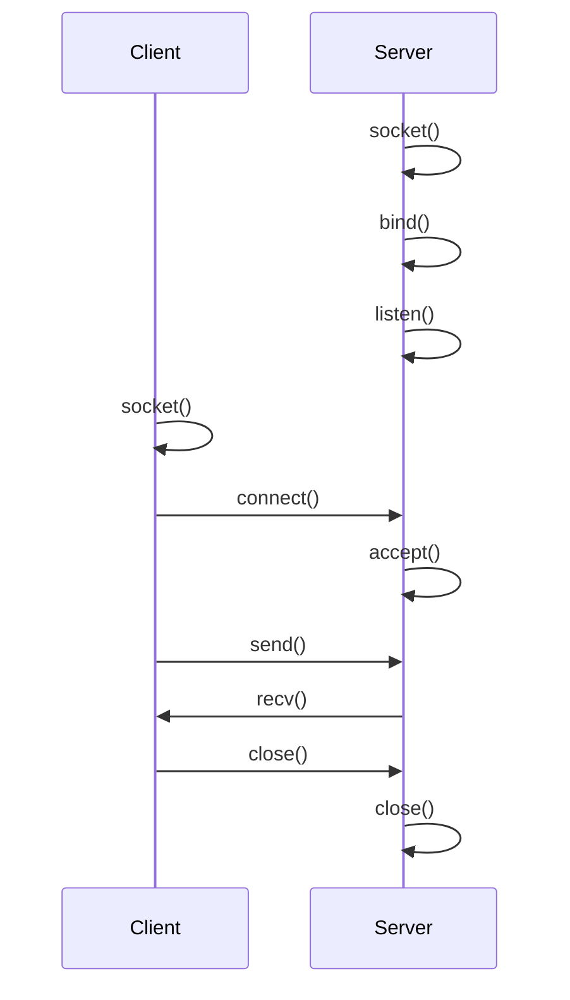

## 1. Socket 基础

### 1.1 Socket 概念

Socket 是网络通信的端点, 提供进程间通信的接口.



### 1.2 Socket 地址结构

```c
#include <sys/socket.h>
#include <netinet/in.h>
#include <arpa/inet.h>

// IPv4 地址
struct sockaddr_in {
    sa_family_t    sin_family;  // AF_INET
    in_port_t      sin_port;    // 端口 (网络字节序)
    struct in_addr sin_addr;    // IP 地址
};

// 通用地址
struct sockaddr {
    sa_family_t sa_family;
    char        sa_data[14];
};
```

### 1.3 字节序转换

```c
// 主机字节序 -> 网络字节序
uint16_t htons(uint16_t hostshort);
uint32_t htonl(uint32_t hostlong);

// 网络字节序 -> 主机字节序
uint16_t ntohs(uint16_t netshort);
uint32_t ntohl(uint32_t netlong);
```

### 1.4 地址转换

```c
// 字符串 -> 二进制
inet_pton(AF_INET, "192.168.1.1", &addr.sin_addr);

// 二进制 -> 字符串
char str[INET_ADDRSTRLEN];
inet_ntop(AF_INET, &addr.sin_addr, str, sizeof(str));
```

---

## 2. TCP 编程

### 2.1 服务器流程

```c
#include <stdio.h>
#include <string.h>
#include <unistd.h>
#include <sys/socket.h>
#include <netinet/in.h>

int main(void) {
    // 1. 创建 socket
    int server_fd = socket(AF_INET, SOCK_STREAM, 0);
    
    // 设置地址重用
    int opt = 1;
    setsockopt(server_fd, SOL_SOCKET, SO_REUSEADDR, &opt, sizeof(opt));
    
    // 2. 绑定地址
    struct sockaddr_in addr = {
        .sin_family = AF_INET,
        .sin_port = htons(8080),
        .sin_addr.s_addr = INADDR_ANY
    };
    bind(server_fd, (struct sockaddr *)&addr, sizeof(addr));
    
    // 3. 监听
    listen(server_fd, 5);
    printf("Server listening on port 8080\n");
    
    while (1) {
        // 4. 接受连接
        struct sockaddr_in client_addr;
        socklen_t len = sizeof(client_addr);
        int client_fd = accept(server_fd, 
                               (struct sockaddr *)&client_addr, &len);
        
        // 5. 处理请求
        char buf[1024];
        ssize_t n = read(client_fd, buf, sizeof(buf) - 1);
        buf[n] = '\0';
        printf("Received: %s\n", buf);
        
        // 6. 发送响应
        const char *response = "HTTP/1.1 200 OK\r\n\r\nHello";
        write(client_fd, response, strlen(response));
        
        // 7. 关闭连接
        close(client_fd);
    }
    
    close(server_fd);
    return 0;
}
```

### 2.2 客户端流程

```c
int main(void) {
    // 1. 创建 socket
    int sock = socket(AF_INET, SOCK_STREAM, 0);
    
    // 2. 连接服务器
    struct sockaddr_in addr = {
        .sin_family = AF_INET,
        .sin_port = htons(8080)
    };
    inet_pton(AF_INET, "127.0.0.1", &addr.sin_addr);
    connect(sock, (struct sockaddr *)&addr, sizeof(addr));
    
    // 3. 发送数据
    write(sock, "Hello, Server!", 14);
    
    // 4. 接收响应
    char buf[1024];
    ssize_t n = read(sock, buf, sizeof(buf) - 1);
    buf[n] = '\0';
    printf("Response: %s\n", buf);
    
    // 5. 关闭
    close(sock);
    return 0;
}
```

---

## 3. UDP 编程

### 3.1 服务器

```c
int main(void) {
    int sock = socket(AF_INET, SOCK_DGRAM, 0);
    
    struct sockaddr_in addr = {
        .sin_family = AF_INET,
        .sin_port = htons(8080),
        .sin_addr.s_addr = INADDR_ANY
    };
    bind(sock, (struct sockaddr *)&addr, sizeof(addr));
    
    while (1) {
        char buf[1024];
        struct sockaddr_in client_addr;
        socklen_t len = sizeof(client_addr);
        
        ssize_t n = recvfrom(sock, buf, sizeof(buf), 0,
                             (struct sockaddr *)&client_addr, &len);
        
        // 回显
        sendto(sock, buf, n, 0, 
               (struct sockaddr *)&client_addr, len);
    }
    
    close(sock);
    return 0;
}
```

### 3.2 客户端

```c
int main(void) {
    int sock = socket(AF_INET, SOCK_DGRAM, 0);
    
    struct sockaddr_in addr = {
        .sin_family = AF_INET,
        .sin_port = htons(8080)
    };
    inet_pton(AF_INET, "127.0.0.1", &addr.sin_addr);
    
    sendto(sock, "Hello", 5, 0, 
           (struct sockaddr *)&addr, sizeof(addr));
    
    char buf[1024];
    ssize_t n = recvfrom(sock, buf, sizeof(buf), 0, NULL, NULL);
    buf[n] = '\0';
    printf("Response: %s\n", buf);
    
    close(sock);
    return 0;
}
```

---

## 4. I/O 多路复用

### 4.1 select

```c
#include <sys/select.h>

fd_set readfds;
FD_ZERO(&readfds);
FD_SET(server_fd, &readfds);
int maxfd = server_fd;

while (1) {
    fd_set tmp = readfds;
    int n = select(maxfd + 1, &tmp, NULL, NULL, NULL);
    
    if (FD_ISSET(server_fd, &tmp)) {
        int client = accept(server_fd, NULL, NULL);
        FD_SET(client, &readfds);
        if (client > maxfd) maxfd = client;
    }
    
    for (int fd = 0; fd <= maxfd; fd++) {
        if (fd != server_fd && FD_ISSET(fd, &tmp)) {
            char buf[1024];
            ssize_t n = read(fd, buf, sizeof(buf));
            if (n <= 0) {
                close(fd);
                FD_CLR(fd, &readfds);
            } else {
                write(fd, buf, n);  // 回显
            }
        }
    }
}
```

### 4.2 poll

```c
#include <poll.h>

struct pollfd fds[100];
fds[0].fd = server_fd;
fds[0].events = POLLIN;
int nfds = 1;

while (1) {
    int n = poll(fds, nfds, -1);
    
    if (fds[0].revents & POLLIN) {
        int client = accept(server_fd, NULL, NULL);
        fds[nfds].fd = client;
        fds[nfds].events = POLLIN;
        nfds++;
    }
    
    for (int i = 1; i < nfds; i++) {
        if (fds[i].revents & POLLIN) {
            char buf[1024];
            ssize_t n = read(fds[i].fd, buf, sizeof(buf));
            if (n <= 0) {
                close(fds[i].fd);
                fds[i] = fds[--nfds];
            } else {
                write(fds[i].fd, buf, n);
            }
        }
    }
}
```

### 4.3 epoll (Linux)

```c
#include <sys/epoll.h>

int epfd = epoll_create1(0);

struct epoll_event ev;
ev.events = EPOLLIN;
ev.data.fd = server_fd;
epoll_ctl(epfd, EPOLL_CTL_ADD, server_fd, &ev);

struct epoll_event events[100];

while (1) {
    int n = epoll_wait(epfd, events, 100, -1);
    
    for (int i = 0; i < n; i++) {
        if (events[i].data.fd == server_fd) {
            int client = accept(server_fd, NULL, NULL);
            ev.events = EPOLLIN;
            ev.data.fd = client;
            epoll_ctl(epfd, EPOLL_CTL_ADD, client, &ev);
        } else {
            int fd = events[i].data.fd;
            char buf[1024];
            ssize_t n = read(fd, buf, sizeof(buf));
            if (n <= 0) {
                epoll_ctl(epfd, EPOLL_CTL_DEL, fd, NULL);
                close(fd);
            } else {
                write(fd, buf, n);
            }
        }
    }
}

close(epfd);
```

---

## 5. 服务器模型对比

| 模型 | 特点 | 适用场景 |
|------|------|----------|
| 单进程阻塞 | 简单, 无并发 | 测试 |
| 多进程 | 每连接一进程 | 低并发 |
| 多线程 | 每连接一线程 | 中等并发 |
| select/poll | I/O 多路复用 | 跨平台, 中等 |
| epoll | 高性能 | Linux 高并发 |
| Reactor | 事件驱动 | 高性能服务器 |

### 5.1 SO_REUSEPORT (端口复用)

允许多个 socket 绑定同一端口, 内核自动负载均衡:

```c
int opt = 1;
setsockopt(fd, SOL_SOCKET, SO_REUSEPORT, &opt, sizeof(opt));

// 启动多个进程/线程, 各自 bind 同一端口
// 内核将连接分发到不同的 socket
```

**优势**:
- 无锁负载均衡
- 多核扩展性
- 热升级支持

### 5.2 io_uring (Linux 5.1+)

现代异步 I/O 接口, 性能超越 epoll:

```c
#include <liburing.h>

struct io_uring ring;
io_uring_queue_init(256, &ring, 0);

// 提交异步读请求
struct io_uring_sqe *sqe = io_uring_get_sqe(&ring);
io_uring_prep_read(sqe, fd, buf, len, offset);
io_uring_sqe_set_data(sqe, user_data);
io_uring_submit(&ring);

// 等待完成
struct io_uring_cqe *cqe;
io_uring_wait_cqe(&ring, &cqe);
int result = cqe->res;
void *data = io_uring_cqe_get_data(cqe);
io_uring_cqe_seen(&ring, cqe);

io_uring_queue_exit(&ring);
```

**io_uring vs epoll**:

| 特性 | epoll | io_uring |
| :--- | :--- | :--- |
| 模型 | 就绪通知 | 完成通知 |
| 系统调用 | 每次 I/O 需调用 | 批量提交, 减少调用 |
| 零拷贝 | 需额外配置 | 原生支持 |
| 适用 | 网络 I/O | 网络 + 磁盘 I/O |

---

## 6. 练习

### 6.1 Echo 服务器

实现一个多线程的 Echo 服务器.

### 6.2 HTTP 服务器

实现一个简单的 HTTP 静态文件服务器.

### 6.3 聊天室

使用 epoll 实现简单的多人聊天室.

---

## 7. 思考题

1. TCP 和 UDP 的区别?
2. 为什么需要字节序转换?
3. select、poll、epoll 的区别?
4. 什么是水平触发和边缘触发?
5. 如何处理 TCP 粘包?

---

## 8. 本周小结

- **Socket**: 地址结构, 字节序.
- **TCP**: 连接导向, 可靠.
- **UDP**: 无连接, 不可靠.
- **I/O 多路复用**: select, poll, epoll.
- **服务器模型**: 多进程, 多线程, 事件驱动.

---

> 网络编程是系统编程的重要组成部分. 理解 I/O 多路复用, 是编写高性能服务器的关键.
