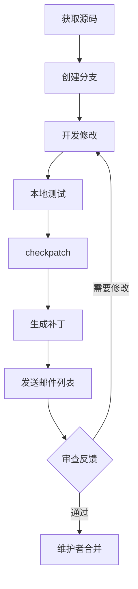

## 1. Git 基础回顾

### 1.1 常用命令

```bash
# 基本操作
git init
git clone https://github.com/user/repo.git
git add file.c
git commit -m "message"
git push origin main
git pull origin main

# 分支
git branch feature
git checkout feature
git checkout -b feature  # 创建并切换
git merge feature
git branch -d feature

# 查看
git log --oneline --graph
git diff HEAD~1
git show commit_hash
git status
```

### 1.2 配置

```bash
# 用户信息
git config --global user.name "Your Name"
git config --global user.email "your.email@example.com"

# 编辑器
git config --global core.editor vim

# 内核开发推荐
git config --global format.signoff true
git config --global sendemail.smtpserver smtp.example.com
```

---

## 2. 内核 Git 工作流

### 2.1 获取内核源码

```bash
# 官方仓库
git clone git://git.kernel.org/pub/scm/linux/kernel/git/torvalds/linux.git

# 稳定版
git clone git://git.kernel.org/pub/scm/linux/kernel/git/stable/linux.git
```

### 2.2 分支模型

```
mainline (Linus)
    ├── linux-next (集成测试)
    ├── net (网络)
    ├── mm (内存管理)
    └── drivers/xxx (各驱动子系统)
```

### 2.3 开发分支

```bash
# 基于最新主线创建分支
git checkout -b fix/my-bugfix origin/master

# 开发完成后 rebase
git fetch origin
git rebase origin/master
```

---

## 3. 补丁格式

### 3.1 生成补丁

```bash
# 生成最近一次提交的补丁
git format-patch -1

# 生成最近 3 次提交
git format-patch -3

# 指定输出目录
git format-patch -o patches/ -3

# 生成 cover letter
git format-patch --cover-letter -3
```

### 3.2 补丁格式

```
From: Your Name <your.email@example.com>
Subject: [PATCH] subsystem: Brief description

Detailed description of the change.
Explain why the change is needed and how it works.

Signed-off-by: Your Name <your.email@example.com>
---
 path/to/file.c | 10 ++++++++--
 1 file changed, 8 insertions(+), 2 deletions(-)

diff --git a/path/to/file.c b/path/to/file.c
index abc1234..def5678 100644
--- a/path/to/file.c
+++ b/path/to/file.c
@@ -10,6 +10,8 @@
 code changes here
```

### 3.3 Commit Message 规范

```
subsystem: Brief summary (50 chars or less)

More detailed explanation if needed. Wrap at 72 characters.
Explain the problem being solved and why this approach was chosen.

- Bullet points are OK
- Keep it focused

Fixes: abc123def456 ("Original commit subject")
Reviewed-by: Reviewer Name <reviewer@example.com>
Tested-by: Tester Name <tester@example.com>
Signed-off-by: Your Name <your.email@example.com>
```

---

## 4. 发送补丁

### 4.1 检查补丁

```bash
# 语法检查
./scripts/checkpatch.pl --strict 0001-*.patch

# 编译测试
make C=1 path/to/module.o
```

### 4.2 发送到邮件列表

```bash
# 配置邮件
git config --global sendemail.smtpserver smtp.example.com
git config --global sendemail.smtpserverport 587
git config --global sendemail.smtpencryption tls
git config --global sendemail.smtpuser your@email.com

# 发送
git send-email --to=maintainer@example.com \
               --cc=linux-kernel@vger.kernel.org \
               0001-*.patch
```

### 4.3 找到维护者

```bash
./scripts/get_maintainer.pl path/to/file.c
./scripts/get_maintainer.pl 0001-*.patch
```

---

## 5. 代码审查

### 5.1 审查流程

```
1. 发送补丁到邮件列表
2. 等待维护者和社区反馈
3. 根据反馈修改
4. 发送新版本 (v2, v3...)
5. 维护者应用补丁
```

### 5.2 版本迭代

```bash
# 第二版补丁
git format-patch -v2 -1

# Subject 会变成:
# [PATCH v2] subsystem: description
```

### 5.3 回复格式

```
> Original comment from reviewer

Your response here.

> Another comment

Another response.
```

---

## 6. 内核编码规范

### 6.1 缩进与格式

```c
// 使用 Tab 缩进 (8 空格宽度)
if (condition) {
	do_something();
} else {
	do_something_else();
}

// 函数定义
static int
my_function(int arg1, int arg2)
{
	return arg1 + arg2;
}
```

### 6.2 命名约定

```c
// 局部变量: 简短
int i, j, ret;

// 全局变量和函数: 描述性
static int packet_counter;
int process_incoming_packet(struct packet *pkt);

// 宏: 全大写
#define MAX_BUFFER_SIZE 1024
```

### 6.3 注释

```c
/*
 * This is a multi-line comment.
 * Each line starts with a space after *.
 */

/* Single line comment */

// C++ style comments are okay (C99)
```

### 6.4 检查工具

```bash
# checkpatch.pl
./scripts/checkpatch.pl --file path/to/file.c

# clang-format (有内核配置)
clang-format -style=file path/to/file.c
```

---

## 7. 调试内核

### 7.1 printk

```c
printk(KERN_INFO "Info message\n");
printk(KERN_WARNING "Warning message\n");
printk(KERN_ERR "Error message\n");
printk(KERN_DEBUG "Debug message\n");

// 动态调试
pr_debug("Debug: %d\n", value);

// 推荐使用 pr_* 宏
pr_info("Info\n");
pr_err("Error\n");
```

### 7.2 kgdb

```bash
# 内核配置
CONFIG_KGDB=y
CONFIG_KGDB_SERIAL_CONSOLE=y

# 启动参数
kgdboc=ttyS0,115200 kgdbwait

# 连接调试
gdb vmlinux
(gdb) target remote /dev/ttyS0
```

### 7.3 ftrace

```bash
# 启用
echo function > /sys/kernel/debug/tracing/current_tracer

# 设置过滤器
echo 'my_function' > /sys/kernel/debug/tracing/set_ftrace_filter

# 查看
cat /sys/kernel/debug/tracing/trace
```

---

## 8. 贡献流程总结



---

## 9. 练习

### 9.1 生成补丁

为 hello_world 模块生成符合规范的补丁.

### 9.2 checkpatch

修复 checkpatch 报告的所有警告和错误.

### 9.3 模拟审查

练习回复审查意见并迭代补丁.

---

## 10. 思考题

1. 为什么内核使用邮件列表而不是 PR?
2. Signed-off-by 有什么法律意义?
3. 如何处理冲突的审查意见?
4. DCO (Developer Certificate of Origin) 是什么?
5. 如何成为内核模块的维护者?

---

## 11. 本周小结

- **Git 工作流**: 分支, rebase.
- **补丁格式**: format-patch, commit message.
- **发送补丁**: git send-email, 邮件列表.
- **代码审查**: 迭代修改, 版本号.
- **编码规范**: 缩进, 命名, checkpatch.
- **调试**: printk, kgdb, ftrace.

---

## 课程总结

通过 20 周的学习, 你已经掌握了:

1. **C 语言基础**: 类型, 运算符, 控制流, 函数
2. **指针与内存**: 指针算术, 动态分配, 内存布局
3. **复合类型**: 结构体, 联合体, 枚举
4. **数据结构**: 链表, 栈, 队列, 哈希表, 树
5. **预处理器**: 宏, 条件编译, X-Macro
6. **编译链接**: 静态库, 动态库, ELF
7. **系统编程**: 文件 I/O, 进程, 线程, 网络
8. **调试工具**: GDB, Valgrind, perf
9. **内核开发**: 模块, 内核数据结构, 并发
10. **Git 工作流**: 补丁, 邮件列表, 内核贡献

---

> 内核开发是 C 语言的最高应用. 保持耐心, 持续学习, 你将成为一名出色的系统开发者.
