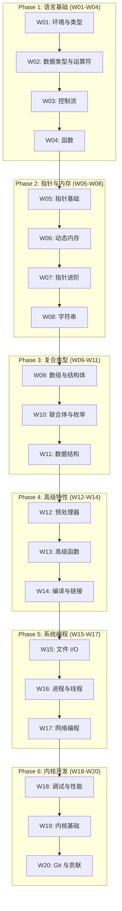

本学习计划面向没有任何 C 语言经验的初学者, 通过 20 周的系统学习, 从语言基础逐步深入到系统编程和 Linux 内核开发, 最终掌握内核级开发能力和 Git 协作流程.

---

## 学习路径概览



---

## Phase 1: 语言基础 (Week 1-4)

### Week 01: C 语言简介与开发环境
- C 语言历史与设计哲学
- 编译原理 (预处理, 编译, 汇编, 链接)
- GCC/Clang 工具链, Make 构建系统
- 变量与基本类型

### Week 02: 数据类型与运算符
- 整数类型, 浮点类型
- 类型转换规则
- 算术运算符, 位运算符
- 运算符优先级

### Week 03: 控制流语句
- if/else, switch/case
- for, while, do-while
- break, continue, goto
- 控制流的底层实现

### Week 04: 函数
- 函数定义与声明
- 参数传递, 返回值
- 头文件与多文件编译
- 静态函数与内联函数

---

## Phase 2: 指针与内存 (Week 5-8)

### Week 05: 指针基础
- 指针概念与语法
- 指针与数组的关系
- 指针算术
- void*, const 指针

### Week 06: 动态内存管理
- 内存布局 (栈, 堆, BSS, Data, Text)
- malloc, calloc, realloc, free
- 内存泄漏检测 (Valgrind)
- 内存对齐

### Week 07: 指针进阶
- 函数指针, 回调函数
- 指针数组与数组指针
- 复杂声明解析
- restrict 关键字

### Week 08: 字符串处理
- C 字符串表示
- 标准库函数 (strlen, strcpy, strcmp)
- 安全函数, 字符串解析
- 宽字符与 Unicode

---

## Phase 3: 复合数据类型 (Week 9-11)

### Week 09: 数组与结构体
- 多维数组
- 结构体定义, 内存布局
- offsetof, packed
- 位域

### Week 10: 联合体与枚举
- 联合体原理, 类型双关
- 枚举类型
- typedef, 复杂类型声明
- 标签联合

### Week 11: 数据结构基础
- 链表 (单向, 双向)
- 栈与队列
- 哈希表
- 二叉搜索树

---

## Phase 4: 预处理与高级特性 (Week 12-14)

### Week 12: 预处理器
- 宏定义 (#define)
- 条件编译
- 预定义宏
- X-Macro, _Generic

### Week 13: 高级函数特性
- 可变参数函数 (stdarg.h)
- 递归与尾递归
- 函数属性 (__attribute__)
- 调用约定

### Week 14: 编译与链接
- 编译过程详解
- 静态库与动态库
- ELF 格式, 符号表
- 链接脚本

---

## Phase 5: 系统编程 (Week 15-17)

### Week 15: 文件 I/O
- 标准 I/O vs 低级 I/O
- 文件描述符
- 目录操作
- 文件锁, mmap

### Week 16: 进程与线程
- fork, exec, wait
- 管道, 共享内存, 信号
- POSIX 线程 (pthread)
- 互斥锁, 条件变量, 读写锁

### Week 17: 网络编程
- Socket 基础
- TCP/UDP 编程
- I/O 多路复用 (select, poll, epoll)
- 服务器模型

---

## Phase 6: 调试与内核开发 (Week 18-20)

### Week 18: 调试与性能分析
- GDB 调试器
- Valgrind, AddressSanitizer
- 性能分析 (perf, gprof)
- 静态分析

### Week 19: Linux 内核基础
- 内核架构
- 内核模块开发
- 内核数据结构 (list_head, rbtree)
- 内核内存分配, 并发控制 (spinlock, mutex, RCU)

### Week 20: Git 与内核开发流程
- Git 工作流
- 补丁格式 (git format-patch)
- 代码审查与邮件列表
- 内核编码规范
- 贡献内核代码流程

---

## 综合实战项目

完成学习后, 建议实现以下项目以整合知识:

### 项目: 内存分配器 (Mini Malloc)

实现一个简化版的 `malloc`/`free`, 涵盖:

**阶段 1: 基础分配器**
```c
// 使用 sbrk/mmap 管理内存
// 实现 first-fit 或 best-fit 算法
void *my_malloc(size_t size);
void my_free(void *ptr);
```

**阶段 2: 空闲链表**
```c
// 显式空闲链表
struct block_header {
    size_t size;
    int is_free;
    struct block_header *next;
    struct block_header *prev;
};

// 合并相邻空闲块
void coalesce(struct block_header *block);
```

**阶段 3: Slab 分配器**
```c
// 为固定大小对象优化
struct slab_cache {
    size_t obj_size;
    struct slab *slabs;
    void *freelist;
};

void *slab_alloc(struct slab_cache *cache);
void slab_free(struct slab_cache *cache, void *obj);
```

**涵盖知识点**:
| 周 | 内容 |
| :--- | :--- |
| W05 | 指针算术 |
| W06 | 内存布局, 对齐 |
| W09 | 结构体, 柔性数组 |
| W11 | 链表, 红黑树 (用于大块管理) |
| W18 | Valgrind 检测内存错误 |

---

## 学习资源

| 资源 | 类型 | 阶段 |
|------|------|------|
| [The C Programming Language (K&R)](https://en.wikipedia.org/wiki/The_C_Programming_Language) | 书籍 | 入门 |
| [C Primer Plus](https://www.pearson.com/en-us/subject-catalog/p/c-primer-plus/P200000009200) | 书籍 | 入门 |
| [Linux Kernel Development](https://www.amazon.com/Linux-Kernel-Development-Robert-Love/dp/0672329468) | 书籍 | 内核 |
| [Understanding the Linux Kernel](https://www.oreilly.com/library/view/understanding-the-linux/0596005652/) | 书籍 | 内核 |
| [kernel.org Documentation](https://www.kernel.org/doc/) | 文档 | 内核 |

---

## 安全编码检查清单

在代码审查和开发中使用:

### 缓冲区安全

| 危险 | 安全替代 | 说明 |
| :--- | :--- | :--- |
| `strcpy(dest, src)` | `strlcpy(dest, src, size)` | 限制长度 |
| `strcat(dest, src)` | `strlcat(dest, src, size)` | 限制长度 |
| `sprintf(buf, fmt, ...)` | `snprintf(buf, size, fmt, ...)` | 限制长度 |
| `gets(buf)` | `fgets(buf, size, stdin)` | 已从 C11 移除 |
| `scanf("%s", buf)` | `scanf("%99s", buf)` | 指定最大宽度 |

### 整数安全

```c
// 溢出检测
#include <stdint.h>
if (a > SIZE_MAX - b) {
    // 溢出
}

// 或使用 __builtin_add_overflow (GCC/Clang)
size_t result;
if (__builtin_add_overflow(a, b, &result)) {
    // 溢出
}
```

### 格式字符串

```c
// 危险: 用户控制格式字符串
printf(user_input);  // 格式字符串攻击!

// 安全
printf("%s", user_input);
```

### 内存安全

```c
// 释放后置空
free(ptr);
ptr = NULL;

// 检查 malloc 返回值
void *p = malloc(size);
if (!p) {
    // 处理失败
}
```

---

## C 语言版本演进

学习时需注意各版本特性的引入时间.

| 版本 | 发布 | 关键特性 |
| :--- | :--- | :--- |
| C89/C90 | 1989 | 第一个标准, 函数原型 |
| C99 | 1999 | `_Bool`, VLA, `//` 注释, `inline`, `restrict` |
| C11 | 2011 | `_Static_assert`, `_Noreturn`, 原子操作, 多线程 |
| C17 | 2018 | Bug 修复版本, 无新特性 |
| C23 | 2024 | `nullptr`, `auto`, `typeof`, `#embed`, 新属性语法 |

### C23 关键特性

**1. `nullptr` (空指针常量)**

```c
int *p = nullptr;  // 替代 NULL
// nullptr 有自己的类型 nullptr_t
```

**2. `bool`/`true`/`false` 成为关键字**

```c
bool flag = true;  // 不再需要 <stdbool.h>
```

**3. `auto` 类型推断**

```c
auto x = 42;       // x 是 int
auto y = 3.14;     // y 是 double
auto *p = &x;      // p 是 int*
```

**4. `typeof` 和 `typeof_unqual`**

```c
int x = 10;
typeof(x) y = 20;  // y 是 int

const int cx = 10;
typeof_unqual(cx) y = 20;  // y 是 int (去掉 const)
```

**5. `#embed` 预处理指令**

```c
// 编译期嵌入二进制文件
const unsigned char icon[] = {
    #embed "icon.png"
};
```

**6. 新属性语法 `[[]]`**

```c
[[nodiscard]] int compute(void);
[[deprecated("use new_func")]] void old_func(void);
[[maybe_unused]] int unused_var;
[[noreturn]] void die(void);
```

**7. `constexpr` 对象**

```c
constexpr int SIZE = 100;
int arr[SIZE];  // 编译期常量
```

**8. 其他改进**

- `#warning` 预处理指令 (标准化)
- `__VA_OPT__` 可变参数宏改进
- `_BitInt(N)` 任意位宽整数
- `unreachable()` 不可达代码标记
- 标签可以出现在复合语句末尾

### 版本选择建议

| 场景 | 推荐版本 |
| :--- | :--- |
| 新项目 | C23 或 C11 |
| 跨平台/嵌入式 | C99 或 C11 |
| Linux 内核 | C11 (内核使用 GNU 扩展的 C11) |
| 遗留代码 | 至少升级到 C99 |

### 编译器支持

```bash
# GCC
gcc -std=c23 program.c

# Clang
clang -std=c23 program.c

# 检查版本
#if __STDC_VERSION__ >= 202311L
    // C23
#endif
```

---

> C 语言是通向系统底层的钥匙. 掌握 C 语言和内核开发, 将使你成为真正的系统开发者.
