# An Intermediate Guide to Git

**Chase Zhang**
Splunk Inc.
May 21, 2017

---

## Table of Contents

*   **Advanced Techniques**
    *   Warming Up
    *   History Management
    *   Other Toys
*   **Underneath Git Command**
    *   Git’s Object Model
    *   Git’s Internal Files
    *   Optimizations
*   **Git HTTP Server**
    *   Provide info/refs
    *   Serving Fetch Request
    *   Accept Push Request
*   **References**

---

## Advanced Techniques

### Warming Up

If you are not familiar with previous commands, please refer to some tutorials on the Internet:
*   [Pro Git](https://git-scm.com/book)
*   [Git Documentation](https://git-scm.com/doc)
*   [Tutorials from Atlassian](https://www.atlassian.com/git/tutorials/)

**Basic Status and Commits**
```bash
# Show current status
git status

# Show commit logs on current branch
git log

# Add changes under current directory
git add .

# Reset status of HEAD
git reset HEAD

# Commit
git commit -m "commit message"
```

**Branching and Checking Out**
```bash
# Checkout a branch
git checkout branch_name

# Checkout a commit
git checkout 23abef

# Revert unstaged changes
git checkout .

# Create a new branch
git checkout -b branch_name

# Rename a branch
git branch -m new_branch_name

# Delete a branch
git branch -d branch_name

# Merge from another branch
git merge another_branch_name
```

**Remote Operations**
```bash
# Add a remote upstream
git remote add origin git@remote.repo.url

# Fetch from upstream repo
git fetch

# Pull from upstream repo
git pull

# Push onto upstream repo
git push
```

---

### History Management

**Resetting Commits**
```bash
# Revert commit softly. Changes will be kept
git reset --soft HEAD~3

# Revert commit hardly. Changes will lose
git reset --hard HEAD~3

# Revert commit mixed. Stage will be clear,
# changes will be kept (default)
git reset --mixed HEAD~3
```

#### Reset Modes Comparison

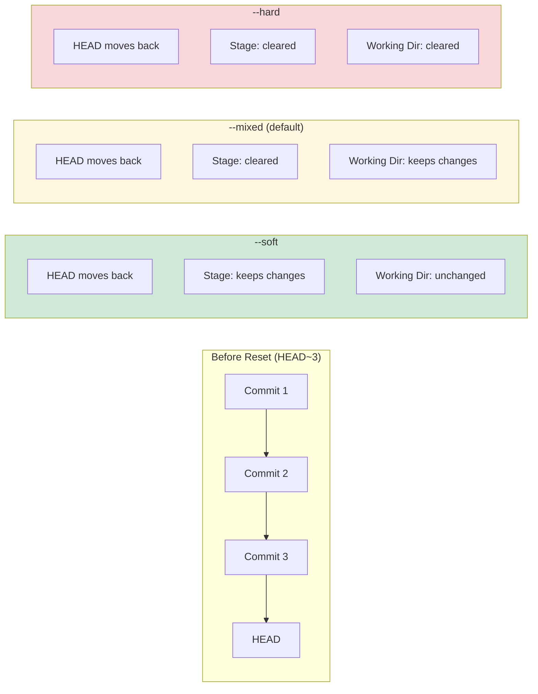

| Mode | HEAD | Staging Area | Working Directory | Use Case |
|:---:|:---:|:---:|:---:|:---|
| `--soft` | ✅ Moves | ✅ Keeps changes | ✅ Keeps changes | Re-commit with different message |
| `--mixed` | ✅ Moves | ❌ Clears | ✅ Keeps changes | Unstage and recommit selectively |
| `--hard` | ✅ Moves | ❌ Clears | ❌ Clears | Completely discard commits |


**Restoring Lost Commits (Reflog)**

```bash
# Accidentally reverted a commit?
# No panic, there is a way to restore it.
git reflog

# Checkout the hash point you'd like be back to
git checkout 42efba

# Replace the origin branch
git checkout -B master
```

**Cherry-Picking**
```bash
# Pick a commit from other branch, without merging it
git cherry-pick 892bfe

# Pick several commits at once
git cherry-pick 892bfe..42fdab

# If there is a conflict, you have to resolve it
# And use this to continue
git cherry-pick --continue

# Or use this to abort
git cherry-pick --abort
```

#### Cherry-Pick Workflow

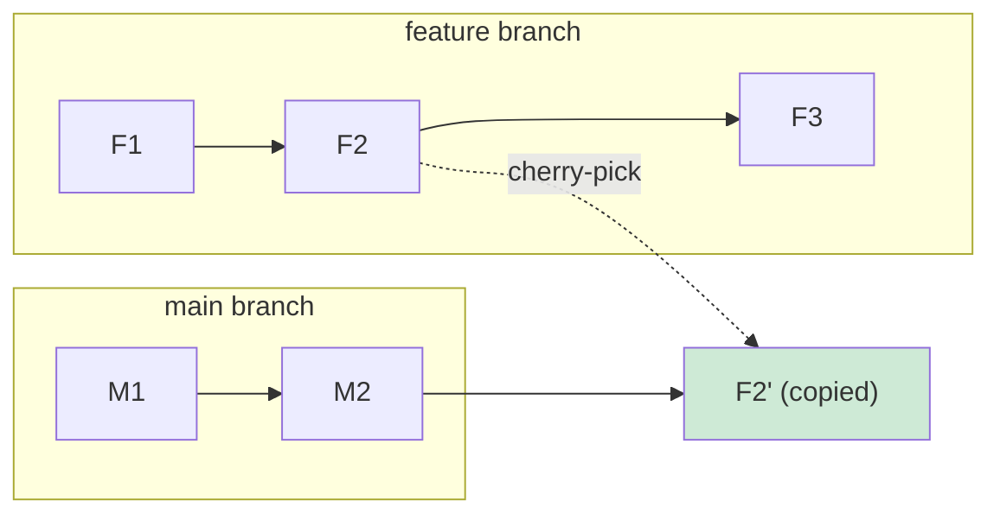

**Key Points:**
- Cherry-pick **copies** a commit, creating a new commit with a different SHA
- The original commit remains in the source branch
- Useful for hotfixes: pick a fix from develop to main without full merge

**Rebase**

A more convenient way is to use rebase:

```bash
# Rebase HEAD with a previous commit in the same branch
git rebase HEAD^10

# Rebase current branch to master
git rebase master
```

**Interactive Rebase**

Use interactive rebase, we can change the history easily!

```bash
git rebase -i HEAD~3
```

What can interactive rebase do:

*   Pick or drop a commit
*   Change commit orders
*   Change commit message
*   Modify edit contents
*   Squash two commits into one

**Merge vs. Rebase**
It is highly recommended that we always use `rebase` instead of `merge` when syncing local developing branches with upstream.

**Question:** What’s the difference between `git merge` and `git rebase`?

#### Branch Model: Git Merge

Scenario: You are on `develop` branch and want to sync with `master`.

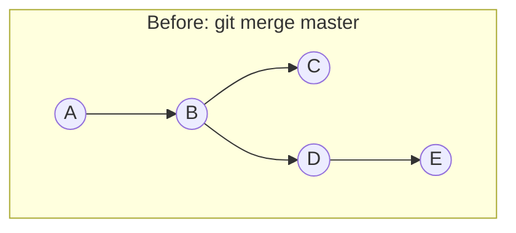

```text
        master
          ↓
    A --- B --- C
          \
           D --- E
                 ↑
              develop
```

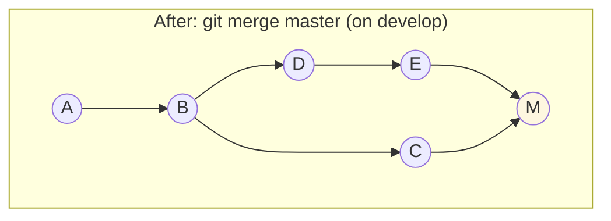

```text
        master
          ↓
    A --- B --- C
          \     \
           D --- E --- M (merge commit)
                       ↑
                    develop
```

**Result:** A new merge commit `M` is created, combining `C` and `E`. Both branch histories are preserved.

---

#### Branch Model: Git Rebase

Scenario: You are on `develop` branch and want to sync with `master`.

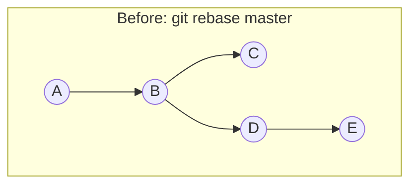

```text
        master
          ↓
    A --- B --- C
          \
           D --- E
                 ↑
              develop
```

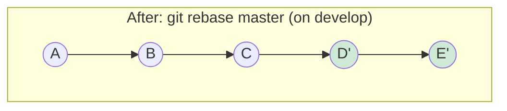

```text
                       master
                         ↓
    A --- B --- C --- D' --- E'
                             ↑
                          develop
```

**Result:** Commits `D` and `E` are **replayed** on top of `C`, creating new commits `D'` and `E'` with different SHAs. The history becomes linear.

**Comparison:**

*   **git merge**
    *   Will not change any commits in both master and develop branches.
    *   Will generate a new merge commit at develop branch.
    *   Once merged back, merge commits in develop will appears in master.
*   **git rebase**
    *   Will rewrite commits from develop branch.
    *   Will eliminate empty commits and keep logs clean.

**Duplicate Commits Scenario**
If two developers make the same change, `git rebase` can eliminate the second commit (the redundant one), whereas merge keeps both.

#### Figure: git rebase will eliminate empty commits

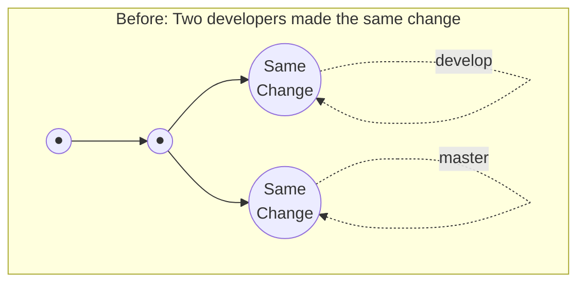

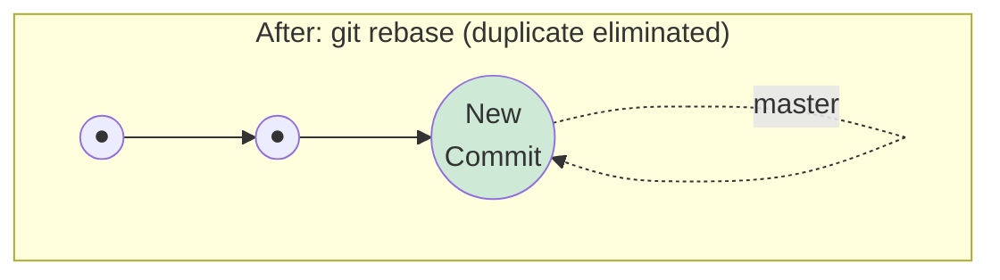

**Key Point:** The second commit (which was a duplicate) is automatically eliminated during rebase because it produces no diff when replayed.

#### Branch Flow: Git Merge vs. Git Rebase

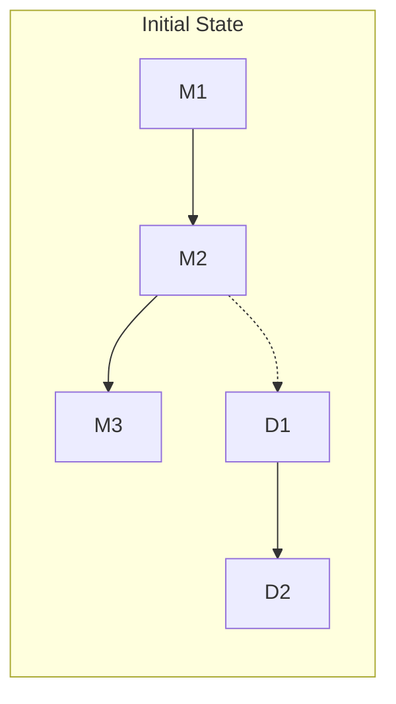

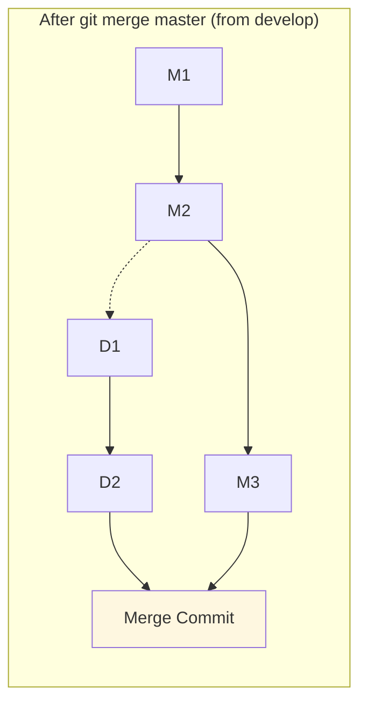

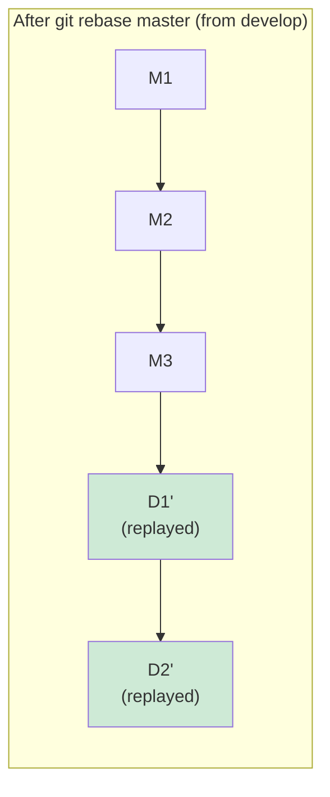

| Aspect | `git merge` | `git rebase` |
|:---|:---|:---|
| **Commit History** | Preserves all original commits | Rewrites commits (new SHA) |
| **Merge Commits** | Creates merge commit | No merge commit |
| **Timeline** | Non-linear (branches visible) | Linear (flat history) |
| **Conflicts** | Resolve once | Resolve per commit |
| **Safety** | Safe for public branches | Dangerous for public branches |
| **Use Case** | Merging feature to main | Syncing feature with main |

**The Golden Rule**
The golden rule of git rebase is to **never use it on public branches**.

**Additional Notices**
1.  Once rebase is applied, you may have to use `git push -f` to push local changes to remote. You should never do this on master, but it’s ok for your own branches.
2.  `git pull` is actually equivalent to `git fetch + git merge` by default. You can override this by:
    ```bash
    git pull --rebase
    ```

---

### Other Toys

Some git commands you may not know:

*   **git grep**:
    *   Multi threads, will be much faster than bare grep command.
    *   Output to less by default.
*   **git clean**:
    *   Clean uncommitted files.
    *   Can’t be reverted!
*   **gitk, git gui**: build-in GUI client of Git.

**Visualizing the Tree**
Let git log show tree graph other than just a commit list.
```bash
git log --graph --oneline --decorate
```

**Convenient Alias**
It is convenient to make an alias command:
```bash
git config alias.lg "log --color --graph --pretty=format:'%Cred%h%Creset -%C(yellow)%d%Creset %s %Cgreen(%cr) %C(bold blue)<%an>%Creset' --abbrev-commit"
git config alias.ci commit
git config alias.st status
```

**Toys and Resources with Git Hooks**
*   **lolcommits**: take a photo of yourself every time you make a commit. ([Link](https://lolcommits.github.io/))
*   **Continuous Delivery**: [Heroku](https://www.heroku.com/), [Dokku](https://github.com/dokku/dokku), [Deis](https://github.com/deis/workflow).
*   **git-jira-hook**: Automatically retrieve JIRA number from branch name and prepend to each commit. ([Link](https://github.com/joyjit/git-jira-hook))
*   **What The Commit**: Humorous commit message generator. ([Link](https://whatthecommit.com/))

---

## Underneath Git Command

### Git’s Object Model

To describe Git’s Object Model is actually the same as answering the question below because our file system is just a tree like data structure.

**Question:** How can we make an immutable in memory tree, which we can look up its modification history and revert to previous state at will?

#### Four Object Types

Git stores everything as objects, identified by SHA-1 hash:

| Object Type | Description | Content |
|:---:|:---|:---|
| **blob** | File content | Raw file data (no filename!) |
| **tree** | Directory | List of blobs and trees with names |
| **commit** | Snapshot | Points to tree + parent commit + metadata |
| **tag** | Named reference | Points to commit + tag metadata |

#### Git Object Relationship

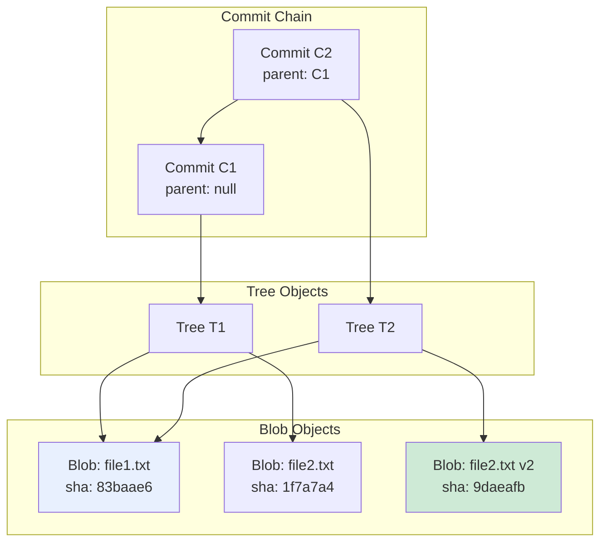

**Key Insight:** When `file2.txt` is modified:
- A new blob (`B3`) is created for the new content
- A new tree (`T2`) references the unchanged `B1` and new `B3`
- The unchanged `file1.txt` blob is **reused** (content-addressable storage)

#### Git Tree Model

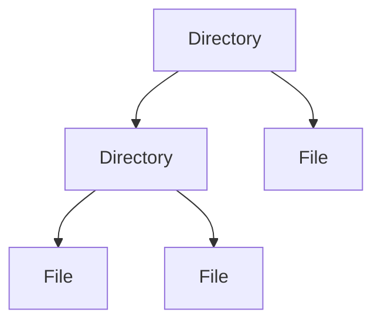

**The Simplest Approach (Inefficient)**
*   For every change, copy everything and save them somewhere.
*   Use an array of pointers pointing to each copy according to their order.
*   Look up old time points by retrieving copies from the array.
*   *Result:* Costs too much memory and is very slow.

#### Optimized Git Object Tree

The PDF shows two diagrams: First, a single tree with "Change This" marker, then Track Nodes added:

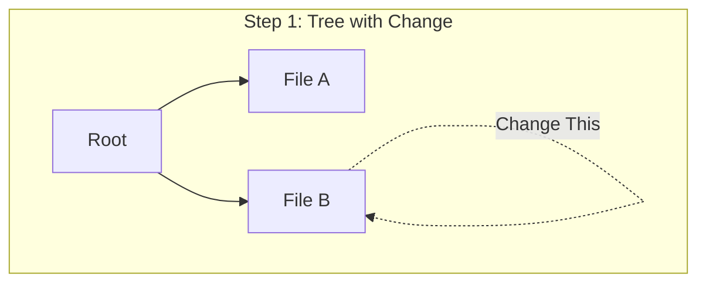

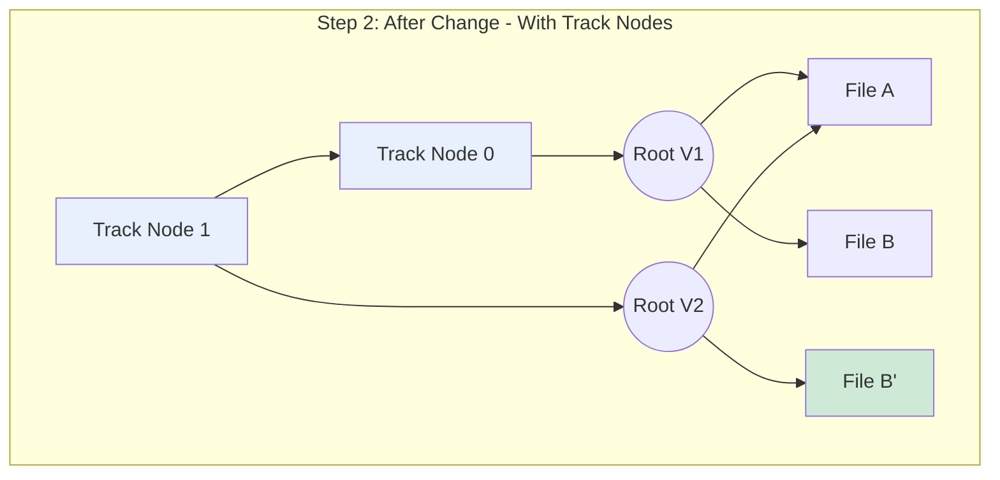

**Key Points from PDF Figure:**
- Track Node 1 has a **pointer to Track Node 0** (previous node / parent commit)
- Both Track Nodes point to their respective Root copies
- File A is **shared** between both versions (unchanged content reuses same object)
- Only File B' is new (the modified file)

**Conclusion: Optimizations**
1.  **Partial Copying:** Once there is a change, we don’t copy everything, but only the path from root to the node that has been modified. This saves memory and time.
2.  **Track Nodes:** Use a series of track nodes to preserve the order of each time point. Each node has a pointer to the copy of root and a pointer to the previous node.
3.  **Traversal:** To find a history state, find the track node, get the root copy, and traverse the tree to get the snapshot.

**Summary**
*   Git makes an object for every directory and file and saves them into `.git/objects`.
*   Each TrackNode corresponds to a **commit** in Git’s object model; commits are also saved in `.git/objects`.
*   Every operation maintains these object files and ensures consistency with source directories.

---

### Git’s Internal Files

Let’s have an exploration of Git’s internal files (some files are omitted):

```text
.git
├── HEAD
├── objects
│   ├── 0c
│   ├── 0d
│   ├── info
│   └── pack
├── refs
│   ├── heads
│   └── tags
```

*   **objects**: Contains all objects. Indexed by SHA1 hash. First two characters form directory names (categories).
*   **refs**: Contains all pointers like branches and tags.
*   **HEAD**: Points to the commit hash of the current working directory.

**Viewing Objects**
Git’s objects are compressed with zlib. You can view content using Python (zlib.decompress) or the native command:
```bash
git cat-file -p 5b67fd90081
```

**Manual Commit Interaction**
You can commit files manually without `git commit`:
```bash
# Write a new file object
git hash-object -w test.txt

# Create a new tree object and write a tree
git update-index --add --cacheinfo 100644 83baae61804e65cc73a7201a7252750c76066a30 test.txt
git write-tree

# Commit a tree
git commit-tree d8329f

# Read a tree from storage and apply to current working directory
git read-tree 5fd87
```

**Bare Repositories**
Update and maintain working directory is costly and unsafe. For remote repos, we usually init them without a working directory:
```bash
git init --bare
```

---

### Optimizations

Ideally, we should only save the diff if a huge file changed slightly. Git can pack files to save space and speed up lookups.

```bash
# Let git perform GC and pack files
git gc
# git gc will run every time you execute git push
git push
```
Packfiles are saved under `.git/objects/pack`.

#### Pack File Structure

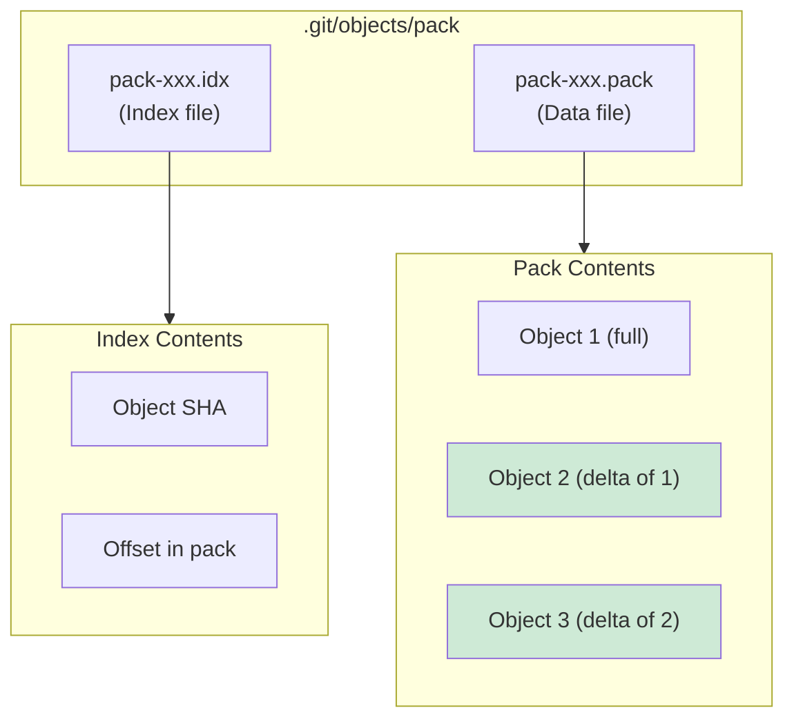

**Delta Compression:**
- Similar objects are stored as **deltas** (differences from a base object)
- Reduces storage by 10-100x for large repositories
- Index file allows O(1) lookup by SHA

**Shortcomings & Solutions**
Git's object model is slow for huge files or too many files.
*   **GLFS (Git Large File System)**: Open source tool saving huge files to external cloud storage. ([Link](https://git-lfs.github.com/))
*   **GVFS (Git Virtual File System)**: Microsoft project; won't download an object until it is read for the first time. ([Link](https://github.com/Microsoft/GVFS))

---

### Git HTTP Server

An implementation of a Git HTTP server might be simpler than imagined.

#### Provide info/refs

*   Before fetch/push, client sends requests to `info/refs`.
*   Client finds minimum amount of objects to transfer.
*   This is an RPC invoke requiring a Git client on the server.

**Handling Requests**
Requests have a URL parameter named `service`. Call the local git command:
```bash
git [service] --stateless-rpc --advertise-refs
```

Stream STDOUT back to the client via HTTP, prepending a head block:

#### Figure: Head Block Structure

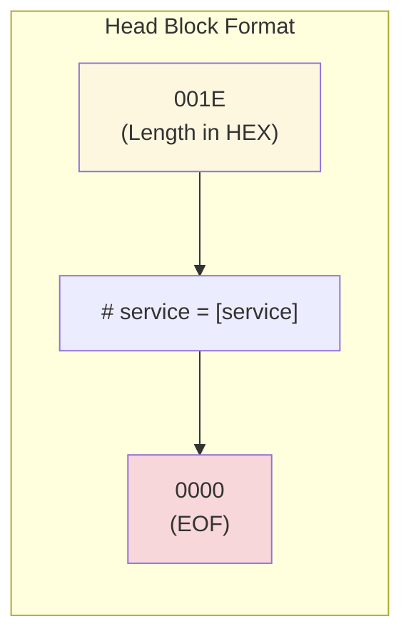

```text
001E # service = [service] 0000
 ↑                          ↑
 Length of head block       EOF marker
 (in HEX, 4 chars)
```

#### Serving Fetch Request
Support fetching request is very simple. As the client has already known what to fetch from the `info/refs` call. It will fetch all files by itself and we’ll just serve objects directory as static files.

#### Accept Push Request

Push request is a little more complex than fetch. Although client git has already known what to push to the server, for the sake of security and concurrency, writing action must be performed in a safer and faster way. It is an RPC invoke too.

#### Figure: Handle Push Requests

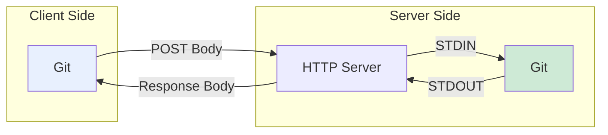

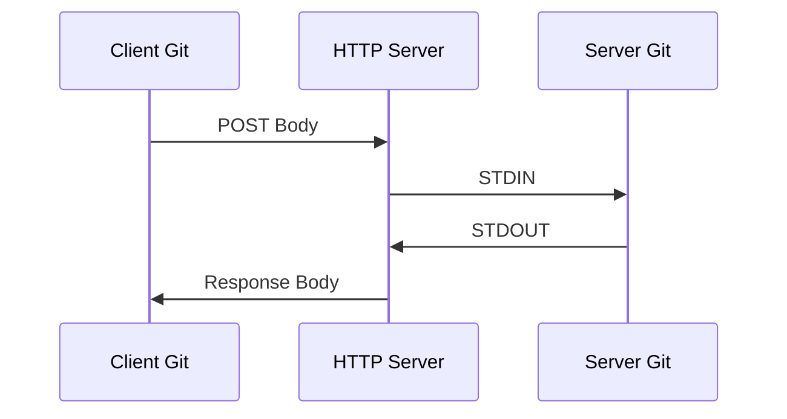

**Execution**
Push requests will have a URL parameter named `command`, as before, we pass this command to git directly:
```bash
git [command] --stateless-rpc
```
If command name is `receive-pack`, we have to do one step more:
```bash
git update-server-info
```

That’s it! We now have a workable Git HTTP Server. (More info: [Git Internals - Transfer Protocols](https://git-scm.com/book/en/v2/Git-Internals-Transfer-Protocols)).

---

### References

1.  **Atlassian.** Merging vs. rebasing. [Link](https://www.atlassian.com/git/tutorials/merging-vs-rebasing)
2.  **Git lfs.** [Link](https://git-lfs.github.com/)
3.  **Gvfs.** [Link](https://github.com/Microsoft/GVFS)
4.  **Microsoft.** Announcing gvfs. [Link](https://blogs.msdn.microsoft.com/visualstudioalm/2017/02/03/announcing-gvfs-git-virtual-file-system/)
5.  **Mary Rose Cook.** Git from the inside out. [Link](https://codewords.recurse.com/issues/two/git-from-the-inside-out)
6.  **Git internals.** [Link](https://git-scm.com/book/en/v2/Git-Internals-Plumbing-and-Porcelain)
7.  **Atlassian.** Reset, checkout, and revert. [Link](https://www.atlassian.com/git/tutorials/resetting-checking-out-and-reverting)