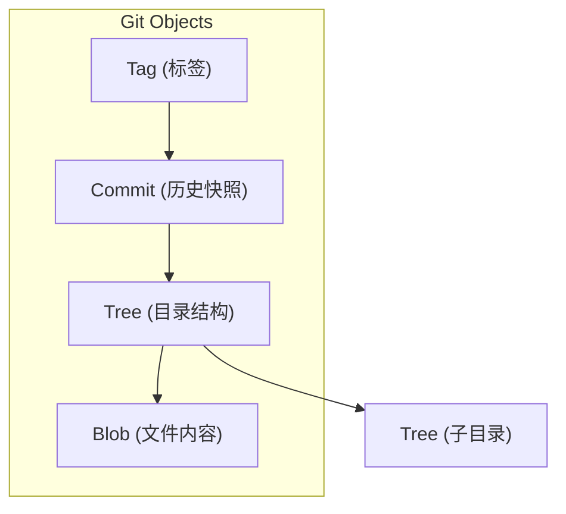
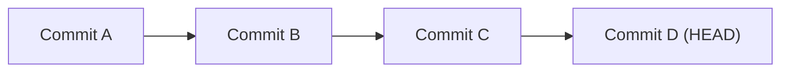

## 1. Git 的本质: 内容寻址文件系统

### 1.1 什么是内容寻址

Git 的底层是一个**内容寻址文件系统 (Content-Addressable Filesystem)**. 这意味着数据的存储位置由其**内容的哈希值**决定, 而非文件路径或名称.

**传统文件系统 vs 内容寻址**

| 特性 | 传统文件系统 | 内容寻址系统 |
|------|-------------|-------------|
| 寻址方式 | 路径 (`/home/user/file.txt`) | 内容哈希 (`a1b2c3d4...`) |
| 重命名 | 改变路径 | 内容不变, 哈希不变 |
| 内容相同的文件 | 存储多份 | 只存储一份 |
| 完整性验证 | 需要额外机制 | 内置 (哈希即校验) |

### 1.2 为什么选择内容寻址

1. **去重**: 相同内容只存储一次, 节省空间.
2. **完整性**: 哈希值本身就是校验和, 任何损坏都会被检测到.
3. **分布式友好**: 不同仓库之间可以通过哈希值确认是否拥有相同的对象.
4. **不可变性**: 对象一旦创建, 内容就不会改变 (改变内容 = 创建新对象).

### 1.3 数学模型: Git 作为有向无环图 (DAG)

除了内容寻址, Git 的另一个数学本质是 **DAG (Directed Acyclic Graph)**.

*   **Directed (有向)**: 提交指向父提交, 形成时间箭头 (反向).
*   **Acyclic (无环)**: 你不能成为自己的祖先.
*   **Graph (图)**: 由节点 (Commit) 和边 (Parent Pointer) 组成.

**DAG 的意义**:
1.  **可达性 (Reachability)**: Git 通过图的遍历算法 (如 Graph Coloring) 来计算 "哪些对象需要推送到服务器" 或 "哪些对象是垃圾可以回收".
2.  **合并基底 (Merge Base)**: 两个分支的共同祖先, 就是 DAG 中它们的第一条重合路径.
3.  **拓扑排序**: 保证了历史的因果关系.

---

## 2. SHA-1 哈希算法

### 2.1 哈希基础

Git 使用 **SHA-1** (Secure Hash Algorithm 1) 算法计算对象的哈希值:

- **输入**: 任意长度的数据
- **输出**: 固定 160 位 (40 个十六进制字符) 的哈希值
- **特性**: 单向、确定性、雪崩效应

```bash
# 计算字符串的 SHA-1
echo -n "hello" | sha1sum
# aaf4c61ddcc5e8a2dabede0f3b482cd9aea9434d

# Git 计算对象哈希 (会添加 header)
echo -n "hello" | git hash-object --stdin
# ce013625030ba8dba906f756967f9e9ca394464a
```

### 2.2 Git 对象的哈希计算

Git 在计算哈希前会添加一个 header:

```
{type} {size}\0{content}
```

例如, 存储字符串 "hello" 作为 blob:

```
blob 5\0hello
```

计算方式:

```bash
# 手动计算
echo -e "blob 5\0hello" | sha1sum
# ce013625030ba8dba906f756967f9e9ca394464a

# 等价于
echo -n "hello" | git hash-object --stdin
```

### 2.3 SHA-256 迁移

由于 SHA-1 已被证明存在碰撞攻击, Git 正在逐步迁移到 **SHA-256**:

```bash
# 创建使用 SHA-256 的仓库 (Git 2.29+)
git init --object-format=sha256
```

---

## 3. 四大核心对象

Git 的所有数据都存储为四种类型的对象:



### 3.1 Blob (二进制大对象)

**作用**: 存储文件的**纯内容**, 不包含文件名、路径或权限.

**结构**

```
blob {size}\0{content}
```

**特点**:
- 两个内容完全相同的文件, 无论名称或路径, 共享同一个 Blob.
- Blob 是 Git 去重的基础.

**查看 Blob**

```bash
# 查看对象类型
git cat-file -t ce01362
# blob

# 查看对象内容
git cat-file -p ce01362
# hello

# 查看对象大小
git cat-file -s ce01362
# 5
```

### 3.2 Tree (树对象)

**作用**: 存储目录结构, 将文件名、权限与 Blob 关联.

**结构**

```
tree {size}\0
{mode} {filename}\0{20-byte SHA-1}
{mode} {filename}\0{20-byte SHA-1}
...
```

**mode 权限值**:

| Mode | 含义 |
|------|------|
| 100644 | 普通文件 |
| 100755 | 可执行文件 |
| 120000 | 符号链接 |
| 040000 | 目录 (子 Tree) |

**示例**

```bash
git cat-file -p HEAD^{tree}
# 100644 blob a1b2c3d4...  README.md
# 100755 blob e5f6g7h8...  build.sh
# 040000 tree i9j0k1l2...  src
```

**Tree 是递归结构**: 一个 Tree 可以包含其他 Tree (子目录).

### 3.3 Commit (提交对象)

**作用**: 记录项目的一次快照, 包含元数据.

**结构**

```
tree {tree-sha1}
parent {parent-sha1}
parent {parent-sha1}  (合并提交可能有多个 parent)
author {name} <{email}> {timestamp} {timezone}
committer {name} <{email}> {timestamp} {timezone}

{commit message}
```

**示例**

```bash
git cat-file -p HEAD
# tree 4b825dc642cb6eb9a060e54bf8d69288fbee4904
# parent 1234567890abcdef...
# author Alice <alice@example.com> 1705380000 +0800
# committer Alice <alice@example.com> 1705380000 +0800
#
# Initial commit
```

**Commit 形成链表**: 每个 Commit 指向其父 Commit, 形成历史链.



### 3.4 Tag (标签对象)

**作用**: 为特定 Commit 创建一个有意义的名称.

**两种标签**:
- **轻量标签 (Lightweight)**: 仅是指向 Commit 的引用, 不创建 Tag 对象.
- **附注标签 (Annotated)**: 创建 Tag 对象, 包含元数据和签名.

**附注标签结构**

```
object {commit-sha1}
type commit
tag v1.0.0
tagger Alice <alice@example.com> 1705380000 +0800

Release version 1.0.0
```

**创建标签**

```bash
# 轻量标签
git tag v1.0.0

# 附注标签
git tag -a v1.0.0 -m "Release 1.0.0"

# 带 GPG 签名的标签
git tag -s v1.0.0 -m "Signed release"
```

---

## 4. `.git` 目录结构

`.git` 目录是 Git 仓库的核心, 存储所有版本控制信息.

```
.git/
├── HEAD                 # 当前分支指针
├── config               # 仓库级配置
├── description          # GitWeb 描述
├── hooks/               # 钩子脚本
├── index                # 暂存区 (Staging Area)
├── info/                # 仓库信息
│   └── exclude          # 本地 gitignore
├── logs/                # 引用日志 (reflog)
│   ├── HEAD
│   └── refs/
├── objects/             # 对象存储
│   ├── info/
│   ├── pack/            # 打包对象
│   └── {2-char}/{38-char}  # 松散对象
└── refs/                # 引用
    ├── heads/           # 本地分支
    ├── remotes/         # 远程分支
    └── tags/            # 标签
```

### 4.1 HEAD 文件

HEAD 是一个符号引用, 指向当前分支:

```bash
cat .git/HEAD
# ref: refs/heads/main
```

当处于分离 HEAD 状态时, HEAD 直接包含 Commit 哈希:

```bash
cat .git/HEAD
# a1b2c3d4e5f6...
```

### 4.2 refs 目录

引用是指向 Commit 的指针:

```bash
# 分支
cat .git/refs/heads/main
# a1b2c3d4e5f6...

# 远程跟踪分支
cat .git/refs/remotes/origin/main
# a1b2c3d4e5f6...

# 标签
cat .git/refs/tags/v1.0.0
# a1b2c3d4e5f6...
```

### 4.3 objects 目录

对象以两种形式存储:

**松散对象 (Loose Objects)**

- 路径: `.git/objects/{前2位}/{后38位}`
- 压缩: 使用 zlib 压缩

```bash
ls .git/objects/ce/
# 013625030ba8dba906f756967f9e9ca394464a
```

**打包对象 (Packed Objects)**

- 路径: `.git/objects/pack/`
- 格式: `.pack` (数据) + `.idx` (索引)
- 用途: 节省空间, 优化传输

---

## 5. Packfile 与 Delta 压缩

### 5.1 为什么需要 Packfile

松散对象的问题:
- 每个对象一个文件, 文件系统开销大
- 相似内容的文件 (如同一文件的不同版本) 各自存储, 浪费空间

### 5.2 Delta 压缩

Packfile 使用 **Delta 压缩**: 只存储对象之间的差异.

```
Base Object: 完整的文件内容 (1000 bytes)
Delta 1: 相对于 Base 的差异 (50 bytes)
Delta 2: 相对于 Delta 1 的差异 (30 bytes)
```

### 5.3 触发打包

```bash
# 手动触发打包
git gc

# 自动触发 (当松散对象超过阈值)
git config gc.auto 256  # 默认值
```

### 5.4 查看 Packfile

```bash
# 列出 pack 文件
ls .git/objects/pack/

# 验证 pack 文件
git verify-pack -v .git/objects/pack/pack-{hash}.idx
```

---

## 6. Plumbing 命令实战

Git 命令分为两类:
- **Porcelain (瓷器)**: 用户友好的高层命令 (add, commit, push)
- **Plumbing (管道)**: 底层命令, 直接操作对象

### 6.1 创建对象

```bash
# 创建 Blob
echo "hello" | git hash-object -w --stdin
# ce013625030ba8dba906f756967f9e9ca394464a

# 创建 Tree
git update-index --add --cacheinfo 100644 ce0136... hello.txt
git write-tree
# 4b825dc642cb6eb9a060e54bf8d69288fbee4904

# 创建 Commit
echo "Initial commit" | git commit-tree 4b825dc -p HEAD
# a1b2c3d4e5f6...
```

### 6.2 读取对象

```bash
# 查看对象类型
git cat-file -t {hash}

# 查看对象内容
git cat-file -p {hash}

# 查看对象大小
git cat-file -s {hash}
```

### 6.3 手动构建提交

完整的底层提交流程:

```bash
# 1. 创建文件并写入对象库
echo "Hello, Git!" > hello.txt
BLOB_HASH=$(git hash-object -w hello.txt)

# 2. 更新索引
git update-index --add --cacheinfo 100644 $BLOB_HASH hello.txt

# 3. 创建 Tree
TREE_HASH=$(git write-tree)

# 4. 创建 Commit
COMMIT_HASH=$(echo "First commit" | git commit-tree $TREE_HASH)

# 5. 更新分支引用
git update-ref refs/heads/main $COMMIT_HASH
```

---

## 7. 练习

### 7.1 探索 `.git/objects`

1. 创建一个新仓库并添加几个文件.
2. 列出 `.git/objects` 中的所有对象.
3. 使用 `git cat-file` 查看每个对象的类型和内容.

### 7.2 验证内容寻址

1. 创建两个内容相同但名称不同的文件.
2. 验证它们是否共享同一个 Blob.

### 7.3 手动创建提交

使用 Plumbing 命令手动创建一个完整的提交, 不使用 `git add` 或 `git commit`.

---

## 8. 思考题

1. 为什么 Git 对象是不可变的?
2. 如果两个文件内容相同但权限不同, 它们的 Blob 是否相同? Tree 呢?
3. 为什么 Git 选择 SHA-1 而不是 MD5?
4. Delta 压缩的 "Base Object" 是如何选择的?
5. 如果 `.git/objects` 中的某个对象损坏了, Git 能检测到吗?

---

## 9. 本周小结

- **内容寻址**: Git 以内容的哈希值作为地址存储数据.
- **四大对象**: Blob (内容), Tree (目录), Commit (快照), Tag (标签).
- **不可变性**: 对象一旦创建就不会改变.
- **Packfile**: 通过 Delta 压缩节省空间.
- **Plumbing 命令**: 底层命令直接操作对象.

---

> 理解 Git 的对象模型, 就理解了 Git 的一切. 分支、合并、变基, 都只是在这些不可变对象之上移动指针.
