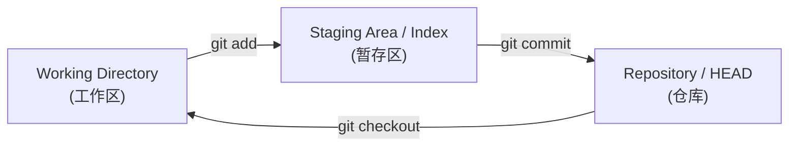
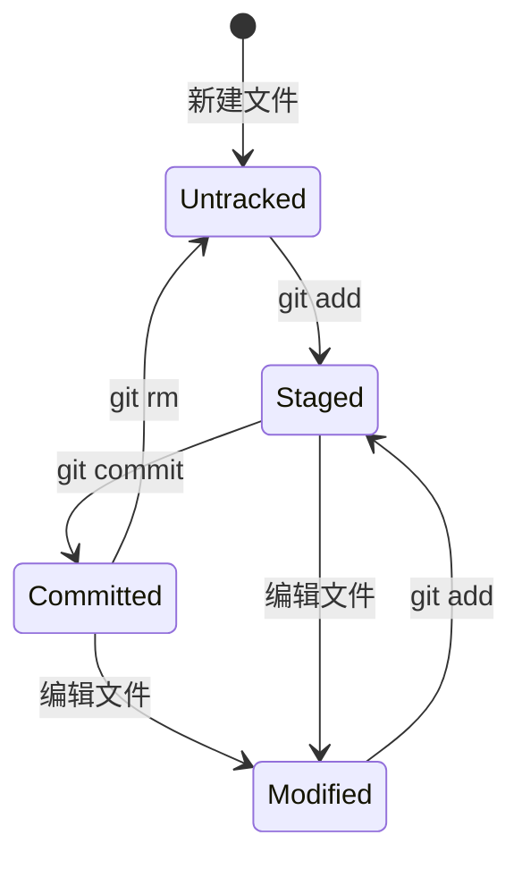

## 1. 三棵树模型

Git 的核心工作流围绕三个"树"结构展开:



### 1.1 Working Directory (工作区)

**定义**: 项目目录中实际存在的文件, 用户直接编辑的地方.

**特点**:
- 包含已跟踪文件和未跟踪文件
- 文件可能与 HEAD 或 Index 不同
- 是唯一用户可见的"树"

### 1.2 Staging Area / Index (暂存区)

**定义**: 下一次提交的预览, 存储在 `.git/index` 文件中.

**特点**:
- 是一个二进制文件, 不是目录
- 记录文件的路径、权限、时间戳和 Blob 哈希
- 允许精细控制提交内容

### 1.3 Repository / HEAD (仓库)

**定义**: 已提交的历史, 由 Commit 对象链组成.

**特点**:
- HEAD 指向当前分支的最新提交
- 提交后数据就被持久化

---

## 2. Index 文件深度解析

### 2.1 Index 的作用

Index 是 Git 高效运行的核心:

1. **快照预览**: 存储下一次提交的文件列表
2. **版本缓存**: 记录文件的状态, 避免重复计算哈希
3. **合并基础**: 在合并冲突时存储三个阶段的版本

### 2.2 Index 文件格式

Index 是一个二进制文件, 结构如下:

```
+------------------+
| Header           |
|  - signature     | 4 bytes: "DIRC"
|  - version       | 4 bytes: 2, 3, or 4
|  - entry count   | 4 bytes
+------------------+
| Entry 1          |
|  - ctime         | 8 bytes
|  - mtime         | 8 bytes
|  - dev, ino      | 8 bytes
|  - mode          | 4 bytes
|  - uid, gid      | 8 bytes
|  - file size     | 4 bytes
|  - SHA-1         | 20 bytes
|  - flags         | 2 bytes
|  - path          | variable
+------------------+
| Entry 2          |
| ...              |
+------------------+
| Extensions       |
+------------------+
| Checksum         | 20 bytes SHA-1
+------------------+
```

### 2.3 查看 Index 内容

```bash
# 列出 Index 中的文件
git ls-files

# 详细信息 (含 SHA-1 和权限)
git ls-files --stage

# 调试输出
git ls-files --debug
```

### 2.4 Index 的三个阶段

在合并冲突时, Index 存储同一文件的三个版本:

| Stage | 含义 |
|-------|------|
| 0 | 正常 (无冲突) |
| 1 | 共同祖先版本 (Base) |
| 2 | 当前分支版本 (Ours) |
| 3 | 合并分支版本 (Theirs) |

```bash
# 查看冲突文件的三个阶段
git ls-files -u
# 100644 abc123 1 conflict.txt  (base)
# 100644 def456 2 conflict.txt  (ours)
# 100644 ghi789 3 conflict.txt  (theirs)
```

---

## 3. 文件状态与生命周期

### 3.1 文件状态



### 3.2 状态查看

```bash
# 简洁状态
git status -s

# 状态码含义
#  M  修改但未暂存
# M   已暂存
# MM  暂存后又修改
# A   新增文件
# D   删除文件
# R   重命名
# ??  未跟踪
```

### 3.3 暂存的精细控制

```bash
# 交互式暂存
git add -i

# 按 hunk 暂存
git add -p
# y = 暂存此块
# n = 不暂存
# s = 拆分成更小的块
# e = 手动编辑

# 暂存部分文件
git add -p file.txt
```

---

## 4. .gitignore 与 .gitattributes

### 4.1 .gitignore

控制哪些文件不被 Git 跟踪.

**语法规则**

```text
# 注释
*.log           # 忽略所有 .log 文件
/build          # 忽略根目录的 build 目录
build/          # 忽略所有 build 目录
!important.log  # 例外: 不忽略此文件
**/temp         # 匹配任意层级的 temp 目录
*.py[cod]       # 字符类: .pyc, .pyo, .pyd
```

**忽略层次**

| 位置 | 作用范围 | 是否提交 |
|------|----------|----------|
| `.gitignore` | 整个仓库 | 是 |
| `.git/info/exclude` | 本地仓库 | 否 |
| `~/.config/git/ignore` | 全局 | 否 |

**已跟踪文件的忽略**

```bash
# 停止跟踪但保留本地文件
git rm --cached file.txt

# 临时忽略 (不修改 .gitignore)
git update-index --assume-unchanged file.txt

# 恢复跟踪
git update-index --no-assume-unchanged file.txt
```

### 4.2 .gitattributes

控制 Git 如何处理特定文件.

**常见用法**

```text
# 文本处理
*.txt text
*.sh  text eol=lf
*.bat text eol=crlf

# 二进制文件
*.png binary
*.jpg binary

# 合并策略
*.lock merge=ours

# 差异显示
*.md  diff=markdown
*.png diff=exif

# LFS (大文件存储)
*.psd filter=lfs diff=lfs merge=lfs -text
```

---

## 5. 配置系统

### 5.1 配置层次

Git 配置有三个层次, 优先级从低到高:

| 级别 | 文件位置 | 作用范围 |
|------|----------|----------|
| system | `/etc/gitconfig` | 所有用户 |
| global | `~/.gitconfig` | 当前用户 |
| local | `.git/config` | 当前仓库 |

```bash
# 查看配置来源
git config --list --show-origin

# 查看生效的配置
git config --list

# 编辑配置
git config --global --edit
```

### 5.2 核心配置

```bash
# 用户信息
git config --global user.name "Your Name"
git config --global user.email "you@example.com"

# 默认分支名
git config --global init.defaultBranch main

# 编辑器
git config --global core.editor "vim"

# 差异工具
git config --global diff.tool vimdiff

# 合并工具
git config --global merge.tool vimdiff

# 换行符处理
git config --global core.autocrlf input  # Linux/Mac
git config --global core.autocrlf true   # Windows
```

### 5.3 常用别名

```bash
git config --global alias.st status
git config --global alias.co checkout
git config --global alias.br branch
git config --global alias.ci commit
git config --global alias.unstage 'reset HEAD --'
git config --global alias.last 'log -1 HEAD'
git config --global alias.visual '!gitk'

# 图形化日志
git config --global alias.lg "log --graph --oneline --decorate --all"

# 查看文件历史
git config --global alias.filelog "log -u"
```

### 5.4 条件配置 (includeIf)

根据仓库路径应用不同配置:

```ini
# ~/.gitconfig
[user]
    name = Personal Name
    email = personal@email.com

[includeIf "gitdir:~/work/"]
    path = ~/.gitconfig-work
```

```ini
# ~/.gitconfig-work
[user]
    name = Work Name
    email = work@company.com
```

---

## 6. Hooks 系统

### 6.1 什么是 Hooks

Hooks 是在特定 Git 事件触发时自动执行的脚本.

**存储位置**: `.git/hooks/`

**启用**: 移除 `.sample` 后缀并添加执行权限.

### 6.2 客户端 Hooks

| Hook | 触发时机 | 常见用途 |
|------|----------|----------|
| `pre-commit` | commit 之前 | 代码检查, 格式化 |
| `prepare-commit-msg` | 编辑器打开前 | 自动填充模板 |
| `commit-msg` | 消息写入后 | 验证 commit 格式 |
| `post-commit` | commit 完成后 | 通知, 触发 CI |
| `pre-push` | push 之前 | 运行测试 |
| `pre-rebase` | rebase 之前 | 警告或阻止 |
| `post-checkout` | checkout 后 | 环境设置 |
| `post-merge` | merge 后 | 依赖安装 |

### 6.3 服务端 Hooks

| Hook | 触发时机 | 常见用途 |
|------|----------|----------|
| `pre-receive` | 接收 push 前 | 权限检查, 分支保护 |
| `update` | 每个分支更新前 | 分支级策略 |
| `post-receive` | push 完成后 | 部署, 通知 |

### 6.4 Hook 示例

**pre-commit: 代码检查**

```bash
#!/bin/sh
# .git/hooks/pre-commit

# 运行 linter
if ! npm run lint; then
    echo "Lint failed. Commit aborted."
    exit 1
fi

# 检查敏感信息
if git diff --cached | grep -E "(password|secret|api_key)\s*="; then
    echo "Potential secrets detected. Commit aborted."
    exit 1
fi
```

**commit-msg: 验证格式**

```bash
#!/bin/sh
# .git/hooks/commit-msg

# Conventional Commits 格式检查
if ! grep -qE "^(feat|fix|docs|style|refactor|test|chore)(\(.+\))?: .+" "$1"; then
    echo "Commit message must follow Conventional Commits format."
    echo "Example: feat(auth): add login endpoint"
    exit 1
fi
```

### 6.5 共享 Hooks

默认 Hooks 不在 Git 中跟踪. 解决方案:

```bash
# 方法 1: 配置 hooks 路径
git config core.hooksPath .githooks

# 方法 2: 使用工具 (husky, pre-commit)
npx husky install
npx husky add .husky/pre-commit "npm run lint"
```

---

## 7. reset 与 checkout 深度理解

### 7.1 reset 的三种模式

```bash
git reset [--soft | --mixed | --hard] <commit>
```

| 模式 | HEAD | Index | Working Directory |
|------|------|-------|-------------------|
| --soft | 移动 | 不变 | 不变 |
| --mixed (默认) | 移动 | 重置 | 不变 |
| --hard | 移动 | 重置 | 重置 |

**用途**:
- `--soft`: 合并多个提交为一个
- `--mixed`: 取消暂存
- `--hard`: 完全丢弃更改

### 7.2 checkout vs reset

| 命令 | 作用对象 | 行为 |
|------|----------|------|
| `git checkout <branch>` | HEAD | 切换分支 |
| `git checkout <file>` | Working Dir | 恢复文件 |
| `git reset <commit>` | HEAD + Index | 移动分支指针 |
| `git reset <file>` | Index | 取消暂存 |

### 7.3 restore (Git 2.23+)

更清晰的命令替代 checkout 的文件操作:

```bash
# 恢复工作区文件
git restore file.txt

# 取消暂存
git restore --staged file.txt

# 从特定提交恢复
git restore --source=HEAD~2 file.txt
```

---

## 8. 练习

### 8.1 Index 探索

1. 创建几个文件并暂存.
2. 使用 `git ls-files --stage` 查看 Index 内容.
3. 修改已暂存的文件, 观察状态变化.

### 8.2 配置定制

1. 设置常用别名.
2. 配置条件用户信息 (个人/工作).
3. 创建一个 `git lg` 别名显示图形化日志.

### 8.3 Hook 实践

1. 创建 `pre-commit` hook 阻止包含 TODO 的提交.
2. 创建 `commit-msg` hook 强制 Conventional Commits 格式.

---

## 9. 思考题

1. 为什么 Index 是二进制文件而不是目录?
2. `git add -p` 是如何实现按块暂存的?
3. `.gitignore` 和 `git update-index --assume-unchanged` 有什么区别?
4. 为什么 Hooks 默认不被 Git 跟踪?
5. `git reset --soft HEAD~1` 和 `git commit --amend` 有什么关系?

---

## 10. 本周小结

- **三棵树**: Working Directory, Staging Area (Index), Repository.
- **Index**: 二进制文件, 存储下一次提交的快照.
- **.gitignore**: 控制未跟踪文件.
- **.gitattributes**: 控制 Git 如何处理文件.
- **配置层次**: system < global < local.
- **Hooks**: 事件驱动的自动化脚本.
- **reset/restore**: 精确控制三棵树的状态.

---

> 暂存区是 Git 区别于其他 VCS 的核心创新. 理解了 Index, 就理解了 Git 精细控制提交的能力.
