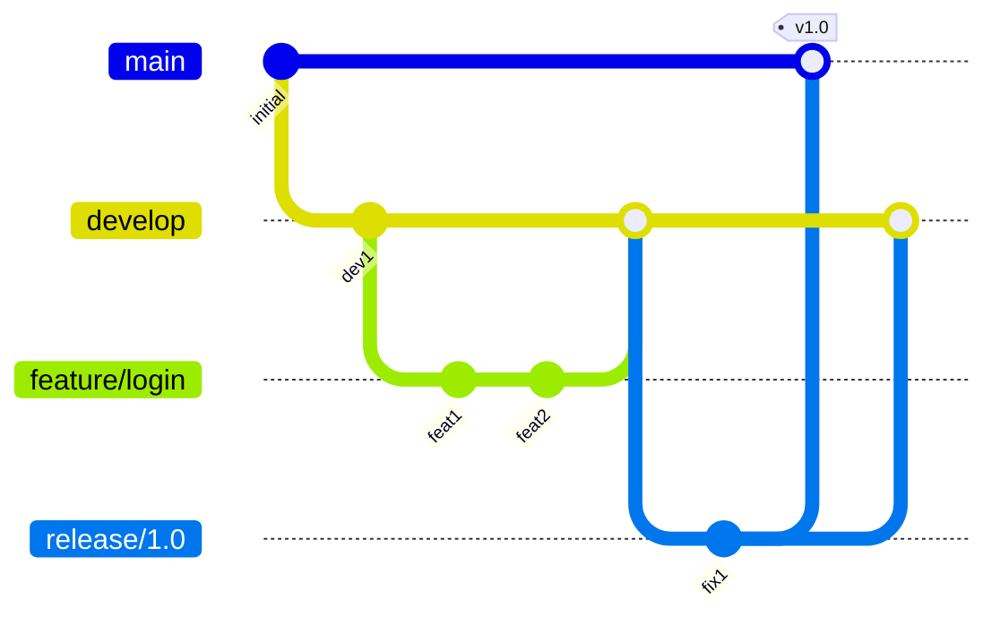
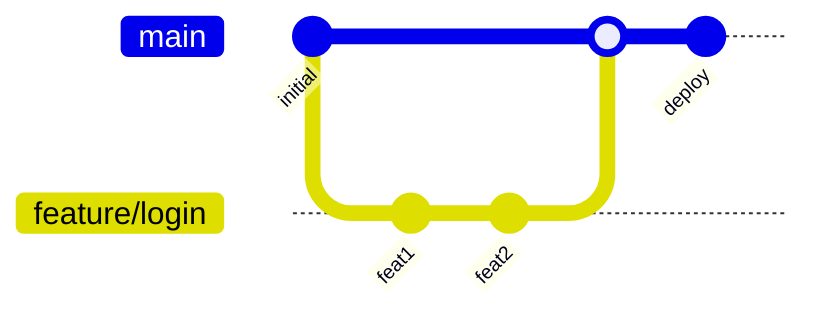

## 1. 分支的本质

### 1.1 分支是什么

Git 分支**只是一个指向 Commit 的可移动指针**, 存储在 `.git/refs/heads/` 目录中.

```bash
# 查看分支指向的 Commit
cat .git/refs/heads/main
# a1b2c3d4e5f6...

# 等价于
git rev-parse main
```

**分支操作的成本**:
- 创建分支: 写入一个 41 字节的文件 (40 字符哈希 + 换行符)
- 切换分支: 更新 HEAD 和工作区
- 删除分支: 删除一个文件

### 1.2 HEAD 指针

HEAD 是一个特殊的引用, 指向当前分支:

```bash
cat .git/HEAD
# ref: refs/heads/main
```

**分离 HEAD 状态 (Detached HEAD)**:
当 checkout 到特定 Commit 而非分支时, HEAD 直接指向 Commit:

```bash
git checkout a1b2c3d
cat .git/HEAD
# a1b2c3d4e5f6...
```

在分离 HEAD 状态下的提交不属于任何分支, 容易丢失.

### 1.3 分支命名约定

```
feature/    # 功能开发
bugfix/     # Bug 修复
hotfix/     # 紧急修复
release/    # 发布准备
experiment/ # 实验性功能
```

---

## 2. 分支操作

### 2.1 基本操作

```bash
# 创建分支
git branch feature

# 创建并切换
git checkout -b feature
git switch -c feature  # Git 2.23+

# 切换分支
git checkout main
git switch main  # Git 2.23+

# 查看分支
git branch          # 本地
git branch -r       # 远程
git branch -a       # 全部
git branch -v       # 含最后提交
git branch --merged # 已合并到当前分支

# 删除分支
git branch -d feature    # 安全删除 (已合并)
git branch -D feature    # 强制删除

# 重命名分支
git branch -m old-name new-name
```

### 2.2 分支与远程

```bash
# 推送分支
git push origin feature

# 建立跟踪关系
git push -u origin feature
git branch --set-upstream-to=origin/feature feature

# 删除远程分支
git push origin --delete feature
```

---

## 3. 合并 (Merge)

### 3.1 合并类型

**Fast-Forward 合并**

当目标分支是当前分支的直接祖先时, Git 只需移动指针:

```
Before:
main:       A---B
feature:        \---C---D

After (git merge feature):
main:       A---B---C---D
```

```bash
git merge feature
# Fast-forward
```

**三方合并 (3-Way Merge)**

当两个分支有分叉时, Git 创建一个合并提交:

```
Before:
main:       A---B---E
feature:        \---C---D

After (git merge feature):
main:       A---B---E---F (merge commit)
                 \     /
feature:          C---D
```

```bash
git merge feature
# Merge made by the 'recursive' strategy.
```

### 3.2 合并策略

Git 支持多种合并策略, 通过 `-s` 参数指定:

| 策略 | 说明 | 适用场景 |
|------|------|----------|
| `recursive` | 默认策略, 处理两个分支 | 常规合并 |
| `ort` | Git 2.33+ 默认, 更快 | 常规合并 |
| `resolve` | 传统策略, 较慢 | 简单合并 |
| `octopus` | 合并多个分支 | 同时合并多分支 |
| `ours` | 忽略对方所有更改 | 保留历史但不要内容 |
| `subtree` | 合并到子目录 | 子项目合并 |

```bash
# 使用 ours 策略 (只保留当前分支内容)
git merge -s ours feature

# 合并多个分支 (octopus)
git merge feature1 feature2 feature3
```

### 3.3 合并选项

```bash
# 禁止 Fast-Forward (总是创建合并提交)
git merge --no-ff feature

# 只允许 Fast-Forward
git merge --ff-only feature

# 合并但不提交, 用于检查
git merge --no-commit feature

# 合并后压缩为一个提交
git merge --squash feature
git commit -m "Merge feature"
```

---

## 4. 冲突解决

### 4.1 冲突标记

当同一文件的同一部分被两个分支修改时, 产生冲突:

```
<<<<<<< HEAD
当前分支的内容
=======
合并分支的内容
>>>>>>> feature
```

### 4.2 解决冲突

```bash
# 1. 查看冲突文件
git status

# 2. 手动编辑解决冲突
vim conflict.txt

# 3. 标记为已解决
git add conflict.txt

# 4. 完成合并
git commit
```

### 4.3 工具辅助

```bash
# 使用合并工具
git mergetool

# 常用工具配置
git config --global merge.tool vimdiff
git config --global merge.tool vscode
git config --global mergetool.vscode.cmd 'code --wait $MERGED'
```

### 4.4 冲突策略选项

```bash
# 自动选择某一方
git merge -X ours feature    # 冲突时保留当前分支
git merge -X theirs feature  # 冲突时保留合并分支

# 注意: -X 是策略选项, 不是策略
# -s ours 会忽略所有更改
# -X ours 只在冲突时选择当前分支
```

### 4.5 Rerere (Reuse Recorded Resolution)

Rerere 记录冲突解决方案, 自动应用于相同冲突:

```bash
# 启用 Rerere
git config --global rerere.enabled true

# 查看记录
ls .git/rr-cache/

# 清除记录
git rerere forget conflict.txt
```

**工作原理**:
1. 第一次解决冲突时, Git 记录冲突内容和解决方案.
2. 下次遇到相同冲突时, 自动应用解决方案.

---

## 5. 分支策略

### 5.1 Git Flow

经典的发布模型, 适合有计划发布周期的项目:



**分支**:
- `main`: 生产环境代码
- `develop`: 开发主线
- `feature/*`: 功能开发
- `release/*`: 发布准备
- `hotfix/*`: 紧急修复

### 5.2 GitHub Flow

简化模型, 适合持续部署:



**规则**:
1. `main` 分支始终可部署
2. 从 `main` 创建功能分支
3. 通过 Pull Request 合并
4. 合并后立即部署

### 5.3 Trunk-Based Development

极简模型, 适合高频发布:

**规则**:
1. 所有开发者直接提交到 `main`
2. 使用功能开关控制未完成功能
3. 小批量、频繁提交
4. 短生命周期分支 (< 1 天)

---

## 6. 高级分支操作

### 6.1 Worktree (多工作目录)

同时在多个分支工作, 无需切换:

```bash
# 创建 worktree
git worktree add ../feature-worktree feature

# 列出 worktree
git worktree list

# 删除 worktree
git worktree remove ../feature-worktree
```

**用途**:
- 同时在多个分支开发
- 长时间构建时继续其他工作
- 比较不同分支的运行结果

### 6.2 分支比较

```bash
# 比较两个分支
git diff main..feature
git diff main...feature  # 自共同祖先起

# 查看分支差异的提交
git log main..feature    # feature 有而 main 没有的
git log main...feature   # 两边各自独有的

# 查看共同祖先
git merge-base main feature
```

---

## 7. 练习

### 7.1 合并策略实验

1. 创建两个分支, 分别修改同一文件的不同部分, 合并.
2. 创建冲突场景, 练习手动解决.
3. 尝试 `--squash` 合并.

### 7.2 Rerere 练习

1. 启用 Rerere.
2. 制造冲突并解决.
3. 回退合并, 再次合并, 观察自动解决.

### 7.3 分支策略设计

为一个团队项目设计分支策略, 考虑:
- 发布频率
- 团队规模
- 环境数量

---

## 8. 思考题

1. 为什么 Git 分支如此轻量?
2. `--no-ff` 和 `--ff-only` 分别适合什么场景?
3. `-s ours` 和 `-X ours` 有什么区别?
4. Rerere 可能带来什么问题?
5. 为什么 Trunk-Based 需要功能开关?

---

## 9. 本周小结

- **分支本质**: 指向 Commit 的指针.
- **HEAD**: 指向当前分支或 Commit.
- **合并类型**: Fast-Forward, 三方合并.
- **合并策略**: recursive, ort, octopus, ours, subtree.
- **冲突解决**: 手动编辑, 工具辅助, Rerere 自动化.
- **分支策略**: Git Flow, GitHub Flow, Trunk-Based.
- **Worktree**: 多工作目录并行开发.

---

> 分支是 Git 最强大的特性之一. 理解其本质后, 分支操作就变成了指针的简单移动.
