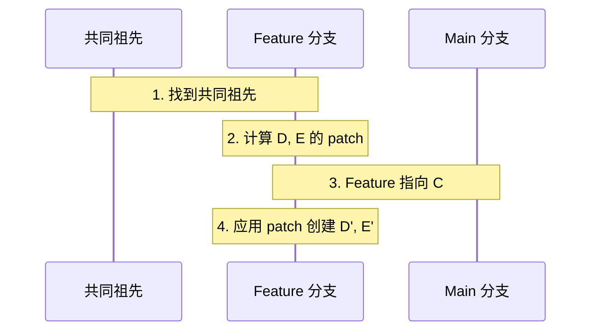

## 1. Rebase 基础

### 1.1 什么是 Rebase

Rebase 意为"变基", 即改变分支的基点. 它将一系列提交**重新应用**到另一个基点上.

```
Before:
main:       A---B---C
feature:        \---D---E

After (git rebase main):
main:       A---B---C
feature:            \---D'---E'
```

**D' 和 E' 是新的提交**, 内容相同但哈希值不同 (因为 parent 改变了).

### 1.2 Rebase vs Merge

| 特性 | Rebase | Merge |
|------|--------|-------|
| 历史 | 线性 | 保留分支结构 |
| 提交 | 重新创建 | 保持原样 |
| 冲突 | 逐个提交解决 | 一次解决 |
| 安全性 | 重写历史 (危险) | 不改变历史 |
| 适用场景 | 本地分支整理 | 公共分支合并 |

### 1.3 基本用法

```bash
# 在 feature 分支上
git rebase main

# 等价于
git rebase main feature

# 解决冲突后继续
git add .
git rebase --continue

# 跳过当前提交
git rebase --skip

# 中止 rebase
git rebase --abort
```

---

## 2. Rebase 的工作原理

### 2.1 内部流程

1. 找到两个分支的共同祖先
2. 计算当前分支相对于祖先的所有修改 (patch)
3. 将当前分支指向目标基点
4. 依次应用每个 patch, 创建新提交



### 2.2 为什么提交哈希会变

Git 提交的哈希值由以下内容计算:
- Tree (内容)
- Parent (父提交)
- Author/Committer 信息
- 时间戳
- 提交信息

Rebase 改变了 Parent, 所以哈希必然改变.

---

## 3. 交互式 Rebase

### 3.1 启动交互式 Rebase

```bash
# 修改最近 3 个提交
git rebase -i HEAD~3

# 从某个提交开始
git rebase -i abc1234

# 从根提交开始
git rebase -i --root
```

### 3.2 操作指令

编辑器会显示提交列表和可用操作:

```
pick abc1234 First commit
pick def5678 Second commit
pick ghi9012 Third commit

# Commands:
# p, pick   = 保留提交
# r, reword = 修改提交信息
# e, edit   = 暂停以修改
# s, squash = 合并到前一个提交
# f, fixup  = 合并但丢弃信息
# d, drop   = 删除提交
# x, exec   = 执行 shell 命令
# b, break  = 在此暂停
```

### 3.3 常见操作示例

**修改提交信息 (reword)**

```
r abc1234 First commit
pick def5678 Second commit
```

**合并多个提交 (squash/fixup)**

```
pick abc1234 Add feature
s def5678 Fix typo
f ghi9012 Fix another typo
```

结果: 三个提交合并为一个.
- `squash`: 合并提交信息
- `fixup`: 丢弃被合并提交的信息

**重新排序**

```
pick ghi9012 Third commit
pick abc1234 First commit
pick def5678 Second commit
```

**删除提交**

```
pick abc1234 First commit
d def5678 Second commit
pick ghi9012 Third commit
```

或直接删除该行.

**暂停编辑**

```
pick abc1234 First commit
e def5678 Second commit
pick ghi9012 Third commit
```

Git 会在 `def5678` 处暂停, 允许修改文件:

```bash
# 修改文件
vim file.txt
git add file.txt
git commit --amend
git rebase --continue
```

### 3.4 Autosquash

自动整理 fixup 提交:

```bash
# 创建 fixup 提交
git commit --fixup=abc1234
# 会创建: fixup! {原提交信息}

# 自动 rebase
git rebase -i --autosquash HEAD~5
```

配置自动启用:

```bash
git config --global rebase.autosquash true
```

---

## 4. onto: 更精确的 Rebase

### 4.1 onto 语法

```bash
git rebase --onto <newbase> <upstream> <branch>
```

**意思**: 把 `<upstream>` 到 `<branch>` 之间的提交, 应用到 `<newbase>` 上.

### 4.2 使用场景

**场景 1: 移动分支到另一个基点**

```
Before:
main:       A---B---C
feature:        \---D---E
topic:              \---F---G

After (git rebase --onto main feature topic):
main:       A---B---C
                    \---F'---G'
```

**场景 2: 删除中间的提交**

```
Before:
feature: A---B---C---D---E

After (git rebase --onto A C feature):
feature: A---D'---E'
# B 和 C 被删除
```

---

## 5. 历史重写工具

### 5.1 commit --amend

修改最后一个提交:

```bash
# 修改提交信息
git commit --amend -m "New message"

# 添加遗漏的文件
git add forgotten.txt
git commit --amend --no-edit

# 修改作者
git commit --amend --author="Name <email>"
```

### 5.2 filter-repo (推荐)

`git-filter-repo` 是 `filter-branch` 的现代替代品:

```bash
# 安装
pip install git-filter-repo

# 删除文件的所有历史
git filter-repo --path secrets.txt --invert-paths

# 重写作者信息
git filter-repo --mailmap mailmap.txt

# 提取子目录为新仓库
git filter-repo --subdirectory-filter src/

# 重命名文件/目录
git filter-repo --path-rename old/:new/
```

**mailmap 格式**

```
New Name <new@email.com> <old@email.com>
```

### 5.3 filter-branch (已废弃)

仍可用但不推荐:

```bash
# 删除文件
git filter-branch --tree-filter 'rm -f secrets.txt' HEAD

# 重写作者
git filter-branch --env-filter '
if [ "$GIT_AUTHOR_EMAIL" = "old@email.com" ]; then
    export GIT_AUTHOR_EMAIL="new@email.com"
fi' HEAD
```

### 5.4 BFG Repo-Cleaner

专门用于删除大文件和敏感数据:

```bash
# 删除大文件
bfg --strip-blobs-bigger-than 100M

# 删除敏感数据
bfg --replace-text passwords.txt

# 删除特定文件
bfg --delete-files *.mp4
```

---

## 6. Rebase 的黄金法则

> **永远不要 rebase 已经推送到公共仓库的提交.**

### 6.1 为什么

Rebase 会重写历史, 其他开发者的本地仓库会与远程不一致, 导致:
- 合并冲突
- 重复提交
- 历史混乱

### 6.2 安全的 Rebase 场景

- ✅ 本地未推送的分支
- ✅ 个人功能分支 (仅自己使用)
- ✅ Pull Request 合并前的整理
- ❌ 共享的分支 (main, develop)
- ❌ 已推送的公共提交

### 6.3 如果已经推送

```bash
# 强制推送 (谨慎!)
git push --force

# 更安全的强制推送
git push --force-with-lease
# 如果远程有其他人的新提交, 会失败
```

---

## 7. Cherry-pick

### 7.1 基本用法

将某个提交应用到当前分支:

```bash
# 应用单个提交
git cherry-pick abc1234

# 应用多个提交
git cherry-pick abc1234 def5678

# 应用范围 (不含起点)
git cherry-pick abc1234..ghi9012

# 应用范围 (含起点)
git cherry-pick abc1234^..ghi9012
```

### 7.2 选项

```bash
# 不自动提交
git cherry-pick -n abc1234

# 编辑提交信息
git cherry-pick -e abc1234

# 添加来源信息
git cherry-pick -x abc1234
# 提交信息会包含: (cherry picked from commit abc1234)
```

### 7.3 冲突处理

```bash
# 解决冲突后继续
git add .
git cherry-pick --continue

# 跳过
git cherry-pick --skip

# 中止
git cherry-pick --abort
```

---

## 8. 练习

### 8.1 交互式 Rebase 练习

1. 创建 5 个提交.
2. 使用交互式 rebase 合并前两个, 删除第三个, 重排后两个.

### 8.2 Fixup 工作流

1. 创建一个提交.
2. 发现问题, 创建 `--fixup` 提交.
3. 使用 `--autosquash` 自动合并.

### 8.3 敏感数据清除

1. 创建仓库并添加包含"密码"的文件.
2. 使用 `filter-repo` 从历史中删除.
3. 验证所有提交都不再包含该文件.

---

## 9. 思考题

1. Rebase 后原来的提交去哪了? (提示: reflog)
2. 为什么 `--force-with-lease` 比 `--force` 更安全?
3. 什么时候用 `squash`, 什么时候用 `fixup`?
4. `git rebase --onto A B C` 中三个参数各代表什么?
5. Cherry-pick 和 Rebase 有什么关系?

---

## 10. 本周小结

- **Rebase 原理**: 重新应用提交到新基点.
- **交互式 Rebase**: pick, reword, edit, squash, fixup, drop.
- **onto**: 精确控制 rebase 范围.
- **历史重写**: filter-repo, BFG Repo-Cleaner.
- **黄金法则**: 不 rebase 公共提交.
- **Cherry-pick**: 选择性应用提交.

---

> Rebase 是把双刃剑. 用好了, 它能保持历史整洁; 用错了, 它会摧毁团队协作.
