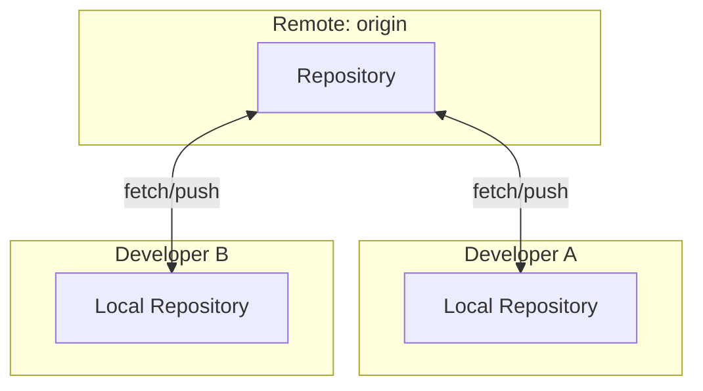
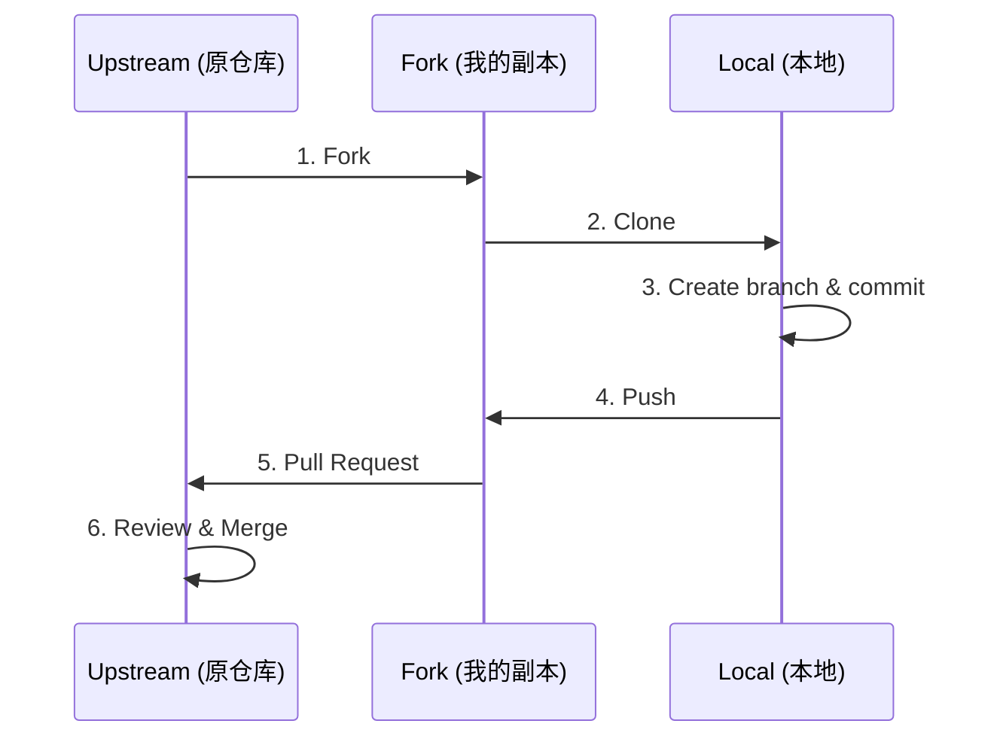

## 1. 分布式版本控制

### 1.1 集中式 vs 分布式

| 特性 | 集中式 (SVN) | 分布式 (Git) |
|------|-------------|--------------|
| 仓库位置 | 单一服务器 | 每个开发者完整副本 |
| 离线工作 | 不支持 | 完全支持 |
| 提交 | 提交到服务器 | 提交到本地 |
| 分支 | 重量级 | 轻量级 |
| 单点故障 | 有 | 无 |

### 1.2 Git 的分布式模型

每个 Git 仓库都是**完整的**, 包含全部历史:



---

## 2. Remote (远程仓库)

### 2.1 Remote 概念

Remote 是一个**指向远程仓库的别名**, 存储在 `.git/config` 中.

```ini
[remote "origin"]
    url = git@github.com:user/repo.git
    fetch = +refs/heads/*:refs/remotes/origin/*
```

### 2.2 Remote 操作

```bash
# 查看远程仓库
git remote
git remote -v

# 添加远程仓库
git remote add origin git@github.com:user/repo.git

# 修改 URL
git remote set-url origin https://github.com/user/repo.git

# 重命名
git remote rename origin upstream

# 删除
git remote remove origin

# 查看详细信息
git remote show origin
```

### 2.3 多远程仓库配置

```bash
# Fork 工作流常见配置
git remote add origin git@github.com:me/repo.git    # 我的 fork
git remote add upstream git@github.com:org/repo.git # 原始仓库

# 从 upstream 同步
git fetch upstream
git merge upstream/main
```

---

## 3. Refspec (引用规格)

### 3.1 什么是 Refspec

Refspec 定义了**本地引用与远程引用之间的映射关系**:

```
+<src>:<dst>
```

- `+`: 强制更新 (即使非 fast-forward)
- `<src>`: 源引用
- `<dst>`: 目标引用

### 3.2 Fetch Refspec

```ini
[remote "origin"]
    fetch = +refs/heads/*:refs/remotes/origin/*
```

**解读**:
- 获取远程所有分支 (`refs/heads/*`)
- 存储到本地 `refs/remotes/origin/*`
- `+` 表示总是更新, 即使本地版本更新

**自定义 Fetch**

```bash
# 只获取特定分支
git config --add remote.origin.fetch +refs/heads/main:refs/remotes/origin/main

# 获取所有标签
git config --add remote.origin.fetch +refs/tags/*:refs/tags/*
```

### 3.3 Push Refspec

```bash
# 显式 push
git push origin main:main
# 等价于: 将本地 main 推送到远程 main

# 删除远程分支
git push origin :feature
# 等价于: 推送"空"到远程 feature

# 推送本地分支到不同名称
git push origin local-branch:remote-branch
```

### 3.4 配置默认 Push 行为

```bash
# 推送当前分支到同名远程分支
git config --global push.default current

# 推送到设置的上游分支
git config --global push.default upstream

# Git 2.0+ 默认: 推送同名分支
git config --global push.default simple
```

---

## 4. Fetch, Pull, Push

### 4.1 Fetch

从远程获取更新, **不修改工作区**:

```bash
git fetch origin
git fetch origin main
git fetch --all       # 所有远程
git fetch --prune     # 删除本地已不存在的远程分支
git fetch --tags      # 获取标签
```

**Fetch 只更新**:
- `.git/objects/` (对象)
- `.git/refs/remotes/` (远程跟踪分支)

### 4.2 Pull

Fetch + Merge (或 Rebase):

```bash
git pull origin main

# 等价于
git fetch origin main
git merge origin/main

# 使用 rebase
git pull --rebase origin main

# 配置默认 rebase
git config --global pull.rebase true
```

### 4.3 Push

将本地提交推送到远程:

```bash
git push origin main

# 设置上游并推送
git push -u origin main

# 推送所有分支
git push --all

# 推送标签
git push --tags
git push origin v1.0.0

# 强制推送 (危险!)
git push --force

# 安全强制推送
git push --force-with-lease
```

---

## 5. 跟踪分支 (Tracking Branch)

### 5.1 什么是跟踪分支

当本地分支与远程分支建立关联后, Git 会自动跟踪它们的差异.

```bash
# 查看跟踪关系
git branch -vv
# * main   abc1234 [origin/main: ahead 2, behind 1] Latest commit

# ahead 2: 本地比远程多 2 个提交
# behind 1: 远程比本地多 1 个提交
```

### 5.2 设置跟踪

```bash
# 创建时设置
git checkout -b feature origin/feature
git switch -c feature --track origin/feature

# 为已有分支设置
git branch --set-upstream-to=origin/feature feature

# 推送时设置
git push -u origin feature
```

### 5.3 查看上游信息

```bash
# 显示上游仓库详情
git remote show origin

# 查看所有跟踪分支
git for-each-ref --format='%(refname:short) -> %(upstream:short)' refs/heads
```

---

## 6. Fork 与 Pull Request 工作流

### 6.1 Fork 模型



### 6.2 完整工作流

```bash
# 1. Fork 仓库 (在 GitHub/GitLab 网页操作)

# 2. 克隆自己的 Fork
git clone git@github.com:me/repo.git
cd repo

# 3. 添加 upstream
git remote add upstream git@github.com:org/repo.git

# 4. 创建功能分支
git checkout -b feature/awesome-feature

# 5. 开发并提交
git add .
git commit -m "feat: add awesome feature"

# 6. 推送到自己的 Fork
git push -u origin feature/awesome-feature

# 7. 创建 Pull Request (网页操作)

# 8. 同步 upstream 更新
git fetch upstream
git checkout main
git merge upstream/main
git push origin main
```

### 6.3 保持 Fork 更新

```bash
# 方法 1: Merge
git fetch upstream
git checkout main
git merge upstream/main
git push origin main

# 方法 2: Rebase (保持线性历史)
git fetch upstream
git checkout main
git rebase upstream/main
git push origin main --force-with-lease
```

---

## 7. Code Review 最佳实践

### 7.1 提交者

1. **小批量提交**: 每个 PR 专注于一件事
2. **清晰的描述**: 说明做了什么、为什么、如何测试
3. **自我审查**: 提交前先自己过一遍
4. **响应反馈**: 及时回应评审意见

**PR 模板示例**

```markdown
## 变更描述
简要说明此 PR 做了什么

## 变更类型
- [ ] Bug 修复
- [ ] 新功能
- [ ] 重构
- [ ] 文档更新

## 测试
描述如何测试这些变更

## 相关 Issue
Closes #123
```

### 7.2 审查者

1. **及时审查**: 不要让 PR 长时间挂起
2. **建设性反馈**: 说明问题和建议, 避免否定性评论
3. **区分严重程度**: 必须修改 vs 建议修改
4. **验证功能**: 拉取代码本地测试

**评审评论格式**

```
[nit] 小问题, 可以不改
[suggestion] 建议修改
[required] 必须修改
[question] 需要讨论
```

---

## 8. 协作配置

### 8.1 Credential 管理

```bash
# 缓存密码 (内存, 15分钟)
git config --global credential.helper cache

# 缓存密码 (1小时)
git config --global credential.helper 'cache --timeout=3600'

# 存储密码 (磁盘, 明文)
git config --global credential.helper store

# macOS Keychain
git config --global credential.helper osxkeychain

# Windows Credential Manager
git config --global credential.helper manager
```

### 8.2 SSH vs HTTPS

| 特性 | SSH | HTTPS |
|------|-----|-------|
| 认证 | SSH Key | 用户名/密码或 Token |
| 端口 | 22 | 443 |
| 防火墙 | 可能被阻断 | 通常畅通 |
| 配置 | 需要生成 key | 需要存储凭证 |

**SSH 配置**

```bash
# 生成 SSH Key
ssh-keygen -t ed25519 -C "your@email.com"

# 添加到 SSH Agent
eval "$(ssh-agent -s)"
ssh-add ~/.ssh/id_ed25519

# 测试连接
ssh -T git@github.com
```

---

## 9. 练习

### 9.1 Fork 工作流

1. Fork 一个开源项目.
2. 克隆并配置 upstream.
3. 创建分支并提交.
4. 同步 upstream 更新.

### 9.2 Refspec 实验

1. 配置只 fetch 特定分支.
2. 使用 push refspec 重命名分支.

### 9.3 多远程协作

配置两个远程仓库, 模拟从一个获取, 推送到另一个的场景.

---

## 10. 思考题

1. `git fetch` 和 `git pull` 有什么区别?
2. 为什么推荐 `--force-with-lease` 而不是 `--force`?
3. Fork 和 Clone 有什么区别?
4. 跟踪分支的信息存储在哪里?
5. 为什么 PR 合并后建议删除功能分支?

---

## 11. 本周小结

- **分布式架构**: 每个仓库都是完整副本.
- **Remote**: 指向远程仓库的别名.
- **Refspec**: 定义本地与远程的映射.
- **Fetch/Pull/Push**: 获取、合并、推送.
- **跟踪分支**: 建立本地与远程的关联.
- **Fork 工作流**: 开源项目的标准协作模式.
- **Code Review**: 小批量、建设性反馈.

---

> 理解 Refspec, 就理解了 Git 远程操作的本质. 所有的 fetch, pull, push 都是 Refspec 的应用.
