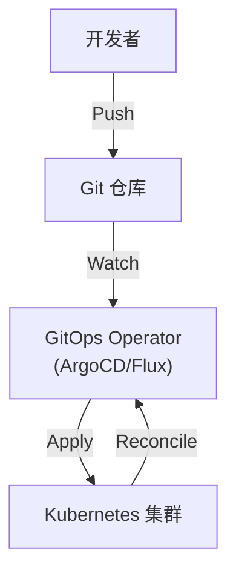
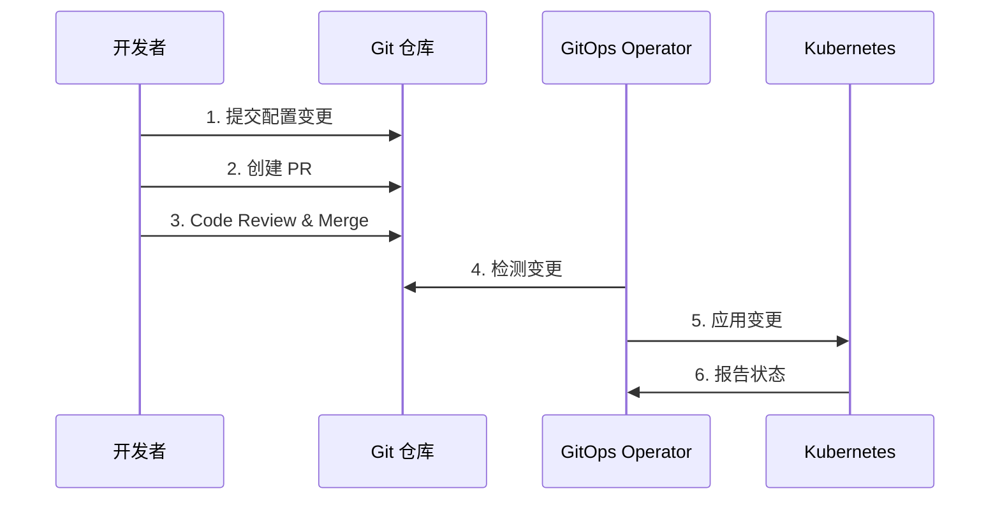
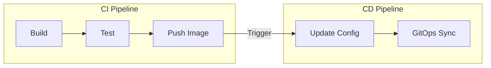

## 1. GitOps 概述

### 1.1 什么是 GitOps

GitOps 是一种**以 Git 为单一事实来源 (Single Source of Truth)** 的运维方法论.

**核心原则**:
1. **声明式描述**: 基础设施和应用配置以声明式形式存储
2. **版本控制**: 所有变更通过 Git 管理
3. **自动应用**: 变更自动同步到目标环境
4. **持续观测**: 系统状态与 Git 保持一致

### 1.2 传统 CI/CD vs GitOps

| 特性 | 传统 CI/CD (Push) | GitOps (Pull) |
|------|------------------|---------------|
| 部署方向 | CI 推送到集群 | 集群从 Git 拉取 |
| 凭证位置 | CI 系统 | 集群内部 |
| 状态管理 | 命令式 | 声明式 |
| 回滚 | 重新运行管道 | Git revert |
| 漂移检测 | 需要额外工具 | 内置 |

### 1.3 GitOps 架构



---

## 2. GitOps 工作流

### 2.1 仓库结构

**推荐: 分离应用代码和配置**

```
app-repo/           # 应用代码仓库
├── src/
├── Dockerfile
└── .github/workflows/ci.yml

config-repo/        # 配置仓库
├── base/
│   ├── deployment.yaml
│   ├── service.yaml
│   └── kustomization.yaml
├── overlays/
│   ├── dev/
│   ├── staging/
│   └── prod/
└── .github/workflows/promote.yml
```

### 2.2 分支策略与环境映射

**方案 1: 分支对应环境**

```
main     → production
staging  → staging
develop  → development
```

**方案 2: 目录对应环境 (推荐)**

```
main 分支
├── environments/
│   ├── dev/
│   ├── staging/
│   └── prod/
```

**方案 3: 标签触发发布**

```
v1.0.0 → 触发 prod 部署
v1.0.0-rc.1 → 触发 staging 部署
```

### 2.3 变更流程



---

## 3. ArgoCD 核心概念

### 3.1 什么是 ArgoCD

ArgoCD 是一个声明式 GitOps 持续交付工具, 用于 Kubernetes.

### 3.2 核心组件

| 组件 | 作用 |
|------|------|
| Application | 定义 Git 仓库与 K8s 命名空间的映射 |
| AppProject | 应用分组和权限控制 |
| Repository | Git 仓库配置 |
| Cluster | 目标 K8s 集群配置 |

### 3.3 Application 定义

```yaml
apiVersion: argoproj.io/v1alpha1
kind: Application
metadata:
  name: my-app
  namespace: argocd
spec:
  project: default
  source:
    repoURL: https://github.com/org/config-repo
    targetRevision: main
    path: environments/prod
  destination:
    server: https://kubernetes.default.svc
    namespace: my-app
  syncPolicy:
    automated:
      prune: true      # 删除不在 Git 中的资源
      selfHeal: true   # 自动修复漂移
    syncOptions:
      - CreateNamespace=true
```

### 3.4 同步状态

| 状态 | 含义 |
|------|------|
| Synced | 集群状态与 Git 一致 |
| OutOfSync | 集群状态与 Git 不一致 |
| Unknown | 无法确定状态 |

| 健康状态 | 含义 |
|----------|------|
| Healthy | 所有资源正常 |
| Progressing | 资源正在更新 |
| Degraded | 资源异常 |
| Suspended | 资源暂停 |

---

## 4. Flux 核心概念

### 4.1 什么是 Flux

Flux 是 CNCF 毕业项目, 提供 GitOps 工具集.

### 4.2 核心组件

| 组件 | 作用 |
|------|------|
| source-controller | 管理 Git/Helm/OCI 来源 |
| kustomize-controller | 应用 Kustomize 配置 |
| helm-controller | 管理 Helm Release |
| notification-controller | 事件通知 |
| image-reflector | 镜像自动更新 |

### 4.3 GitRepository 定义

```yaml
apiVersion: source.toolkit.fluxcd.io/v1
kind: GitRepository
metadata:
  name: app-config
  namespace: flux-system
spec:
  url: https://github.com/org/config-repo
  ref:
    branch: main
  interval: 1m
  secretRef:
    name: git-credentials
```

### 4.4 Kustomization 定义

```yaml
apiVersion: kustomize.toolkit.fluxcd.io/v1
kind: Kustomization
metadata:
  name: my-app
  namespace: flux-system
spec:
  sourceRef:
    kind: GitRepository
    name: app-config
  path: environments/prod
  interval: 5m
  prune: true
  healthChecks:
    - apiVersion: apps/v1
      kind: Deployment
      name: my-app
      namespace: my-app
```

---

## 5. Secrets 管理

### 5.1 问题

Git 仓库中不应存储明文 Secrets:
- 敏感信息泄露风险
- 违反安全策略
- 审计困难

### 5.2 解决方案

| 方案 | 原理 | 适用场景 |
|------|------|----------|
| Sealed Secrets | 加密存入 Git, 集群内解密 | K8s 原生 |
| SOPS | 加密配置文件 | 通用, 多云 |
| External Secrets | 从外部存储同步 | Vault, AWS SM |
| Vault Agent | 运行时注入 | HashiCorp 生态 |

### 5.3 SOPS (Secrets OPerationS)

**原理**: 使用 PGP/AWS KMS/GCP KMS 加密 YAML/JSON 中的值.

**安装与配置**

```bash
# 安装
brew install sops

# 创建 .sops.yaml 配置
cat > .sops.yaml <<EOF
creation_rules:
  - path_regex: .*secrets.*\.yaml
    age: age1...public_key
EOF
```

**使用**

```bash
# 加密文件
sops -e secrets.yaml > secrets.enc.yaml

# 解密文件
sops -d secrets.enc.yaml > secrets.yaml

# 直接编辑加密文件
sops secrets.enc.yaml
```

**加密后的文件**

```yaml
apiVersion: v1
kind: Secret
metadata:
  name: my-secret
data:
  password: ENC[AES256_GCM,data:...,iv:...,tag:...,type:str]
sops:
  age:
    - recipient: age1...
      enc: |
        -----BEGIN AGE ENCRYPTED FILE-----
        ...
        -----END AGE ENCRYPTED FILE-----
```

### 5.4 Sealed Secrets

**原理**: 使用集群的公钥加密, 只有集群能解密.

```bash
# 安装
kubectl apply -f https://github.com/bitnami-labs/sealed-secrets/releases/.../controller.yaml

# 获取公钥
kubeseal --fetch-cert > pub-sealed-secrets.pem

# 加密 Secret
kubeseal --format yaml < secret.yaml > sealed-secret.yaml
```

---

## 6. CI/CD 集成

### 6.1 CI 与 CD 分离



### 6.2 自动更新镜像版本

**GitHub Actions 示例**

```yaml
name: Update Image Version

on:
  workflow_dispatch:
    inputs:
      image_tag:
        description: 'Image tag to deploy'
        required: true

jobs:
  update:
    runs-on: ubuntu-latest
    steps:
      - uses: actions/checkout@v4
        with:
          repository: org/config-repo
          token: ${{ secrets.GITHUB_TOKEN }}
      
      - name: Update image tag
        run: |
          cd environments/prod
          kustomize edit set image app=registry/app:${{ inputs.image_tag }}
      
      - name: Commit and Push
        run: |
          git config user.name "github-actions"
          git config user.email "actions@github.com"
          git add -A
          git commit -m "chore: update image to ${{ inputs.image_tag }}"
          git push
```

### 6.3 Flux 镜像自动更新

```yaml
apiVersion: image.toolkit.fluxcd.io/v1beta1
kind: ImageRepository
metadata:
  name: app
spec:
  image: registry/app
  interval: 1m

---
apiVersion: image.toolkit.fluxcd.io/v1beta1
kind: ImagePolicy
metadata:
  name: app
spec:
  imageRepositoryRef:
    name: app
  policy:
    semver:
      range: ">=1.0.0"

---
apiVersion: image.toolkit.fluxcd.io/v1beta1
kind: ImageUpdateAutomation
metadata:
  name: app
spec:
  sourceRef:
    kind: GitRepository
    name: app-config
  git:
    commit:
      author:
        name: fluxcdbot
        email: fluxcd@users.noreply.github.com
      messageTemplate: 'chore: update image to {{.NewTag}}'
  update:
    path: ./environments/prod
```

---

## 7. 安全与合规

### 7.1 签名验证

**签名提交**

```yaml
# ArgoCD 验证签名
apiVersion: argoproj.io/v1alpha1
kind: Application
spec:
  source:
    repoURL: https://github.com/org/config-repo
    targetRevision: main
    signatureVerification:
      enabled: true
      signatureKeys:
        - gpg:
            privateKeySecret:
              name: argocd-gpg-keys
              key: private.asc
```

### 7.2 分支保护

- 要求 PR 合并
- 要求 Code Review
- 要求 CI 通过
- 禁止强制推送

### 7.3 审计日志

Git 历史本身就是完整的审计日志:

```bash
# 查看谁在什么时候做了什么变更
git log --oneline --author="Alice" -- environments/prod/

# 查看特定文件的变更历史
git log -p -- environments/prod/deployment.yaml
```

---

## 8. 练习

### 8.1 GitOps 基础

1. 创建配置仓库.
2. 设置环境目录结构.
3. 手动模拟 GitOps 流程.

### 8.2 SOPS 加密

1. 配置 SOPS 使用 age.
2. 加密 Secret 文件.
3. 解密并验证.

### 8.3 CI/CD 自动化

设计一个 CI 管道, 在镜像构建后自动更新配置仓库.

---

## 9. 思考题

1. 为什么 GitOps 使用 Pull 模式而不是 Push?
2. ArgoCD 和 Flux 的主要区别是什么?
3. SOPS 和 Sealed Secrets 应该选哪个?
4. 如何处理 GitOps 中的紧急回滚?
5. GitOps 如何处理有状态应用?

---

## 10. 本周小结

- **GitOps 原则**: 声明式, 版本控制, 自动应用, 持续观测.
- **仓库策略**: 分离应用代码和配置.
- **ArgoCD**: Application, 自动同步, 漂移检测.
- **Flux**: GitRepository, Kustomization, 镜像自动更新.
- **Secrets**: SOPS, Sealed Secrets, External Secrets.
- **CI/CD**: CI 构建镜像, CD 更新配置.
- **安全**: 签名验证, 分支保护, 审计.

---

> GitOps 的本质是将运维知识编码化. Git 不仅是代码的版本控制, 更是基础设施的版本控制.
