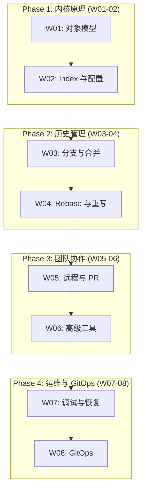

本学习计划面向有 Git 基础的开发者, 目标是深入理解 Git 内核原理, 掌握高级协作技术, 并具备 GitOps 工程化能力.

---

## 学习路径概览

---

## Phase 1: Git 内核原理 (Week 1-2)

### Week 01: Git 对象模型与存储引擎

- 内容寻址文件系统原理
- SHA-1/SHA-256 哈希算法
- 四大对象: Blob, Tree, Commit, Tag
- `.git` 目录完整解析
- Packfile 与 Delta 压缩
- Plumbing 命令实战

### Week 02: 工作区、暂存区与配置系统

- 三棵树模型 (Working/Staging/Repository)
- Index 文件二进制格式
- `.gitignore` 与 `.gitattributes`
- 配置层次与 includeIf
- Hooks 系统 (客户端与服务端)
- reset/restore 深度理解

---

## Phase 2: 历史管理 (Week 3-4)

### Week 03: 分支模型与合并策略

- 分支的本质 (指针)
- HEAD 与分离 HEAD
- 合并策略 (recursive, ort, octopus, ours)
- 冲突解决与 Rerere
- 分支策略 (Git Flow, GitHub Flow, Trunk-Based)
- Worktree 多工作目录

### Week 04: Rebase 与历史重写

- Rebase 原理与工作流程
- 交互式 Rebase (squash, fixup, reword, edit, drop)
- `--onto` 精确控制
- `filter-repo` 与 BFG Repo-Cleaner
- Cherry-pick
- 黄金法则: 不 rebase 公共提交

---

## Phase 3: 团队协作 (Week 5-6)

### Week 05: 远程仓库与团队协作

- 分布式架构原理
- Remote 与 Refspec 深度解析
- Fetch/Pull/Push 机制
- 跟踪分支与上游
- Fork 与 Pull Request 工作流
- Code Review 最佳实践

### Week 06: 高级协作模式与工具

- Worktree 并行开发
- Stash 栈管理与内部结构
- Patch 工作流 (format-patch, am)
- Blame 与 Log 高级用法
- Git LFS 大文件存储
- GPG 签名与验证

---

## Phase 4: 运维与 GitOps (Week 7-8)

### Week 07: 调试、恢复与仓库维护

- Bisect 二分查找定位 Bug
- Reflog 历史恢复
- fsck 完整性验证
- GC/Prune/Repack 机制
- 仓库瘦身与优化
- 备份与迁移策略

### Week 08: GitOps 与自动化

- GitOps 原则与架构
- Git 作为 Single Source of Truth
- ArgoCD 核心概念
- Flux 工具集
- Secrets 管理 (SOPS, Sealed Secrets)
- CI/CD 集成
- 安全与合规

---

## 学习资源

| 资源 | 类型 | 阶段 |
|------|------|------|
| [Pro Git Book](https://git-scm.com/book/en/v2) | 书籍 | 全阶段 |
| [Git Internals](https://git-scm.com/book/en/v2/Git-Internals-Plumbing-and-Porcelain) | 文档 | 原理 |
| [Atlassian Git Tutorials](https://www.atlassian.com/git/tutorials) | 教程 | 入门 |
| [ArgoCD Documentation](https://argo-cd.readthedocs.io/) | 文档 | GitOps |
| [Flux Documentation](https://fluxcd.io/docs/) | 文档 | GitOps |

---

> 理解 Git 的对象模型, 就掌握了 Git 的一切. 分支、合并、变基, 都只是在不可变对象之上移动指针.
