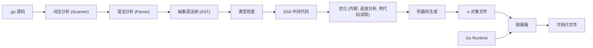

## 1. Go 语言概述

### 1.1 设计哲学

Go 语言由 Google 于 2009 年发布, 设计者包括 Ken Thompson (Unix 创始人)、Rob Pike (UTF-8 发明者) 和 Robert Griesemer.

**核心设计原则**:
1.  **简洁性 (Simplicity)**: 只有 25 个关键字, 语法极简.
2.  **正交性 (Orthogonality)**: 特性之间相互独立, 不会产生意外交互.
3.  **组合优于继承**: 通过接口和嵌入实现代码复用, 不支持传统面向对象的继承.
4.  **并发优先**: Goroutine 和 Channel 是语言内置特性, 而非库.
5.  **快速编译**: 大型项目也能在秒级完成编译.

### 1.2 Go 的应用场景

Go 语言在以下领域有广泛应用:
*   **云原生基础设施**: Docker, Kubernetes, Prometheus, Istio, Terraform
*   **微服务开发**: 高并发 HTTP/gRPC 服务
*   **命令行工具**: kubectl, gh (GitHub CLI), hugo
*   **分布式系统**: etcd, CockroachDB, TiDB

---

## 2. 开发环境搭建

### 2.1 安装 Go

**macOS (Homebrew)**
```bash
brew install go
```

**Linux (手动安装)**
```bash
# 从官网下载最新版本
wget https://go.dev/dl/go1.22.0.linux-amd64.tar.gz

# 解压到 /usr/local
sudo rm -rf /usr/local/go
sudo tar -C /usr/local -xzf go1.22.0.linux-amd64.tar.gz

# 添加到 PATH
echo 'export PATH=$PATH:/usr/local/go/bin' >> ~/.bashrc
source ~/.bashrc
```

**Windows**
下载 [官方安装包](https://go.dev/dl/) 并运行安装向导.

### 2.2 验证安装

```bash
go version
# 输出示例: go version go1.22.0 darwin/arm64

go env GOROOT
# 输出 Go 的安装目录

go env GOPATH
# 输出工作空间目录 (默认 ~/go)
```

### 2.3 关键环境变量

| 变量 | 说明 | 默认值 / 常用值 |
|------|------|----------------|
| `GOROOT` | Go SDK 安装路径 | 自动设置, 通常无需修改 |
| `GOPATH` | 工作空间 (存放依赖缓存和安装的工具) | `~/go` |
| `GOBIN` | `go install` 安装二进制的目录 | `$GOPATH/bin` |
| `GOPROXY` | 模块代理地址 | `https://proxy.golang.org,direct` |
| `GOSUMDB` | 校验数据库 | `sum.golang.org` |
| `CGO_ENABLED` | 是否启用 CGO | `1` (启用) 或 `0` (禁用) |

**国内用户配置代理**:
```bash
go env -w GOPROXY=https://goproxy.cn,direct
```

### 2.4 IDE 配置

**VS Code (推荐)**
1.  安装 [Visual Studio Code](https://code.visualstudio.com/)
2.  安装官方 Go 扩展 (搜索 "Go" by Go Team at Google)
3.  打开命令面板 (`Cmd+Shift+P` / `Ctrl+Shift+P`)
4.  运行 `Go: Install/Update Tools`
5.  全选并安装 (gopls, dlv, staticcheck 等)

**GoLand**
商业 IDE, 开箱即用, 适合大型项目.

---

## 3. 第一个程序: Hello World

### 3.1 创建项目

```bash
mkdir hello
cd hello
go mod init hello
```

`go mod init` 会创建 `go.mod` 文件, 这是 Go Module 的清单文件:

```go
module hello

go 1.22
```

### 3.2 编写代码

创建 `main.go`:

```go
package main

import "fmt"

func main() {
    fmt.Println("Hello, World!")
}
```

### 3.3 运行与编译

```bash
# 方式 1: 直接运行 (编译到临时目录并执行)
go run main.go
# 输出: Hello, World!

# 方式 2: 编译为可执行文件
go build -o hello
./hello
# 输出: Hello, World!

# 方式 3: 安装到 $GOBIN
go install
```

### 3.4 程序结构解析

```go
package main            // 1. 包声明

import "fmt"            // 2. 导入标准库

func main() {           // 3. 主函数 (程序入口)
    fmt.Println("Hello, World!")  // 4. 输出语句
}
```

**详细说明**:
1.  **package main**: 声明这是一个可执行程序. 只有 `main` 包可以被编译为可执行文件.
2.  **import "fmt"**: 导入标准库中的 `fmt` (格式化 I/O) 包.
3.  **func main()**: 程序入口函数, 无参数无返回值.
4.  **fmt.Println**: `Println` 函数输出一行文本并换行.

---

## 4. 编译原理深度解析

### 4.1 从源码到可执行文件

Go 的编译工具链将 `.go` 源文件转换为机器码. 整个过程可以分为以下阶段:



### 4.2 各阶段详解

**1. 词法分析 (Lexical Analysis)**
将源代码字符流分解为 Token (词法单元), 如 `package`, `main`, `{`, `}`, `"Hello, World!"` 等.

**2. 语法分析 (Parsing)**
将 Token 序列构建为 AST (抽象语法树). AST 是源代码的树形表示.

**3. 类型检查 (Type Checking)**
验证类型正确性: 函数参数、返回值、赋值操作等. 类型错误在此阶段报出.

**4. SSA 生成与优化**
SSA (Static Single Assignment) 是一种中间表示形式, 每个变量只被赋值一次. 编译器在此阶段执行:
*   **内联 (Inlining)**: 将小函数直接展开到调用点.
*   **逃逸分析 (Escape Analysis)**: 决定变量分配在栈还是堆.
*   **死代码消除 (Dead Code Elimination)**: 移除永远不会执行的代码.

**5. 机器码生成**
将 SSA 转换为目标平台的汇编代码 (Go 使用自定义的 Plan 9 汇编语法).

**6. 链接**
将用户代码、依赖库和 **Go Runtime** 链接为最终的可执行文件.

### 4.3 查看编译过程

```bash
# 查看详细编译步骤
go build -x main.go

# 查看生成的汇编代码
go build -gcflags="-S" main.go

# 查看逃逸分析结果
go build -gcflags="-m" main.go
```

### 4.4 Go Runtime: 隐藏的巨人

与 C/C++ 不同, Go 生成的二进制文件包含一个完整的运行时系统. 这也解释了为什么即使是 Hello World, 二进制文件也有数 MB.

**Runtime 核心组件**:
1.  **调度器 (Scheduler)**: 实现 GMP 模型, 管理 Goroutine 的创建、执行和切换.
2.  **内存分配器 (Memory Allocator)**: 类似 TCMalloc, 多级缓存分配.
3.  **垃圾回收器 (Garbage Collector)**: 并发三色标记清除, 自动回收内存.
4.  **栈管理 (Stack Management)**: Goroutine 栈的动态扩容和收缩.

> 当程序启动时, 真正的入口是 `runtime.rt0_go`, 它负责初始化上述系统, 最后才调用用户的 `main.main`.

---

## 5. 变量与常量

### 5.1 变量声明

Go 提供多种变量声明方式:

```go
// 方式 1: var 关键字 (完整形式)
var name string = "Alice"
var age int = 25

// 方式 2: var + 类型推断
var name = "Alice"   // 推断为 string
var age = 25         // 推断为 int

// 方式 3: 短变量声明 (只能在函数内使用)
name := "Alice"
age := 25

// 方式 4: 批量声明
var (
    name   string = "Alice"
    age    int    = 25
    active bool   = true
)
```

### 5.2 零值 (Zero Value)

Go 保证所有变量在声明时都会被初始化为**零值**. 这消除了"未初始化内存"的安全隐患.

| 类型 | 零值 |
|------|------|
| 整数 (int, int8, ...) | `0` |
| 浮点数 (float32, float64) | `0.0` |
| 布尔 (bool) | `false` |
| 字符串 (string) | `""` (空字符串) |
| 指针、切片、映射、通道、函数、接口 | `nil` |

```go
var i int       // i == 0
var s string    // s == ""
var b bool      // b == false
var p *int      // p == nil
```

### 5.3 常量

常量使用 `const` 关键字声明, 必须在编译时确定值.

```go
const Pi = 3.14159
const MaxSize = 1024
const Greeting = "Hello"

// 批量声明
const (
    StatusOK    = 200
    StatusError = 500
)
```

**iota: 枚举生成器**

`iota` 是 Go 的常量计数器, 在 `const` 块中从 0 开始, 每声明一个常量自增 1.

```go
const (
    Sunday = iota  // 0
    Monday         // 1
    Tuesday        // 2
    Wednesday      // 3
    Thursday       // 4
    Friday         // 5
    Saturday       // 6
)

// 位运算示例: 权限标志
const (
    Read  = 1 << iota  // 1 (001)
    Write              // 2 (010)
    Exec               // 4 (100)
)

// 使用
perm := Read | Write  // 3 (011)
```

### 5.4 常量的编译期特性

常量在编译期求值, 不占用运行时内存.

```go
const x = 1 + 2  // 编译期计算, x = 3

// 高精度: 编译器使用 256+ bit 精度计算
const Huge = 1e1000 / 1e999  // 10.0, 不会溢出
```

---

## 6. 基础数据类型

### 6.1 整数类型

| 类型 | 大小 | 范围 |
|------|------|------|
| int8 | 1 byte | -128 ~ 127 |
| int16 | 2 bytes | -32768 ~ 32767 |
| int32 | 4 bytes | -2^31 ~ 2^31-1 |
| int64 | 8 bytes | -2^63 ~ 2^63-1 |
| uint8 (byte) | 1 byte | 0 ~ 255 |
| uint16 | 2 bytes | 0 ~ 65535 |
| uint32 | 4 bytes | 0 ~ 2^32-1 |
| uint64 | 8 bytes | 0 ~ 2^64-1 |
| int | 平台相关 | 32位系统: int32, 64位: int64 |
| uint | 平台相关 | 同上 |
| uintptr | 平台相关 | 存储指针值 |

**补码表示**:
有符号整数使用补码 (Two's Complement) 存储. 补码的优势是加减法无需特殊处理符号位.

```go
var a int8 = 127   // 二进制: 0111 1111
a = a + 1          // 溢出! 二进制: 1000 0000 -> 补码解释为 -128
fmt.Println(a)     // -128
```

> Go 不会在运行时检测整数溢出. 这是性能与安全的权衡.

### 6.2 浮点数类型

| 类型 | 大小 | 精度 |
|------|------|------|
| float32 | 4 bytes | 约 7 位有效数字 |
| float64 | 8 bytes | 约 15 位有效数字 |

Go 的浮点数遵循 IEEE 754 标准.

**精度问题**:
```go
fmt.Println(0.1 + 0.2)  // 0.30000000000000004 (不是精确的 0.3)

// 正确的比较方式
const epsilon = 1e-9
if math.Abs(a-b) < epsilon {
    // 视为相等
}
```

### 6.3 布尔类型

```go
var active bool = true
var deleted bool = false

// 零值
var flag bool  // false
```

Go 的布尔类型不能与整数互换 (不像 C):
```go
// 错误!
if 1 { }  // 编译错误: non-bool 1 used as if condition
```

### 6.4 字符串类型

Go 的字符串是**不可变**的 UTF-8 编码字节序列.

```go
s := "Hello, 世界"
fmt.Println(len(s))          // 13 (字节数, 非字符数)
fmt.Println(utf8.RuneCountInString(s))  // 9 (字符数)

// 遍历字符串 (按 byte)
for i := 0; i < len(s); i++ {
    fmt.Printf("%d: %c\n", i, s[i])  // 中文会乱码
}

// 遍历字符串 (按 rune, 推荐)
for i, r := range s {
    fmt.Printf("%d: %c\n", i, r)  // 正确处理 UTF-8
}
```

**字符串底层结构**:
```go
// 类似于 (伪代码)
type stringHeader struct {
    Data uintptr  // 指向底层字节数组
    Len  int      // 字符串长度
}
```

**字符串不可变性**:
```go
s := "hello"
// s[0] = 'H'  // 编译错误! strings are immutable
```

### 6.5 byte 与 rune

*   **byte**: `uint8` 的别名, 表示一个字节.
*   **rune**: `int32` 的别名, 表示一个 Unicode 码点.

```go
var b byte = 'A'   // 65
var r rune = '中'  // 20013

// 字符串转换
s := "你好"
bytes := []byte(s)   // UTF-8 编码的字节切片
runes := []rune(s)   // Unicode 码点切片
```

---

## 7. 类型转换

Go **只有显式类型转换**, 没有隐式转换.

```go
var i int = 42
var f float64 = float64(i)  // int -> float64
var u uint = uint(i)        // int -> uint

// 字符串转换
s := strconv.Itoa(42)       // int -> string: "42"
n, err := strconv.Atoi("42") // string -> int: 42
```

**转换可能丢失精度或溢出**:
```go
var big int64 = 1000000
var small int8 = int8(big)  // 溢出! 结果未定义
```

---

## 8. 格式化输出 (fmt 包)

### 8.1 常用函数

| 函数 | 说明 |
|------|------|
| `fmt.Print` | 输出, 无换行 |
| `fmt.Println` | 输出, 自动换行 |
| `fmt.Printf` | 格式化输出 |
| `fmt.Sprintf` | 格式化并返回字符串 |
| `fmt.Errorf` | 格式化并返回 error |

### 8.2 格式化动词

| 动词 | 说明 | 示例 |
|------|------|------|
| `%v` | 默认格式 | `fmt.Printf("%v", 42)` -> `42` |
| `%+v` | 带字段名的结构体 | `{Name:Alice Age:25}` |
| `%#v` | Go 语法格式 | `main.Person{Name:"Alice"}` |
| `%T` | 类型 | `fmt.Printf("%T", 42)` -> `int` |
| `%d` | 十进制整数 | `42` |
| `%b` | 二进制 | `101010` |
| `%x` | 十六进制 (小写) | `2a` |
| `%f` | 浮点数 (默认精度) | `3.141593` |
| `%.2f` | 浮点数 (2位小数) | `3.14` |
| `%s` | 字符串 | `hello` |
| `%q` | 带引号的字符串 | `"hello"` |
| `%p` | 指针地址 | `0xc0000140a0` |
| `%t` | 布尔值 | `true` |

```go
name := "Alice"
age := 25
fmt.Printf("Name: %s, Age: %d\n", name, age)
// Name: Alice, Age: 25

pi := 3.14159265
fmt.Printf("Pi: %.2f\n", pi)
// Pi: 3.14
```

---

## 9. 输入 (fmt.Scan)

```go
var name string
var age int

fmt.Print("Enter name: ")
fmt.Scan(&name)

fmt.Print("Enter age: ")
fmt.Scan(&age)

fmt.Printf("Hello, %s! You are %d years old.\n", name, age)
```

---

## 10. 进阶工具链

### 10.1 常用工具命令

```bash
go env              # 查看所有环境变量
go env -w KEY=VALUE # 持久化设置环境变量
go doc fmt.Println  # 查看文档
go fix              # 自动修复旧版本 API
go generate         # 执行代码生成指令
go tool dist list   # 查看支持的编译目标平台
```

### 10.2 编译指令 (Compiler Directives)

Go 支持通过注释形式的编译指令控制编译行为:

```go
//go:build linux && amd64
// +build linux,amd64  // 旧语法 (Go 1.17 前)

//go:embed assets/*
var assets embed.FS

//go:generate mockgen -source=interface.go -destination=mock.go

//go:noinline  // 禁止内联 (性能分析用)
//go:nosplit   // 禁止栈分裂
```

### 10.3 交叉编译

Go 原生支持交叉编译, 无需额外工具链:

```bash
# 编译 Linux AMD64 二进制
GOOS=linux GOARCH=amd64 go build -o app-linux

# 编译 Windows 二进制
GOOS=windows GOARCH=amd64 go build -o app.exe

# 编译 macOS ARM64 二进制
GOOS=darwin GOARCH=arm64 go build -o app-darwin
```

### 10.4 条件编译 (Build Tags)

通过文件命名或 `//go:build` 指令实现条件编译:

```go
// file: config_prod.go
//go:build prod

package config

var Debug = false

// file: config_dev.go
//go:build !prod

package config

var Debug = true
```

```bash
# 使用 build tag 编译
go build -tags=prod
```

---

## 11. 练习

### 11.1 温度转换

编写程序, 将摄氏温度转换为华氏温度.

```go
package main

import "fmt"

func main() {
    var celsius float64
    fmt.Print("Enter temperature in Celsius: ")
    fmt.Scan(&celsius)

    fahrenheit := celsius*9/5 + 32
    fmt.Printf("%.2f°C = %.2f°F\n", celsius, fahrenheit)
}
```

### 11.2 iota 练习

使用 iota 定义文件大小单位 (KB, MB, GB, TB).

```go
const (
    _  = iota             // 忽略 0
    KB = 1 << (10 * iota) // 1 << 10 = 1024
    MB                    // 1 << 20
    GB                    // 1 << 30
    TB                    // 1 << 40
)

func main() {
    fileSize := 2.5 * GB
    fmt.Printf("File size: %.2f bytes\n", fileSize)
}
```

### 11.3 编译选项实验

1.  使用 `go build -x main.go` 查看完整编译过程.
2.  使用 `go build -gcflags="-m" main.go` 查看逃逸分析.
3.  使用 `go build -ldflags="-s -w" main.go` 生成更小的二进制.

---

## 12. 常见问题

### 12.1 go: command not found

```bash
# 检查 Go 是否在 PATH 中
echo $PATH | grep go

# 手动添加
export PATH=$PATH:/usr/local/go/bin
```

### 12.2 短声明 := 只能在函数内使用

```go
package main

name := "Alice"  // 错误! 必须用 var

func main() {
    name := "Alice"  // 正确
}
```

### 12.3 未使用的变量会导致编译错误

```go
func main() {
    x := 10  // 错误! x declared but not used
}
```

这是 Go 的设计哲学: 保持代码整洁.

---

## 13. 思考题

1.  为什么 Go 的可执行文件比 C 编译的类似程序大很多?
2.  Go 为什么不支持隐式类型转换?
3.  `var x int` 和 `x := 0` 有什么区别?
4.  为什么 Go 字符串是不可变的? 这有什么好处?
5.  `iota` 在每个 `const` 块中的值是如何变化的?

---

## 14. 本周小结

*   **环境搭建**: 安装 Go, 配置 GOPATH 和 GOPROXY.
*   **编译原理**: 理解 Source -> AST -> SSA -> Machine Code 的流程.
*   **Runtime**: Go 二进制包含调度器、GC、内存分配器等核心组件.
*   **变量与常量**: var 声明, := 短声明, const iota.
*   **基础类型**: int, float, string, bool, byte, rune.
*   **类型转换**: 只有显式转换, 无隐式转换.
*   **格式化**: fmt.Printf 及常用动词.

---

> 第一周的目标是让你能运行第一个 Go 程序, 并理解背后的编译和运行机制. 下周我们将学习控制流和函数.
