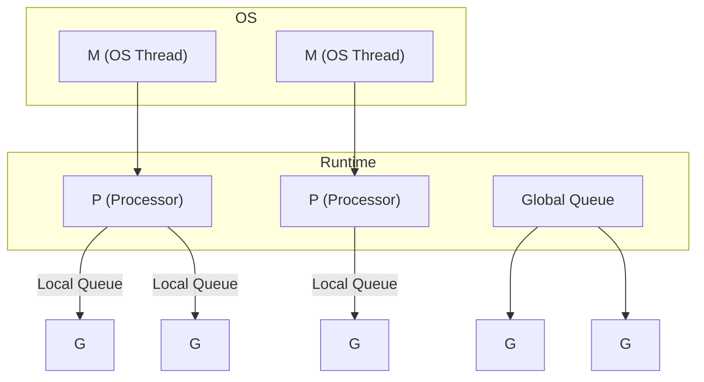

## 1. 并发 vs 并行

*   **并发 (Concurrency)**: 同时处理多个任务的能力 (交替执行).
*   **并行 (Parallelism)**: 同时执行多个任务 (多核 CPU).

Go 的并发模型基于 **CSP (Communicating Sequential Processes)**, 核心理念是:

> "不要通过共享内存来通信, 而要通过通信来共享内存."

### 1.3 Go 内存模型 (Happens-Before)

Go 内存模型定义了"在一个 Goroutine 中写入变量, 在另一个 Goroutine 中读取该变量"的可见性规则. 核心是 **Happens-Before** 关系.

**核心保证**:
1.  **初始化**: `main.init` Happens-Before `main.main`.
2.  **Goroutine 创建**: `go` 语句 Happens-Before Goroutine 的执行.
3.  **Channel 发送/接收**:
    *   **无缓冲**: 接收完成 Happens-Before 发送完成.
    *   **有缓冲**: 发送完成 Happens-Before 接收完成 (对于第 K 个元素).
    *   **关闭**: `close` Happens-Before 接收到零值.
4.  **Lock**: `Unlock` Happens-Before 下一次 `Lock`.

**错误示例**:
```go
var a string
var done bool

func setup() {
    a = "hello"
    done = true
}

func main() {
    go setup()
    for !done { }  // 忙等待 (Busy Wait)
    print(a)       // 无法保证打印 "hello", 可能打印空字符串!
}
```
*原因*: `done = true` 和 `print(a)` 之间没有 Happens-Before 关系. 编译器重排或 CPU 缓存可能导致 `main` 看到 `done` 变了但 `a` 没变.

---

## 2. Goroutine

### 2.1 什么是 Goroutine

Goroutine 是 Go 运行时管理的**轻量级线程**, 比操作系统线程更加高效.

| 特性 | Goroutine | OS Thread |
|------|-----------|-----------|
| 初始栈大小 | 2 KB | 1-8 MB |
| 创建成本 | ~0.3 μs | ~30 μs |
| 切换成本 | ~0.2 μs | ~1 μs |
| 数量限制 | 可创建百万级 | 数千级 |

### 2.2 启动 Goroutine

使用 `go` 关键字启动:

```go
func sayHello() {
    fmt.Println("Hello from Goroutine!")
}

func main() {
    go sayHello()  // 启动新 goroutine
    
    // 主 goroutine 继续执行
    fmt.Println("Hello from main!")
    
    time.Sleep(time.Second)  // 等待 (不推荐, 后面会讲更好的方法)
}
```

### 2.3 匿名 Goroutine

```go
go func() {
    fmt.Println("匿名 Goroutine")
}()

// 带参数
go func(msg string) {
    fmt.Println(msg)
}("Hello")
```

### 2.4 main 函数与 Goroutine

当 `main` 函数返回时, 所有 Goroutine 都会被强制终止, 无论它们是否完成.

```go
func main() {
    go func() {
        time.Sleep(2 * time.Second)
        fmt.Println("永远不会打印")
    }()
    
    fmt.Println("main 退出")
    // 程序结束, goroutine 被终止
}
```

---

## 3. GMP 调度模型

Go 运行时使用 **GMP 模型** 调度 Goroutine.

### 3.1 核心组件

*   **G (Goroutine)**: 待执行的任务.
*   **M (Machine)**: 操作系统线程, 真正执行代码的实体.
*   **P (Processor)**: 逻辑处理器, 包含运行 Goroutine 所需的资源 (本地队列、缓存等).



### 3.2 调度流程

1.  当创建新 Goroutine 时, 优先放入当前 P 的**本地队列**.
2.  如果本地队列满, 放入**全局队列**.
3.  M 从绑定的 P 的本地队列获取 G 执行.
4.  如果本地队列为空, 尝试从全局队列或其他 P **偷取** (Work Stealing).
5.  如果 G 发生阻塞 (如系统调用), M 会与 P 解绑, P 绑定新的 M 继续执行其他 G.

### 3.3 抢占调度 (Go 1.14+)

Go 1.14 引入了**基于信号的抢占调度**, 解决了长时间计算不让出 CPU 的问题.

*   运行时每 10ms 检查一次, 向长时间运行的 Goroutine 发送信号.
*   Goroutine 收到信号后, 在安全点让出执行权.

### 3.4 GOMAXPROCS

`GOMAXPROCS` 设置 P 的数量 (默认等于 CPU 核心数):

```go
import "runtime"

runtime.GOMAXPROCS(4)  // 最多 4 个 P 同时执行
fmt.Println(runtime.NumCPU())  // CPU 核心数
```

---

## 4. Channel (通道)

Channel 是 Goroutine 之间通信的管道.

### 4.1 创建 Channel

```go
// 无缓冲 Channel
ch := make(chan int)

// 有缓冲 Channel
ch := make(chan int, 100)
```

### 4.2 发送与接收

```go
ch <- 42        // 发送
v := <-ch       // 接收
<-ch            // 接收并丢弃
```

### 4.3 阻塞特性

**无缓冲 Channel**:
*   发送方阻塞, 直到有接收方接收.
*   接收方阻塞, 直到有发送方发送.

```go
ch := make(chan int)

go func() {
    ch <- 42  // 阻塞, 直到主 goroutine 接收
}()

v := <-ch  // 阻塞, 直到子 goroutine 发送
fmt.Println(v)  // 42
```

**有缓冲 Channel**:
*   缓冲区未满时, 发送不阻塞.
*   缓冲区非空时, 接收不阻塞.

```go
ch := make(chan int, 2)
ch <- 1  // 不阻塞
ch <- 2  // 不阻塞
// ch <- 3  // 阻塞! 缓冲区已满

fmt.Println(<-ch)  // 1
fmt.Println(<-ch)  // 2
```

### 4.4 Channel 的内存结构

Channel 在运行时由 `hchan` 结构体表示:

```go
type hchan struct {
    qcount   uint           // 队列中元素数量
    dataqsiz uint           // 缓冲区大小 (容量)
    buf      unsafe.Pointer // 环形缓冲区指针
    elemsize uint16         // 元素大小
    closed   uint32         // 是否已关闭
    sendx    uint           // 发送索引
    recvx    uint           // 接收索引
    recvq    waitq          // 等待接收的 Goroutine 队列
    sendq    waitq          // 等待发送的 Goroutine 队列
    lock     mutex          // 互斥锁
}
```

**环形缓冲区**: 有缓冲 Channel 使用循环队列存储数据, `sendx` 和 `recvx` 分别指向写入和读取位置.

### 4.5 关闭 Channel

```go
close(ch)
```

**关闭后的行为**:
*   向已关闭的 Channel 发送数据会 **panic**.
*   从已关闭的 Channel 接收数据:
    *   如果有剩余数据, 返回数据.
    *   如果无数据, 返回**零值**.

```go
ch := make(chan int, 2)
ch <- 1
ch <- 2
close(ch)

fmt.Println(<-ch)  // 1
fmt.Println(<-ch)  // 2
fmt.Println(<-ch)  // 0 (零值)
```

**检测是否关闭**:

```go
v, ok := <-ch
if !ok {
    fmt.Println("Channel 已关闭")
}
```

### 4.6 遍历 Channel

使用 `range` 遍历 Channel, 直到它被关闭:

```go
ch := make(chan int)

go func() {
    for i := 0; i < 5; i++ {
        ch <- i
    }
    close(ch)  // 必须关闭, 否则 range 会永远阻塞
}()

for v := range ch {
    fmt.Println(v)
}
```

---

## 5. select 语句

`select` 用于同时等待多个 Channel 操作.

### 5.1 基本用法

```go
select {
case v := <-ch1:
    fmt.Println("从 ch1 收到:", v)
case ch2 <- 42:
    fmt.Println("发送到 ch2")
case <-time.After(time.Second):
    fmt.Println("超时")
default:
    fmt.Println("没有就绪的操作")
}
```

### 5.2 非阻塞操作

使用 `default` 实现非阻塞收发:

```go
select {
case v := <-ch:
    fmt.Println(v)
default:
    fmt.Println("Channel 为空")
}
```

### 5.3 随机选择

当多个 case 同时就绪时, `select` **随机**选择一个执行 (防止饥饿).

### 5.4 超时控制

```go
select {
case v := <-ch:
    fmt.Println(v)
case <-time.After(3 * time.Second):
    fmt.Println("操作超时")
}
```

---

## 6. 并发模式

### 6.1 Worker Pool (工作池)

```go
func worker(id int, jobs <-chan int, results chan<- int) {
    for j := range jobs {
        fmt.Printf("Worker %d 处理任务 %d\n", id, j)
        time.Sleep(time.Second)  // 模拟工作
        results <- j * 2
    }
}

func main() {
    jobs := make(chan int, 100)
    results := make(chan int, 100)
    
    // 启动 3 个 worker
    for w := 1; w <= 3; w++ {
        go worker(w, jobs, results)
    }
    
    // 发送 9 个任务
    for j := 1; j <= 9; j++ {
        jobs <- j
    }
    close(jobs)
    
    // 收集结果
    for a := 1; a <= 9; a++ {
        <-results
    }
}
```

### 6.2 Fan-out / Fan-in

**Fan-out**: 多个 Goroutine 从同一个 Channel 读取.
**Fan-in**: 多个 Channel 的结果汇聚到一个 Channel.

```go
func fanIn(channels ...<-chan int) <-chan int {
    out := make(chan int)
    var wg sync.WaitGroup
    
    for _, ch := range channels {
        wg.Add(1)
        go func(c <-chan int) {
            defer wg.Done()
            for v := range c {
                out <- v
            }
        }(ch)
    }
    
    go func() {
        wg.Wait()
        close(out)
    }()
    
    return out
}
```

### 6.3 Pipeline (流水线)

```go
func generate(nums ...int) <-chan int {
    out := make(chan int)
    go func() {
        for _, n := range nums {
            out <- n
        }
        close(out)
    }()
    return out
}

func square(in <-chan int) <-chan int {
    out := make(chan int)
    go func() {
        for n := range in {
            out <- n * n
        }
        close(out)
    }()
    return out
}

func main() {
    // 流水线: generate -> square -> print
    for n := range square(generate(1, 2, 3, 4)) {
        fmt.Println(n)
    }
}
```

### 6.4 取消信号 (done channel)

使用专门的 Channel 传递取消信号:

```go
func worker(done <-chan struct{}, jobs <-chan int) {
    for {
        select {
        case <-done:
            fmt.Println("收到取消信号, 退出")
            return
        case j := <-jobs:
            fmt.Println("处理:", j)
        }
    }
}

func main() {
    done := make(chan struct{})
    jobs := make(chan int)
    
    go worker(done, jobs)
    
    jobs <- 1
    jobs <- 2
    
    close(done)  // 发送取消信号
    time.Sleep(time.Second)
}
```

---

## 7. 常见陷阱

### 7.1 循环变量捕获

```go
for i := 0; i < 3; i++ {
    go func() {
        fmt.Println(i)  // 可能打印 3, 3, 3
    }()
}
```

**原因**: 闭包捕获的是变量 `i` 的引用, 循环结束时 `i = 3`.

**解决方案**:
```go
for i := 0; i < 3; i++ {
    go func(n int) {
        fmt.Println(n)  // 0, 1, 2 (顺序不定)
    }(i)  // 传值
}
```

> Go 1.22+ 已修复此问题 (每次迭代创建新变量).

### 7.2 Goroutine 泄漏

如果 Goroutine 永远阻塞且无法退出, 称为 Goroutine 泄漏.

```go
// 泄漏示例
func leak() {
    ch := make(chan int)
    go func() {
        v := <-ch  // 永远阻塞, ch 没有发送者
        fmt.Println(v)
    }()
    // 函数返回, ch 无法被关闭, goroutine 泄漏
}
```

**解决**: 确保每个 Goroutine 有明确的退出条件 (done channel, context 等).

### 7.3 向已关闭的 Channel 发送

```go
ch := make(chan int)
close(ch)
ch <- 1  // panic: send on closed channel
```

---

## 8. 练习

### 8.1 并行求和

编写程序, 将切片分成 N 份, 并行计算各部分的和, 最后汇总.

### 8.2 Rate Limiter

使用 `time.Ticker` 实现一个简单的限流器.

```go
func rateLimiter(rate int) <-chan time.Time {
    limiter := make(chan time.Time, rate)
    go func() {
        for t := range time.Tick(time.Second / time.Duration(rate)) {
            limiter <- t
        }
    }()
    return limiter
}
```

### 8.3 并发安全计数器

实现一个使用 Channel 的并发安全计数器 (不使用锁).

---

## 9. 思考题

1.  无缓冲 Channel 和缓冲 Channel 分别适合什么场景?
2.  为什么向已关闭的 Channel 发送会 panic, 但接收不会?
3.  GMP 模型中, 为什么需要 P 这一层?
4.  如何检测 Goroutine 泄漏?
5.  `select {}` (空 select) 会发生什么?

---

## 10. 本周小结

*   **Goroutine**: 轻量级线程, 使用 `go` 关键字启动.
*   **GMP 模型**: G (任务), M (线程), P (逻辑处理器).
*   **Channel**: Goroutine 间的通信管道, 有缓冲/无缓冲.
*   **select**: 多路复用, 同时等待多个 Channel.
*   **并发模式**: Worker Pool, Fan-out/Fan-in, Pipeline.
*   **陷阱**: 循环变量捕获, Goroutine 泄漏, 向已关闭 Channel 发送.

---

> 并发是 Go 的核心竞争力. 理解 GMP 调度和 Channel 机制, 是编写高性能 Go 程序的基础.
