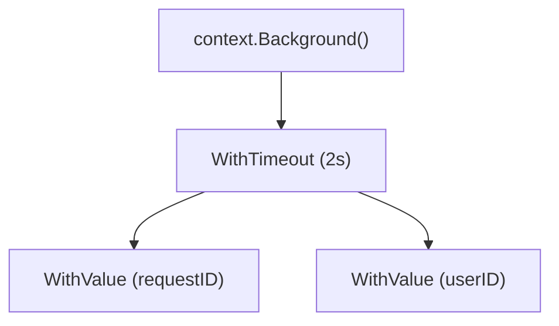

## 1. sync 包概述

`sync` 包提供了底层的同步原语, 用于保护共享数据和协调 Goroutine.

---

## 2. Mutex (互斥锁)

### 2.1 基本用法

```go
import "sync"

type Counter struct {
    mu    sync.Mutex
    value int
}

func (c *Counter) Inc() {
    c.mu.Lock()
    defer c.mu.Unlock()
    c.value++
}

func (c *Counter) Value() int {
    c.mu.Lock()
    defer c.mu.Unlock()
    return c.value
}
```

### 2.2 Mutex 的内部结构

```go
type Mutex struct {
    state int32  // 状态位
    sema  uint32 // 信号量
}
```

**状态位 (state)** 包含:
*   **Locked (1 bit)**: 是否被锁定.
*   **Woken (1 bit)**: 是否有 Goroutine 被唤醒.
*   **Starving (1 bit)**: 是否处于饥饿模式.
*   **Waiters (29 bits)**: 等待者数量.

### 2.3 正常模式 vs 饥饿模式

**正常模式**:
*   新来的 Goroutine 和被唤醒的 Goroutine 竞争锁.
*   新来的 Goroutine 有优势 (CPU 缓存局部性), 可能导致等待者长时间拿不到锁.

**饥饿模式 (Go 1.9+)**:
*   如果某 Goroutine 等待超过 1ms, 进入饥饿模式.
*   锁直接移交给等待队列头部的 Goroutine.
*   新来的 Goroutine 直接排队, 不再竞争.

### 2.4 使用原则

1.  **尽量减少锁的持有时间**: 锁的范围应尽可能小.
2.  **避免在锁内执行 I/O 或长时间操作**.
3.  **不要复制 Mutex**: Mutex 包含状态, 复制后行为未定义.

---

## 3. RWMutex (读写锁)

允许多个读者同时访问, 但写者独占.

```go
type SafeMap struct {
    mu sync.RWMutex
    m  map[string]int
}

func (s *SafeMap) Get(key string) int {
    s.mu.RLock()            // 读锁
    defer s.mu.RUnlock()
    return s.m[key]
}

func (s *SafeMap) Set(key string, value int) {
    s.mu.Lock()             // 写锁
    defer s.mu.Unlock()
    s.m[key] = value
}
```

**适用场景**: 读多写少的场景 (如配置缓存).

---

## 4. WaitGroup

等待一组 Goroutine 完成.

```go
var wg sync.WaitGroup

for i := 0; i < 5; i++ {
    wg.Add(1)
    go func(id int) {
        defer wg.Done()
        fmt.Printf("Worker %d 完成\n", id)
    }(i)
}

wg.Wait()  // 阻塞, 直到计数器归零
fmt.Println("所有任务完成")
```

**注意**:
*   `Add` 应在启动 Goroutine 之前调用.
*   `Done` 应在 Goroutine 内使用 `defer` 调用.
*   计数器不能为负 (否则 panic).

---

## 5. Once

保证函数只执行一次, 常用于单例初始化.

```go
var once sync.Once
var instance *Config

func GetConfig() *Config {
    once.Do(func() {
        instance = loadConfig()  // 只执行一次
    })
    return instance
}
```

**特点**:
*   即使 `Do` 中的函数 panic, 也视为"已执行", 后续调用不会重试.
*   多个 Goroutine 同时调用 `Do`, 只有一个执行, 其他等待.

---

## 6. Pool

对象池, 用于复用临时对象, 减少 GC 压力.

```go
var bufferPool = sync.Pool{
    New: func() interface{} {
        return new(bytes.Buffer)
    },
}

func process(data []byte) {
    buf := bufferPool.Get().(*bytes.Buffer)
    defer func() {
        buf.Reset()
        bufferPool.Put(buf)
    }()
    
    buf.Write(data)
    // 使用 buf...
}
```

**注意**:
*   Pool 中的对象可能随时被 GC 回收 (每次 GC 后清空).
*   不适合存储有状态的对象 (从池中取出的对象状态不确定).

---

## 7. sync.Map

专门针对并发读优化的高性能 Map.

```go
var m sync.Map

// 存储
m.Store("hello", "world")

// 读取
if v, ok := m.Load("hello"); ok {
    fmt.Println(v.(string))
}

// 删除
m.Delete("hello")

// 遍历
m.Range(func(key, value interface{}) bool {
    fmt.Println(key, value)
    return true // 继续遍历
})
```

**适用场景**:
1.  **读多写少**: 键值对只写一次但读很多次 (如缓存).
2.  **不相交的读写**: 多个 Goroutine 访问不同的键.

**注意**: 通用场景下, `sync.RWMutex` + `map` 性能通常更好且类型安全.

---

## 8. Cond (条件变量)

用于等待/通知模式 (较少直接使用, Channel 更常用).

```go
var (
    mu    sync.Mutex
    cond  = sync.NewCond(&mu)
    ready bool
)

// 等待方
mu.Lock()
for !ready {
    cond.Wait()  // 释放锁并等待通知, 醒来后重新获取锁
}
// 使用共享资源...
mu.Unlock()

// 通知方
mu.Lock()
ready = true
cond.Broadcast()  // 通知所有等待者 (或 Signal 通知一个)
mu.Unlock()
```

---

## 8. Context (上下文)

### 8.1 Context 的作用

*   **取消信号**: 通知 Goroutine 停止工作.
*   **超时控制**: 设置操作的最大执行时间.
*   **请求作用域值**: 传递请求 ID、认证信息等.

### 8.2 创建 Context

```go
// 根 Context
ctx := context.Background()  // 永不取消, 用于 main 或顶层
ctx := context.TODO()        // 占位符, 用于不确定使用哪种 Context

// 可取消的 Context
ctx, cancel := context.WithCancel(context.Background())
defer cancel()

// 带超时的 Context
ctx, cancel := context.WithTimeout(context.Background(), 5*time.Second)
defer cancel()

// 带截止时间的 Context
ctx, cancel := context.WithDeadline(context.Background(), time.Now().Add(5*time.Second))
defer cancel()

// 带值的 Context
ctx := context.WithValue(context.Background(), "requestID", "abc-123")
```

### 8.3 使用 Context

```go
func doWork(ctx context.Context) error {
    for {
        select {
        case <-ctx.Done():
            return ctx.Err()  // context.Canceled 或 context.DeadlineExceeded
        default:
            // 继续工作...
        }
    }
}

func main() {
    ctx, cancel := context.WithTimeout(context.Background(), 2*time.Second)
    defer cancel()
    
    if err := doWork(ctx); err != nil {
        fmt.Println("任务被取消:", err)
    }
}
```

### 8.4 Context 的内部结构

Context 是一个树形结构:

```go
type cancelCtx struct {
    Context           // 父 Context
    mu       sync.Mutex
    done     atomic.Value
    children map[canceler]struct{}  // 子 Context 集合
    err      error
}
```

**取消传播**:
当父 Context 被取消时, 会递归取消所有子 Context.



### 8.5 Context 使用原则

1.  **Context 应作为函数的第一个参数**, 命名为 `ctx`.
2.  **不要存储在结构体中** (除非确有必要).
3.  **不要传递 nil Context**, 使用 `context.TODO()` 代替.
4.  **不要用 Context 传递可选参数**, 只传递请求作用域的数据.
5.  **始终调用 cancel 函数**, 即使 Context 超时, 也要调用以释放资源.

---

## 9. 竞态检测 (Race Detector)

### 9.1 什么是数据竞态

当两个 Goroutine 同时访问同一变量, 且至少有一个是写操作, 就发生了数据竞态.

```go
var count int

go func() { count++ }()
go func() { count++ }()
// count 的最终值不确定 (可能是 1 或 2)
```

### 9.2 使用 Race Detector

```bash
go run -race main.go
go test -race ./...
go build -race
```

**示例输出**:
```
WARNING: DATA RACE
Write at 0x00c0000140a8 by goroutine 7:
  main.main.func1()
      main.go:10 +0x30

Previous write at 0x00c0000140a8 by goroutine 6:
  main.main.func2()
      main.go:11 +0x30
```

### 9.3 竞态检测的原理

编译器在每个内存操作前后插入检测代码, 记录访问历史. 如果发现冲突的并发访问, 立即报告.

**开销**: 内存 5-10x, 执行时间 2-20x. 仅用于测试, 不要用于生产.

---

## 10. 原子操作 (sync/atomic)

对于简单的计数器, 原子操作比锁更高效:

```go
import "sync/atomic"

var counter int64

atomic.AddInt64(&counter, 1)   // 原子加
v := atomic.LoadInt64(&counter) // 原子读
atomic.StoreInt64(&counter, 0)  // 原子写
```

**Go 1.19+ 泛型原子类型**:
```go
var counter atomic.Int64
counter.Add(1)
v := counter.Load()
```

---

## 11. golang.org/x/sync 扩展

标准库之外, `golang.org/x/sync` 提供了一系列实用的并发工具.

### 11.1 singleflight - 防止缓存击穿

当多个 Goroutine 请求同一资源时, 只执行一次实际调用:

```go
import "golang.org/x/sync/singleflight"

var group singleflight.Group

func GetUser(id int64) (*User, error) {
    key := fmt.Sprintf("user:%d", id)
    
    result, err, shared := group.Do(key, func() (interface{}, error) {
        // 即使 100 个 goroutine 同时请求同一用户
        // 此函数只执行一次
        return db.GetUser(id)
    })
    
    if err != nil {
        return nil, err
    }
    _ = shared // true 表示结果是共享的
    return result.(*User), nil
}
```

### 11.2 errgroup - 并发任务与错误聚合

管理一组 Goroutine, 等待全部完成或首个错误:

```go
import "golang.org/x/sync/errgroup"

func fetchAll(urls []string) ([]string, error) {
    g, ctx := errgroup.WithContext(context.Background())
    results := make([]string, len(urls))
    
    for i, url := range urls {
        i, url := i, url  // Go 1.22 前需要捕获变量
        g.Go(func() error {
            req, _ := http.NewRequestWithContext(ctx, "GET", url, nil)
            resp, err := http.DefaultClient.Do(req)
            if err != nil {
                return err  // 任一失败, 取消其他
            }
            defer resp.Body.Close()
            body, _ := io.ReadAll(resp.Body)
            results[i] = string(body)
            return nil
        })
    }
    
    if err := g.Wait(); err != nil {
        return nil, err
    }
    return results, nil
}
```

### 11.3 semaphore - 限制并发数

```go
import "golang.org/x/sync/semaphore"

var sem = semaphore.NewWeighted(10)  // 最多 10 个并发

func process(ctx context.Context, item Item) error {
    if err := sem.Acquire(ctx, 1); err != nil {
        return err  // 被取消或超时
    }
    defer sem.Release(1)
    
    // 处理 item...
    return nil
}
```

---

## 12. 硬件亲和性: False Sharing (伪共享)

这是高性能并发编程中常被忽视的杀手.

### 12.1 什么是伪共享
CPU 缓存以 **Cache Line** (通常 64 字节) 为单位加载. 如果两个无关变量 (如 `var A, B int64`) 恰好在同一个 Cache Line 中:
1. Core 1 修改 A.
2. Core 2 必须废弃整个 Cache Line (包含 B).
3. Core 2 读取 B 时发生 Cache Miss.
这导致看似独立的变量操作相互干扰.

### 12.2 解决方案: Padding
使用无意义的字节填充, 强行分隔变量.

```go
type NoPad struct {
    a uint64
    b uint64
}

type Pad struct {
    a uint64
    _ [56]byte // 填充, 确保 a 和 b 不在同一 Cache Line
    b uint64
}
```

在超高并发计数器中 (如 `sync.Pool` 内部), 这种优化至关重要.

---

## 13. 练习

### 12.1 并发安全的 Set

使用 Mutex 实现一个并发安全的 Set 类型.

### 12.2 带取消的 Worker

实现一个 Worker, 在收到 Context 取消信号时优雅退出.

### 12.3 限流器

使用 Channel 或 time.Ticker 实现一个每秒 N 次请求的限流器.

---

## 14. 思考题

1.  Mutex 和 Channel 各适合什么场景?
2.  为什么 Pool 中的对象会被 GC 回收?
3.  为什么 Context 要作为第一个参数传递?
4.  竞态检测的开销为什么这么大?
5.  atomic.Value 和 Mutex 有什么区别?

---

## 15. 本周小结

*   **Mutex**: 互斥锁, 有正常/饥饿两种模式.
*   **RWMutex**: 读写锁, 读多写少场景.
*   **WaitGroup**: 等待 Goroutine 完成.
*   **Once**: 单次执行, 用于单例.
*   **Pool**: 对象池, 减少 GC 压力.
*   **Context**: 取消传播、超时控制、请求作用域值.
*   **Race Detector**: 检测数据竞态.
*   **atomic**: 高效的原子操作.

---

> 同步原语和 Context 是构建健壮并发程序的基石. 善用 Race Detector, 消灭隐藏的竞态 bug.
