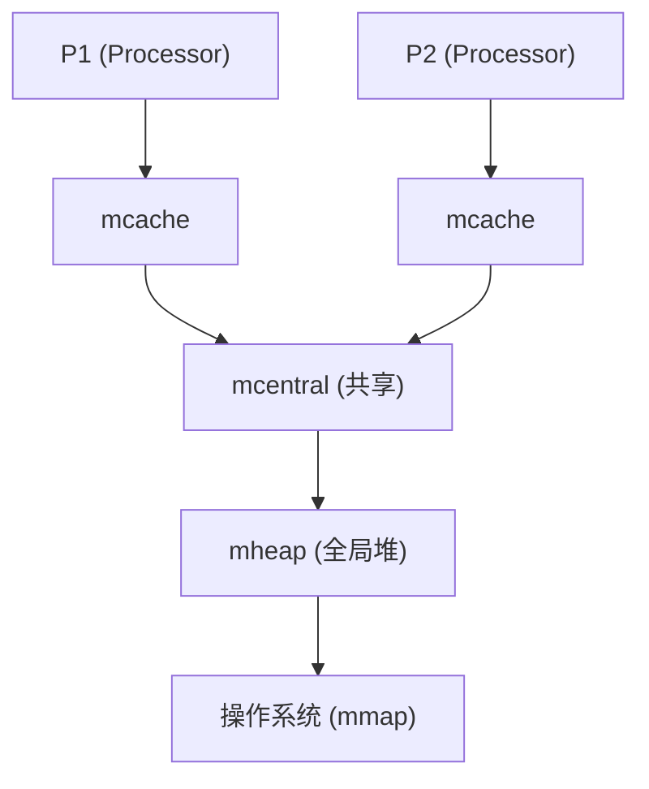

## 1. 内存分配器架构

Go 的内存分配器基于 **TCMalloc** (Thread-Caching Malloc) 设计, 采用多级缓存减少锁竞争.

### 1.1 核心组件



| 组件 | 作用 | 锁 |
|------|------|-----|
| mcache | P 本地缓存, 存放各 Size Class 的 mspan | 无锁 |
| mcentral | 为 mcache 补充 mspan | 每个 Size Class 一把锁 |
| mheap | 全局堆管理, 向 OS 申请内存 | 全局锁 |

### 1.2 Size Class

Go 将对象按大小分为多个 Size Class (约 70 个), 每个 Class 对应一种固定大小的对象槽位.

| 类别 | 大小范围 | 分配方式 |
|------|----------|----------|
| Tiny | \< 16 bytes (无指针) | 多个对象合并到一个 16B 块 |
| Small | 16 bytes - 32 KB | 从 mcache 的 mspan 分配 |
| Large | \> 32 KB | 直接从 mheap 分配 |

### 1.3 mspan

mspan 是内存管理的基本单位, 包含多个相同大小的对象槽位:

```go
type mspan struct {
    startAddr uintptr      // 起始地址
    npages    uintptr      // 页数 (8KB/页)
    freeindex uintptr      // 下一个空闲槽位索引
    allocBits *gcBits      // 位图: 哪些槽位已分配
    gcmarkBits *gcBits     // 位图: 哪些槽位被标记
    // ...
}
```

### 1.4 分配流程

`new(T)` 或 `make(T)`:

1.  计算 T 的大小, 确定 Size Class.
2.  从当前 P 的 mcache 获取对应 Class 的 mspan.
3.  从 mspan 的 freeindex 处分配槽位.
4.  如果 mspan 已满, 从 mcentral 获取新 mspan.
5.  如果 mcentral 无可用 mspan, 从 mheap 分配新页.
6.  如果 mheap 内存不足, 向 OS 申请 (mmap).

---

## 2. 垃圾回收 (GC)

### 2.1 三色标记法

Go 使用**并发三色标记清除**算法:

*   **白色**: 未访问的对象 (潜在垃圾).
*   **灰色**: 已访问但子对象未扫描的对象.
*   **黑色**: 已访问且子对象已扫描的对象.

### 2.2 GC 流程

1.  **Mark Setup** (STW): 开启写屏障, 所有 Goroutine 进入安全点.
2.  **Concurrent Mark**: 并发标记, 从 Root 开始遍历.
3.  **Mark Termination** (STW): 完成标记, 关闭写屏障.
4.  **Concurrent Sweep**: 并发清除白色对象.

### 2.3 写屏障 (Write Barrier)

在并发标记期间, 用户代码可能修改指针. 写屏障确保不会漏标:

```go
// 混合写屏障 (Hybrid Write Barrier, Go 1.8+)
// 当黑色对象指向新分配的对象时, 新对象被标记为灰色
```

### 2.4 GC 触发条件

1.  **堆增长触发**: 当堆大小达到上次 GC 后存活对象大小的 (1 + GOGC/100) 倍.
   *   默认 GOGC=100, 即堆翻倍时触发.
2.  **定时触发**: 2 分钟内未 GC, 强制触发.
3.  **手动触发**: `runtime.GC()`.

### 2.5 GC 调优

**GOGC**: 控制堆增长阈值.
```bash
GOGC=50   # 更频繁 GC, 省内存
GOGC=200  # 更少 GC, 高吞吐
GOGC=off  # 关闭 GC (仅测试用)
```

**GOMEMLIMIT (Go 1.19+)**: 软内存上限.
```bash
GOMEMLIMIT=1GiB  # 限制堆不超过 1GB
```

当接近 GOMEMLIMIT 时, GC 会更激进地运行.

### 2.6 Profile-Guided Optimization (PGO, Go 1.21+)

PGO 使用运行时 profile 指导编译器优化:

```bash
# 1. 收集生产环境 profile
curl -o cpu.pprof http://localhost:6060/debug/pprof/profile?seconds=30

# 2. 使用 profile 构建 (约 2-7% 性能提升)
go build -pgo=cpu.pprof -o app

# 3. 或放到源码目录 (自动使用)
cp cpu.pprof default.pgo
go build  # 自动检测 default.pgo
```

---

## 3. 逃逸分析 (Escape Analysis)

### 3.1 逃逸场景

编译器决定变量分配在栈还是堆:

```go
// 1. 返回局部变量指针 -> 逃逸
func createUser() *User {
    u := User{Name: "Alice"}  // 逃逸到堆
    return &u
}

// 2. 赋值给接口 -> 可能逃逸
func print(v interface{}) { ... }
x := 42
print(x)  // x 被装箱, 可能逃逸

// 3. 闭包引用 -> 逃逸
func counter() func() int {
    count := 0  // 逃逸
    return func() int {
        count++
        return count
    }
}

// 4. 切片扩容 -> 可能逃逸
s := make([]int, 0)
s = append(s, 1)  // 如果扩容, 新数组可能在堆上
```

### 3.2 查看逃逸分析

```bash
go build -gcflags="-m" main.go
go build -gcflags="-m -m" main.go  # 更详细
```

### 3.3 减少逃逸

1.  **避免返回指针** (如果可以返回值).
2.  **预分配切片容量**.
3.  **使用 sync.Pool 复用对象**.
4.  **避免在热路径使用接口**.

---

## 4. 性能分析工具

### 4.1 pprof

```go
import _ "net/http/pprof"

go func() {
    http.ListenAndServe("localhost:6060", nil)
}()
```

**采集 Profile**:
```bash
# CPU
go tool pprof http://localhost:6060/debug/pprof/profile?seconds=30

# 堆内存
go tool pprof http://localhost:6060/debug/pprof/heap

# Goroutine
go tool pprof http://localhost:6060/debug/pprof/goroutine

# 阻塞
go tool pprof http://localhost:6060/debug/pprof/block
```

**常用命令**:
```bash
(pprof) top10        # 前 10 热点
(pprof) list funcName # 逐行分析
(pprof) web          # 生成调用图 (需要 graphviz)
```

### 4.2 trace

```bash
curl -o trace.out http://localhost:6060/debug/pprof/trace?seconds=5
go tool trace trace.out
```

可视化:
*   Goroutine 调度
*   GC 停顿
*   系统调用阻塞

### 4.3 benchstat

对比多次 Benchmark 结果:

```bash
go test -bench=. -count=10 > old.txt
# 修改代码
go test -bench=. -count=10 > new.txt
benchstat old.txt new.txt
```

### 4.4 边界检查消除 (Bounds Check Elimination, BCE)

Go 为了安全, 访问切片时会检查索引越界. BCE 是一种编译器优化, 删除不必要的检查.

```go
// 未优化: 每次循环都检查 i < len(s)
func sum(s []int) int {
    n := 0
    for i := 0; i < len(s); i++ {
        n += s[i]
    }
    return n
}

// 优化 (BCE): 编译器知道 i < len(s) 恒成立
func sumBCE(s []int) int {
    n := 0
    l := len(s) // 提取长度
    for i := 0; i < l; i++ {
        n += s[i]
    }
    return n
}
```

启用调试查看 BCE 结果:
```bash
go build -gcflags="-d=ssa/check_bce/debug=1" main.go
```

---

## 5. CGO 与 FFI

### 5.1 CGO 基础

Go 可以直接调用 C 代码 (FFI). 尽管强大, 但有代价.

```go
package main

/*
#include <stdlib.h>
#include <stdio.h>

void print(char* s) {
    printf("%s\n", s);
}
*/
import "C"
import "unsafe"

func main() {
    cs := C.CString("Hello from C")
    defer C.free(unsafe.Pointer(cs)) // 必须手动释放!
    C.print(cs)
}
```

### 5.2 CGO 的开销

1.  **栈切换**: Go 栈 (2KB) -> C 栈 (几MB). 每次调用需切换上下文.
2.  **调度器干扰**: C 代码运行期间, M 线程被锁定, P 可能被其他 M 抢占.
3.  **编译变慢**: 此时不能交叉编译 (依赖 GCC).

**最佳实践**:
只有现有库 (如 OpenCV, ffmpeg) 无 Go 替代版时才用 CGO. 避免在高频调用中使用.

---

## 6. 性能优化技巧

### 5.1 减少内存分配

```go
// 避免
func join(a, b string) string {
    return a + b  // 每次分配新字符串
}

// 改用 strings.Builder
var sb strings.Builder
sb.WriteString(a)
sb.WriteString(b)
result := sb.String()
```

### 5.2 sync.Pool 复用对象

```go
var bufferPool = sync.Pool{
    New: func() interface{} {
        return new(bytes.Buffer)
    },
}

func process(data []byte) {
    buf := bufferPool.Get().(*bytes.Buffer)
    defer func() {
        buf.Reset()
        bufferPool.Put(buf)
    }()
    
    buf.Write(data)
    // 使用 buf...
}
```

### 5.3 预分配切片

```go
// 避免
var result []int
for i := 0; i < 1000; i++ {
    result = append(result, i)  // 多次扩容
}

// 改用
result := make([]int, 0, 1000)
for i := 0; i < 1000; i++ {
    result = append(result, i)
}
```

### 5.4 避免接口开销

在热路径避免使用接口, 使用具体类型:

```go
// 慢: 动态派发
func process(r io.Reader) { ... }

// 快: 静态调用
func processFile(f *os.File) { ... }
```

---

## 7. Go Assembly 简明指南

Go 使用 Plan 9 汇编风格, 与 x86/ARM 汇编不同.

### 7.1 核心伪寄存器

*   `SB` (Static Base): 全局符号基址. `foo(SB)` 表示符号 `foo`.
*   `FP` (Frame Pointer): 参数基址. `symbol+offset(FP)` 引用参数.
*   `SP` (Stack Pointer): 栈顶. `symbol+offset(SP)` 引用局部变量.
*   `PC` (Program Counter): 指令地址.

### 7.2 简单示例

```asm
// func Add(a, b int64) int64
TEXT ·Add(SB), $0-24
    MOVQ    a+0(FP), AX   // 取参数 a
    ADDQ    b+8(FP), AX   // 加参数 b
    MOVQ    AX, ret+16(FP) // 存返回值
    RET
```

### 7.3 查看汇编

```bash
# 查看特定函数的汇编
go tool objdump -s "main.main" app

# 编译生成汇编
go build -gcflags="-S" main.go
```

---

## 8. 练习

### 6.1 逃逸分析实验

编写代码, 故意制造逃逸, 使用 `-gcflags="-m"` 验证.

### 6.2 内存 Benchmark

对比字符串拼接方式的内存分配:
*   `+` 运算符
*   `fmt.Sprintf`
*   `strings.Builder`
*   `bytes.Buffer`

### 6.3 pprof 实战

为一个 HTTP 服务添加 pprof, 模拟负载, 分析 CPU 和内存热点.

---

## 9. 思考题

1.  为什么 mcache 不需要锁?
2.  GC 的 STW 阶段做了什么?
3.  GOGC=off 在什么场景有用?
4.  sync.Pool 的对象为什么可能被 GC 回收?
5.  栈分配为什么比堆分配快?

---

## 10. 本周小结

*   **内存分配器**: mcache → mcentral → mheap, Size Class, mspan.
*   **GC**: 三色标记, 写屏障, 并发清除.
*   **GC 调优**: GOGC, GOMEMLIMIT.
*   **逃逸分析**: `-gcflags="-m"`, 栈 vs 堆.
*   **pprof**: CPU/内存/Goroutine 分析.
*   **优化技巧**: strings.Builder, sync.Pool, 预分配.

---

> 内存管理是性能优化的核心. 理解 GC 和分配器, 才能写出高性能代码.
