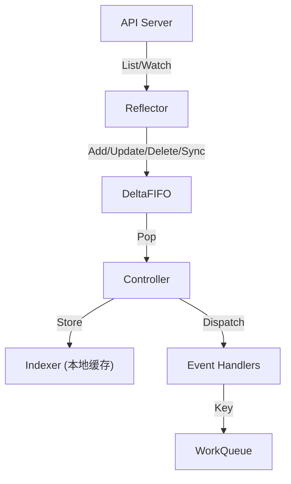

## 1. Kubernetes API 基础

### 1.1 GVK 与 GVR

*   **GVK (Group, Version, Kind)**: 标识资源类型.
    *   `apps/v1/Deployment`
    *   `core/v1/Pod` (core 组省略)

*   **GVR (Group, Version, Resource)**: 标识 API 路径.
    *   `apps/v1/deployments`
    *   `v1/pods`

```
API 路径: /apis/{group}/{version}/namespaces/{namespace}/{resource}
Pod:      /api/v1/namespaces/default/pods
Deploy:   /apis/apps/v1/namespaces/default/deployments
```

### 1.2 Scheme

Scheme 是 GVK 与 Go 类型的映射表:

```go
scheme := runtime.NewScheme()
corev1.AddToScheme(scheme)    // 注册 Pod, Service, ConfigMap...
appsv1.AddToScheme(scheme)    // 注册 Deployment, StatefulSet...
```

---

## 2. client-go 客户端

### 2.1 Clientset

强类型客户端, 为每种资源生成专用方法:

```go
import (
    "k8s.io/client-go/kubernetes"
    "k8s.io/client-go/tools/clientcmd"
)

// 加载 kubeconfig
config, err := clientcmd.BuildConfigFromFlags("", kubeconfigPath)
if err != nil {
    log.Fatal(err)
}

// 创建 Clientset
clientset, err := kubernetes.NewForConfig(config)
if err != nil {
    log.Fatal(err)
}

// 获取 Pod 列表
pods, err := clientset.CoreV1().Pods("default").List(ctx, metav1.ListOptions{})
for _, pod := range pods.Items {
    fmt.Println(pod.Name)
}

// 创建 Deployment
deployment := &appsv1.Deployment{...}
_, err = clientset.AppsV1().Deployments("default").Create(ctx, deployment, metav1.CreateOptions{})
```

### 2.2 DynamicClient

动态客户端, 适用于 CRD 或未知类型:

```go
import "k8s.io/client-go/dynamic"

dynamicClient, err := dynamic.NewForConfig(config)

gvr := schema.GroupVersionResource{
    Group:    "mygroup.example.com",
    Version:  "v1",
    Resource: "myresources",
}

result, err := dynamicClient.Resource(gvr).Namespace("default").
    List(ctx, metav1.ListOptions{})

for _, item := range result.Items {
    fmt.Println(item.GetName())
}
```

### 2.3 RESTClient

底层 REST 客户端, 最灵活:

```go
restClient := clientset.CoreV1().RESTClient()

result := &corev1.PodList{}
err := restClient.Get().
    Namespace("default").
    Resource("pods").
    Do(ctx).
    Into(result)
```

---

## 3. Informer 机制

### 3.1 为什么需要 Informer

直接调用 API Server 的问题:
1.  频繁请求增加 API Server 负载.
2.  无法感知资源变化.

Informer 解决方案:
1.  **本地缓存**: 减少 API 调用.
2.  **Watch 机制**: 实时感知变化.
3.  **事件分发**: 将变化通知 Controller.

### 3.2 Informer 架构



### 3.3 核心组件

**Reflector**:
*   负责 List (全量) 和 Watch (增量) API Server.
*   将变化推入 DeltaFIFO.

**DeltaFIFO**:
*   存储 (Key, Deltas) 对.
*   Delta 包含 (Type, Object), Type 有 Added, Updated, Deleted, Sync.
*   压缩: 同一 Key 的多个 Delta 合并.

**Indexer**:
*   本地缓存, 支持多维索引.
*   默认按 namespace/name 索引.

**WorkQueue**:
*   存储待处理的 Key.
*   支持限速、去重、延迟添加.

### 3.4 使用 Informer

```go
import (
    "k8s.io/client-go/informers"
    "k8s.io/client-go/tools/cache"
)

// 创建 SharedInformerFactory
factory := informers.NewSharedInformerFactory(clientset, 30*time.Second)

// 获取 Pod Informer
podInformer := factory.Core().V1().Pods()

// 注册事件处理器
podInformer.Informer().AddEventHandler(cache.ResourceEventHandlerFuncs{
    AddFunc: func(obj interface{}) {
        pod := obj.(*corev1.Pod)
        fmt.Println("Pod added:", pod.Name)
    },
    UpdateFunc: func(oldObj, newObj interface{}) {
        oldPod := oldObj.(*corev1.Pod)
        newPod := newObj.(*corev1.Pod)
        fmt.Printf("Pod updated: %s -> %s\n", oldPod.ResourceVersion, newPod.ResourceVersion)
    },
    DeleteFunc: func(obj interface{}) {
        pod := obj.(*corev1.Pod)
        fmt.Println("Pod deleted:", pod.Name)
    },
})

// 启动 Informer
stopCh := make(chan struct{})
factory.Start(stopCh)

// 等待缓存同步
if !cache.WaitForCacheSync(stopCh, podInformer.Informer().HasSynced) {
    log.Fatal("缓存同步失败")
}

// 从缓存读取
pods, err := podInformer.Lister().Pods("default").List(labels.Everything())
```

---

## 4. Operator 模式

### 4.1 什么是 Operator

Operator = **CRD** (Custom Resource Definition) + **Controller**

*   **CRD**: 扩展 Kubernetes API, 定义自己的资源类型 (如 MySQLCluster).
*   **Controller**: 监听 CRD 变化, 执行业务逻辑, 确保**实际状态 = 期望状态**.

### 4.2 Reconciler 模式

Controller 的核心是 Reconcile 循环:

```go
func (r *MyResourceReconciler) Reconcile(ctx context.Context, req ctrl.Request) (ctrl.Result, error) {
    // 1. 获取资源
    var myResource myv1.MyResource
    if err := r.Get(ctx, req.NamespacedName, &myResource); err != nil {
        return ctrl.Result{}, client.IgnoreNotFound(err)
    }
    
    // 2. 执行业务逻辑
    // 创建/更新/删除相关资源...
    
    // 3. 更新状态
    myResource.Status.Ready = true
    if err := r.Status().Update(ctx, &myResource); err != nil {
        return ctrl.Result{}, err
    }
    
    // 4. 返回结果
    return ctrl.Result{}, nil  // 成功, 不重新入队
    // return ctrl.Result{Requeue: true}, nil  // 立即重新入队
    // return ctrl.Result{RequeueAfter: time.Minute}, nil  // 延迟重新入队
}
```

### 4.3 Level-Triggered vs Edge-Triggered

Kubernetes Controller 采用 **Level-Triggered** (水平触发):
*   不关心"发生了什么事件", 只关心"当前期望状态是什么".
*   Reconcile 应该是**幂等**的.
*   如果 Reconcile 失败, 会重新入队重试.

---

## 5. Kubebuilder 实战

### 5.1 初始化项目

```bash
kubebuilder init --domain example.com --repo github.com/user/my-operator
kubebuilder create api --group webapp --version v1 --kind Guestbook
```

### 5.2 定义 CRD (api/v1/guestbook_types.go)

```go
type GuestbookSpec struct {
    // +kubebuilder:validation:Minimum=1
    // +kubebuilder:validation:Maximum=10
    Replicas int32 `json:"replicas"`
    
    Image string `json:"image"`
}

type GuestbookStatus struct {
    AvailableReplicas int32 `json:"availableReplicas"`
    
    // +kubebuilder:validation:Enum=Pending;Running;Failed
    Phase string `json:"phase"`
}
```

### 5.3 实现 Controller (internal/controller/guestbook_controller.go)

```go
func (r *GuestbookReconciler) Reconcile(ctx context.Context, req ctrl.Request) (ctrl.Result, error) {
    log := log.FromContext(ctx)
    
    // 获取 Guestbook
    var gb webappv1.Guestbook
    if err := r.Get(ctx, req.NamespacedName, &gb); err != nil {
        return ctrl.Result{}, client.IgnoreNotFound(err)
    }
    
    // 创建或更新 Deployment
    deploy := &appsv1.Deployment{
        ObjectMeta: metav1.ObjectMeta{
            Name:      gb.Name,
            Namespace: gb.Namespace,
        },
        Spec: appsv1.DeploymentSpec{
            Replicas: &gb.Spec.Replicas,
            // ...
        },
    }
    
    // 设置 OwnerReference (级联删除)
    if err := controllerutil.SetControllerReference(&gb, deploy, r.Scheme); err != nil {
        return ctrl.Result{}, err
    }
    
    // CreateOrUpdate
    _, err := controllerutil.CreateOrUpdate(ctx, r.Client, deploy, func() error {
        deploy.Spec.Replicas = &gb.Spec.Replicas
        return nil
    })
    if err != nil {
        return ctrl.Result{}, err
    }
    
    // 更新状态
    gb.Status.Phase = "Running"
    if err := r.Status().Update(ctx, &gb); err != nil {
        return ctrl.Result{}, err
    }
    
    return ctrl.Result{}, nil
}
```

### 5.4 运行与部署

```bash
make install       # 安装 CRD
make run           # 本地运行 Controller
make docker-build  # 构建镜像
make deploy        # 部署到集群
```

---

## 6. 练习

### 6.1 使用 client-go 列出 Pod

编写程序, 列出指定 namespace 下所有 Pod 的名称和状态.

### 6.2 Informer 事件监听

使用 Informer 监听 Pod 的增删改事件, 打印事件日志.

### 6.3 简单 Operator

使用 Kubebuilder 创建一个简单的 Operator, 管理一个自定义资源.

---

## 7. 思考题

1.  为什么 Informer 使用 DeltaFIFO 而不是普通队列?
2.  Reconciler 为什么要是幂等的?
3.  OwnerReference 的作用是什么?
4.  List/Watch 中的 ResourceVersion 如何保证一致性?
5.  如何处理 Reconcile 中的临时错误?

---

## 8. 本周小结

*   **K8s API**: GVK, GVR, Scheme.
*   **client-go**: Clientset, DynamicClient, RESTClient.
*   **Informer**: Reflector, DeltaFIFO, Indexer, WorkQueue.
*   **Operator**: CRD + Controller, Reconciler 模式.
*   **Kubebuilder**: 脚手架, CRD 定义, Controller 实现.

---

> Kubernetes 生态是 Go 的主战场. 掌握 client-go 和 Operator 开发, 是成为云原生开发者的必经之路.
