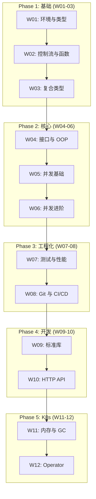

本学习计划面向零 Go 语言经验的初学者, 目标是循序渐进地掌握 Go 语言, 并最终具备 Kubernetes 生态开发能力.

---

## 学习路径概览

---

## Phase 1: 语言基础 (Week 1-3)

### Week 01: 环境配置与程序基础

*   Go 安装与环境变量
*   编译原理 (Source → SSA → Machine Code)
*   Runtime 核心组件 (Scheduler, GC, Memory)
*   变量、常量、iota
*   基础类型 (int, float, string, bool)
*   类型转换与 fmt 包

### Week 02: 控制流、函数与错误处理

*   for 循环 (唯一循环) 与 range
*   if/switch 语句
*   函数定义、多返回值、可变参数
*   闭包与逃逸分析
*   defer 机制 (LIFO)
*   error 接口与错误包装
*   panic/recover
*   **错误处理进阶 (errors.Join, 自定义错误类型)**

### Week 03: 复合类型与内存布局

*   数组 (值类型)
*   切片 (SliceHeader, 扩容机制)
*   映射 (hmap, bucket 结构)
*   结构体 (内存对齐)
*   指针基础
*   **slices/maps 包 (Go 1.21+), clear 函数**

---

## Phase 2: 核心概念 (Week 4-6)

### Week 04: 方法、接口与面向对象

*   方法定义 (值/指针接收者)
*   接口隐式实现
*   接口内部结构 (iface/eface)
*   类型断言与 Type Switch
*   组合与嵌入
*   常用接口 (Stringer, Reader, Writer)
*   **泛型 (Go 1.18+): 泛型函数、泛型类型、类型约束**

### Week 05: 并发基础 - Goroutine 与 Channel

*   Goroutine 轻量级线程
*   GMP 调度模型
*   Channel 内部结构 (hchan)
*   select 多路复用
*   并发模式 (Worker Pool, Fan-out/Fan-in, Pipeline)
*   Go 内存模型 (Happens-Before)

### Week 06: 并发进阶 - 同步与 Context

*   Mutex/RWMutex (正常/饥饿模式)
*   WaitGroup, Once, Pool
*   Context 树形传播
*   Race Detector
*   atomic 操作
*   **golang.org/x/sync: singleflight, errgroup, semaphore**
*   sync.Map 与 False Sharing (伪共享)

---

## Phase 3: 工程实践 (Week 7-8)

### Week 07: 测试、Benchmark 与性能分析

*   testing 包基础
*   表驱动测试
*   覆盖率分析
*   **Fuzzing (Go 1.18+)**
*   Benchmark 方法论
*   pprof (CPU/Memory/Goroutine)
*   逃逸分析

### Week 08: Go Modules、Git 与 CI/CD

*   go.mod/go.sum 机制
*   语义化版本
*   **Workspace 模式 (Go 1.18+)**
*   **ldflags 版本注入**
*   Git 工作流 (GitHub Flow)
*   Commit 规范
*   GitHub Actions 配置
*   golangci-lint
*   Docker 多阶段构建

---

## Phase 4: 生产开发 (Week 9-10)

### Week 09: 标准库核心包

*   io 包 (Reader/Writer)
*   os 包 (文件/环境变量)
*   **embed 包 (Go 1.16+)**
*   net/http (服务器/客户端/连接池)
*   encoding/json (序列化/流式处理)
*   reflect 反射
*   插件系统 (Plugins)
*   time 包

### Week 10: HTTP API 开发与数据库

*   REST API 设计
*   服务器架构 (Handler/Service/Repository)
*   中间件模式
*   **gRPC 基础 (Protocol Buffers)**
*   数据库 (database/sql, sqlx, GORM)
*   优雅关闭
*   配置管理

---

## Phase 5: Kubernetes 生态 (Week 11-12)

### Week 11: 内存管理与性能优化

*   内存分配器 (mcache/mcentral/mheap)
*   Size Class 与 mspan
*   GC 三色标记与写屏障
*   GOGC 与 GOMEMLIMIT
*   **PGO (Go 1.21+)**
*   CGO 与 FFI (原理与开销)
*   Go Assembly 简明指南
*   性能优化技巧 (BCE, strings.Builder, sync.Pool)

### Week 12: Kubernetes 生态开发

*   K8s API (GVK/GVR)
*   client-go (Clientset, DynamicClient)
*   Informer 架构 (Reflector, DeltaFIFO, Indexer)
*   Operator 模式 (CRD + Controller)
*   Kubebuilder 实战

---

## Phase 6: 生产实践 (Week 13)

### Week 13: 安全编程与生产可靠性

*   输入验证 (SQL 注入, 命令注入, 路径遍历)
*   敏感数据处理 (bcrypt, 日志脱敏)
*   TLS/HTTPS 配置
*   HTTP 安全头 (XSS, CSRF 防护)
*   Secrets 管理 (环境变量, K8s Secrets, Vault)
*   常见漏洞防护 (SSRF, Race Condition, DoS)
*   分布式高可用模式 (熔断/限流/分布式锁)
*   安全工具 (govulncheck, gosec)

---

## Go 版本说明

| 版本 | 重要特性 |
|------|----------|
| Go 1.18 | 泛型, Fuzzing, Workspace |
| Go 1.20 | errors.Join |
| Go 1.21 | slices/maps 包, slog, clear 函数, PGO |
| Go 1.22 | 循环变量语义修复, 增强路由 |
| Go 1.25 | PGO 稳定化, 性能优化 |

---

## 学习资源

| 资源 | 类型 | 阶段 |
|------|------|------|
| [Go 官方教程](https://go.dev/tour/) | 官方 | 入门 |
| [Go by Example](https://gobyexample.com/) | 示例 | 入门 |
| [Effective Go](https://go.dev/doc/effective_go) | 文档 | 核心 |
| [Go 语言设计与实现](https://draveness.me/golang/) | 书籍 | 进阶 |
| [Kubebuilder Book](https://book.kubebuilder.io/) | 文档 | K8s |

---

> 13 周的学习路径将带你从 Go 语言零基础成长为能够开发 Kubernetes Operator 并具备安全编程意识的工程师.