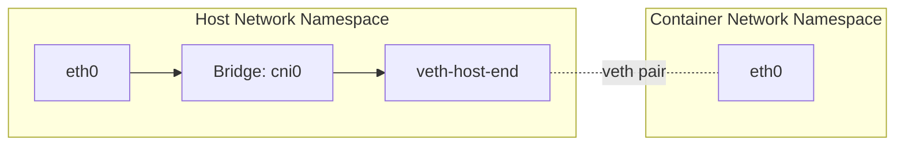
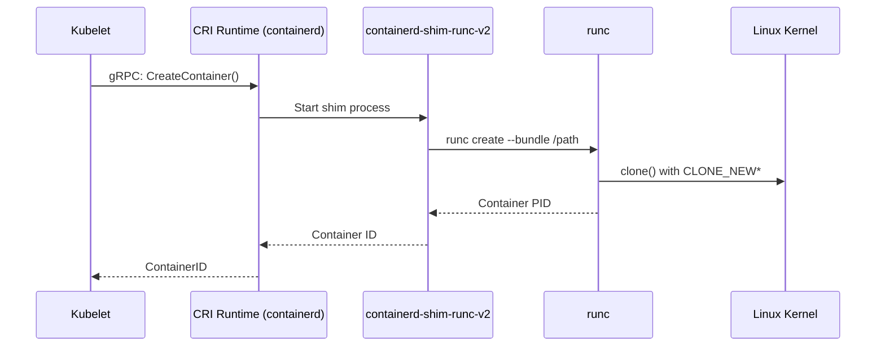
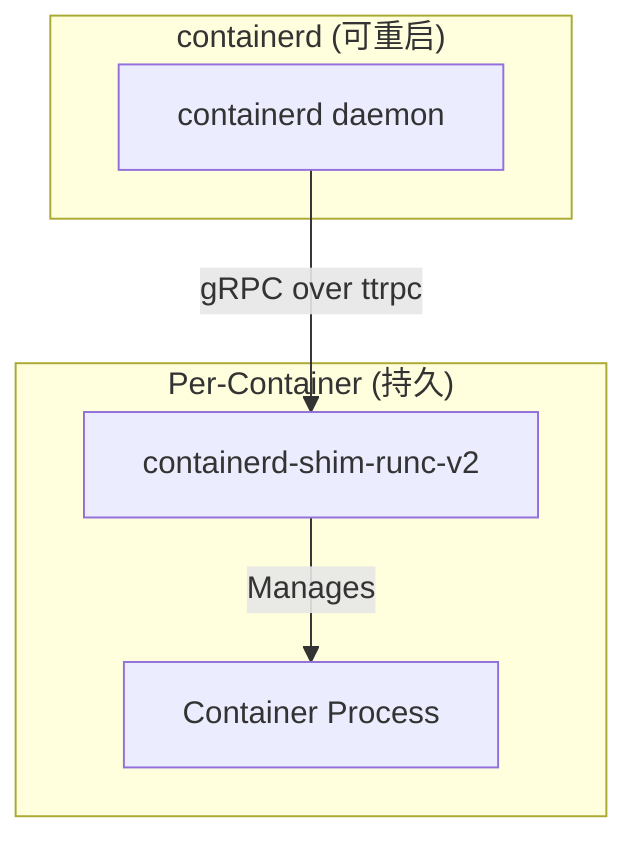
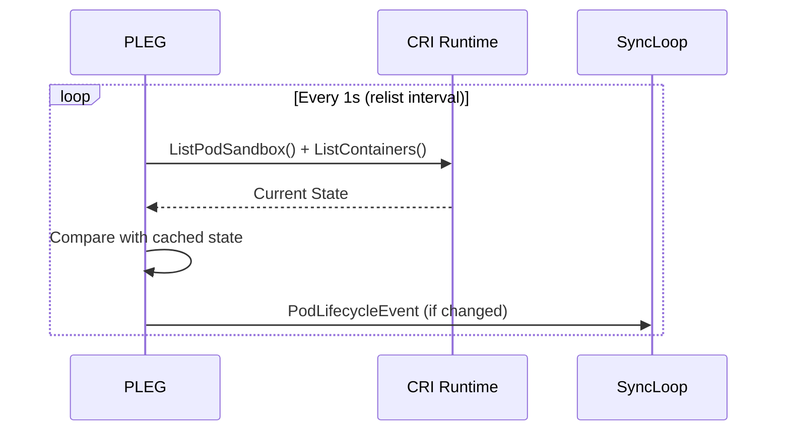
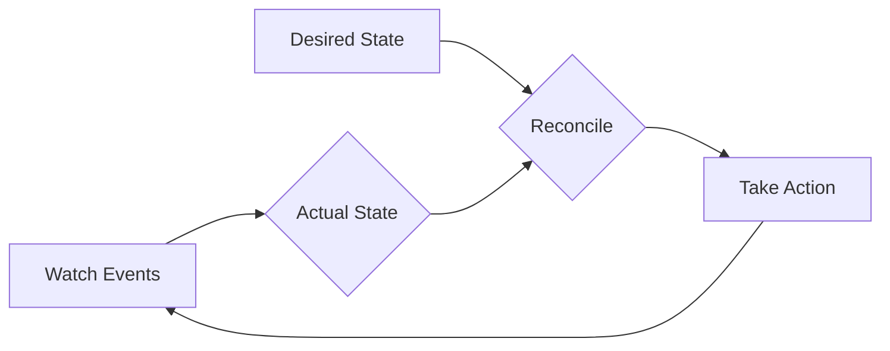
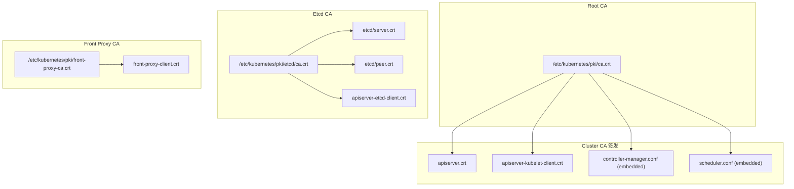

## 1. 本周任务清单

### 1.1 内核模块预校验
在初始化集群前, 必须确保以下两个关键内核模块已加载并生效:

*   **`overlay`**: 
    - **原理**: 容器存储驱动的基础. 它允许内核通过联合挂载 (Union Mount) 将只读的镜像层与可写的容器层合并, 为容器提供统一的文件视图.
    - **验证**: `lsmod | grep overlay`
*   **`br_netfilter`**:
    - **原理**: 允许 Linux 网桥 (Bridge) 流量经过 Netfilter 框架处理. 这是 Kubernetes 实现 Service (iptables/ipvs) 和 NetworkPolicy 的前提. 如果未开启, 同主机或跨主机的 Pod 流量将无法触发正确的转发与过滤规则.
    - **验证**: `lsmod | grep br_netfilter` 且确认 `/proc/sys/net/bridge/bridge-nf-call-iptables` 为 1.

### 1.2 Cgroup V2 与 Driver 深度验证

在 Rocky Linux 9 中, 系统默认已启用 Cgroup V2. 必须确保底层内核协议与上层运行时驱动完全一致.

#### 1. OS 层面: 确认 Cgroup V2 是否开启
执行以下命令, 如果输出为 `cgroup2fs`, 则表示系统运行在 V2 模式:
```bash
stat -fc %T /sys/fs/cgroup/
```

#### 2. 运行时层面: 统一使用 Systemd 驱动
为了提高生产环境稳定性, 必须在 Containerd 和 Kubelet 中同步开启 `systemd` 驱动.

*   **Containerd 配置文件校验**:
    ```bash
    grep -i "SystemdCgroup" /etc/containerd/config.toml
    # 预期输出: SystemdCgroup = true
    ```
*   **Kubelet 配置文件校验**:
    ```bash
    cat /var/lib/kubelet/config.yaml | grep cgroupDriver
    # 预期输出: cgroupDriver: systemd
    ```
*   **实时状态确认**:
    ```bash
    # 查看 Kubelet 运行参数
    ps -ef | grep kubelet | grep cgroup-driver
    
    # 查看容器运行时检测到的 Cgroup 状态
    crictl info | jq '.compute.cgroupDriver' # 或者直接使用 grep -i cgroup
    ```

### 1.3 集群引导实战
1.  **HA 初始化**: 使用 kubeadm 部署一个 3-Master 的 HA 集群.
2.  **内核观测**: 使用 `crictl ps` 和 `crictl inspect` 观察底层容器在 `/sys/fs/cgroup` 下对应的资源目录, 验证其受控程度.

> **关键提醒**: 在生产环境初始化时, 务必预留足够的 `--pod-network-cidr`, 建议使用 /16 及以上的私有大网段, 以免后期因可用 IP 地址耗尽而导致集群瘫痪或被迫进行代价极高的全量迁移.

---

## 2. Linux Namespace 内核机制深度剖析

容器隔离的核心是 Linux Namespace, 它为进程提供了一个独立的系统资源视图. 理解这一机制是深入排障容器问题的基础.

### 2.1 Namespace 类型与 clone() 系统调用

Linux 通过 `clone(2)` 系统调用创建新进程并将其放入新 Namespace:

| Namespace | clone Flag | 隔离内容 | 引入版本 |
| :--- | :--- | :--- | :--- |
| **Mount** | `CLONE_NEWNS` | 文件系统挂载点 | 2.4.19 |
| **UTS** | `CLONE_NEWUTS` | 主机名, 域名 | 2.6.19 |
| **IPC** | `CLONE_NEWIPC` | 信号量, 消息队列, 共享内存 | 2.6.19 |
| **PID** | `CLONE_NEWPID` | 进程 ID 编号空间 | 2.6.24 |
| **Network** | `CLONE_NEWNET` | 网络设备, 协议栈, 端口 | 2.6.29 |
| **User** | `CLONE_NEWUSER` | UID/GID 映射 | 3.8 |
| **Cgroup** | `CLONE_NEWCGROUP` | Cgroup 根目录视图 | 4.6 |

### 2.2 Namespace 持久化与引用

Namespace 的生命周期由引用计数管理:

*   **进程引用**: 只要有进程存在于 Namespace 中, 它就不会被销毁.
*   **文件引用**: 通过 bind mount `/proc/<pid>/ns/<type>` 可以持久化 Namespace.
*   **文件描述符引用**: `setns(2)` 可以将进程加入已存在的 Namespace.

```bash
# 查看进程所属的 Namespace
ls -la /proc/$$/ns/
# lrwxrwxrwx 1 root root 0 Jan 21 10:00 cgroup -> 'cgroup:[4026531835]'
# lrwxrwxrwx 1 root root 0 Jan 21 10:00 ipc -> 'ipc:[4026531839]'
# lrwxrwxrwx 1 root root 0 Jan 21 10:00 mnt -> 'mnt:[4026531840]'
# lrwxrwxrwx 1 root root 0 Jan 21 10:00 net -> 'net:[4026531992]'
# lrwxrwxrwx 1 root root 0 Jan 21 10:00 pid -> 'pid:[4026531836]'
# lrwxrwxrwx 1 root root 0 Jan 21 10:00 user -> 'user:[4026531837]'
# lrwxrwxrwx 1 root root 0 Jan 21 10:00 uts -> 'uts:[4026531838]'
```

### 2.3 User Namespace 与 UID 映射

User Namespace 是实现 Rootless Container 的核心. 它允许容器内的 root (UID 0) 映射到宿主机的非特权用户:

```bash
# 查看 UID 映射
cat /proc/<container_pid>/uid_map
#         0       1000          1   # 容器内 UID 0 → 宿主机 UID 1000

# 映射格式: <ns_inside_start> <host_start> <length>
```

*   **安全意义**: 即使容器内进程以 root 运行, 逃逸后仅获得宿主机普通用户权限.
*   **文件系统影响**: 挂载卷时会出现 "permission denied", 因为文件 UID 不在映射范围内.

### 2.4 Network Namespace 与 Veth Pair

容器网络隔离依赖 Network Namespace 与虚拟以太网对 (veth pair):



*   **创建流程**: 
    1. 创建 Network Namespace: `ip netns add <name>`
    2. 创建 veth pair: `ip link add veth0 type veth peer name veth1`
    3. 将一端移入容器: `ip link set veth1 netns <name>`
    4. 配置 IP 地址与路由

*   **诊断命令**:
    ```bash
    # 进入容器的 Network Namespace
    nsenter -t <container_pid> -n ip addr
    
    # 查看 veth 对端
    ip link show | grep -A1 veth
    ethtool -S veth12345 | grep peer_ifindex
    ```

---

## 3. Cgroups V2 统一层级深度剖析

### 3.1 从 V1 到 V2 的架构演进

Cgroups V1 采用多层级结构, 每个控制器 (cpu, memory, blkio) 可以有独立的层级树, 导致管理复杂且存在不一致问题. V2 引入了**统一层级 (Unified Hierarchy)**, 所有控制器共享同一棵树.

| 特性 | Cgroups V1 | Cgroups V2 |
| :--- | :--- | :--- |
| **层级结构** | 多层级 (每控制器一棵树) | 统一层级 (单棵树) |
| **控制器激活** | 挂载时指定 | 通过 `cgroup.subtree_control` |
| **进程归属** | 可属于不同控制器的不同 cgroup | 进程只能属于一个 cgroup |
| **线程支持** | 有限 | Threaded cgroup 原生支持 |
| **PSI 支持** | 无 | 原生 Pressure Stall Information |

### 3.2 控制器激活与委托

V2 使用 `cgroup.subtree_control` 文件控制子 cgroup 可用的控制器:

```bash
# 查看可用控制器
cat /sys/fs/cgroup/cgroup.controllers
# cpu cpuset io memory hugetlb pids rdma misc

# 为子 cgroup 启用控制器
echo "+cpu +memory +io" > /sys/fs/cgroup/kubepods/cgroup.subtree_control

# 查看生效的控制器
cat /sys/fs/cgroup/kubepods/cgroup.subtree_control
# cpu memory io
```

### 3.3 Memory Controller 关键文件

| 文件 | 描述 | Kubernetes 映射 |
| :--- | :--- | :--- |
| `memory.current` | 当前内存使用量 | 容器 RSS + Page Cache |
| `memory.min` | 硬保护下限 (不可回收) | - |
| `memory.low` | 软保护下限 (优先保留) | - |
| `memory.high` | 限流阈值 (触发回收) | - |
| `memory.max` | 硬上限 (触发 OOM) | `limits.memory` |
| `memory.swap.max` | Swap 上限 | - |

*   **OOM 触发条件**: 当 `memory.current` 达到 `memory.max` 且内核无法回收更多内存时.
*   **Kubernetes 默认行为**: 仅设置 `memory.max`, 不设置 `memory.high` (无渐进式限流).

### 3.4 PSI (Pressure Stall Information)

PSI 提供资源压力的量化指标, 是容量规划的关键数据源:

```bash
cat /sys/fs/cgroup/kubepods/cpu.pressure
# some avg10=0.00 avg60=0.00 avg300=0.00 total=0
# full avg10=0.00 avg60=0.00 avg300=0.00 total=0

cat /sys/fs/cgroup/kubepods/memory.pressure
# some avg10=0.50 avg60=0.33 avg300=0.21 total=123456789
# full avg10=0.00 avg60=0.00 avg300=0.00 total=0
```

*   **some**: 至少有一个任务在等待资源的时间百分比.
*   **full**: 所有任务都在等待资源的时间百分比.
*   **Prometheus 集成**: 可通过 `cAdvisor` 暴露 PSI 指标用于告警.

---

## 4. 容器底座: CRI 与 OCI 标准剖析

Kubernetes 不直接管理容器, 而是通过 **CRI (Container Runtime Interface)** 与底层的容器运行时进行交互. 理解这一层抽象是 SRE 深入排障的基础.

### 4.1 架构层级: 从 Kubelet 到 runc



*   **Kubelet**: 发起 gRPC 请求到 CRI Runtime.
*   **CRI Runtime (Containerd/CRI-O)**: 管理镜像, Sandbox, 容器元数据.
*   **containerd-shim-runc-v2**: 解耦容器进程与 containerd 守护进程, 支持 containerd 热重启.
*   **OCI Runtime (runc)**: 解析 OCI spec, 调用 Linux 内核 API 创建容器.

### 4.2 CRI gRPC 协议详解

CRI 定义了两个核心服务:

| 服务 | 核心 RPC | 描述 |
| :--- | :--- | :--- |
| **RuntimeService** | `RunPodSandbox`, `CreateContainer`, `StartContainer`, `StopContainer`, `RemoveContainer` | Pod/容器生命周期管理 |
| **ImageService** | `PullImage`, `ListImages`, `RemoveImage`, `ImageStatus` | 镜像拉取与管理 |

*   **Sandbox 概念**: CRI 中的 Sandbox 对应 Kubernetes Pod, 包含网络命名空间和 pause 容器.
*   **通信端点**: 默认 Unix Socket `/run/containerd/containerd.sock`.

### 4.3 OCI Runtime Specification

runc 接收的配置文件 (`config.json`) 结构:

```json
{
  "ociVersion": "1.0.2",
  "process": {
    "terminal": false,
    "user": { "uid": 0, "gid": 0 },
    "args": ["/bin/sh"],
    "env": ["PATH=/usr/bin"],
    "cwd": "/"
  },
  "root": { "path": "rootfs", "readonly": true },
  "linux": {
    "namespaces": [
      { "type": "pid" },
      { "type": "network" },
      { "type": "mount" }
    ],
    "resources": {
      "memory": { "limit": 536870912 },
      "cpu": { "shares": 1024, "quota": 100000, "period": 100000 }
    }
  }
}
```

*   **rootfs**: 容器的根文件系统 (由镜像层叠加生成).
*   **linux.namespaces**: 要创建的 Namespace 列表.
*   **linux.resources**: 直接映射到 cgroup 配置.

### 4.4 containerd-shim 架构



*   **设计目标**: shim 进程与容器生命周期绑定, containerd 重启不影响正在运行的容器.
*   **ttrpc**: Lightweight gRPC 替代协议, 减少内存占用.
*   **诊断**: `ps aux | grep shim` 可看到每个容器对应一个 shim 进程.

### 4.5 Cgroup Driver 统一策略
*   **为何统一 Cgroup Driver?** 
    Kubelet 和容器运行时必须同时使用 `systemd` 或 `cgroupfs` 作为驱动. 混合使用会导致资源统计不准且系统不稳定.
*   **生产环境**: 在现代 Linux 发行版 (systemd-based) 中, 统一采用 `systemd` 以减少竞争.

---

## 5. Kubelet 核心机制深度剖析

### 5.1 PLEG (Pod Lifecycle Event Generator)

PLEG 是 Kubelet 监控容器状态变化的核心组件:



*   **Relist Interval**: 默认 1 秒, 控制状态同步延迟.
*   **故障症状**: `PLEG is not healthy` 通常意味着 CRI 响应缓慢或 relist 超时 (默认 3 分钟).
*   **诊断**:
    ```bash
    # 检查 PLEG 健康状态
    curl -s http://localhost:10248/healthz?verbose | grep -i pleg
    
    # 查看 Kubelet 日志中的 PLEG 事件
    journalctl -u kubelet | grep -i pleg
    ```

### 5.2 Node Lease 心跳机制

Kubelet 通过 `kube-node-lease` 命名空间中的 Lease 对象向 API Server 报告存活状态:

| 参数 | 默认值 | 描述 |
| :--- | :--- | :--- |
| `nodeLeaseDurationSeconds` | 40s | Lease 有效期 |
| `nodeStatusUpdateFrequency` | 10s | 节点状态更新间隔 |
| `nodeMonitorGracePeriod` | 40s | Node Controller 等待心跳的宽限期 |

*   **Lease vs NodeStatus**: Lease 更新更轻量 (仅 renewTime), 减少 Etcd 写入压力.
*   **节点 NotReady**: 当 Lease 过期且 NodeStatus 更新失败时触发.

### 5.3 SyncLoop 工作流

Kubelet 的主循环 (SyncLoop) 整合多个事件源:

*   **configCh**: 来自 API Server 的 Pod 配置变更.
*   **plegCh**: PLEG 产生的容器状态事件.
*   **syncCh**: 定期同步 (默认 1 秒).
*   **housekeepingCh**: 清理任务 (如删除已终止的容器).

---

## 6. 控制平面核心逻辑

### 6.1 API Server: 数据的唯一入口

API Server 是唯一直接访问 Etcd 的组件. 它承担了认证, 授权, 准入控制及所有资源的缓存与过滤工作.

*   **Watch 机制**: 客户端通过 HTTP Chunked 响应持续接收资源变更事件.
*   **Informer Cache**: 客户端本地缓存, 减少对 API Server 的直接请求.

### 6.2 Controller Manager

Controller Manager 运行多个控制器, 每个控制器实现一个控制环 (Control Loop):



*   **核心控制器**: Deployment, ReplicaSet, StatefulSet, DaemonSet, Job, CronJob, Node, Endpoint, ServiceAccount, Namespace.
*   **Work Queue**: 事件去重与批处理, 减少无效协调.

### 6.3 Scheduler

*   **调度策略**: Filtering (预选) 确定候选节点, Scoring (优选) 选择最佳节点.
*   **Scheduling Framework**: 可插拔架构, 支持自定义调度插件.

---

## 7. PKI 证书体系深度剖析

Kubernetes 集群依赖复杂的 PKI (Public Key Infrastructure) 体系实现组件间的双向 TLS 认证.

### 7.1 证书层级结构



### 7.2 证书用途详解

| 证书 | 签发 CA | 用途 |
| :--- | :--- | :--- |
| `ca.crt/key` | 自签 | 集群根 CA, 签发所有 K8s 组件证书 |
| `apiserver.crt` | ca | API Server 服务端证书, SAN 包含所有访问地址 |
| `apiserver-kubelet-client.crt` | ca | API Server 访问 Kubelet API 的客户端证书 |
| `apiserver-etcd-client.crt` | etcd/ca | API Server 访问 Etcd 的客户端证书 |
| `front-proxy-client.crt` | front-proxy-ca | API Aggregation 层 (如 metrics-server) 的代理认证 |
| `etcd/server.crt` | etcd/ca | Etcd 服务端证书, 用于客户端连接 |
| `etcd/peer.crt` | etcd/ca | Etcd 节点间通信证书 |

### 7.3 证书生命周期管理

```bash
# 查看所有证书过期时间
kubeadm certs check-expiration

# 输出示例:
# CERTIFICATE                EXPIRES                  RESIDUAL TIME
# admin.conf                 Jan 21, 2027 08:00 UTC   364d
# apiserver                  Jan 21, 2027 08:00 UTC   364d
# apiserver-etcd-client      Jan 21, 2027 08:00 UTC   364d
# ...

# 手动续期所有证书
kubeadm certs renew all

# 续期单个证书
kubeadm certs renew apiserver
```

*   **默认有效期**: kubeadm 签发的证书默认 1 年有效.
*   **CA 有效期**: 根 CA 默认 10 年.
*   **自动轮转**: Kubelet 客户端证书支持自动轮转 (`rotateCertificates: true`).

### 7.4 证书调试技巧

```bash
# 查看证书详情
openssl x509 -in /etc/kubernetes/pki/apiserver.crt -text -noout

# 关键字段:
# Issuer: CN=kubernetes  (签发者)
# Subject: CN=kube-apiserver (主体)
# X509v3 Subject Alternative Name:
#     DNS:kubernetes, DNS:kubernetes.default, IP:10.96.0.1, IP:192.168.20.101

# 验证证书链
openssl verify -CAfile /etc/kubernetes/pki/ca.crt /etc/kubernetes/pki/apiserver.crt
```

### 7.5 外部 Etcd vs 堆叠 Etcd

| 模式 | 优势 | 劣势 | 适用场景 |
| :--- | :--- | :--- | :--- |
| **Stacked (堆叠)** | 部署简单, 节点数少 | 控制面故障影响数据层 | 开发/测试, 小规模生产 |
| **External (外部)** | 数据层独立, 可单独扩展 | 管理复杂, 成本翻倍 | 大规模生产, 高可用要求 |

---

## 8. 实战指南: Rocky Linux 9 部署 Kubernetes 高可用集群

### 8.1 集群架构与环境规约

在开始部署前, 请参考下表确认您的实验/生产环境配置. 本次实战采用 **Master-Worker 混部**模式, 旨在最大化利用三节点物理资源构建高可用集群.

| 维度 | 配置项 | 详细规格 |
| :--- | :--- | :--- |
| **基础环境** | 操作系统 | Rocky Linux 9.x (Kernel 5.14+) |
| | K8s 版本 | v1.35.0 (Timbernetes) |
| | 容器运行时 | Containerd v1.7+ (SystemdCgroup) |
| **节点信息** | k8s-node1 | 192.168.20.101 (Master / Worker) |
| | k8s-node2 | 192.168.20.102 (Master / Worker) |
| | k8s-node3 | 192.168.20.103 (Master / Worker) |
| | **k8s-vip** | **192.168.20.104 (HA 控制面入口)** |
| **网络规划** | Pod CIDR | 10.97.0.0/16 |
| | Service CIDR | 10.96.0.0/16 |
| | Proxy 模式 | **IPVS** (基于 ipset/ipvsadm) |
| **技术栈集成** | CNI 插件 | Cilium (eBPF-native / KPR) |
| | Ingress | Traefik v3.x (CRD-mode) |
| | Service Mesh | Istio (Ambient / mTLS) |

---

### 8.2 环境基准配置 (所有节点)

#### 主机名与解析
设置静态主机名并配置 `/etc/hosts`:
```bash
hostnamectl set-hostname k8s-node1 # 分别设置为 node1, node2, node3
cat >> /etc/hosts <<EOF
192.168.20.101 k8s-node1
192.168.20.102 k8s-node2
192.168.20.103 k8s-node3
192.168.20.104 k8s-vip # 控制平面虚拟 IP
EOF
```

#### 系统加固与优化
关闭 Swap (Kubelet 强制要求) 及 SELinux:
```bash
sudo sed -i '/ swap / s/^\(.*\)$/#\1/g' /etc/fstab
sudo swapoff -a
sudo setenforce 0
sudo sed -i 's/^SELINUX=enforcing$/SELINUX=permissive/' /etc/selinux/config
```

配置防火墙放行 K8s 核心端口或临时关闭 (研发环境):
```bash
sudo systemctl stop firewalld && sudo systemctl disable firewalld
```

### 8.3 内核参数与传输层配置 (所有节点)

加载驱动模块并开启 IPv4 转发:
```bash
cat <<EOF | sudo tee /etc/modules-load.d/k8s.conf
overlay
br_netfilter
ip_vs
ip_vs_rr
ip_vs_wrr
ip_vs_sh
nf_conntrack
EOF

sudo modprobe overlay
sudo modprobe br_netfilter
sudo modprobe ip_vs
sudo modprobe ip_vs_rr
sudo modprobe ip_vs_wrr
sudo modprobe ip_vs_sh
sudo modprobe nf_conntrack

cat <<EOF | sudo tee /etc/sysctl.d/k8s.conf
net.bridge.bridge-nf-call-iptables  = 1
net.bridge.bridge-nf-call-ip6tables = 1
net.ipv4.ip_forward                 = 1
EOF

sudo sysctl --system

# 安装 IPVS 基础工具
sudo dnf install -y ipset ipvsadm
```

### 8.4 容器运行时: Containerd (所有节点)

 Rocky Linux 9 使用 DNF 管理软件包:
```bash
sudo dnf config-manager --add-repo https://download.docker.com/linux/rhel/docker-ce.repo
sudo dnf install -y containerd.io

# 生成默认配置并进行生产级优化 (关键步骤)
containerd config default | sudo tee /etc/containerd/config.toml >/dev/null

# 1. 启用 SystemdCgroup (K8s 官方推荐)
sudo sed -i 's/SystemdCgroup = false/SystemdCgroup = true/g' /etc/containerd/config.toml

# 2. 修改 sandbox_image 镜像仓库 (解决大陆无法访问 registry.k8s.io 问题)
# 针对 v1.35, pause 镜像版本通常为 3.10, 建议使用阿里云镜像加速
sudo sed -i 's|sandbox_image = ".*"|sandbox_image = "registry.aliyuncs.com/google_containers/pause:3.10"|g' /etc/containerd/config.toml

sudo systemctl restart containerd && sudo systemctl enable containerd
```

### 8.5 安装 Kubernetes 组件与依赖

根据节点在集群中承担的角色, 确定需要安装的软件包. 在本实战中, 所有节点均为混合角色, 因此均需执行全量安装.

| 软件包 | Master 节点 | Worker 节点 | 功能描述 |
| :--- | :---: | :---: | :--- |
| **Kubeadm** | 必须 | 必须 | 集群引导、初始化、Token 管理及节点加入. |
| **Kubelet** | 必须 | 必须 | 容器生命周期管理, 解析 PodSpec 并确保容器运行. |
| **Kubectl** | 必须 | 可选 (建议) | 核心命令行工具, 用于与 API Server 通信与调试. |
| **ipset/ipvsadm** | 必须 | 必须 | 支撑 kube-proxy 的 IPVS 转发模式, 处理负载均衡. |
| **Containerd** | 必须 | 必须 | 容器运行时 (OCI Runtime), 实际执行容器进程. |

配置官方仓库并执行全量安装 (所有节点):

```bash
cat <<EOF | sudo tee /etc/yum.repos.d/kubernetes.repo
[kubernetes]
name=Kubernetes
baseurl=https://pkgs.k8s.io/core:/stable:/v1.35/rpm/
enabled=1
gpgcheck=1
gpgkey=https://pkgs.k8s.io/core:/stable:/v1.35/rpm/repodata/repomd.xml.key
EOF

sudo dnf install -y kubelet kubeadm kubectl ipset ipvsadm --disableexcludes=kubernetes
sudo systemctl enable --now kubelet
```

### 8.6 HA 负载均衡配置 (Keepalived & HAProxy)

在控制平面实现高可用, 必须有一个能够漂移的 **VIP**. 既然您配置了 `192.168.20.104` 作为 `controlPlaneEndpoint`, 那么在初始化前必须确保该 IP 在当前节点是可达的.

#### 1. 安装组件 (所有 Master 节点)
```bash
sudo dnf install -y keepalived haproxy
```

#### 2. 配置 HAProxy (所有 Master 节点)
编辑 `/etc/haproxy/haproxy.cfg`, 用于反向代理到三个 Master 的 6443 端口:
```text
frontend k8s-api
    bind *:16443
    mode tcp
    option tcplog
    default_backend k8s-api-backend

backend k8s-api-backend
    mode tcp
    option tcp-check
    balance roundrobin
    server k8s-node1 192.168.20.101:6443 check
    server k8s-node2 192.168.20.102:6443 check
    server k8s-node3 192.168.20.103:6443 check
```
*注: 这里让 HAProxy 监听 16443, 避免与本地 API Server 冲突.*

#### 3. 配置 Keepalived (所有 Master 节点)
编辑 `/etc/keepalived/keepalived.conf` (以 node1 为例):
```text
vrrp_instance VI_1 {
    state MASTER          # node2/3 设置为 BACKUP
    interface eth0        # 您的网卡名称
    virtual_router_id 51
    priority 100          # node2 设为 90, node3 设为 80
    advert_int 1
    authentication {
        auth_type PASS
        auth_pass 1111
    }
    virtual_ipaddress {
        192.168.20.104    # 您的 VIP
    }
}
```

启用并启动服务:
```bash
sudo systemctl enable --now haproxy keepalived
```

#### 4. 连通性预校验 (关键环节)
在执行初始化前, 务必在 **node1** 确认负载均衡已生效. 如果此步失败, 后续 `init` 必报 `context deadline exceeded`.

1. **检查 VIP**: `ip addr show | grep 192.168.20.104` (应能看到该 IP).
2. **检查端口**: `telnet 127.0.0.1 16443` (应能连通, 证明 HAProxy 已启动).
3. **SELinux 纠偏**: 如果 HAProxy 启动失败, 请确保已执行 `setenforce 0`.
4. **内核放行**: 允许绑定非本地 IP (防止 VIP 漂移瞬间 LB 挂掉):
   ```bash
   echo "net.ipv4.ip_nonlocal_bind = 1" | sudo tee -a /etc/sysctl.conf
   sudo sysctl -p
   ```

### 8.7 集群初始化与 HA 配置

> **重要修正**: 由于我们引入了 HAProxy 监听 `16443`, `kubeadm-config.yaml` 中的 `controlPlaneEndpoint` 应指向 VIP 的 **16443** 端口 (或者如果您直接让 VIP 绑定在 6443, 请确保 LB 配置正确). 

在 **k8s-node1** 上创建初始化配置文件 `kubeadm-config.yaml`:
```yaml
apiVersion: kubeadm.k8s.io/v1beta4
kind: InitConfiguration
---
apiVersion: kubeadm.k8s.io/v1beta4
kind: ClusterConfiguration
kubernetesVersion: v1.35.0
imageRepository: registry.aliyuncs.com/google_containers
controlPlaneEndpoint: "192.168.20.104:16443" # 指向负载均衡端口
networking:
  podSubnet: "10.97.0.0/16"
  serviceSubnet: "10.96.0.0/16"
---
apiVersion: kubelet.config.k8s.io/v1beta1
kind: KubeletConfiguration
cgroupDriver: systemd
---
apiVersion: kubeproxy.config.k8s.io/v1alpha1
kind: KubeProxyConfiguration
mode: ipvs
```


执行初始化:
```bash
sudo kubeadm init --config kubeadm-config.yaml --upload-certs
```

#### 加入其它 Master 节点
初始化完成后, 在 **node1** 会生成带 `--control-plane` 标志的 join 命令, 在 **node2, node3** 上执行即可.

#### 节点角色转换: 允许 Master 运行应用负载
由于这三台机器既是 Master 也是 Worker, 需要移除节点上的污点 (Taint):
```bash
kubectl taint nodes --all node-role.kubernetes.io/control-plane-
```

### 8.8 验证集群状态
```bash
kubeadm init --config kubeadm-config.yaml --upload-certs
[init] Using Kubernetes version: v1.35.0
[preflight] Running pre-flight checks
	[WARNING SystemVerification]: kernel release 5.14.0-570.55.1.el9_6.x86_64 is unsupported. Supported LTS versions from the 5.x series are 5.4, 5.10 and 5.15. Any 6.x version is also supported. For cgroups v2 support, the recommended version is 5.10 or newer
[preflight] Pulling images required for setting up a Kubernetes cluster
[preflight] This might take a minute or two, depending on the speed of your internet connection
[preflight] You can also perform this action beforehand using 'kubeadm config images pull'
[certs] Using certificateDir folder "/etc/kubernetes/pki"
[certs] Generating "ca" certificate and key
[certs] Generating "apiserver" certificate and key
[certs] apiserver serving cert is signed for DNS names [k8s-node1 kubernetes kubernetes.default kubernetes.default.svc kubernetes.default.svc.cluster.local] and IPs [10.96.0.1 192.168.20.101 192.168.20.104]
[certs] Generating "apiserver-kubelet-client" certificate and key
[certs] Generating "front-proxy-ca" certificate and key
[certs] Generating "front-proxy-client" certificate and key
[certs] Generating "etcd/ca" certificate and key
[certs] Generating "etcd/server" certificate and key
[certs] etcd/server serving cert is signed for DNS names [k8s-node1 localhost] and IPs [192.168.20.101 127.0.0.1 ::1]
[certs] Generating "etcd/peer" certificate and key
[certs] etcd/peer serving cert is signed for DNS names [k8s-node1 localhost] and IPs [192.168.20.101 127.0.0.1 ::1]
[certs] Generating "etcd/healthcheck-client" certificate and key
[certs] Generating "apiserver-etcd-client" certificate and key
[certs] Generating "sa" key and public key
[kubeconfig] Using kubeconfig folder "/etc/kubernetes"
W1225 16:44:05.324448  142317 endpoint.go:56] [endpoint] WARNING: port specified in controlPlaneEndpoint overrides bindPort in the controlplane address
[kubeconfig] Writing "admin.conf" kubeconfig file
W1225 16:44:05.368717  142317 endpoint.go:56] [endpoint] WARNING: port specified in controlPlaneEndpoint overrides bindPort in the controlplane address
[kubeconfig] Writing "super-admin.conf" kubeconfig file
[kubeconfig] Writing "kubelet.conf" kubeconfig file
W1225 16:44:05.542045  142317 endpoint.go:56] [endpoint] WARNING: port specified in controlPlaneEndpoint overrides bindPort in the controlplane address
[kubeconfig] Writing "controller-manager.conf" kubeconfig file
W1225 16:44:05.720756  142317 endpoint.go:56] [endpoint] WARNING: port specified in controlPlaneEndpoint overrides bindPort in the controlplane address
[kubeconfig] Writing "scheduler.conf" kubeconfig file
[etcd] Creating static Pod manifest for local etcd in "/etc/kubernetes/manifests"
[control-plane] Using manifest folder "/etc/kubernetes/manifests"
[control-plane] Creating static Pod manifest for "kube-apiserver"
[control-plane] Creating static Pod manifest for "kube-controller-manager"
[control-plane] Creating static Pod manifest for "kube-scheduler"
[kubelet-start] Writing kubelet environment file with flags to file "/var/lib/kubelet/kubeadm-flags.env"
[kubelet-start] Writing kubelet configuration to file "/var/lib/kubelet/instance-config.yaml"
[patches] Applied patch of type "application/strategic-merge-patch+json" to target "kubeletconfiguration"
[kubelet-start] Writing kubelet configuration to file "/var/lib/kubelet/config.yaml"
[kubelet-start] Starting the kubelet
[wait-control-plane] Waiting for the kubelet to boot up the control plane as static Pods from directory "/etc/kubernetes/manifests"
[kubelet-check] Waiting for a healthy kubelet at http://127.0.0.1:10248/healthz. This can take up to 4m0s
[kubelet-check] The kubelet is healthy after 501.834926ms
[control-plane-check] Waiting for healthy control plane components. This can take up to 4m0s
[control-plane-check] Checking kube-apiserver at https://192.168.20.101:6443/livez
[control-plane-check] Checking kube-controller-manager at https://127.0.0.1:10257/healthz
[control-plane-check] Checking kube-scheduler at https://127.0.0.1:10259/livez
[control-plane-check] kube-controller-manager is healthy after 504.163478ms
[control-plane-check] kube-scheduler is healthy after 1.98641028s
[control-plane-check] kube-apiserver is healthy after 3.501668409s
[upload-config] Storing the configuration used in ConfigMap "kubeadm-config" in the "kube-system" Namespace
[kubelet] Creating a ConfigMap "kubelet-config" in namespace kube-system with the configuration for the kubelets in the cluster
[upload-certs] Storing the certificates in Secret "kubeadm-certs" in the "kube-system" Namespace
[upload-certs] Using certificate key:
00d5dde98a8c3b815de529fe24f658325d3b31150fae8efbd72cbc7baaf42ea2
[mark-control-plane] Marking the node k8s-node1 as control-plane by adding the labels: [node-role.kubernetes.io/control-plane node.kubernetes.io/exclude-from-external-load-balancers]
[mark-control-plane] Marking the node k8s-node1 as control-plane by adding the taints [node-role.kubernetes.io/control-plane:NoSchedule]
[bootstrap-token] Using token: 7asjr6.3pocg3akvka3sscf
[bootstrap-token] Configuring bootstrap tokens, cluster-info ConfigMap, RBAC Roles
[bootstrap-token] Configured RBAC rules to allow Node Bootstrap tokens to get nodes
[bootstrap-token] Configured RBAC rules to allow Node Bootstrap tokens to post CSRs in order for nodes to get long term certificate credentials
[bootstrap-token] Configured RBAC rules to allow the csrapprover controller automatically approve CSRs from a Node Bootstrap Token
[bootstrap-token] Configured RBAC rules to allow certificate rotation for all node client certificates in the cluster
[bootstrap-token] Creating the "cluster-info" ConfigMap in the "kube-public" namespace
[kubelet-finalize] Updating "/etc/kubernetes/kubelet.conf" to point to a rotatable kubelet client certificate and key
[addons] Applied essential addon: CoreDNS
W1225 16:44:11.233493  142317 endpoint.go:56] [endpoint] WARNING: port specified in controlPlaneEndpoint overrides bindPort in the controlplane address
[addons] Applied essential addon: kube-proxy

Your Kubernetes control-plane has initialized successfully!

To start using your cluster, you need to run the following as a regular user:

  mkdir -p $HOME/.kube
  sudo cp -i /etc/kubernetes/admin.conf $HOME/.kube/config
  sudo chown $(id -u):$(id -g) $HOME/.kube/config

Alternatively, if you are the root user, you can run:

  export KUBECONFIG=/etc/kubernetes/admin.conf

You should now deploy a pod network to the cluster.
Run "kubectl apply -f [podnetwork].yaml" with one of the options listed at:
  https://kubernetes.io/docs/concepts/cluster-administration/addons/

You can now join any number of control-plane nodes running the following command on each as root:

  kubeadm join 192.168.20.104:16443 --token 7asjr6.3pocg3akvka3sscf \
	--discovery-token-ca-cert-hash sha256:a926f40b153f1e1d818be1b2a40198edc6a0dd6f8bf4e1e8f25da3fdd938067e \
	--control-plane --certificate-key 00d5dde98a8c3b815de529fe24f658325d3b31150fae8efbd72cbc7baaf42ea2

Please note that the certificate-key gives access to cluster sensitive data, keep it secret!
As a safeguard, uploaded-certs will be deleted in two hours; If necessary, you can use
"kubeadm init phase upload-certs --upload-certs" to reload certs afterward.

Then you can join any number of worker nodes by running the following on each as root:

kubeadm join 192.168.20.104:16443 --token 7asjr6.3pocg3akvka3sscf \
	--discovery-token-ca-cert-hash sha256:a926f40b153f1e1d818be1b2a40198edc6a0dd6f8bf4e1e8f25da3fdd938067e
```

---

## 9. 深度解析: kubeadm init 初始化流程与镜像优化

### 9.1 初始化全过程背后的核心步骤
执行 `kubeadm init` 时, 内核与组件经历了一系列严密的原子操作:
1.  **Pre-flight Checks**: 环境预检. 检查内核模块 (overlay/br_netfilter)、Swap 关闭状态、端口占用以及容器运行时的连通性.
2.  **Generate Certificates (PKI)**: 在 `/etc/kubernetes/pki` 下生成全套 CA 及组件证书.
3.  **Generate Kubeconfig**: 为组件 (Admin, Controller Manager, Scheduler, Kubelet) 生成访问 API Server 的凭证文件.
4.  **Static Pod Manifests**: 在 `/etc/kubernetes/manifests` 创建 API Server、Controller Manager 和 Scheduler 的 YAML 定义. Kubelet 监测到该目录后会自动拉起这些核心组件.
5.  **Wait for Control Plane**: Kubelet 等待静态 Pod 变为就绪状态.
6.  **Upload Config & Mark Node**: 将 K8s 配置上传至集群内的 ConfigMap, 并将当前节点打上 `control-plane` 标签.
7.  **Bootstrap Token**: 生成用于后续节点加入的单向身份验证令牌.
8.  **Add-ons**: 部署 CoreDNS 和 kube-proxy 进行服务发现与流量转发.
9.  **--upload-certs**: 将生成的证书加密后存入集群, 允许后续 Master 节点通过 Token 自动同步证书, 避免了手动拷贝证书的繁琐与风险.

### 9.2 大陆环境镜像优化 (Offline/Proxy-free)
默认情况下, `kubeadm` 会访问 `registry.k8s.io`, 这在大陆环境通常无法连接.

*   **配置优化**: 如 5.7 节所示, 在 `ClusterConfiguration` 中设置 `imageRepository: registry.aliyuncs.com/google_containers`.
*   **查看所需镜像列表**:
    ```bash
    kubeadm config images list --config kubeadm-config.yaml
    ```
*   **预拉取镜像 (建议首选)**: 为了避免在初始化过程中因网络波动导致 `init` 失败, 建议先进行离线预拉取:
    ```bash
    kubeadm config images pull --config kubeadm-config.yaml
    ```
    预拉取成功后, 后续的 `init` 过程将直接映射本地镜像, 速度与成功率大幅提升.

---

## 10. 云原生进阶生态集成: 为何选择这一套栈?

在 v1.35 时代, 传统的选型正在向 **eBPF-native** 和 **Cloud-native First** 转型.

#### 1. 网络层: Cilium (CNI)
*   **技术深度**: 摒弃 Iptables 臃肿的规则链, 使用 eBPF 实现 **O(1)** 级的查询效率.
*   **KPR (Kube-Proxy Replacement)**: 强烈建议在安装 Cilium 时开启 `kube-proxy-replacement=true`. 这将允许流量绕过 `kube-proxy`, 直接在内核驱动层处理 Service 转发, 显著降低在高并发请求下的 CPU 消耗.

#### 2. 入口层: Traefik (Ingress Controller)
*   **架构优势**: Traefik 并非像 Nginx 那样简单封装二进制, 而是原生为容器设计的. 
*   **CRD 优先**: 它直接通过 Kubernetes CRD (IngressRoute) 定义路由逻辑, 避免了传统 Ingress 注解 (Annotation) 的混乱.
*   **实时响应**: 支持真正的热加载, 无需为了配置生效而频繁 Reload 进程, 保证了长连接的稳定性.

#### 3. 服务治理: Istio (Service Mesh)
*   **关键价值**: 在多中心、零信任架构中提供双向 TLS (mTLS) 强制加密.
*   **无感升级**: 推荐关注 Istio 的 **Ambient Mesh** (无代理模式), 它通过宿主机层的 ztunnel 替代了复杂的 Sidecar 注入, 极大简化了运维成本并降低了内存开销.

> **架构深度**: 开启 IPVS 模式是优化 Service 转发性能的第一步. 随着集群规模扩大, 引入 Cilium 则能帮助系统从传统的 Netfilter 转发迁移到现代的 eBPF 转发, 实现真正意义上的线速计算与安全隔离.

---

## 11. 部署时序建议: 从内核到应用层

针对您选择的 **Cilium + Traefik + Istio** 技术栈, 部署顺序遵循 "由内而外, 由底层到抽象" 的原则:

### 11.1 核心网络层 (CNI): Cilium (KPR 模式)
为了发挥 Cilium 的最大性能, 建议在安装时完全取代 `kube-proxy`.

*   **安装时机**: **`kubeadm init` 成功后立即执行**. 只有 CNI 就绪, Node 才会变为 `Ready`.
*   **KPR 核心参数**:
    ```bash
    --set k8sServiceHost=192.168.20.104
    --set k8sServicePort=16443 # 必须指向您的 HA 负载均衡端口
    --set kubeProxyReplacement=true
    ```
    *详见第 10.2 节的完整 Helm 配置.*

### 11.2 入口管控层: Traefik (CRD 模式)
*   **安装时机**: **节点状态变为 `Ready` 且已经有可用的持久化存储 (可选) 后**. 
*   **架构价值**: Traefik 作为网关层, 负责将外部流量 (南北流量) 引入集群. 建议开启 `IngressRoute` 以获得比标准 Ingress 更强大的流量编排能力.

### 11.3 服务治理层: Istio (Ambient Mesh)
*   **安装时机**: **基础集群与网关层 (Traefik) 运行稳定后**. 
*   **Ambient 优势**: 无需为业务 Pod 注入 Sidecar, 通过宿主机层的 `ztunnel` 实现零信任加密和流量观测. 这是目前与 Cilium eBPF 栈配合最完美的治理方案.

| 步骤 | 组件 | 处理阶段 | 核心观测指标 (SRE Checkpoints) |
| :--- | :--- | :--- | :--- |
| **Step 1** | **kubeadm init** | 基础设施初始化 | **16443** 端口可用性、VIP 漂移、CA 证书签发 |
| **Step 2** | **Cilium** | 物理连通性层 | **10.97.0.0/16** 网段分配、KPR 模式开启、Node Ready |
| **Step 3** | **Traefik** | 南北流量层 | 30080/30443 端口连通性、**IngressRoute** CRD 生效 |
| **Step 4** | **Istio** | 东西流量层 | **Ambient** 模式启动、ztunnel 容器状态、mTLS 强制加密 |

---

## 12. 常见问题排查 (Troubleshooting)

如果您在执行 `kubeadm init` 时遇到 `failed while waiting for the control plane to start` (Connection Refused), 请按以下优先级进行排查:

### 12.1 检查 Static Pod 日志 (最终杀手锏)
当 `kube-apiserver` 没起来时, `kubectl` 是无法使用的. 此时必须直接查看磁盘上的日志或使用容器工具:
```bash
# 查看 Kubelet 运行状态
journalctl -xeu kubelet

# 查看具体容器报错 (针对 Containerd)
crictl --runtime-endpoint unix:///var/run/containerd/containerd.sock ps -a
# 找到状态为 Exited 的容器 ID (如 kube-apiserver)
crictl --runtime-endpoint unix:///var/run/containerd/containerd.sock logs <ID>
```

### 12.2 核心原因分析: Sandbox Image (Pause 镜像)
**现象**: `crictl ps` 中没有运行中的容器, 只有不断重启的 `pause` 容器.
**原因**: Containerd 默认从 `registry.k8s.io` 拉取 `pause` 镜像, 即便 `kubeadm` 设置了阿里云镜像, Containerd 内部的 CRI 插件仍会坚持原始路径.
**修复**: 检查 `/etc/containerd/config.toml` 中的 `sandbox_image` 是否已指向 `registry.aliyuncs.com/google_containers/pause:3.10`.

### 12.3 核心原因分析: VIP 连通性 (Context Deadline Exceeded)
**现象**: `kube-apiserver` 健康检查通过, 后续报错 `unable to create ClusterRoleBinding: context deadline exceeded` 访问 VIP.
**原因**: `kubeadm` 使用生成的 `admin.conf` 访问 VIP 时, HAProxy 可能认为后端 (node2, node3) 异常而拒绝服务, 或本地路由无法回环访问 VIP.

**修复方案**:
1. **最小化 LB 范围**: 第一次执行 `init` 时, 建议 `/etc/haproxy/haproxy.cfg` 暂时只保留 `server k8s-node1`. 等待首个 Master 加入后再补齐 node2, node3.
2. **强制放行回环流量**: 确保 `16443` 没有被 `iptables` 或 `nftables` 的规则丢弃.
3. **连通性测试**: 在执行 `init` 前, 尝试手工测试: 
   ```bash
   # 如果返回 403/401(Unauthorized) 证明链路通了; 如果直接 Timeout 则必挂
   curl -k https://192.168.20.104:16443/livez
   ```

### 12.4 网络通信: 监听端口冲突
**检查**: 确保核心端口没有被占用.
*   API Server: `6443`
*   Etcd: `2379`, `2380`
*   Kubelet: `10248`, `10250`

### 12.5 集群重置 (清理现场)
如果排障后需要重新初始化, 请务必执行彻底清理:
```bash
sudo kubeadm reset -f
sudo rm -rf /etc/kubernetes /var/lib/etcd /var/lib/kubelet $HOME/.kube
# 重启网络插件残留 (可选)
sudo ip link delete cni0
sudo ip link delete flannel.1
```

---


## 13. 进阶组件实战部署 (Step-by-Step)

在集群控制平面稳定后, 按照以下步骤依次安装核心生态组件:

### 13.1 前置准备: 包管理器 Helm
在 **k8s-node1** 上安装官方 Helm 3:
```bash
curl https://raw.githubusercontent.com/helm/helm/main/scripts/get-helm-3 | bash
# 验证安装
helm version
```

### 13.2 阶段一: Cilium (CNI) 取代 Kube-proxy
这是实现 eBPF 高性能转发的关键一步.

1. **安装 Cilium**:
   ```bash
   helm repo add cilium https://charts.cilium.io
   helm repo update
   
   helm install cilium cilium/cilium --version 1.18.5 \
     --namespace kube-system \
     --set k8sServiceHost=192.168.20.104 \
     --set k8sServicePort=16443 \
     --set kubeProxyReplacement=true \
     --set ipam.operator.clusterPoolIPv4PodCIDRList={10.97.0.0/16} \
     --set hubble.enabled=true \
     --set hubble.relay.enabled=true \
     --set hubble.ui.enabled=true
   ```

> **升级**: 如果您已安装旧版本 (如 1.16), 可通过 `helm upgrade` 命令并配合同样的 `--set` 参数实现无损升级至 1.18.5. 升级后, Cilium Agent 会自动滚动重启以重新加载内核 eBPF 模块.

```bash
helm upgrade cilium cilium/cilium --version 1.18.5 \
  --namespace kube-system \
  --set k8sServiceHost=192.168.20.104 \
  --set k8sServicePort=16443 \
  --set kubeProxyReplacement=true \
  --set ipam.operator.clusterPoolIPv4PodCIDRList={10.97.0.0/16} \
  --set hubble.enabled=true \
  --set hubble.relay.enabled=true \
  --set hubble.ui.enabled=true
Release "cilium" has been upgraded. Happy Helming!
NAME: cilium
LAST DEPLOYED: Fri Dec 26 09:56:53 2025
NAMESPACE: kube-system
STATUS: deployed
REVISION: 2
TEST SUITE: None
NOTES:
You have successfully installed Cilium with Hubble Relay and Hubble UI.

Your release version is 1.18.5.

For any further help, visit https://docs.cilium.io/en/v1.18/gettinghelp
```

```bash
helm upgrade cilium cilium/cilium --version 1.18.5 \
  --namespace kube-system \
∙ --reuse-values \
  --set prometheus.enabled=true \
  --set operator.prometheus.enabled=true \
  --set hubble.metrics.enabled="{dns,drop,tcp,flow,icmp,http}" \
  --set hubble.metrics.enableOpenMetrics=true

Release "cilium" has been upgraded. Happy Helming!
NAME: cilium
LAST DEPLOYED: Fri Dec 26 11:23:10 2025
NAMESPACE: kube-system
STATUS: deployed
REVISION: 3
TEST SUITE: None
NOTES:
You have successfully installed Cilium with Hubble Relay and Hubble UI.

Your release version is 1.18.5.

For any further help, visit https://docs.cilium.io/en/v1.18/gettinghelp
```

2. **状态验证**:
   下载 Cilium CLI 并检查:
   ```bash
   cilium status --wait
   # 确认 KubeProxyReplacement 状态为 "True"
   # 下载 Cilium CLI: https://github.com/cilium/cilium-cli/releases
   ```
   
具体输出:
```bash
   cilium status --wait
    /¯¯\
 /¯¯\__/¯¯\    Cilium:             OK
 \__/¯¯\__/    Operator:           OK
 /¯¯\__/¯¯\    Envoy DaemonSet:    OK
 \__/¯¯\__/    Hubble Relay:       OK
    \__/       ClusterMesh:        disabled

DaemonSet              cilium                   Desired: 3, Ready: 3/3, Available: 3/3
DaemonSet              cilium-envoy             Desired: 3, Ready: 3/3, Available: 3/3
Deployment             cilium-operator          Desired: 2, Ready: 2/2, Available: 2/2
Deployment             hubble-relay             Desired: 1, Ready: 1/1, Available: 1/1
Deployment             hubble-ui                Desired: 1, Ready: 1/1, Available: 1/1
Containers:            cilium                   Running: 3
                       cilium-envoy             Running: 3
                       cilium-operator          Running: 2
                       clustermesh-apiserver
                       hubble-relay             Running: 1
                       hubble-ui                Running: 1
Cluster Pods:          4/4 managed by Cilium
Helm chart version:    1.18.5
Image versions         cilium             quay.io/cilium/cilium:v1.18.5@sha256:2c92fb05962a346eaf0ce11b912ba434dc10bd54b9989e970416681f4a069628: 3
                       cilium-envoy       quay.io/cilium/cilium-envoy:v1.34.12-1765374555-6a93b0bbba8d6dc75b651cbafeedb062b2997716@sha256:3108521821c6922695ff1f6ef24b09026c94b195283f8bfbfc0fa49356a156e1: 3
                       cilium-operator    quay.io/cilium/operator-generic:v1.18.5@sha256:36c3f6f14c8ced7f45b40b0a927639894b44269dd653f9528e7a0dc363a4eb99: 2
                       hubble-relay       quay.io/cilium/hubble-relay:v1.18.5@sha256:17212962c92ff52384f94e407ffe3698714fcbd35c7575f67f24032d6224e446: 1
                       hubble-ui          quay.io/cilium/hubble-ui-backend:v0.13.3@sha256:db1454e45dc39ca41fbf7cad31eec95d99e5b9949c39daaad0fa81ef29d56953: 1
                       hubble-ui          quay.io/cilium/hubble-ui:v0.13.3@sha256:661d5de7050182d495c6497ff0b007a7a1e379648e60830dd68c4d78ae21761d: 1
```

3. **清理残留 (实现纯净 eBPF 模式)**:
   在物理移除 `kube-proxy` 前, 请务必执行以下 "最终校验", 确保 Cilium 已经 100% 接管流量:

   *   **最终校验**:
       ```bash
       # 检查 KPR 状态 (预期为 True 或 Strict)
       kubectl -n kube-system exec ds/cilium -- cilium status | grep KubeProxyReplacement
       
       # 检查 Service 列表 (确保能看到 K8s Service 对应的 BPF 映射)
       kubectl -n kube-system exec ds/cilium -- cilium service list
       ```

   *   **删除 K8s 资源**:
       ```bash
       kubectl -n kube-system delete ds kube-proxy
       kubectl -n kube-system delete cm kube-proxy

       # ds, DaemonSet
       # cm, ConfigMap
       ```

   *   **清理节点内核规则 (所有节点执行)**:
       如果您之前使用的是 IPVS 模式:
       ```bash
       sudo ipvsadm -C
       ```
       如果您使用的是 Iptables 模式:
       ```bash
       # 警告: 仅清除 Kubernetes 相关的链, 避免误删 OS 自定义规则
       iptables-save | grep -v KUBE | sudo iptables-restore
       ```

   *   **进阶优化 (防止 kubeadm upgrade 自动恢复)**:
       编辑集群配置, 将 `kubeProxy` 的架构定义移除或禁用, 确保未来升级集群时不会被自动重新安装.
       ```bash
       kubectl edit cm kubeadm-config -n kube-system
       # 在 ClusterConfiguration 中移除 kubeProxy 相关定义
       ```

   > **架构深度**: 此时您的集群已彻底摆脱了传统的 Netfilter/Iptables 链条. 所有的 Service 负载均衡都在网卡 XDP 或内核 TC 层由 eBPF 程序高效执行, 实现了真正的 "无 Proxy" 架构.

### 13.3 阶段二: Traefik v3 入口网关
1. **安装 Traefik**:
   ```bash
   helm repo add traefik https://traefik.github.io/charts
   helm repo update
   
   helm install traefik traefik/traefik \
     --namespace traefik-system --create-namespace \
     --set ingressClass.enabled=true \
     --set ingressClass.isDefaultClass=true
   ```
2. **验证部署**:
   ```bash
   kubectl get pods -n traefik-system
   # 确认所有 Pod 运行正常后, 可以通过 NodePort 访问 Dashboard (需要自行创建 IngressRoute 暴露)
   ```

   > **(南北流量控制)**: 建议在生产环境中将 Traefik 部署为 `DaemonSet`, 并利用 `nodeSelector` 将其固定在特定的 "边缘节点" 上, 配合物理负载均衡器实现极致稳定的流量入口。

### 13.4 阶段三: Istio Ambient (无代理) 服务网格
1. **安装 istioctl**:
   ```bash
   curl -L https://istio.io/downloadIstio | sh -
   cd istio-*
   export PATH=$PWD/bin:$PATH
   ```
2. **部署 Ambient Profile**:
   ```bash
   istioctl install --set profile=ambient -y
   ```
3. **纳管命名空间**:
   ```bash
   kubectl label namespace default istio.io/dataplane-mode=ambient
   ```

4. **架构校验 (Ambient 模式)**:
   ```bash
   # 检查宿主机上的数据面代理 (ztunnel)
   kubectl get pods -n istio-system -l app=ztunnel
   
   # 观察业务 Pod 是否已被无感纳管 (无需重启 Pod)
   istioctl proxy-status
   ```

   > **架构深度 (Cilium + Istio Ambient)**: 在此架构下, Cilium 的 eBPF 负责集群内部的高效路由 (L3/L4), 而 Istio 的 Ambient 模式则通过 `ztunnel` 负责 L7 策略 (如双向 TLS、重试、熔断)。两者相辅相成, 彻底告别了传统网格繁琐的 Sidecar 性能瓶颈。

---

## 14. 动态 NFS 存储配置

虽然云原生存储 (如 Ceph/Rook, Longhorn) 非常流行, 但 NFS 依然是中小型环境、开发测试环境或特定生产场景 (如多 Pod 共享数据备份) 中最简单、最稳定且成本最低的共享存储方案.

在 K8s 中使用 NFS 有两种方式, 强烈建议使用动态供给:

*   **静态供给 (Static)**: 你需要手动创建一个 PV 对应 NFS 上的一个目录, 再写 PVC 去绑定. 手动维护成本极高, 不符合 SRE 自动化理念.
*   **动态供给 (Dynamic) [推荐]**: 部署一个 `nfs-subdir-external-provisioner`. 你只需要定义一个 `StorageClass`, 之后 Pod 申请 PVC 时, 它会自动在 NFS 服务器上创建一个子目录并生成对应的 PV.

核心概念:
*   **PV (PersistentVolume)**: 物理存储资源.
*   **PVC (PersistentVolumeClaim)**: 用户对存储资源的申请.

### 14.1 集群节点准备
所有节点 (Master/Worker) 均需安装 NFS 客户端工具:
```bash
dnf install -y nfs-utils
```

### 14.2 部署并配置参数
使用 Helm 部署 Provisioner:
```bash
helm repo add nfs-subdir-external-provisioner https://kubernetes-sigs.github.io/nfs-subdir-external-provisioner/
helm repo update

helm install nfs-provisioner nfs-subdir-external-provisioner/nfs-subdir-external-provisioner \
    --namespace kube-system \
    --set nfs.server=192.168.20.14 \
    --set nfs.path=/k8sdev \
    --set storageClass.name=nfs-client \
    --set storageClass.defaultClass=true \
    --set storageClass.reclaimPolicy=Delete \
    --set storageClass.archiveOnDelete=false
```

*   `storageClass.defaultClass=true`: 设为默认存储类, 后续创建 PVC 时无需显式指定名称.
*   `storageClass.reclaimPolicy=Delete`: 关键参数, 删除 PVC 即删除物理数据.
*   `storageClass.archiveOnDelete=false`: 如果不设为 false, 删除 PVC 时它会把目录改名为 archived-xxx 而不是真正删除.

### 14.3 持久化存储连通性测试
为了确认这套 "自动回收" 机制是否生效, 请按以下步骤验证:

#### A. 创建 PVC 测试文件 (test-pvc.yaml)
```yaml
apiVersion: v1
kind: PersistentVolumeClaim
metadata:
  name: nfs-test-pvc
spec:
  accessModes:
    - ReadWriteMany  # NFS 支持多点读写
  resources:
    requests:
      storage: 1Gi
```

#### B. 验证状态
```bash
kubectl apply -f test-pvc.yaml
kubectl get pvc nfs-test-pvc
```
如果 `STATUS` 变为 `Bound`, 说明动态分配成功!

#### C. 验证 "自动回收"
1.  去 NFS 服务器 (192.168.20.14) 的 `/k8sdev` 目录下, 你会看到一个新目录产生.
2.  在 K8s 中删除 PVC: `kubectl delete pvc nfs-test-pvc`.
3.  **最终检查**: 再次查看 NFS 服务器的 `/k8sdev` 目录, 该子目录应该已经彻底消失.
