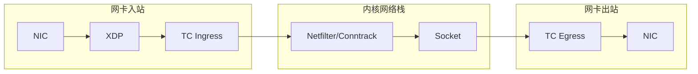
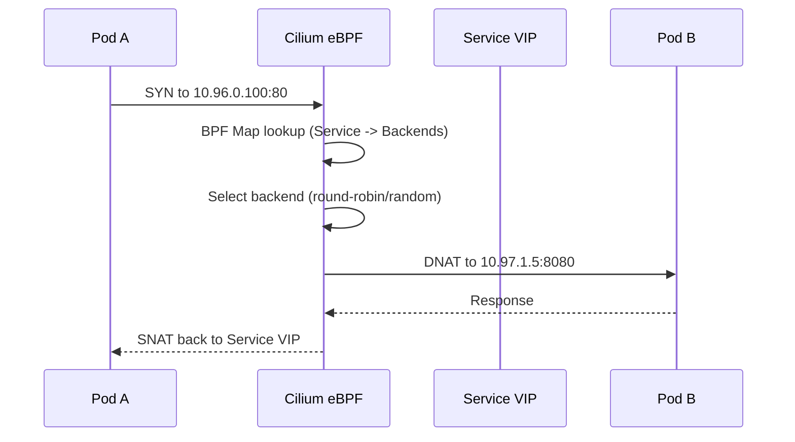
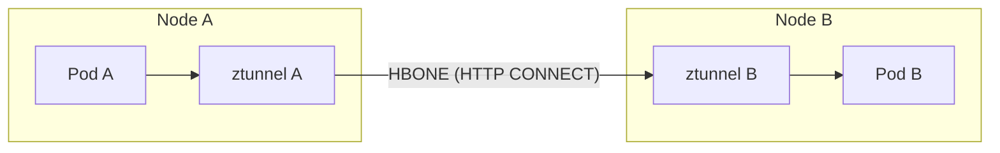

## 1. 核心架构图景 (Architectural Vision)

我们的目标是构建一个高性能, 安全且具备高度可扩展性的流量治理体系:

*   **承载层 (L3/L4)**: **Cilium** 使用 **KPR (Kube-Proxy Replacement)** 模式, 通过 **VIP (192.168.20.104)** 实现 BGP/ARP 级别的负载均衡. 流量处理下沉至内核 eBPF, 实现 **O(1)** 级的转发效能.
*   **入口控制器 (L7)**: **Traefik** 放弃传统的 Ingress, 全面拥抱 **Gateway API**. 作为南北流量 (North-South) 的枢纽, 提供动态路由, TLS 卸载与流量治理.
*   **服务网格 (Security)**: **Istio Ambient Mesh** 模式. 东西流量 (East-West) 通过 **ztunnel** 实现无侵入的 mTLS 和安全策略, 彻底解决传统 Sidecar 带来的性能开销与管理复杂性.
*   **持久化层 (Stateful)**: 状态剥离. 使用 **CloudNativePG (CNPG)** 管理外部 PostgreSQL 集群, 承载 Grafana 看板配置, 实现监控系统真正的无状态高可用.

---

## 2. eBPF 数据路径深度剖析

eBPF (extended Berkeley Packet Filter) 是 Cilium 实现高性能网络的核心技术. 理解其工作原理对于网络故障排查至关重要.

### 2.1 eBPF Hook 点与执行时机



| Hook Point | 位置 | 特点 | Cilium 用途 |
| :--- | :--- | :--- | :--- |
| **XDP** | 驱动层 (最早) | 性能最高, 可 offload 到网卡硬件 | DDoS 防护, 早期丢包 |
| **TC Ingress** | 网络栈入口 | 可访问完整 skb 结构 | Service LB, NetworkPolicy |
| **TC Egress** | 网络栈出口 | 处理出站流量 | NAT, 出口策略 |
| **Socket** | 传输层 | 与 socket 生命周期绑定 | Socket-level LB (TPROXY) |

### 2.2 Cilium BPF Map 类型

Cilium 使用多种 BPF Map 存储网络状态:

| Map 类型 | 用途 | 示例 |
| :--- | :--- | :--- |
| `BPF_MAP_TYPE_HASH` | K-V 查找 | Service 后端列表 |
| `BPF_MAP_TYPE_LRU_HASH` | 带 LRU 淘汰的 K-V | Connection Tracking |
| `BPF_MAP_TYPE_LPM_TRIE` | 最长前缀匹配 | CIDR-based NetworkPolicy |
| `BPF_MAP_TYPE_ARRAY` | 索引数组 | 配置参数, 统计计数器 |

*   **查看 BPF Map**:
    ```bash
    # 列出所有 Cilium BPF Map
    bpftool map list | grep cilium
    
    # 查看 Service Map 内容
    cilium bpf lb list
    
    # 查看 Connection Tracking
    cilium bpf ct list global
    ```

### 2.3 KPR (Kube-Proxy Replacement) 工作原理

传统 kube-proxy 使用 iptables/ipvs 规则实现 Service 负载均衡, 规则数量与 Service 数量呈线性增长. Cilium KPR 将负载均衡逻辑下沉到 eBPF:



*   **性能对比**: O(n) iptables 规则遍历 vs O(1) BPF Map 查找.
*   **连接亲和性**: 通过 BPF Map 存储会话状态, 实现 Session Affinity.

### 2.4 eBPF 程序调试

```bash
# 查看加载的 eBPF 程序
bpftool prog list

# 查看程序附加点
bpftool net show

# 追踪 eBPF 程序执行
cilium monitor --type trace

# 抓包 (在 eBPF 层)
cilium monitor --type drop  # 查看被丢弃的包
```

---

## 3. CNI 插件链执行机制

### 3.1 CNI 规范核心操作

CNI (Container Network Interface) 定义了容器网络配置的标准接口:

| 操作 | 描述 | 触发时机 |
| :--- | :--- | :--- |
| `ADD` | 配置容器网络 | Pod 创建, Sandbox 就绪后 |
| `DEL` | 清理容器网络 | Pod 删除 |
| `CHECK` | 验证网络配置 | 健康检查 (可选) |
| `VERSION` | 返回支持的 CNI 版本 | 初始化 |

### 3.2 插件链执行流程

CNI 支持多个插件串联执行 (Plugin Chaining):

```bash
# /etc/cni/net.d/05-cilium.conflist
{
  "cniVersion": "1.0.0",
  "name": "cilium",
  "plugins": [
    {
      "type": "cilium-cni"  # 主插件: IP 分配, 路由配置
    },
    {
      "type": "portmap",     # 端口映射 (hostPort 支持)
      "capabilities": {"portMappings": true}
    },
    {
      "type": "bandwidth",   # 带宽限制
      "ingressRate": 1000000,
      "egressRate": 1000000
    }
  ]
}
```

*   **执行顺序**: 按 plugins 数组顺序依次执行.
*   **结果传递**: 前一个插件的输出作为后一个插件的 `prevResult`.

### 3.3 CNI ADD 结果结构

```json
{
  "cniVersion": "1.0.0",
  "interfaces": [
    {"name": "eth0", "sandbox": "/var/run/netns/cni-xxx"}
  ],
  "ips": [
    {"address": "10.97.0.15/24", "gateway": "10.97.0.1", "interface": 0}
  ],
  "routes": [
    {"dst": "0.0.0.0/0", "gw": "10.97.0.1"}
  ],
  "dns": {
    "nameservers": ["10.96.0.10"],
    "search": ["default.svc.cluster.local"]
  }
}
```

### 3.4 CNI 故障调试

```bash
# 查看 CNI 配置
ls -la /etc/cni/net.d/
cat /etc/cni/net.d/05-cilium.conflist | jq

# 手动执行 CNI (测试)
CNI_COMMAND=ADD CNI_CONTAINERID=test CNI_NETNS=/var/run/netns/test \
  CNI_IFNAME=eth0 CNI_PATH=/opt/cni/bin \
  /opt/cni/bin/cilium-cni < /etc/cni/net.d/05-cilium.conflist

# 查看 Kubelet CNI 日志
journalctl -u kubelet | grep -i cni
```

---

## 4. 第一阶段: 部署 Traefik 边缘网关 (南北向枢纽)

Traefik 作为南北流量的 "守门员", 负责将外部请求引入集群.

### 4.1 安装 Traefik
通过 Helm 在独立命名空间部署并开启 Gateway API 支持:
```bash
helm repo add traefik https://traefik.github.io/charts
helm repo update

helm install traefik traefik/traefik \
  --namespace traefik-system --create-namespace \
  --set ports.web.exposedPort=80 \
  --set ports.websecure.exposedPort=443 \
  --set gatewayExtensions.enabled=true
```

### 4.2 底层支撑: Cilium LB IPAM 与 L2 Announcement

在私有化 (Bare-metal) 环境中, `Service Type: LoadBalancer` 无法自动获得 External IP. 我们需要利用 Cilium 的 **LB IPAM** (管理 IP 池) 和 **L2 Announcement** (通过 ARP 宣告 IP 归属) 来实现 192.168.20.104 的线上可见性.

#### 1. 定义 IP 地址池 (ip-pool.yaml)
告诉 Cilium 哪些 IP 地址可以分配给集群的服务:
```yaml
apiVersion: "cilium.io/v2alpha1"
kind: CiliumLoadBalancerIPPool
metadata:
  name: "management-pool"
spec:
  blocks:
    - cidr: "192.168.20.104/32" # 明确指定我们要使用的虚拟 IP
```

#### 2. 定义 L2 公告策略 (`l2-policy.yaml`)
告诉 Cilium 在哪些节点上、通过哪些网卡发送 ARP 响应, 从而将流量引导至集群：
```yaml
apiVersion: "cilium.io/v2alpha1"
kind: CiliumL2AnnouncementPolicy
metadata:
  name: "l2-announcement-policy"
spec:
  externalIPs: true
  loadBalancerIPs: true
  interfaces:
    - ^eth[0-9]+ # 匹配物理网卡名称, 请根据实际 ip addr 结果修改
  nodeSelector:
    matchLabels:
      kubernetes.io/os: linux
```

---

### 4.3 定义 GatewayClass 与 Gateway

在 Gateway API 规范中, 我们需要定义 **GatewayClass** 来声明底层的控制器实现, 并创建 **Gateway** 实例来分配物理资源.

#### 1. 定义基础设施类型 (GatewayClass)
这告诉 Kubernetes, 所有引用 `gatewayClassName: traefik` 的网关都由 Traefik 控制器负责处理:
```yaml
# gateway-class.yaml
apiVersion: gateway.networking.k8s.io/v1
kind: GatewayClass
metadata:
  name: traefik
spec:
  controllerName: traefik.io/gateway-controller
```

#### 2. 申请外部 IP 与定义网关 (Gateway)
这里我们通过 `annotations` 字段与 Cilium 的 LB IPAM 进行联动。
*   **为何使用 annotations?** 因为标准 Gateway 规范尚未统一 IP 分配指令。`io.cilium/lb-ipam-ips` 属于 Cilium 的扩展指令, 用于精准申请我们在 2.2 节定义的 `192.168.20.104`。
*   **为何使用 8000 端口?** Traefik 容器镜像默认监听 8000 (HTTP) 和 8443 (HTTPS)。在 Gateway 层匹配 8000 可以确保流量直接触达容器的监听点, 避免不必要的转发重定向。

```yaml
# edge-gateway.yaml
apiVersion: gateway.networking.k8s.io/v1
kind: Gateway
metadata:
  name: edge-gateway
  namespace: traefik-system
  annotations:
    io.cilium/lb-ipam-ips: "192.168.20.104" # 核心动作: 向 Cilium 申请锁定 VIP
spec:
  gatewayClassName: traefik
  listeners:
  - name: http
    protocol: HTTP
    port: 8000
    allowedRoutes:
      namespaces:
        from: All
```

#### 3. 验证 Traefik 监听状态 (Verification)
定义完资源后, 必须确认 Traefik 是否已经 "接管" 了该类.

*   **检查 GatewayClass 状态**:
    ```bash
    kubectl get gatewayclass traefik -o yaml
    ```
    预期在 `status.conditions` 中看到 `type: Accepted` 且 `status: "True"`. 这意味着控制器已识别并接受了该类的定义.

*   **对齐 Traefik 启动参数**:
    如果状态未更新, 请检查 Traefik Deployment 的启动参数, 确保开启了 Gateway 支撑。
    ```bash
    kubectl get deploy -n traefik-system traefik -o yaml | grep "providers.kubernetesgateway"
    # 预期输出应包含: --providers.kubernetesgateway

    # kubectl patch 手动注入参数
    kubectl patch deployment traefik -n traefik-system --type='json' -p='[
    {"op": "add", "path": "/spec/template/spec/containers/0/args/-", "value": "--providers.kubernetesgateway"}
    ]'
    # 手动修改
    kubectl edit deployment traefik -n traefik-system
    ```

---

## 5. Istio Ambient Mesh 内部机制

Istio Ambient 模式通过宿主机层的 `ztunnel` 劫持流量, 为服务间通信提供透明的 mTLS 加密.

### 5.1 Ambient 架构对比 Sidecar

| 维度 | Sidecar 模式 | Ambient 模式 |
| :--- | :--- | :--- |
| **代理位置** | 每个 Pod 一个 Envoy Sidecar | 每个 Node 一个 ztunnel |
| **资源开销** | 高 (N 个 Pod = N 个 Sidecar) | 低 (节点级共享) |
| **L7 策略** | Sidecar 处理 | Waypoint Proxy (按需) |
| **注入方式** | Namespace Label 触发重启 Pod | Namespace Label 无需重启 |
| **mTLS** | Sidecar 间加密 | ztunnel 间加密 |

### 5.2 ztunnel 工作原理



*   **流量劫持**: ztunnel 通过 eBPF 或 iptables TPROXY 拦截 Pod 出入流量.
*   **HBONE 协议**: HTTP-Based Overlay Network Encapsulation, 使用 HTTP/2 CONNECT 方法封装 TCP 流量.
*   **mTLS**: ztunnel 间使用 SPIFFE 身份 (X.509 SVID) 实现双向 TLS.

### 5.3 Waypoint Proxy (L7 策略)

当需要 L7 功能 (HTTP 路由, 重试, 熔断) 时, 部署 Waypoint Proxy:

```bash
# 为 Namespace 创建 Waypoint
istioctl waypoint apply --namespace default --name default-waypoint

# 查看 Waypoint Pod
kubectl get pods -n default -l istio.io/gateway-name=default-waypoint
```

*   **工作流程**: ztunnel 检测到 L7 策略时, 将流量转发到 Waypoint Proxy.
*   **按需部署**: 只有定义了 L7 策略的 Namespace/Service 才需要 Waypoint.

### 5.4 Cilium + Istio Ambient 集成要点

```bash
# 关键: 禁用 Cilium CNI 独占模式
helm upgrade cilium cilium/cilium \
  --namespace kube-system \
  --reuse-values \
  --set cni.exclusive=false

# 重启 Cilium 以应用新配置
kubectl rollout restart ds cilium -n kube-system
```

*   **CNI Chaining**: Cilium 和 Istio CNI 可以共存, 但需禁用 `cni.exclusive`.
*   **eBPF 与 ztunnel**: Cilium 处理 L3/L4, ztunnel 处理 mTLS 和 L7 安全.

### 5.5 安装与纳管

#### 安装 istioctl

```bash
# macOS
brew install istioctl

# Linux
curl -L https://istio.io/downloadIstio | sh -
cd istio-1.*
sudo cp bin/istioctl /usr/local/bin/
```

#### 部署 Ambient Profile

```bash
istioctl install --set profile=ambient -y
```

#### 纳管命名空间

```bash
kubectl create namespace monitoring-dev
kubectl label namespace monitoring-dev istio.io/dataplane-mode=ambient
kubectl describe namespace monitoring-dev
```

---

## 6. 第三阶段: 搭建高可用监控系统 (持久化解耦)

### 6.1 数据库高可用 (CloudNativePG)
使用外置 PostgreSQL 取代本地 SQLite, 确保 Grafana 副本间的数据一致性.

```yaml
# pg-grafana.yaml
apiVersion: postgresql.cnpg.io/v1
kind: Cluster
metadata:
  name: pg-grafana
  namespace: monitoring-dev
spec:
  instances: 3 
  imageName: ghcr.io/cloudnative-pg/postgresql:17.0
  storage:
    size: 20Gi
    storageClass: "nfs-client"
  # 数据库初始化
  bootstrap:
    initdb:
      database: grafana
      owner: grafana_user
      secret:
        name: pg-grafana-creds # 稍后创建这个 Secret 存放密码
  postgresql:
    parameters:
      archive_timeout: "5min"
      max_wal_senders: "10" 
```

```bash
# 创建 secret
kubectl create secret generic pg-grafana-creds \
  --from-literal=username=grafana_user \
  --from-literal=password=Grafana123 \
  -n monitoring-dev
```

### 6.2 应用层 HA 与 路由关联

配置 Grafana 接入外部 PostgreSQL 集群以实现状态剥离. 建议初次调试时将副本数设为 1, 待连通性确认后再扩容.

#### 1. 核心配置文件 (grafana-values.yaml)
```yaml
# 1. 环境变量注入 (数据库对接)
extraEnvs:
  - name: GF_DATABASE_TYPE
    value: "postgres"
  - name: GF_DATABASE_HOST
    value: "pg-grafana-rw.monitoring-dev.svc.cluster.local:5432"
  - name: GF_DATABASE_NAME
    value: "grafana"
  - name: GF_DATABASE_SSL_MODE
    value: "disable"
  - name: GF_DATABASE_USER
    valueFrom:
      secretKeyRef:
        name: pg-grafana-creds
        key: username
  - name: GF_DATABASE_PASSWORD
    valueFrom:
      secretKeyRef:
        name: pg-grafana-creds
        key: password

# 2. 基础运行配置
grafana.ini:
  log:
    level: info
  # 注意: database 部分在此保持空白, 以强制让环境变量生效

# 3. 高可用配置 (初次调试建议先设为 1)
replicas: 1

# 4. 存储与权限配置
persistence:
  enabled: true
  storageClassName: "nfs-client"
  size: 5Gi

podSecurityContext:
  fsGroup: 472
containerSecurityContext:
  runAsUser: 472
```

#### 2. 定义业务路由 (grafana-route.yaml)
```yaml
apiVersion: gateway.networking.k8s.io/v1
kind: HTTPRoute
metadata:
  name: grafana-route
  namespace: monitoring-dev
spec:
  parentRefs:
  - name: edge-gateway
    namespace: traefik-system
  hostnames:
    - "grafana.example.com"
  rules:
  - backendRefs:
    - name: grafana
      port: 80
```

---

## 7. 验证、观测与审计

### 7.1 全链路观测 (Hubble)
观察流量如何跨越 N-S 与 E-W 边界:
1. **南北流**: 外部 -> VIP (eBPF 拦截) -> Traefik (路由).
2. **东西流**: Traefik -> ztunnel (加密) -> Grafana -> ztunnel -> PG (加密).

运行命令审计:
```bash
hubble observe --namespace monitoring-dev -f
# 只看发往 5432 端口（数据库）的流量
hubble observe --namespace monitoring-dev -f --dest-port 5432

# 如果没有 Hubble CLI, 可以直接在 Cilium Pod 里运行
kubectl exec -n kube-system ds/cilium -- hubble observe --namespace monitoring-dev -f
```

### 7.2 故障恢复演练
模拟数据库主节点故障, 观察 CNPG 的自动 Failover 过程. 得益于 Istio Ambient 的无感知特性, 数据库切换期间的连接重试将由网格层自动处理, 业务层基本无感.

---

## 8. 全链路流量数据流向图 (Data Flow Path)

当外部用户通过浏览器访问 `http://grafana.example.com` 时, 流量经历了一场严密的协议栈之旅：

### 8.1 物理接入层 (L2 - Data Link)
1.  **ARP 响应**: 外部客户端 (或上层交换机) 查询 192.168.20.104 的 MAC 地址.
2.  **Cilium 宣告**: 运行 **L2 Announcement Policy** 的集群节点响应 ARP, 声明该 VIP 绑定在自己的物理网卡 (如 eth0) 上.

### 8.2 内核转发层 (L3/L4 - Network/Transport)
1.  **eBPF 拦截**: 报文进入网卡那一刻, Cilium 的 **tc (Traffic Control)** 钩子点程序立即接管请求.
2.  **KPR 路由**: eBPF 直接在内核 BPF Map 中查询 LoadBalancer 对应的后端. 它发现流量应由于 **Traefik Pod** 处理, 于是执行地址转换并通过 **O(1)** 路径直接重定向到 Traefik 网卡.

### 8.3 边缘网关层 (L7 - Application [南北向])
1.  **Traefik 业务逻辑**: Traefik 监听 8000 端口. 它解析 HTTP Host 头部为 grafana.example.com.
2.  **Gateway API 路由**: 根据 HTTPRoute 规则, 它识别出目标服务是 monitoring-dev/grafana.

### 8.4 安全网格层 (Mesh - Security [东西向])
1.  **Istio Ambient 劫持**: 流量从 Traefik 发出后, 立即触达宿主机的 **ztunnel**.
2.  **mTLS 加密**: ztunnel 识别出目标属于 istio.io/dataplane-mode=ambient 纳管的命名空间. 它为报文包裹一层 **HBONE (HTTP-Based Overlay Network)**, 实现指令级加密.
3.  **零信任访问**: 流量加密传输至目标节点, 由另一端的 ztunnel 解密并校验身份.

### 8.5 应用与持久化层 (Application & Data)
1.  **Grafana 处理**: 最终报文抵达 Grafana Pod. Grafana 处理 UI 请求, 并需要查询配置.
2.  **数据库访问**: Grafana 向 pg-grafana-rw 发起连接. 该请求同样受到 Istio 东西向加密保护.
3.  **CNPG 自治**: **CloudNativePG** 的 Primary 节点接收并处理 SQL. 由于我们做了状态剥离, 即使 Grafana 容器漂移, 全部的看板与权限数据依然在 PG 的持久卷中安全流转.

---

> 这种 "Cilium KPR (L3/L4) + Traefik Gateway API (L7) + Istio Ambient (Mesh)" 的组合, 代表了当前云原生基础设施的最佳实践. 它在保证极高性能的同时, 通过分层治理实现了零信任安全与状态解耦, 为大规模 SRE 自动化运维奠定了坚实的底座.

> 这份具备工业级深度的实战手册. 这一架构不仅保证了极致的性能, 更实现了 "御敌于门外(Traefik), 治乱于巷内(Istio)" 的深蓝防御体系.

```bash
kubectl scale -n monitoring-dev deployment grafana-dev --replicas=2
kubectl -n kube-system exec pod/cilium-bc8hc -- cilium service list

kubectl get svc -n traefik-system
kubectl get svc -n traefik-system traefik -o yaml

kubectl get httproute grafana-route -n monitoring-dev -o yaml

kubectl get gatewayclass
kubectl get gatewayclass traefik -o yaml
kubectl get gateway -n traefik-system
kubectl get gateway -n traefik-system edge-gateway -o yaml

kubectl describe -n traefik-system pod  -l app.kubernetes.io/name=traefik

kubectl get crd | grep gateway.networking.k8s.io
kubectl logs -n istio-system -l app=ztunnel | grep -i grafana

# 集群内部测试
kubectl run test-curl --image=curlimages/curl -i --rm --restart=Never -- \
  curl -v http://grafana-dev.monitoring-dev.svc.cluster.local:80/api/health

# 重启 traefik
kubectl rollout restart deployment -n traefik-system traefik
```

```bash
# patch
kubectl patch deployment -n monitoring-dev -l app.kubernetes.io/name=grafana --type='json' -p='[
  {"op": "add", "path": "/spec/template/spec/containers/0/env", "value": []},
  {"op": "add", "path": "/spec/template/spec/containers/0/env/-", "value": {"name": "GF_DATABASE_TYPE", "value": "postgres"}},
  {"op": "add", "path": "/spec/template/spec/containers/0/env/-", "value": {"name": "GF_DATABASE_HOST", "value": "pg-grafana-rw.monitoring-dev.svc.cluster.local:5432"}},
  {"op": "add", "path": "/spec/template/spec/containers/0/env/-", "value": {"name": "GF_DATABASE_NAME", "value": "grafana"}},
  {"op": "add", "path": "/spec/template/spec/containers/0/env/-", "value": {"name": "GF_DATABASE_SSL_MODE", "value": "disable"}},
  {"op": "add", "path": "/spec/template/spec/containers/0/env/-", "value": {"name": "GF_DATABASE_USER", "valueFrom": {"secretKeyRef": {"name": "pg-grafana-creds", "key": "username"}}}},
  {"op": "add", "path": "/spec/template/spec/containers/0/env/-", "value": {"name": "GF_DATABASE_PASSWORD", "valueFrom": {"secretKeyRef": {"name": "pg-grafana-creds", "key": "password"}}}}
]'
```


```bash
 curl -v -H "Host: grafana.example.com" http://192.168.20.104/api/health
*   Trying 192.168.20.104:80...
* Connected to 192.168.20.104 (192.168.20.104) port 80
> GET /api/health HTTP/1.1
> Host: grafana.example.com
> User-Agent: curl/8.7.1
> Accept: */*
>
* Request completely sent off
< HTTP/1.1 200 OK
< Cache-Control: no-store
< Content-Length: 101
< Content-Type: application/json; charset=UTF-8
< Date: Wed, 31 Dec 2025 07:48:39 GMT
< X-Content-Type-Options: nosniff
< X-Frame-Options: deny
< X-Xss-Protection: 1; mode=block
<
{
  "database": "ok",
  "version": "12.3.1",
  "commit": "3a1c80ca7ce612f309fdc99338dd3c5e486339be"
* Connection #0 to host 192.168.20.104 left intact
}
```